# 📘 Tutor Notebook: Graph Neural Networks in Recommender Systems
**Course:** Interdisciplinary Deep Learning on Graphs (UE23AM342BA1)  
**Instructor:** Dr. Bhaskarjyoti Das, Department of Computer Science in AI & ML and Engineering, PES University  
**Based on:** Lecture Slides — DLG_15_recommender  

---

## 🗂️ Table of Contents

1. [Recommender Systems: Background](#1-recommender-systems-background)
   - 1.1 Formal Definition and the Rating Function
   - 1.2 Two Problem Formulations: Prediction vs. Ranking
   - 1.3 Types of Ratings
   - 1.4 The Long Tail Property
2. [Recommender Systems: Types](#2-recommender-systems-types)
   - 2.1 Collaborative Filtering (Memory-Based and Model-Based)
   - 2.2 Content-Based Recommender Systems
   - 2.3 Knowledge-Based Recommender Systems
   - 2.4 Utility-Based Recommender Systems
   - 2.5 Hybrid and Ensemble-Based Systems
   - 2.6 Context-Based Recommender Systems
   - 2.7 Time-Sensitive Recommender Systems
   - 2.8 Location-Based Recommender Systems
   - 2.9 Social Recommender Systems
3. [Graph-Based Approach to Recommender Systems](#3-graph-based-approach-to-recommender-systems)
   - 3.1 Why Graphs? The Sparsity Problem
   - 3.2 Indirect Neighbourhood via User-Item Bipartite Graph
   - 3.3 Rating Matrix and Its Correlation Graph
   - 3.4 User-User Graph (2-Hop Approach)
   - 3.5 GNN Setting: Formal Bipartite Graph Formulation
   - 3.6 Collaborative Filtering as an Encoder-Decoder Model
4. [Open Areas and Future Directions](#4-open-areas-and-future-directions)
   - 4.1 Dynamic GNN
   - 4.2 Self-Supervised GNN
   - 4.3 Conversational GNN (CRS)
   - 4.4 Knowledge Graph Enhanced GNN
   - 4.5 LLM + GNN (RAG-Enhanced Recommendations)
5. [Final Summary: Concept Tree](#5-final-summary-concept-tree)

---

## 📖 How to Use This Notebook

This notebook follows a **first-principles, explanation-first** approach. Every concept is explained from scratch — what it is, why it exists, and what goes wrong without it. After each major section, you will find a **Q&A block** with exam-style questions covering conceptual understanding, math, comparisons, failure modes, and real-world reasoning. Work through the Q&A before moving on to test your understanding deeply.

---

## 1. Recommender Systems: Background

### 1.1 Formal Definition and the Rating Function

A **recommender system** is a software tool designed to suggest relevant items to users — movies on Netflix, products on Amazon, songs on Spotify — by learning from historical interaction data. The core challenge is this: a user has not interacted with the vast majority of available items. How do you predict which unseen items they would like?

Formally, a recommender system takes a set of **users** $U$ and a set of **items** $I$ and learns a function $f$ such that:

$$f: U \times I \rightarrow \mathbb{R}$$

**Symbol glossary:**
- $U$ — the set of all users, e.g., $\{u_1, u_2, \ldots, u_m\}$
- $I$ — the set of all items, e.g., $\{i_1, i_2, \ldots, i_n\}$
- $\mathbb{R}$ — the set of real numbers; the output is a predicted rating or utility score
- $f$ — the learned recommendation function mapping (user, item) pairs to predicted scores

**Intuition:** Imagine a matrix where rows are users and columns are items. Each cell $(u, i)$ holds the rating user $u$ gave to item $i$. Most cells are **empty** — users have not rated most items. The recommender system's job is to fill in those empty cells with plausible predicted values.

> **Key Insight:** The recommender system is fundamentally a **matrix completion problem** — completing a large, sparse matrix of user-item interactions.

### 1.2 Two Problem Formulations: Prediction vs. Ranking

There are two ways to frame the recommendation task, and they differ in what the system is asked to output:

**Prediction Version (Matrix Completion):**
Given $m$ users and $n$ items, we have an incomplete matrix. For any given user-item pair $(u, i)$ not yet observed, the goal is to **predict the rating** $\hat{r}_{ui}$. This is treated as a regression or matrix completion problem. Training data consists of known ratings; the model must generalize to unseen pairs.

**Ranking Version (Top-k Recommendation):**
Rather than predicting exact ratings, this formulation asks: *"Given user $u$, which $k$ items should I recommend?"* This is the **top-k recommendation problem**. Instead of a single rating prediction, we need to rank all unobserved items for a user and surface the best $k$.

> **Relationship:** The 2nd formulation (ranking) can always be derived from the 1st (prediction). Once you have predicted ratings for all items, you simply sort them in descending order and take the top-k. In practice, however, many systems directly optimize ranking objectives (like NDCG or AUC) rather than going through rating prediction.

### 1.3 Types of Ratings

Ratings are the raw signals from which recommender systems learn. They come in several forms, each with different properties and trade-offs:

**1. Continuous Rating:**
A real-valued score over a continuous range. The classic example is the Jester Joke dataset, where users rate jokes on a scale from **[-10, 10]**. While information-rich, continuous ratings are a **burden on users** — it is cognitively expensive to assign precise scores — and are therefore rarely used in practice.

**2. Interval-Based Rating:**
Numerical ratings where the **distances between values are explicitly defined and equidistant**. A scale of -5 to +5 (where the gap between 1 and 2 is the same as between 4 and 5) is interval-based. This is common in survey instruments and star-rating systems (e.g., 1 to 5 stars). Arithmetic operations on these values are meaningful.

**3. Ordinal Rating:**
Similar to interval ratings but using **categorical values** (e.g., "poor," "fair," "good," "excellent") that can typically be mapped to equally-spaced numerical utility values. The **absence of a "neutral" option** forces users to pick a positive or negative stance — this is called a **forced choice**.

**4. Binary Rating:**
The user is forced to choose between two options — like/dislike, thumbs up/down — with **no neutral option**. A famous example is **Pandora Radio**, where users can only respond positively or negatively to a song. This is the simplest rating form but loses the fine-grained preference signal.

**5. Unary Rating:**
The user can **only express a positive response** — like pressing the Facebook "Like" button. There is no dislike option. An **implied version** of unary rating is a news click: if a user clicks on an article, that is interpreted as implicit positive feedback. The absence of a click does not mean dislike — the user may simply not have seen it.

**6. Explicit vs. Implicit Ratings:**
- **Explicit ratings** are direct expressions of preference (e.g., assigning a 4-star rating).
- **Implicit ratings** are **derived from behavior** — web activity, viewing time, click-through, purchase history — without the user explicitly stating a preference. Implicit data is abundant but noisy: a click does not definitively mean the user liked something.

| Rating Type | Example | Neutral Option | Rich Signal |
|-------------|---------|----------------|-------------|
| Continuous  | Jester [-10,10] | Yes | Very rich, but burdensome |
| Interval-based | 1-5 Stars | Sometimes | Rich |
| Ordinal | Poor/Fair/Good/Excellent | Sometimes | Moderate |
| Binary | Pandora thumbs up/down | No (forced) | Low |
| Unary | Facebook Like | No (positive only) | Very low |
| Implicit | Clicks, purchase history | N/A | Noisy but abundant |

### 1.4 The Long Tail Property

A fundamental challenge in recommender systems is the **Long Tail** distribution of ratings, which follows a **power law** — the same statistical pattern observed in many real-world graphs and networks.

**What the long tail means:** A small number of items (popular blockbusters, bestsellers) receive an enormous number of ratings. The vast majority of items receive very few or no ratings. Plotting items ordered by decreasing rating frequency against the number of ratings produces a curve that rises sharply on the left and has a very long, thin tail extending to the right.

```
NUMBER OF RATINGS
   700 |████
   600 |████
   500 |████
   400 |███
   300 |███
   200 |██
   100 |█                    ←————— LONG TAIL ——————————→
     0 +——————————————————————————————————————————————————
       0   1000  2000  3000  4000  5000  6000  7000  8000
                   ITEM INDEX (by decreasing frequency)
```

**Key implications for recommender systems:**

1. **Business motivation for the long tail:** High-frequency items tend to be **volume sales items with low margin** (e.g., bestselling books, blockbuster movies). Retailers like Amazon actually make most of their profit from **low-frequency (long-tail) items** — niche products with higher margins. Therefore, Amazon *must* recommend long-tail items effectively to maximize profit.

2. **Challenge for rating quality:** Most items are in the long tail, which means they have **very few ratings**. It is difficult to build a reliable model for items with only 1-2 ratings.

3. **Impact on Collaborative Filtering:** The long tail means that the **Utility Matrix** (the user-item rating matrix) is **extremely sparse** — most cells are empty. This makes collaborative filtering less robust, because two users who share very few common rated items will have unreliable similarity estimates.

> **Key Insight:** The Long Tail property — a power law in rating frequency — is the primary cause of sparsity in the utility matrix, which is the central challenge that graph-based methods are designed to address.

---

### 📝 Q&A — Section 1

**Q1. What does the formal function $f: U \times I \rightarrow \mathbb{R}$ mean in the context of recommender systems, and why is learning it non-trivial?**

A: The function $f$ maps every possible (user, item) pair to a real-valued score representing predicted preference. Learning it is non-trivial because the training data — observed ratings — is an extremely small and biased sample of all possible pairs. Most (user, item) combinations have never been observed, so the model must generalize from a sparse, noisy signal. Additionally, user preferences are not static and items may be rated asymmetrically (popular items have many ratings, obscure items have few), further complicating the learning task.

**Q2. What is the difference between the prediction and ranking formulations of the recommendation problem? Can one always be reduced to the other?**

A: The prediction formulation requires outputting a specific rating value $\hat{r}_{ui}$ for a (user, item) pair — this is a regression task (matrix completion). The ranking formulation requires outputting an ordered list of top-k items for a user — this is a ranking/retrieval task. The ranking formulation can always be derived from the prediction formulation: generate predicted ratings for all unobserved items, then sort and pick top-k. However, the reverse is not true — a ranking model may only learn relative preferences without predicting absolute rating values.

**Q3. Why is unary rating particularly problematic for model training, and how is the "implied version" (e.g., news clicks) even more challenging?**

A: Unary rating only records positive interactions; the model never directly observes negative preferences. This creates a **one-class classification problem** — all observed data is positive, but the model must learn what users don't like. In the implied version (clicks), there is additional noise: a user may not click an article because they genuinely dislike it, or simply because they never saw it (position bias), or because the title was misleading. Distinguishing "didn't see" from "saw and rejected" is extremely difficult without additional signals.

**Q4. Explain the Long Tail property and its two key business and technical implications for a recommender system.**

A: The Long Tail is a power-law distribution where a small number of items receive the vast majority of ratings, while most items receive very few. Business implication: high-frequency popular items have low margins; companies like Amazon profit more from recommending the long-tail niche items to the right customers. Technical implication: because most items are in the long tail with few ratings, the utility matrix is extremely sparse. Collaborative filtering degrades because users rarely co-rate the same obscure items, making similarity computation unreliable.

**Q5. If you were designing a rating system for a new music streaming app, which rating type would you choose and why? What would be the failure mode of your choice?**

A: A **unary (implicit) rating** via listening behavior (e.g., play count, skip rate) would be practical because it requires zero effort from users, yielding massive data. However, the failure mode is noise: a user may play a song they dislike because they were distracted, or skip a song they love because they've heard it recently. The model could incorrectly infer preferences from these behavioral signals. Additionally, the cold-start problem for new songs is severe — before any listens, the model has no signal.

**Q6. What would happen if you tried to apply interval-based arithmetic (e.g., averaging ratings) to ordinal ratings? Give a concrete example of why this is misleading.**

A: Ordinal ratings have categories (e.g., "Poor=1, Fair=2, Good=3, Excellent=4") but the gaps between them may not be psychologically equal. Averaging ordinal ratings treats them as interval data, which can be misleading. For example: if 50 users rate a restaurant "Poor" (1) and 50 users rate it "Excellent" (4), the average is 2.5, suggesting "Fair." But no user actually felt it was fair — the restaurant is polarizing. Interval arithmetic obscures this bimodal distribution and gives a false sense of central tendency.

**Q7. Why does the Long Tail property make Collaborative Filtering specifically less robust, as opposed to Content-Based methods?**

A: Collaborative Filtering relies on finding users who have co-rated the same items. For long-tail items with very few ratings, the probability that two users have both rated the same obscure item is extremely low. The resulting neighborhoods are empty or based on only 1-2 shared items, making similarity estimates unreliable. Content-Based methods, by contrast, rely on the item's own attributes (genre, keywords, metadata), which are available even for items with no ratings. Therefore, content-based methods handle long-tail items much better — they suffer from the cold-start problem for new users, not new items.

**Q8. Derive the relationship: how would you convert a continuous rating on scale [-10, 10] to an ordinal 5-category rating? What information is lost in this process?**

A: You could bin the continuous scale: [-10, -6) → "Very Dislike," [-6, -2) → "Dislike," [-2, 2] → "Neutral," (2, 6] → "Like," (6, 10] → "Very Like." Information lost: (1) within-category distinctions (a rating of 3 and 5 both become "Like"), (2) the precise magnitude of preference (an 8 vs. 10 carries different intensity), (3) fine-grained ranking among items within the same category is impossible. The ordinal representation is a lossy compression of the continuous signal.

---

## 2. Recommender Systems: Types

### 2.1 Collaborative Filtering (Memory-Based and Model-Based)

**Collaborative Filtering (CF)** is the most widely deployed class of recommender systems. The core idea is "wisdom of the crowd" — users with similar past behavior are likely to have similar future preferences. The system learns from the collective ratings of all users, without needing any knowledge of item content.

CF is divided into two major sub-types:

#### Memory-Based (Neighborhood-Based) Methods

These are also called **neighborhood-based collaborative filtering algorithms** and represent the earliest CF approaches. They predict ratings directly from the data in memory, without building an explicit model.

Two variants exist:

1. **User-Based Collaborative Filtering:** To recommend items to a **target user A**, find a neighborhood of users who have rated items similarly to A (i.e., "like-minded" users). Use their ratings to predict what A would like. The assumption is: if user B liked the same movies as A in the past, B's other movie preferences are a good predictor for A.

2. **Item-Based Collaborative Filtering:** To predict user A's rating for a **target item B**, find a set $S$ of items most similar to B (based on how users have rated them). Use A's own ratings of items in $S$ to predict the rating for B. The assumption is: if a user tends to rate items similar to B highly, they will likely rate B highly too.

#### Model-Based Methods

In model-based methods, **machine learning and data mining models** are trained on the rating data to build a predictive model. The ratings are not directly used at prediction time; instead, the model parameters encode the learned patterns.

When the model is **parameterized** (e.g., matrix factorization models like SVD), the parameters are optimized using an objective function (e.g., minimizing mean squared error on known ratings). These models can generalize better and scale to larger datasets than memory-based methods.

| Aspect | Memory-Based | Model-Based |
|--------|-------------|-------------|
| Uses raw data at prediction time | Yes | No (uses learned model) |
| Requires explicit training phase | Minimal | Yes, optimization needed |
| Interpretability | High (you can show similar users/items) | Lower |
| Scalability | Poor (computes similarity over all users/items) | Better |
| Cold-start handling | Very poor | Slightly better |
| Example | k-NN Collaborative Filtering | Matrix Factorization (SVD), GNN |

### 2.2 Content-Based Recommender Systems

**Content-Based (CB) systems** use the **descriptive attributes of items** themselves — keywords, genres, descriptions, metadata — to make recommendations. The term "content" refers to these item descriptions.

In CB methods, the **user's own ratings and buying behavior** are combined with item content information. A profile of each user's preferences is built in terms of item features, and new items are recommended if they match the user's profile.

**Advantage:** CB methods are effective for **new items** (cold-start for items). Even if a movie has never been rated, its genre, director, and plot description can be used to recommend it to users who have enjoyed similar content.

**Disadvantage:** CB methods often produce **obvious recommendations** — if a user likes action movies, they keep getting recommended action movies. This is the "filter bubble" or "over-specialization" problem. Furthermore, CB methods are **not effective for new users** (cold-start for users) because they require a history of user ratings to build a user profile.

### 2.3 Knowledge-Based Recommender Systems

**Knowledge-Based (KB) systems** are particularly valuable for items that are **not purchased frequently** — such as real estate, automobiles, tourism packages, financial services, or expensive luxury goods. For such items, there are simply not enough ratings to apply collaborative or content-based filtering.

The reason ratings are scarce: these items are bought rarely, and each purchase involves many specific options (e.g., a car with specific engine, color, and trim level). The space of item configurations is so large that any particular configuration has almost no ratings.

KB systems use **domain knowledge and user requirements** to navigate this space. They can be classified by their interface type:

1. **Constraint-Based Recommender Systems:** Users specify **requirements or constraints** on item attributes (e.g., "price < $30,000," "year > 2020"). The system also encodes domain knowledge as rules relating user attributes to item attributes (e.g., "Cars before year 1970 do not have cruise control," "Older investors do not invest in ultra high-risk products"). Items satisfying all constraints are recommended.

2. **Case-Based Recommender Systems:** Users specify **specific cases or examples** as targets or anchor points (e.g., "Find me something like this car"). The system uses **similarity metrics** defined on item attributes to retrieve items similar to the specified cases. The user can iteratively refine their query based on retrieved results.

### 2.4 Utility-Based Recommender Systems

In **utility-based systems**, a **utility function** is explicitly defined on product features to compute the probability or value of a user liking an item. The system recommends items with the highest utility score for a given user.

The **central challenge** is defining an appropriate utility function for each user — different users weight features differently (one buyer cares most about price, another about brand reputation). Eliciting these utility functions requires either explicit user input or learning from behavior.

An important observation: **all recommender schemes implicitly rank items by perceived utility** for the target user, whether or not they use an explicit utility function. Collaborative filtering ranks items by predicted rating (a proxy for utility). Content-based systems rank by content similarity. Knowledge-based systems rank by constraint satisfaction. The utility-based approach makes this ranking criterion explicit and transparent.

### 2.5 Hybrid and Ensemble-Based Systems

Different recommender system types have different strengths and weaknesses in different data regimes:

- **Collaborative Filtering:** Relies on **community ratings**. Highly effective with large amounts of data, but fails in cold-start settings (new users, new items) and with sparse matrices.
- **Content-Based Methods:** Rely on **textual descriptions and user's own ratings**. Effective for new items but not for new users.
- **Knowledge-Based Systems:** Rely on **structured domain knowledge and user-system interactions**. More effective in **cold-start settings** where little data is available, but require expert knowledge engineering.
- **Demographic Systems:** Use **demographic profiles** of users (age, gender, location) to make recommendations, without requiring individual rating histories.

**Hybrid systems** combine multiple approaches to overcome individual weaknesses. For example, a hybrid might use knowledge-based recommendations for new users (cold-start) and switch to collaborative filtering once enough interaction data has been collected.

### 2.6 Context-Based Recommender Systems

**Context-Based (or Context-Aware) Recommender Systems** incorporate **contextual information** into the recommendation process. Rather than treating preference as a static function of (user, item), these systems recognize that preferences depend on the context in which consumption occurs.

**Contextual signals include:** time of day, day of week, season, weather, geographic location, social setting (alone vs. with family), current mood.

**Example:** A retailer recommending clothing might recommend winter coats in November in Canada, but lightweight linen shirts to the same user in July in India. The item's relevance depends on both the season and the user's location simultaneously.

Context-aware systems are **incredibly powerful** because the underlying ideas generalize across many domain-specific settings — e-commerce, media, food, travel, financial services — anywhere where situational factors matter.

### 2.7 Time-Sensitive Recommender Systems

In many settings, **recommendations for items evolve over time**. Consider movies: the reputation of a movie may change drastically over years (a critically panned film may become a cult classic; a blockbuster may fade from memory). The same item may warrant different recommendations at different points in time.

The temporal aspect manifests in two important ways:

1. **Evolving community attitudes:** The overall rating of an item may drift as community tastes change, as new information emerges (e.g., controversy about an actor), or as the social context shifts. A model trained on 2015 data may give stale recommendations in 2025.

2. **Time-dependent ratings:** A user's preference for an item may depend on **when** they interact with it — time of day (coffee recommendations at 8am vs. 8pm differ), day of week (restaurants on weekdays vs. weekends), month or season (seasonal products like sunscreen, umbrellas). Ignoring these temporal patterns produces suboptimal recommendations.

### 2.8 Location-Based Recommender Systems

With the proliferation of GPS-enabled smartphones, users increasingly seek **location-aware recommendations** — nearby restaurants, local events, area-specific services.

Two types of spatial locality matter:

1. **User-Specific Locality (Preference Locality):** The **geographical location of a user** influences their preferences. A user in Paris has different baseline preferences from a user in Tokyo, even for the same product category. This is called **preference locality**.

2. **Item-Specific Locality (Travel Locality):** The **geographical location of an item** (e.g., a restaurant's address) determines its relevance based on how far the user would need to travel. A user is much more likely to visit a restaurant 1 km away than one 50 km away. This spatial friction is called **travel locality**.

A comprehensive location-based system must account for both: a user's culturally-shaped preferences (preference locality) and the practical constraint of physical distance (travel locality).

### 2.9 Social Recommender Systems

**Social recommender systems** leverage the structure and signals of social networks to improve recommendations. They operate along two dimensions:

1. **Structural aspect:** The network topology itself — who follows whom, who is friends with whom — can be used to suggest new connections (**link prediction**) or surface content that a user's social circle has engaged with. Systems based purely on structural aspects recommend **nodes and links within the network itself**.

2. **Social cues and tags aspect:** Beyond structure, social signals like likes, shares, comments, and hashtags carry preference information that can improve product recommendations. A user is more likely to trust a product recommended by a friend than by a stranger.

Social recommender systems that blend these aspects with collaborative filtering are particularly powerful because social connections often encode **taste similarities** more reliably than co-rating patterns.

---

### 📝 Q&A — Section 2

**Q1. What is the fundamental difference between user-based and item-based collaborative filtering? When would you prefer one over the other?**

A: User-based CF finds similar users to the target user and uses their ratings to make predictions — it asks "who is like this user?" Item-based CF finds items similar to those already rated by the target user and uses the user's own ratings of similar items — it asks "what is like what this user liked?" Item-based CF tends to be more stable (item similarity changes slowly while user preferences can shift quickly) and scales better (fewer items than users in most systems). User-based CF can be more serendipitous — it can surface very different items if a like-minded user has eclectic tastes.

**Q2. What is the "cold-start problem" and how do different types of recommender systems handle it differently?**

A: Cold-start occurs when a new user or new item enters the system with no interaction history. Collaborative filtering completely fails — with no ratings to find similar users/items. Content-based filtering handles new **items** well (uses item attributes) but fails for new **users** (needs rating history). Knowledge-based systems handle both cold-start cases well — they use domain knowledge and explicit user requirements without needing historical data. Hybrid systems typically use knowledge-based approaches during cold-start and switch to collaborative filtering as data accumulates.

**Q3. Why do content-based recommender systems tend to produce "obvious" recommendations? What is the technical term for this failure mode and how can it be mitigated?**

A: Content-based systems recommend items similar to what a user has already shown preference for. If the user has only interacted with action movies, the system builds a profile of "action movie lover" and only recommends more action movies. This failure mode is called **over-specialization** or **filter bubble**. Mitigation strategies include: injecting serendipity by occasionally recommending items from adjacent categories, using collaborative filtering to discover novel preferences outside the user's content profile, or explicitly penalizing recommendations too similar to already-consumed items.

**Q4. Explain why knowledge-based systems are specifically designed for items like real estate or automobiles. What property of these items makes other recommender approaches fail?**

A: Real estate and automobiles are items purchased very rarely (perhaps once in a lifetime or decade) and involve highly specific configurations (location, size, price range, features). The combination of infrequent purchase and high dimensionality of options means that any specific item configuration has essentially zero historical ratings to learn from. Collaborative filtering needs co-ratings; content-based needs user preference history. Knowledge-based systems bypass both requirements by using structured domain knowledge and actively querying users about their requirements, navigating the item space through constraint satisfaction rather than statistical learning.

**Q5. How do time-sensitive recommender systems differ from context-based ones? Is temporal context a special case of context-based recommendations?**

A: Time-sensitive systems specifically model how item ratings and user preferences **evolve over long time horizons** — capturing drift in community attitudes and changing user interests over months or years. Context-based systems use **situational context** at the moment of recommendation — current time of day, location, weather — to adjust what to recommend right now. Temporal context (time of day, season) is indeed a special case of context-based recommendations. However, time-sensitive systems also capture long-term preference drift, which goes beyond simple contextual adjustment and requires time-series modeling of how preferences change over extended periods.

**Q6. Compare and contrast memory-based and model-based collaborative filtering on four dimensions: interpretability, scalability, generalization, and cold-start handling.**

A:

| Dimension | Memory-Based | Model-Based |
|-----------|-------------|-------------|
| **Interpretability** | High — can explain "users similar to you also liked X" | Low — latent factors are not directly interpretable |
| **Scalability** | Poor — similarity must be computed over all users/items at query time | Better — model is trained offline; prediction is fast |
| **Generalization** | Poor — heavily influenced by noisy individual ratings | Better — learns underlying patterns that generalize |
| **Cold-start handling** | Very poor — requires co-ratings to compute similarity | Slightly better — can incorporate side information into model |

**Q7. What would happen if you built a collaborative filtering system on a dataset where only famous items have ratings (extreme long tail)? Trace the failure mode step by step.**

A: Step 1: The utility matrix has ratings concentrated on ~5% of items (the "head"). Step 2: Users who only interacted with long-tail items have no basis for similarity computation — no common ratings with other users. Step 3: Similarity scores between most user pairs are zero or based on 1-2 co-ratings (statistically unreliable). Step 4: The neighborhood of each user contains only users who have rated the same popular items. Step 5: The system only ever recommends popular items — it cannot surface long-tail items even to users who would love them. This is the **popularity bias** failure: the recommender makes the rich richer.

**Q8. How can social network structure encode taste similarity more reliably than co-rating patterns? Give a concrete example.**

A: Two people may never have rated the same obscure indie film — so their collaborative filtering similarity is zero. But if they are close friends on a social network, they likely share cultural background, values, and aesthetic preferences. Social homophily (the tendency for people with similar traits to form connections) means that a social edge is a strong signal of latent preference similarity. Example: if your close friend (strong social tie) starts listening to a new genre of music, you have a higher prior probability of enjoying it than a stranger who happens to have rated 3 of the same mainstream songs as you.

---

## 3. Graph-Based Approach to Recommender Systems

### 3.1 Why Graphs? The Sparsity Problem

The central challenge in neighborhood-based collaborative filtering is **sparsity**: the utility matrix is so sparse that many user pairs have rated very few items in common, making similarity estimates unreliable or impossible.

> **The "Social Graph" insight:** Graph-based approaches can circumvent sparsity challenges that cripple direct neighborhood methods.

The key intuition is this: in a graph-based approach, **two users do not need to have rated many of the same items to be considered neighbours**. As long as many **short paths** exist between them in the user-item graph, they are considered indirectly connected and therefore informationally related.

This is **indirect connectivity** — instead of requiring direct co-ratings, the graph discovers transitive relationships. If user A and user B both rated item X, and user B and user C both rated item Y, then A and C are connected through a 4-hop path (A → X → B → Y → C). Even though A and C share no directly co-rated item, the graph reveals they are informationally related.

**Types of graphs that can be constructed from rating data:**

1. **User-User graph:** Nodes are users; edges connect users who have rated similar items.
2. **User-Item graph (bipartite):** One set of nodes for users, another for items; an edge connects a user to each item they have rated.
3. **Item-Item graph:** Nodes are items; edges connect items that have been co-rated by similar users (a correlation graph).

**Algorithms used:** Random walk methods (e.g., PageRank and its variants) and shortest path-based approaches are the primary algorithmic tools.

**Critical opportunity:** The recommendation problem can be **reframed as a link prediction problem** on a graph. The missing entries in the utility matrix correspond exactly to missing links in the user-item bipartite graph. Predicting ratings = predicting links.

### 3.2 Indirect Neighbourhood via User-Item Bipartite Graph

Consider the following concrete example from the slides. We have 6 users ($U_1$ through $U_6$) and 6 movies (Gladiator, Godfather, Ben-Hur, Goodfellas, Scarface, Spartacus), with the following rating matrix:

```
         GLADIATOR | GODFATHER | BEN-HUR | GOODFELLAS | SCARFACE | SPARTACUS
U₁           1     |           |         |     5      |          |     2
U₂           -     |     5     |         |            |    4     |
U₃           5     |     3     |         |     1      |          |
U₄           -     |           |    3    |            |          |     4
U₅           -     |           |         |     3      |    5     |
U₆           5     |           |    4    |            |          |
```

This same information can be represented as a **bipartite graph** where users are on the left, items on the right, and an edge connects user $u$ to item $i$ if $u$ has rated $i$.

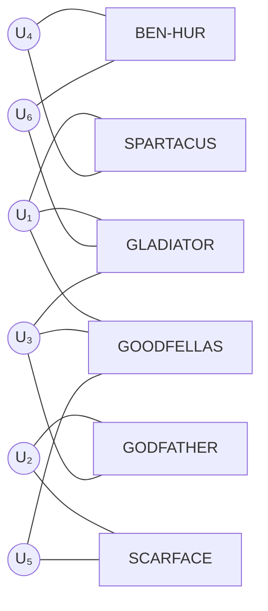

**Why this helps:** In the direct matrix, $U_1$ and $U_4$ share no co-rated items, so their collaborative filtering similarity is 0. But in the bipartite graph, $U_1$ connects to SPARTACUS, and $U_4$ also connects to SPARTACUS. They are at distance 2 (through the Spartacus node). This indirect connection reveals that they likely share tastes, even though they haven't rated anything in common directly.

### 3.3 Rating Matrix and Its Correlation Graph

From the bipartite user-item graph, we can derive an **item-item correlation graph** where two items are connected if they have been co-rated by the same users. The edge weight reflects how many users co-rated both items (or some normalized similarity measure).

**Example item-item correlation graph (from 4-item subset):**

Given the rating matrix with users U₁ through U₆ rating a subset {Gladiator, Godfather, Ben-Hur, Goodfellas}:

```
Unnormalized correlation graph (edge weights = number of common raters):
    
    GLADIATOR ←—1—→ GODFATHER
        ↕ 1            ↕ 2
       2↓              ↓1
    BEN-HUR  ←—1—→ GOODFELLAS
```

**Normalized correlation graph (edge weights = co-raters / total raters of source node):**

```
    GLADIATOR ←—1/4—→ GODFATHER
        ↕ 1               ↕ 1/2
      2/3 ↓              ↓ 1/3
    BEN-HUR  ←—1/2—→ GOODFELLAS
```

Once the **directed, normalized correlation graph** is in place, one can apply **PageRank** (a random walk-based algorithm) to find the top-K neighbourhood of any item. Variants of PageRank (like Personalized PageRank) can also be used, where the restart probability is biased toward the query item or user.

> **Key Insight:** PageRank on the item correlation graph gives a natural way to measure the "relevance" of one item given another, by simulating random walks that tend to stay near highly correlated items.

### 3.4 User-User Graph (2-Hop Approach)

Since the user-item bipartite graph is by definition a bipartite graph, we can create a **2-hop user-user graph** by projecting through items. Two users are connected in this graph if they share at least one co-rated item. The edges carry richer information than simple co-rating counts — they can encode the **number and quality of common items** (weighted by rating similarity).

**The transitivity advantage:** If user John has not rated the movie "Terminator," and none of his immediate neighbors in the user-user graph have either, collaborative filtering cannot predict John's rating. However, in the graph framework, we can check whether John's **indirect neighbors** (neighbors of neighbors) have rated Terminator. **Structural transitivity** allows coverage of users and items that direct methods cannot reach.

> **Main advantage of graph-based approach: Better coverage.** By allowing indirect connectivity through multiple hops, the graph-based neighborhood subsumes and extends the direct neighborhood, producing more robust recommendations even for sparse data.

### 3.5 GNN Setting: Formal Bipartite Graph Formulation

The user-item interaction data can be formally modeled as a **bipartite graph** $\mathcal{G} = \{\mathcal{U} \cup \mathcal{V}, \mathcal{E}\}$:

$$\mathcal{U} = \{u_1, \ldots, u_{N_u}\}$$
$$\mathcal{V} = \{v_1, \ldots, v_{N_v}\}$$
$$\mathcal{E} = \{e_1, \ldots, e_{N_e}\}, \text{ where } e_i = (u_{(i)}, v_{(i)}) \text{ with } u_{(i)} \in \mathcal{U}, v_{(i)} \in \mathcal{V}$$

**Symbol glossary:**
- $\mathcal{G}$ — the bipartite graph representing all user-item interactions
- $\mathcal{U}$ — the set of user nodes, with $N_u$ users total
- $\mathcal{V}$ — the set of item nodes, with $N_v$ items total
- $\mathcal{E}$ — the set of interaction edges; each edge $e_i$ connects one user to one item
- $u_{(i)}, v_{(i)}$ — the user and item endpoints of the $i$-th edge

These interactions can equivalently be represented as an **interaction matrix** $\mathbf{M} \in \mathbb{R}^{N_u \times N_v}$:
- $\mathbf{M}_{i,j}$ is the rating value that user $u_i$ gave to item $v_j$ (explicit feedback), OR
- $\mathbf{M}_{i,j} = 1$ if user $u_i$ interacted with item $v_j$ and 0 otherwise (binary implicit feedback)

**The GNN advantage:** With the bipartite graph structure, historical interactions can be **explicitly utilized to model user and item representations** by adopting graph neural network models. The graph structure provides structural context that flat matrix methods cannot capture — it encodes who interacted with what, and the neighborhood structure propagates this information across users and items.

### 3.6 Collaborative Filtering as an Encoder-Decoder Model

Modern GNN-based collaborative filtering can be elegantly understood through the **encoder-decoder paradigm**:

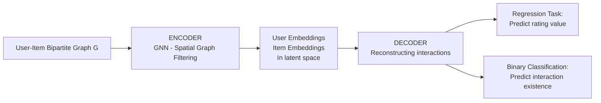

**Encoder:**
The encoder takes each user and item and maps them to **dense vector representations** (embeddings) in a low-dimensional latent space. These embeddings are computed using a Graph Neural Network that applies **Spatial Graph Filtering** — updating each node's representation by aggregating information from its neighbors in the bipartite graph.

For user $u_i$: its representation is updated using all item nodes $I_j$ that $u_i$ has interacted with as neighbors. For item $v_j$: its representation is updated using all user nodes $u_i$ that have interacted with $v_j$.

The spatial graph filtering operation propagates information across the bipartite graph, ensuring that users who have interacted with similar items get similar embeddings, and items interacted with by similar users get similar embeddings.

**Decoder:**
The decoder takes the user and item embeddings and reconstructs the historical interactions. Depending on the task:
- **Regression Task:** Predict the continuous rating value $\hat{r}_{ui}$ (e.g., using inner product of embeddings).
- **Binary Classification Task:** Predict whether an interaction exists (e.g., using sigmoid of inner product).

This encoder-decoder view unifies many different GNN-based recommendation algorithms under a common framework.

---

### 📝 Q&A — Section 3

**Q1. Why does the bipartite graph representation of user-item interactions fundamentally solve the sparsity problem better than direct matrix-based methods?**

A: The bipartite graph does not require direct co-ratings for two users to be considered informationally related. Through multi-hop paths — user → item → user → item — the graph discovers transitive relationships that are invisible in the raw rating matrix. Even if user A and user C share no directly co-rated item, if they are connected by a 4-hop path through shared intermediate users and items, the graph-based method can infer similarity. This extends the effective neighborhood far beyond what direct co-rating can provide, dramatically improving coverage in sparse settings.

**Q2. Formally define the bipartite graph $\mathcal{G}$ used in GNN-based recommender systems, and explain what each component represents.**

A: $\mathcal{G} = \{\mathcal{U} \cup \mathcal{V}, \mathcal{E}\}$ where: $\mathcal{U} = \{u_1, \ldots, u_{N_u}\}$ is the set of user nodes; $\mathcal{V} = \{v_1, \ldots, v_{N_v}\}$ is the set of item nodes; $\mathcal{E}$ is the set of edges, where each edge $e_i = (u_{(i)}, v_{(i)})$ represents that user $u_{(i)}$ has interacted with item $v_{(i)}$. The bipartite property means edges only connect users to items, never user-to-user or item-to-item directly. The interaction matrix $\mathbf{M} \in \mathbb{R}^{N_u \times N_v}$ is an equivalent representation, where $\mathbf{M}_{i,j}$ encodes the rating or binary interaction status.

**Q3. How does the encoder-decoder view of collaborative filtering with GNNs differ from traditional matrix factorization?**

A: Traditional matrix factorization (e.g., SVD) decomposes the rating matrix $R \approx UV^T$ where $U$ and $V$ are latent factor matrices. This is equivalent to a simple encoder-decoder where the encoder is a linear embedding lookup (no graph structure) and the decoder is inner product. GNN-based encoder-decoder is fundamentally different: the encoder is a multi-layer graph neural network that performs spatial graph filtering, iteratively aggregating neighborhood information across the bipartite graph. This means a user's embedding is informed by all items they interacted with (and the users who interacted with those items, etc.), capturing higher-order connectivity patterns that flat matrix factorization cannot. The GNN encoder produces richer, structure-aware embeddings.

**Q4. What is the difference between an unnormalized and normalized item-item correlation graph? Why does normalization matter for PageRank-based recommendations?**

A: In the unnormalized graph, edge weights represent raw counts (number of users who co-rated both items). In the normalized graph, edge weights are divided by the out-degree of the source node (number of users who rated the source item), converting counts to transition probabilities. Normalization matters for PageRank because PageRank simulates a random walk. Without normalization, popular items (with many raters) would have artificially inflated influence — a random walker from a popular item would be more likely to stay in the popular cluster. Normalization ensures that the random walk transition probabilities sum to 1 from each node, preventing popular items from dominating the PageRank scores.

**Q5. Walk through what happens step-by-step when a GNN spatial graph filter updates a user node's representation in the bipartite graph.**

A: Step 1: For target user $u_i$, identify all item nodes in $\mathcal{V}$ that $u_i$ has interacted with — these are $u_i$'s neighbors in the bipartite graph. Step 2: Collect the current feature representations of all these item neighbors. Step 3: Aggregate these neighbor representations using a GNN aggregation function (e.g., mean pooling, attention-weighted sum). Step 4: Combine the aggregated neighbor representation with $u_i$'s own current representation using a learnable transformation (typically a linear layer + nonlinearity). Step 5: The result is $u_i$'s updated representation, which now encodes information about both its own initial features and the collective properties of all items it has interacted with. This process is repeated for $L$ layers, allowing information to propagate $L$ hops across the graph.

**Q6. Why is the recommendation problem equivalent to a link prediction problem on the user-item bipartite graph? What does this equivalence enable?**

A: The utility matrix has observed entries (known ratings) and unobserved entries (missing ratings to predict). In the bipartite graph, observed ratings correspond to existing edges, and unobserved ratings correspond to missing edges between users and items. Predicting whether user $u$ would rate item $v$ highly is equivalent to predicting whether an edge $(u, v)$ should exist in the graph. This equivalence enables the use of the rich literature of graph link prediction algorithms — random walks, Graph Autoencoders, node embeddings, and GNN-based link predictors — directly for recommendation. It also enables the use of graph structural features (common neighbors, Jaccard similarity of neighbor sets) as recommendation signals.

**Q7. In the 2-hop user-user graph derived from the bipartite graph, what does an edge weight represent, and why is this more informative than simple co-rating counts?**

A: In the user-user graph, an edge $(u_A, u_B)$ exists if A and B have at least one co-rated item. The edge weight can encode both the **number** of common items (more shared items = stronger connection) and the **quality** of those shared ratings (similar rating values on shared items = stronger taste agreement). This is more informative than simple co-rating counts because two users who gave identical ratings to 5 obscure niche films are much more similar than two users who both watched the same 5 blockbusters and gave completely different ratings. The edge weight in the user-user graph can simultaneously capture both the breadth and quality of shared preferences.

**Q8. What would happen if you tried to use a GNN on the user-item bipartite graph without normalization of the adjacency matrix? How does this cause over-smoothing?**

A: Without adjacency normalization, the GNN aggregation step sums neighbor features without accounting for node degrees. High-degree nodes (popular items with many user ratings, or active users with many item interactions) would contribute massive aggregate signals to their neighbors. After multiple GNN layers, all node representations would converge to representations dominated by these high-degree nodes — this is **over-smoothing**. Normalization (e.g., symmetric normalization $D^{-1/2} A D^{-1/2}$ where $D$ is the degree matrix) scales each neighbor's contribution by the product of source and target degrees, preventing high-degree nodes from overwhelming the signal and preserving meaningful neighborhood distinctions across layers.

---

## 4. Open Areas and Future Directions

### 4.1 Dynamic GNN

**The current limitation:** Existing GNN-based recommendation models are almost entirely built on **static graphs** — a snapshot of user-item interactions frozen in time. But real-world recommendation systems are inherently dynamic.

**Three key sources of dynamics:**

1. **Sequential and session-based recommendation:** User data arrives continuously in a stream. In session-based recommendation, the system must adapt to a user's *within-session* evolving intent (e.g., the user starts browsing for a laptop, then shifts to looking at laptop bags). The interaction graph must be updated in real time.

2. **Evolving user preferences:** User interests change over time — the music someone loved at 18 may be very different from what they enjoy at 30. A static model cannot capture this preference drift.

3. **Platform-side dynamics:** New users join, new products are added, new features (ratings, reviews, social connections) are created continuously. A static GNN must be retrained from scratch to incorporate new nodes and edges — this is computationally expensive and introduces staleness.

**Research direction:** **Dynamic Graph Neural Networks** that can update node representations incrementally as new interactions arrive, without full retraining. These include temporal GNNs, continuous-time dynamic graphs, and streaming GNN methods.

### 4.2 Self-Supervised GNN

**The problem:** The direct supervision signal from interaction data (observed ratings or clicks) is **relatively sparse compared to the scale of the graph**. With billions of items and sparse ratings, a standard supervised GNN may not learn rich enough representations.

**The solution concept:** Self-supervised learning generates additional supervision signals **from the graph structure itself**, without requiring extra labeled data.

**The Self-Supervised GNN pipeline for recommendations:**

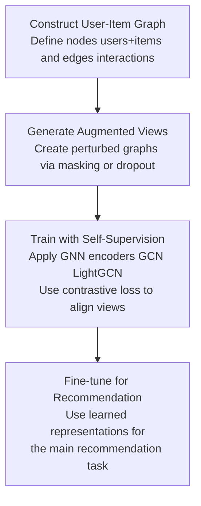

**Step-by-step:**
1. **Construct a User-Item Graph:** Define nodes (users and items) and edges (interactions).
2. **Generate Augmented Views:** Create two or more perturbed versions of the graph (e.g., by randomly masking some edges or nodes, applying edge dropout, or adding noise to node features). Each augmented view provides a different "perspective" on the same underlying graph.
3. **Train with Self-Supervision:** Apply GNN encoders (e.g., GCN, LightGCN) to produce embeddings for each augmented view. Use **contrastive loss** to train the GNN so that different augmented views of the same user/item produce similar embeddings, while different users/items produce dissimilar embeddings.
4. **Fine-tune for Recommendation:** Use the pretrained, structure-rich embeddings as input to the downstream recommendation task (rating prediction or top-k recommendation).

**Why this helps:** The contrastive pretraining forces the GNN to learn representations that are invariant to small perturbations (dropout, masking) and capture the robust structural patterns of the graph — not just the noisy surface features. This enriches the representations significantly beyond what sparse rating supervision alone can achieve.

### 4.3 Conversational GNN (CRS)

**The problem of information asymmetry:** Existing recommender systems can only estimate user preferences from **historically collected behavior data**. They cannot directly ask users what they want right now. This creates information asymmetry — the system guesses while the user knows exactly what they're looking for.

**Conversational Recommendation Systems (CRS):** A new paradigm where users **interact with the recommendation system through dialogue**. Users can explicitly convey consumption demands, ask questions, and provide positive/negative feedback on recommended items in real time.

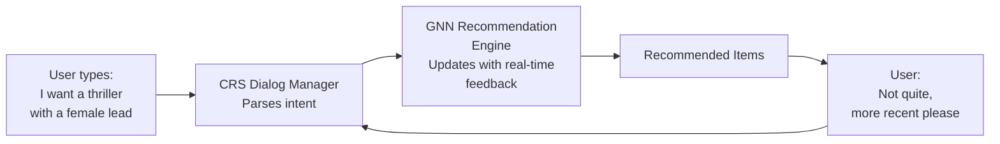

**Key idea:** In a conversational system, new preference data can be dynamically collected during the conversation itself — this directly addresses the static information problem.

**Data challenge:** One needs to generate **conversational recommendation datasets from behavioral interactions** — transforming historical click/rating data into synthetic conversation logs to train CRS models.

**Research opportunity:** The advances in GNN-based representation learning can be **combined with preference learning in the conversational setting**. The GNN provides structural embeddings for users and items; the conversational component provides explicit, real-time feedback signals that can be used to update or condition these embeddings during the conversation.

### 4.4 Knowledge Graph Enhanced GNN

**Motivation:** Standard GNN-based recommendation only leverages the user-item interaction graph. But there is rich **external knowledge** about items that could improve recommendation quality — particularly for aspects like **diversity** (recommending from different categories) and **fairness** (not over-representing certain item types).

**Knowledge Graphs (KGs):** KGs describe **semantic relations between items** — e.g., "Movie A was directed by Director X," "Book B is in the same genre as Book C," "Product D uses Component E." This relational knowledge goes far beyond what can be inferred from co-ratings alone.

**Knowledge Graph Structure:**
- **Entities** $V$: Items (and other real-world entities like directors, actors, genres, brands)
- **Relations** $R$: Typed relation labels (directed_by, belongs_to_genre, similar_to, etc.)
- **Edges** $E_k$: Triplets $e = (v_i, r, v_j)$ meaning "entity $v_i$ is related to entity $v_j$ via relation $r$"

The KG can be extended to include **user knowledge graphs** as well — e.g., "User A is a fan of Director X," "User B prefers action over romance."

**How GNNs incorporate KGs:**

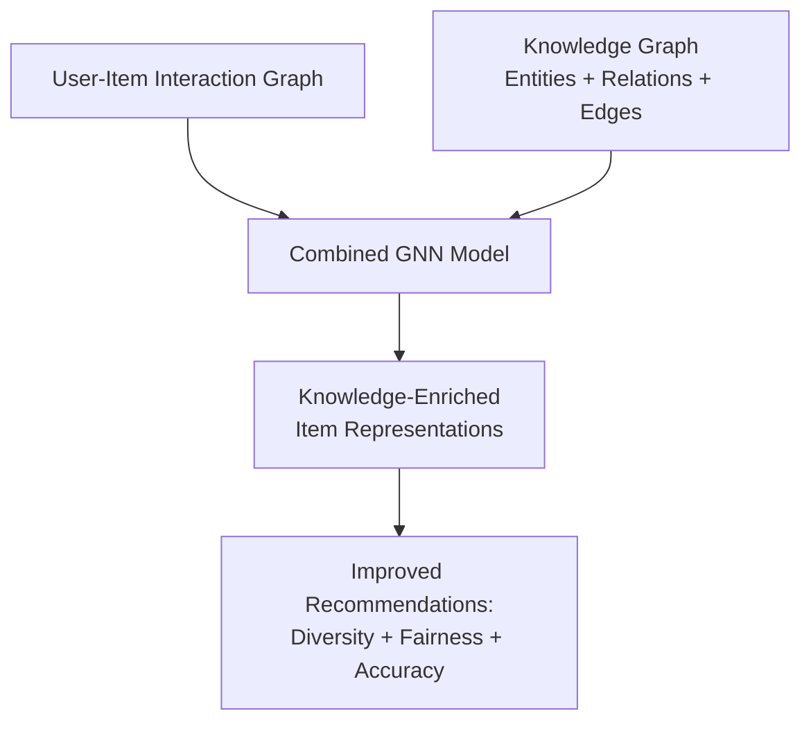

GNN models process the KG by performing **relational graph convolution** — each relation type has its own set of learnable parameters, allowing the model to distinguish "directed_by" from "belongs_to_genre" connections. The enriched item representations capture both the collaborative signal (who bought it) and the semantic signal (what it is and how it relates to other entities).

**Diagram: User-Item-KG integrated graph**

```
Users                    Items
  User A ——PURCHASES——> Item 5
  User A ——PURCHASES——> Item 4    ←—SIMILAR_ITEM—— Item 3
  User B ——PURCHASES——> Item 3    ←—SIMILAR_ITEM—— Item 1
  User C ——PURCHASES——> Item 1
  User D ——PURCHASES——> Item 2
                 ↑
        SIMILAR_USER connections
        between users with similar
        purchase patterns
```

### 4.5 LLM + GNN (RAG-Enhanced Recommendations)

**The problem with pure LLM-based recommendations:**
Large Language Models (LLMs) are powerful general reasoners but face two key limitations as recommenders:
1. **Hallucinations:** LLMs may confidently recommend items that don't exist or have incorrect properties.
2. **Staleness and domain gap:** LLMs lack up-to-date and domain-specific knowledge — they cannot know about items released after their training cutoff or niche domain facts.

**Retrieval-Augmented Generation (RAG):** A technique that addresses these limitations by allowing the LLM to retrieve relevant external knowledge before generating a response. Instead of relying solely on parametric memory, the LLM conditions its output on retrieved documents or facts.

**The problem with vanilla RAG for recommendations:**
Standard RAG retrieves documents based on text similarity (e.g., TF-IDF or dense retrieval), which:
- Introduces **noise** — retrieved documents may be semantically related but not useful for the specific recommendation task
- **Neglects structural relationships** — text-based retrieval cannot capture the relational structure of a knowledge graph (e.g., "this item is in the same category as items the user has previously purchased")

**GNN-Driven RAG:** The proposed solution is to use a GNN to traverse the knowledge graph and retrieve **high-quality, structurally-relevant information** that is then passed to the LLM.


**Why this is promising:** The GNN's structural traversal of the KG is fundamentally better at capturing relational context than text-based retrieval. Combining GNN-based structural retrieval with LLM's natural language reasoning and generation capabilities creates a system that is both knowledgeable and capable of nuanced, contextual recommendation.

---

### 📝 Q&A — Section 4

**Q1. Why are static GNN-based recommendation models inadequate for real-world deployment, even if they achieve high accuracy on benchmark datasets?**

A: Real-world recommender systems are dynamic: new users join, new items are added, and user preferences evolve over time. A static GNN is trained once on a snapshot of the interaction graph and then frozen. When new interactions arrive, the model's embeddings are immediately stale — the representations of existing users and items no longer reflect their current interaction patterns, and new users/items have no representation at all. Retraining from scratch is computationally expensive and introduces latency. Furthermore, sequential/session-based recommendation requires real-time updates within a single user session, which static models fundamentally cannot provide.

**Q2. Explain the self-supervised GNN pipeline for recommendation. What is contrastive loss doing in this context, and why is it necessary?**

A: The pipeline: (1) Build a user-item graph. (2) Generate two augmented views by applying different random perturbations (edge/node dropout, feature masking). (3) Apply a GNN encoder to each view to get embeddings. (4) Apply contrastive loss: this objective pulls together the embeddings of the two views of the same node (they should represent the same user/item despite perturbation) and pushes apart embeddings of different nodes. (5) Fine-tune the pretrained GNN on the recommendation task. Contrastive loss is necessary because the GNN needs rich training signal beyond the sparse supervised ratings. By training the model to be invariant to random perturbations, it is forced to capture robust, structural patterns rather than superficial co-occurrence statistics.

**Q3. What is "information asymmetry" in traditional recommender systems, and how do Conversational Recommendation Systems (CRS) address it?**

A: Information asymmetry means the system only has access to what users have done historically (clicks, ratings) while the user knows exactly what they want right now. A user searching for a gift for their elderly aunt has a very specific need, but their click history (dominated by their own preferences) gives the system no signal for this context. CRS addresses this by allowing users to directly communicate their current needs via dialogue — "I want something for a 75-year-old woman who loves gardening, budget around $50." This real-time, explicit preference communication eliminates the asymmetry and allows the system to make highly targeted recommendations immediately, without waiting to accumulate behavioral history.

**Q4. Why does vanilla RAG (text-based retrieval) fall short for knowledge-graph-augmented recommendation? What specific problem does GNN-driven RAG solve?**

A: Vanilla RAG retrieves documents based on text/semantic similarity. For recommendations, what matters is not just semantic similarity but **structural relationships** in the knowledge graph: "this director has made 3 films the user loved," "this book is a sequel to one the user rated 5 stars," "this restaurant shares 4 menu categories with ones the user visits frequently." Text-based retrieval cannot capture these relational, multi-hop structural patterns. GNN-driven RAG traverses the KG using graph neural networks, which are specifically designed to aggregate and propagate information across relational edges. The retrieved structural context (KG subgraphs relevant to the user's history and query) is then provided to the LLM, grounding its recommendations in factual, structured knowledge rather than parametric hallucination.

**Q5. How does a Knowledge Graph enhance recommendation quality specifically for diversity and fairness? Give an example for each.**

A: **Diversity:** Without a KG, the system only knows items co-rated by similar users. With a KG that encodes "item A and item B belong to the same sub-genre," the system can detect when recommendations are too homogeneous (all sub-genre X) and deliberately select items from adjacent KG regions (related sub-genres Y and Z) to diversify. **Fairness example:** Without a KG, a biased interaction history (over-representation of mainstream items) propagates into recommendations. With a KG encoding "item C was created by a minority-owned business" or "item D serves demographic group Q," the system can use this structural knowledge to apply fairness constraints — ensuring recommendations don't systematically disadvantage certain item categories or producer groups.

**Q6. What would happen if you applied a standard static GNN recommender to a session-based recommendation task (e.g., recommending the next item in an e-commerce browsing session)?**

A: The static GNN produces fixed embeddings trained on historical interaction data. In a session, the user's intent evolves with each click: they might start searching broadly, then progressively narrow down to a specific product type. The static GNN has no mechanism to update embeddings based on within-session signals — its representation of the user is frozen at the last training snapshot. Therefore, the recommendations would remain fixed throughout the session regardless of user behavior, completely missing the user's evolving in-session intent. A dynamic GNN or sequence model (like BERT4Rec or GRU-based session models) is needed to capture this temporal evolution.

**Q7. Trace the mathematical flow from the bipartite graph to an encoder output embedding for a specific user node in a 2-layer GNN setting.**

A: Let $\mathbf{h}_{u_i}^{(0)} = \mathbf{x}_{u_i}$ (initial feature vector of user $u_i$). **Layer 1:** Collect item neighbors $\mathcal{N}(u_i) = \{v_j : (u_i, v_j) \in \mathcal{E}\}$. Aggregate: $\mathbf{m}_{u_i}^{(1)} = \text{AGG}\left(\{\mathbf{h}_{v_j}^{(0)} : v_j \in \mathcal{N}(u_i)\}\right)$ (e.g., mean of item embeddings). Update: $\mathbf{h}_{u_i}^{(1)} = \sigma\left(\mathbf{W}^{(1)} \cdot [\mathbf{h}_{u_i}^{(0)} \| \mathbf{m}_{u_i}^{(1)}]\right)$. **Layer 2:** Now $\mathcal{N}(u_i)$'s own representations $\mathbf{h}_{v_j}^{(1)}$ have already incorporated the users who rated item $v_j$. So $\mathbf{h}_{u_i}^{(2)}$ now encodes 2-hop information: items $u_i$ rated, and other users who rated those same items. This is the "2-hop neighborhood" captured by 2 GNN layers, enabling collaborative signal to flow through the bipartite graph.

**Q8. How would you modify a GNN-based recommender to handle the "popularity bias" problem, where popular items dominate recommendations?**

A: Several strategies: (1) **Inverse popularity weighting in aggregation:** Weight each item neighbor's contribution by $1/\text{pop}(v_j)$ — less popular items have higher weight per interaction, preventing popular items from dominating the aggregated signal. (2) **Popularity-debiased loss:** Use an inverse propensity scoring (IPS) objective where training examples are reweighted by the inverse of the item's exposure probability, correcting for the fact that popular items appear more in training data simply due to visibility. (3) **Causal approaches:** Model the exposure process explicitly and learn embeddings that capture true preference independent of exposure probability. (4) **Regularization:** Add a term to the loss that penalizes concentrating recommendations on a small set of high-degree item nodes.

---

## 5. Final Summary: Concept Tree

```
GNN IN RECOMMENDER SYSTEMS
│
├── 1. BACKGROUND
│   ├── Formal definition: f: U × I → ℝ (matrix completion)
│   ├── Two formulations: Prediction (rating) vs. Ranking (top-k)
│   ├── Rating types: Continuous → Interval → Ordinal → Binary → Unary
│   │   └── Explicit vs. Implicit feedback
│   └── Long Tail Property (Power Law)
│       ├── Business: profit in niche/long-tail items
│       └── Technical: sparsity → collaborative filtering failure
│
├── 2. RECOMMENDER SYSTEM TYPES
│   ├── Collaborative Filtering
│   │   ├── Memory-based: User-based CF / Item-based CF
│   │   └── Model-based: Matrix Factorization / GNN
│   ├── Content-Based (item attributes)
│   │   ├── Strength: new item cold-start
│   │   └── Weakness: over-specialization, new user cold-start
│   ├── Knowledge-Based (constraints, cases)
│   │   └── Best for: rare purchase items (real estate, luxury goods)
│   ├── Utility-Based (explicit utility functions)
│   ├── Hybrid/Ensemble (combine multiple approaches)
│   ├── Context-Based (time, location, social)
│   ├── Time-Sensitive (evolving preferences)
│   ├── Location-Based (preference locality + travel locality)
│   └── Social (network structure + social cues)
│
├── 3. GRAPH-BASED APPROACH
│   ├── Motivation: sparsity → indirect connectivity via graphs
│   ├── Graph types: User-Item bipartite / User-User / Item-Item correlation
│   ├── Algorithms: Random walk (PageRank), Shortest path
│   ├── Key insight: Recommendation = Link Prediction on bipartite graph
│   ├── GNN Setting: G = {U ∪ V, E}, interaction matrix M ∈ ℝ^{Nu×Nv}
│   └── Encoder-Decoder CF
│       ├── Encoder: GNN with spatial graph filtering
│       └── Decoder: Regression (ratings) or Binary Classification (existence)
│
└── 4. OPEN AREAS
    ├── Dynamic GNN (sequential, session-based, evolving preferences)
    ├── Self-Supervised GNN (augmented views + contrastive loss)
    ├── Conversational GNN / CRS (dialogue-based preference elicitation)
    ├── KG-Enhanced GNN (semantic relations → diversity + fairness)
    └── LLM + GNN (GNN-driven RAG to ground LLM recommendations)
```

---

*Notebook compiled for: Interdisciplinary Deep Learning on Graphs — UE23AM342BA1*  
*Contact: Bhaskarjyotidas@pes.edu*


# 📘 Tutor Notebook: Graph Neural Networks in Traffic Prediction and Anomaly Detection
**Course:** Interdisciplinary Deep Learning on Graphs (UE23AM342BA1)  
**Instructor:** Dr. Bhaskarjyoti Das, Department of Computer Science in AI & ML and Engineering, PES University  
**Based on:** Lecture Slides — DLG_16_trafficnetwork  

---

## 🗂️ Table of Contents

1. [Background: Why Traffic Prediction Needs GNNs](#1-background-why-traffic-prediction-needs-gnns)
   - 1.1 The Problem and Its Significance
   - 1.2 Traffic as a Spatio-Temporal Problem
2. [Mathematical Representation of Traffic Networks](#2-mathematical-representation-of-traffic-networks)
   - 2.1 Graph Formulation of the Traffic Network
   - 2.2 The Traffic Forecasting Function
3. [The GNN-Based Spatio-Temporal Architecture](#3-the-gnn-based-spatio-temporal-architecture)
   - 3.1 Layer-by-Layer Representation Refinement
   - 3.2 Spatial Graph Filtering Operation
   - 3.3 Temporal Sequence Modeling
   - 3.4 Available Spatial and Temporal Components
4. [Data Formats for Traffic Forecasting](#4-data-formats-for-traffic-forecasting)
   - 4.1 Time Series Formulation
   - 4.2 Grid Data
   - 4.3 Graph Data
5. [Demand Forecasting vs. Lane Occupancy Prediction](#5-demand-forecasting-vs-lane-occupancy-prediction)
6. [Datasets: New vs. Existing](#6-datasets-new-vs-existing)
   - 6.1 Classic Datasets
   - 6.2 New Open Traffic Datasets
7. [Challenges in GNN-Based Traffic Forecasting](#7-challenges-in-gnn-based-traffic-forecasting)
8. [Research Opportunities](#8-research-opportunities)
9. [Final Summary: Concept Tree](#9-final-summary-concept-tree)

---

## 📖 How to Use This Notebook

This notebook explains every slide from the lecture from first principles. After each major section is a Q&A block with exam-style questions covering conceptual understanding, mathematical formulation, comparison of methods, failure modes, and real-world reasoning. Work through the Q&A to self-test deeply.

---

## 1. Background: Why Traffic Prediction Needs GNNs

### 1.1 The Problem and Its Significance

**Traffic prediction** is the task of forecasting future traffic conditions — speed, volume, congestion — based on historical observations. The ability to accurately predict traffic is critical for multiple high-impact applications:

- **Smart city planning:** Understanding where and when congestion occurs guides decisions about new roads, intersections, and transportation infrastructure.
- **Transportation management:** Real-time traffic forecasting enables dynamic route guidance, adaptive traffic signal control, and incident detection.
- **Autonomous vehicles:** Self-driving vehicles need accurate predictions of the traffic environment to plan safe, efficient paths.
- **Navigation applications:** Systems like Google Maps use traffic prediction to give accurate travel time estimates and re-routing suggestions.

In traffic study, the raw data is **traffic flow data**, which is naturally treated as **time series**: measurements taken at regular time intervals (e.g., every 5 minutes) of quantities such as:
- **Traffic speed:** average vehicle speed on a road segment (km/h)
- **Traffic volume (flow):** number of vehicles passing a sensor per unit time (vehicles/hour)
- **Traffic density:** number of vehicles per unit length of road (vehicles/km)

### 1.2 Traffic as a Spatio-Temporal Problem

The crucial insight that motivates graph neural networks for traffic prediction is that **roads and road sections are not independent of each other** — they have rich spatial relationships.

Consider a highway with an on-ramp. Heavy traffic entering via the on-ramp will immediately affect the density and speed on the main highway downstream. Congestion at one intersection creates a ripple effect through adjacent intersections. These **spatial dependencies** are not captured by treating each road as an isolated time series.

**Why pure time series models are insufficient:**
A standard time series model (e.g., ARIMA, LSTM) applied independently to each road sensor ignores the spatial structure entirely. Road A's future traffic might be heavily influenced by what is happening right now on Road B upstream — pure time series methods have no mechanism to incorporate this spatial context.

**The two-dimensional challenge:** Traffic data has both:
1. **Spatial dependencies:** Nearby roads influence each other in complex, non-linear ways determined by the road network topology.
2. **Temporal dependencies:** Traffic exhibits strong periodicity (rush hours, weekday vs. weekend patterns) and short-term autocorrelation (current congestion predicts near-future congestion).

An effective traffic forecasting model must **capture both spatial and temporal information simultaneously**.

**The solution architecture:**
- **Graph Neural Networks** are adopted to capture **spatial relations** — treating the road network as a graph and propagating information between neighboring road segments.
- **Sequential modeling methods** (CNNs, RNNs, Transformers) are used to capture **temporal relations** — modeling how each node's features evolve over time.

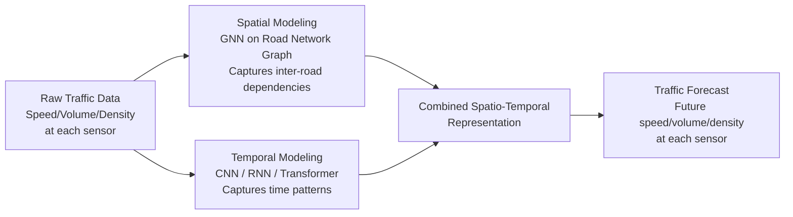

---

### 📝 Q&A — Section 1

**Q1. Why is traffic forecasting fundamentally a spatio-temporal problem, and why does ignoring either dimension lead to failure?**

A: Traffic is spatio-temporal because sensor readings at one location and time are correlated with readings at adjacent locations (spatial) and at previous times (temporal). Ignoring the spatial dimension means treating each road sensor independently — the model cannot account for how upstream congestion propagates downstream, or how accidents on adjacent roads affect traffic flow. Ignoring the temporal dimension means treating each time step as independent — the model cannot capture rush-hour periodicity, the persistence of congestion, or the gradual dissipation of traffic waves. Both dimensions are necessary for accurate forecasting.

**Q2. What are the three main traffic variables captured in traffic flow data, and what does each measure physically?**

A: (1) **Traffic speed:** the average velocity of vehicles passing through a road segment, measured in km/h or mph. It reflects how freely traffic is moving — low speed indicates congestion. (2) **Traffic volume (flow):** the count of vehicles passing a detector per unit time (vehicles/hour). High volume with low speed indicates congested conditions; high volume with high speed indicates free-flow capacity utilization. (3) **Traffic density:** the number of vehicles occupying a unit length of road (vehicles/km). It is the "concentration" of traffic — the Fundamental Diagram of Traffic Flow relates volume, density, and speed via $\text{Volume} = \text{Speed} \times \text{Density}$.

---

## 2. Mathematical Representation of Traffic Networks

### 2.1 Graph Formulation of the Traffic Network

The traffic network is formally represented as a **graph** $\mathcal{G} = \{\mathcal{V}, \mathcal{E}\}$:

$$\mathcal{V} = \{v_1, \ldots, v_N\} \quad \text{(set of nodes)}$$
$$\mathcal{E} \quad \text{(set of edges)}$$
$$\mathbf{A} \quad \text{(adjacency matrix describing node connections)}$$

**Symbol glossary:**
- $\mathcal{G}$ — the traffic graph
- $\mathcal{V}$ — the set of $N$ nodes, where each node represents a road or road section (often a physical sensor location)
- $N$ — total number of nodes in the traffic network
- $\mathcal{E}$ — the set of edges; an edge $(v_i, v_j) \in \mathcal{E}$ indicates that roads $v_i$ and $v_j$ are spatially related (e.g., directly connected, adjacent, or within a certain distance threshold)
- $\mathbf{A} \in \mathbb{R}^{N \times N}$ — the adjacency matrix; $A_{ij} > 0$ if there is a spatial relation between nodes $i$ and $j$, and 0 otherwise. May be weighted by distance or connectivity type.

**Physical interpretation of edges:** Edges encode the spatial relationships between roads. These can be:
- **Road topology edges:** Two roads are directly connected (one leads to the other).
- **Distance-based edges:** Two sensors within a certain geographic distance are connected.
- **Semantic edges:** Two roads that are functionally related (e.g., both serve the same bottleneck) are connected.

### 2.2 The Traffic Forecasting Function

At each time step $t$, the traffic status of the entire network is captured as a feature matrix:

$$\mathbf{x}_t \in \mathbb{R}^{N \times d}$$

**Symbol glossary:**
- $\mathbf{x}_t$ — the traffic status matrix at time $t$
- $N$ — number of nodes (roads/sensors)
- $d$ — number of traffic features per node (e.g., $d=1$ for speed only, $d=3$ for speed + volume + density)
- Row $i$ of $\mathbf{x}_t$ — the feature vector of node $v_i$ at time $t$ (e.g., its traffic speed, volume, and density)

**The forecasting objective:** Given observations from the **previous $M$ time steps**, predict the traffic status for the **next $H$ time steps**:

$$(\hat{\mathbf{X}}_{M+1}, \ldots, \hat{\mathbf{X}}_{M+H}) = f(\mathbf{X}_1, \ldots, \mathbf{X}_M) \quad \text{(Equation 12.7)}$$

**Symbol glossary:**
- $M$ — the length of the historical lookback window (number of past time steps used as input)
- $H$ — the forecast horizon (number of future time steps to predict)
- $\mathbf{X}_t$ — observed traffic status at time $t$ (a matrix over all nodes)
- $\hat{\mathbf{X}}_t$ — predicted traffic status at time $t$
- $f(\cdot)$ — the model to be learned; a function mapping past observations to future predictions

**Intuitive reading of Equation 12.7:** "Given what we have observed about traffic at all $N$ sensor locations over the past $M$ time intervals, predict what the traffic will be at all $N$ locations for the next $H$ time intervals." The graph $\mathcal{G}$ (which encodes the spatial topology) is available to the model as additional context — the model can use the road network structure to reason about how traffic at one location will propagate to adjacent locations.

**Special cases:**
- If $H=1$: **single-step forecasting** — predict only the next time step
- If $H>1$: **multi-step forecasting** — predict multiple future time steps simultaneously
- If $d=1$: **univariate** — only one traffic variable per node
- If $d>1$: **multivariate** — multiple traffic variables per node simultaneously

---

### 📝 Q&A — Section 2

**Q1. Write out and fully explain Equation 12.7. What does each symbol represent, and what is the model $f$ trying to do?**

A: $(\hat{\mathbf{X}}_{M+1}, \ldots, \hat{\mathbf{X}}_{M+H}) = f(\mathbf{X}_1, \ldots, \mathbf{X}_M)$. Here: $\mathbf{X}_t \in \mathbb{R}^{N \times d}$ is the observed traffic status (speed, volume, density) at all $N$ sensor nodes at time $t$; $M$ is the lookback window (how many past time steps are observed); $H$ is the forecast horizon (how many future time steps are predicted); $\hat{\mathbf{X}}_t$ is the predicted future status; $f$ is the spatio-temporal model to be learned. The equation says: given $M$ consecutive snapshots of the traffic network, predict the next $H$ snapshots. The graph structure $\mathcal{G}$ provides the spatial context that $f$ exploits to capture dependencies between roads.

**Q2. Why is the adjacency matrix $\mathbf{A}$ a crucial component of the traffic forecasting model? What would happen if you set $\mathbf{A} = \mathbf{I}$ (identity)?**

A: $\mathbf{A}$ encodes which nodes (roads) are spatially related and thus should share information. The GNN uses $\mathbf{A}$ to determine which neighbors to aggregate information from during the graph filtering step. If $\mathbf{A} = \mathbf{I}$ (identity matrix, meaning each node only "connects" to itself), there is no information exchange between roads — the GNN degenerates to a node-independent feature transformation, equivalent to applying an MLP to each road sensor independently with no spatial awareness. The model would lose all ability to capture spatial dependencies, essentially becoming a pure time series model applied per sensor.

**Q3. What is the difference between single-step and multi-step traffic forecasting? Why is multi-step forecasting significantly harder?**

A: Single-step forecasting predicts only the traffic status at time $t+1$ given observations up to time $t$ — one prediction for each run of the model. Multi-step forecasting predicts $H$ consecutive future time steps simultaneously. Multi-step is harder because: (1) Errors in early predictions compound — if the prediction for $t+1$ is slightly wrong, this error influences the prediction for $t+2$, and so on. (2) The uncertainty grows with forecast horizon — traffic 5 minutes ahead is much more predictable than traffic 1 hour ahead. (3) Multi-step models must implicitly learn to capture longer-range temporal dynamics rather than just short-range autocorrelation.

---

## 3. The GNN-Based Spatio-Temporal Architecture

### 3.1 Layer-by-Layer Representation Refinement

The GNN-based traffic forecasting model processes the traffic data through **multiple layers**, where each layer updates the node representations by capturing both spatial and temporal relations. Crucially, the same GNN filter is used for all time steps — this **weight sharing** across time steps reduces the number of parameters and makes the model more data-efficient.

**Architecture overview:**

For $M$ input time steps $\{t_1, t_2, \ldots, t_M\}$, each node in the traffic graph has a feature vector at each time step. The model processes these in two stages per layer:

1. **Spatial graph filtering** — for each time step independently, update node representations by aggregating information from spatial neighbors.
2. **Temporal sequence modeling** — after spatial filtering, treat the sequence of updated representations across time steps as a sequential signal and model temporal dependencies.

The output of one layer becomes the input to the next, with representations becoming progressively richer and more abstract.

```
Time steps:  t₁          t₂          ...    tM
             ↓            ↓                  ↓
Input:    F₁^(l-1)    F₂^(l-1)    ...   FM^(l-1)    ← Previous layer representations
             ↓            ↓                  ↓
         GNN-Filter   GNN-Filter   ...  GNN-Filter  ← Spatial: same filter, applied per time step
             ↓            ↓                  ↓
          F₁,S^(l-1)  F₂,S^(l-1)  ...  FM,S^(l-1) ← Spatially-filtered representations
             ↓————————————↓————————————————↓
                       Sequence Model                ← Temporal: models sequence across time
             ↓            ↓                  ↓
Output:   F₁^(l)      F₂^(l)      ...   FM^(l)     ← Updated representations for next layer
```

### 3.2 Spatial Graph Filtering Operation

The **spatial graph filtering operation** operates directly on the graph structure, updating each node's representation by aggregating information from its immediate spatial neighbors. Mathematically:

$$\mathbf{F}_{t,S}^{(l)} = \text{GNN-Filter}(\mathbf{F}_t^{(l-1)}, \mathbf{A}), \quad t = 1, \ldots, M$$

**Symbol glossary:**
- $\mathbf{F}_t^{(l-1)}$ — the node representations at time step $t$ after the $(l-1)$-th learning layer; input to layer $l$
- $\mathbf{F}_{t,S}^{(l)}$ — the node representations at time step $t$ after the $l$-th spatial graph filtering layer; output after spatial aggregation but before temporal modeling
- $\mathbf{A}$ — the adjacency matrix of the traffic graph
- $l$ — the current layer index
- $t$ — the current time step index (ranges from 1 to $M$)
- The superscript $(l-1)$ denotes the layer, the subscript $t$ denotes the time step, and the subscript $S$ denotes "after spatial filtering"

**How GNN-Filter works physically:** For node $v_i$ (representing a road sensor), the GNN-Filter collects the feature vectors of all spatially adjacent road sensors (those connected to $v_i$ by an edge in $\mathbf{A}$). It aggregates these neighbor features (e.g., via weighted average or attention), and combines the result with $v_i$'s own current representation through a learnable transformation. After this operation, each node's representation encodes not just its own current traffic state, but also the traffic state of its spatial neighborhood.

**Important:** The **same GNN filter** (same weight matrix $\mathbf{W}$) is applied at every time step $t$. This parameter sharing is what makes the model computationally feasible — instead of learning separate filters for each time step, one shared filter captures the general spatial aggregation principle.

### 3.3 Temporal Sequence Modeling

After the spatial graph filtering produces $\mathbf{F}_{1,S}^{(l)}, \ldots, \mathbf{F}_{M,S}^{(l)}$ — a sequence of spatially-enriched node representations — the **temporal sequence model** captures how these representations evolve over time:

$$\mathbf{F}_1^{(l)}, \ldots, \mathbf{F}_M^{(l)} = \text{Sequence}(\mathbf{F}_{1,S}^{(l)}, \ldots, \mathbf{F}_{M,S}^{(l)})$$

**What this does:** The Sequence function takes the ordered sequence of $M$ spatially-filtered feature matrices and models the temporal dynamics — the periodicity, autocorrelation, and trends in the traffic signal over time. The output is a new sequence of representations that encode both spatial context (captured by the GNN filter) and temporal context (captured by the Sequence function).

**Key property:** The output of the Sequence model $\mathbf{F}_t^{(l)}$ serves as the **input for the next spatial layer** $(l+1)$. This alternating spatial-temporal processing means each successive layer captures higher-order spatio-temporal patterns.

### 3.4 Available Spatial and Temporal Components

**For the spatial GNN-Filter, two main approaches exist:**

1. **GCN Filter (Graph Convolutional Network filter):** The standard spectral or spatial graph convolution, which aggregates neighbor features using a normalized adjacency matrix. Operates with fixed, symmetric weights — each neighbor contributes equally (after normalization).

2. **Attention-enhanced GCN:** An **attention mechanism** is applied on top of the graph filtering. Rather than all neighbors contributing equally, the model learns attention coefficients that weight each neighbor's contribution based on the current features. This allows the model to selectively focus on the most relevant spatial neighbors for each prediction.

**For the temporal Sequence function, multiple options exist:**

1. **1-D Convolutional Neural Networks (CNNs):** Applied along the time dimension. Efficient parallel computation, captures local temporal patterns (patterns over a fixed window). Cannot capture very long-range dependencies.

2. **Gated Recurrent Unit (GRU) / Recurrent Neural Networks:** Sequential processing that maintains a hidden state capturing all past information. Well-suited for variable-length sequences and long-range temporal dependencies. However, RNNs process sequentially and are slower to train than CNNs.

3. **Transformers:** Self-attention over all time steps simultaneously. Captures global temporal dependencies regardless of distance. Computationally expensive ($O(M^2)$ in sequence length) but often achieves state-of-the-art performance.

| Temporal Model | Parallelizable | Long-range dependencies | Complexity | Best for |
|----------------|----------------|------------------------|------------|----------|
| 1-D CNN | Yes | Limited (window size) | O(M) | Short patterns, efficiency |
| GRU/RNN | No (sequential) | Good | O(M) | Variable sequences |
| Transformer | Yes | Excellent | O(M²) | Long sequences, SOTA |

---

### 📝 Q&A — Section 3

**Q1. Why is the same GNN filter applied to all time steps rather than learning separate filters for each time step? What would go wrong if you used time-step-specific filters?**

A: Parameter sharing across time steps enforces the inductive bias that the spatial aggregation principle is the same regardless of time — road $A$ influences road $B$ in the same spatial way at 8am as at 8pm (they are always physically connected). Using separate filters per time step would multiply the number of parameters by $M$ (the lookback window), leading to an enormous model that is prone to overfitting, especially with limited training data. It would also destroy the model's ability to generalize to different times of day or to sequences of different length. The shared filter is both more efficient and more principled.

**Q2. Explain the mathematical formulation $\mathbf{F}_{t,S}^{(l)} = \text{GNN-Filter}(\mathbf{F}_t^{(l-1)}, \mathbf{A})$. What information does each term encode, and why is both $\mathbf{F}_t^{(l-1)}$ and $\mathbf{A}$ needed?**

A: $\mathbf{F}_t^{(l-1)}$ encodes the current node representations at time $t$ after $l-1$ layers of processing — this is the "what each road node knows" at this point. $\mathbf{A}$ encodes the spatial structure of the road network — "which roads are neighbors." The GNN-Filter uses $\mathbf{A}$ to identify each node's spatial neighbors, then aggregates their representations from $\mathbf{F}_t^{(l-1)}$ to update the node's own representation. Both are needed: without $\mathbf{F}_t^{(l-1)}$, there is nothing to aggregate; without $\mathbf{A}$, the model doesn't know which nodes are neighbors and would aggregate all nodes equally (or not at all).

**Q3. Compare and contrast using a GCN filter vs. an attention-enhanced filter for the spatial component. When would attention be specifically beneficial?**

A: A GCN filter applies fixed normalized weights (based on node degrees) to all neighbors — all adjacent roads contribute equally after normalization. An attention-enhanced filter learns dynamic weights for each neighbor based on the current feature context — different neighbors get different importance at different times. Attention is specifically beneficial when the relative importance of spatial neighbors varies with the traffic situation: during normal conditions, all neighbors may contribute equally; during an incident upstream, the specific incident road should have much higher attention weight for downstream prediction. Attention can also model asymmetric spatial influence (road A affects road B more than road B affects road A) more naturally.

**Q4. What is the key difference between using a 1-D CNN and a GRU for temporal modeling? In what type of traffic scenario would each excel?**

A: A 1-D CNN captures local temporal patterns within a fixed window — it sees patterns like "if traffic is slow for the last 3 time steps, it will likely remain slow for the next step." It cannot capture dependencies longer than the kernel size. A GRU maintains a hidden state that summarizes all past information, enabling it to capture much longer-range patterns — like "traffic always spikes at this hour on Fridays based on multi-week patterns." CNN excels for short-horizon forecasting where only recent history matters (e.g., 5-minute ahead prediction). GRU excels for medium-to-long horizon forecasting where historical periodicity and multi-scale patterns matter. In practice, many state-of-the-art models combine both: CNN for local patterns + GRU/attention for global patterns.

**Q5. Walk through what happens to a node representation over two complete spatio-temporal processing layers.**

A: **Layer 1, Spatial phase:** Node $v_3$ (representing a highway sensor) has initial features $\mathbf{F}_{t,3}^{(0)} = \mathbf{x}_{t,3}$ (speed=60, volume=1200). The GNN-Filter collects representations from $v_3$'s neighbors (upstream sensor $v_1$, downstream sensor $v_5$, on-ramp $v_2$). It aggregates: $v_3$ now knows about congestion building upstream. Output: $\mathbf{F}_{t,3,S}^{(1)}$ encodes $v_3$'s own state plus its spatial neighborhood. **Layer 1, Temporal phase:** The Sequence model processes all time steps for $v_3$: it sees that congestion was low at $t-2$, growing at $t-1$, and now high at $t$. Output: $\mathbf{F}_{t,3}^{(1)}$ encodes the spatial neighborhood context AND the temporal trend of congestion buildup. **Layer 2, Spatial phase:** Now each neighbor of $v_3$ already has temporally-enriched representations. $v_3$'s layer-2 spatial aggregation therefore captures "what are my spatially neighboring roads' recent temporal trends?" — i.e., 2-hop spatio-temporal context.

---

## 4. Data Formats for Traffic Forecasting

### 4.1 Time Series Formulation

The **time series formulation** is the earliest and most commonly used approach. Historical data points at a single sensor are used to predict future values at that same sensor. This ignores spatial structure.

**Univariate time series:** Only **one traffic variable** is considered per sensor — e.g., only traffic flow, or only traffic speed. Simpler but loses information about the relationship between different traffic measures.

**Multivariate time series:** **Multiple traffic variables** are considered simultaneously — e.g., speed AND volume AND density at each sensor. Richer but more complex.

**Forecasting variants:**
- **Single-step forecasting:** Predict one future data point — e.g., traffic speed at sensor $i$ at time $t+1$.
- **Multi-step forecasting:** Predict multiple future time steps — e.g., traffic conditions at all sensors for the next 12 intervals (60 minutes ahead).

| Variant | Input | Output | Difficulty |
|---------|-------|--------|------------|
| Univariate single-step | 1 variable, past M steps | 1 variable, 1 step | Easiest |
| Univariate multi-step | 1 variable, past M steps | 1 variable, H steps | Moderate |
| Multivariate single-step | D variables, past M steps | D variables, 1 step | Moderate |
| Multivariate multi-step | D variables, past M steps | D variables, H steps | Hardest |

### 4.2 Grid Data

**Why pure time series is insufficient:** Time series data does not capture the **spatial dependence** of traffic activities — the fact that what happens at one location influences adjacent locations.

**Grid data** addresses this by aggregating traffic data over **regularly divided geographic regions** of the studied urban area. The city is overlaid with a regular grid (think of it like dividing a city map into cells of equal area), and all traffic within each cell is aggregated into a single feature vector.

**The result:** At each time step, the grid data produces an **intensity map** — a 2D image where each pixel corresponds to a grid cell and its value reflects the aggregate traffic activity in that cell. This image can be treated like video data, with each frame being a spatial snapshot and the sequence of frames forming a temporal video.

```
Gridded Map (city divided into cells)
┌───┬───┬───┬───┬───┐
│   │   │ ░ │ ▓ │   │  ← High traffic intensity (dark = dense)
├───┼───┼───┼───┼───┤
│   │ ░ │ ▓ │ ▒ │   │
├───┼───┼───┼───┼───┤
│   │   │ ░ │   │   │
└───┴───┴───┴───┴───┘
       ↓  (temporal sequence)
[Frame t₁] → [Frame t₂] → ... → [Frame tM]   (Video-like structure)
```

**Advantage:** Captures spatial density patterns and can be processed with standard 2D CNNs (treating traffic as an image).  
**Disadvantage:** The regular grid does not conform to the actual road network topology. Two cells may be adjacent in the grid but not connected by road. The grid loses the precise topological structure of roads.

### 4.3 Graph Data

**Graph data** is the most natural and information-rich format for traffic forecasting. Traffic data is aggregated at **specific locations or stations** (sensor nodes on actual roads), which become nodes in a traffic graph.

**Graph data structure:**
- **Nodes:** Traffic sensors/stations; $N$ nodes in the graph
- **Node features:** Measured traffic variables at that sensor (flow, speed, density) — so each node has a $d$-dimensional feature vector at each time step
- **Edges:** Model the road topology and spatial relationships. Edges can represent:
  - **Road connections:** Two roads are directly connected
  - **Spatial distances:** Sensors within a distance threshold are connected, with edge weight = $\exp(-\text{distance}/\sigma)$

**Single-step graph forecasting setup:**
The historical graph data in a **predefined lookback window** of $M$ time steps is used as input. The graph at the **next time step** is the prediction target.

```
Road Network                      Graph Data Representation
with Traffic Sensors              (sequence of graph snapshots)
       ·——·                                   ·——·          ·——·
      /    \                      [t₁]:  ·——·   ·    [tM]: ·      ·
     ·      ·         ——→               ·  ·——·           ·——·——·
      \    /
       ·——·
```

**Advantage over grid:** Precisely models the actual road topology. Edges follow real roads. Can represent complex, irregular road networks (highways, arterials, intersections) that grids approximate poorly.

**Advantage over pure time series:** Captures spatial dependencies through graph structure.

| Format | Spatial Awareness | Road Topology | Temporal | Typical Model |
|--------|-------------------|---------------|----------|---------------|
| Time Series | None | None | Yes | ARIMA, LSTM |
| Grid | Yes (area-based) | Approximate | Yes | Conv-LSTM, ST-ResNet |
| Graph | Yes (precise) | Exact | Yes | STGCN, DCRNN, GraphWaveNet |

---

### 📝 Q&A — Section 4

**Q1. Compare grid data and graph data formats for traffic forecasting on three dimensions: topological accuracy, model type, and missing data handling.**

A: **Topological accuracy:** Grid data imposes a regular spatial structure that approximates but does not match real road topology — adjacent grid cells may have no road connecting them. Graph data exactly represents road topology — edges exist only where roads connect. Grid is less accurate but simpler. **Model type:** Grid data can be processed with 2D CNNs or ConvLSTMs (treating it as video). Graph data requires GNNs or spectral graph methods. **Missing data:** In grid data, missing sensors for a cell are handled by leaving that cell's value empty or imputing. In graph data, a missing node (broken sensor) removes a node and its edges, which can affect neighborhood-based GNN computations and may require graph-completion strategies.

**Q2. Why is the graph data format considered superior to the grid format for most traffic forecasting tasks? When might the grid format be preferred?**

A: Graph data is superior because it precisely captures road network topology — the edges follow actual road connections, not artificial grid boundaries. Two non-adjacent sensors that happen to fall in neighboring grid cells won't be artificially connected in graph data. The GNN can leverage the true spatial relationships for more accurate predictions. Grid data might be preferred when: (1) the prediction target is area-wide traffic density (crowd flow) rather than specific road speeds; (2) you want to use well-developed 2D CNN architectures for spatial modeling; (3) the road network is extremely dense and a grid approximation is acceptable.

**Q3. What is multivariate multi-step traffic forecasting? Formulate it mathematically using the notation from the lecture.**

A: Multivariate multi-step forecasting predicts $d$ traffic variables (e.g., speed, volume, density) for all $N$ sensors simultaneously for $H$ future time steps. Using the lecture notation: given $\mathbf{X}_1, \ldots, \mathbf{X}_M$ where each $\mathbf{X}_t \in \mathbb{R}^{N \times d}$ captures all $d$ variables at all $N$ sensors at time $t$, predict $\hat{\mathbf{X}}_{M+1}, \ldots, \hat{\mathbf{X}}_{M+H}$, i.e., $(\hat{\mathbf{X}}_{M+1}, \ldots, \hat{\mathbf{X}}_{M+H}) = f(\mathbf{X}_1, \ldots, \mathbf{X}_M)$. This is the full Equation 12.7 with $d > 1$ and $H > 1$, representing the most general and challenging formulation.

---

## 5. Demand Forecasting vs. Lane Occupancy Prediction

A distinguishing feature of **demand prediction** (taxi demand, bike-sharing demand, passenger flow) vs. **lane occupancy prediction**:

**Demand prediction:** Forecasts *how many* users will need transportation services at various locations and times. Typical problem settings: predict taxi pick-up demand per zone per time step, predict subway passenger inflow, predict bike-sharing dock occupancy. GNN-based methods have achieved strong results here by modeling spatial transfer patterns (where do people travel from/to).

**Traffic occupancy (lane occupancy):** Measures what fraction of a time interval a detector is occupied by a vehicle — a proxy for traffic density. Unlike speed or flow (continuous variables), **traffic occupancy is often modeled as a decision variable** rather than a continuous variable. For example: is a lane occupied (binary) or what is the occupancy rate (continuous in [0,1])?

**Why occupancy is handled differently:**
- Traffic occupancy can be more efficiently detected using **computer vision methods** based on images or videos (e.g., detecting whether a lane is occupied in a camera frame using CNN-based object detection).
- In this video/image-based setting, **CNNs and Transformers still dominate** over GNNs because the primary data modality is spatial images, not graph-structured sensor readings.
- GNN-based methods are therefore most prevalent for **demand forecasting and anomaly detection** tasks, while lane occupancy prediction often remains in the computer vision domain.

---

## 6. Datasets: New vs. Existing

### 6.1 Classic Datasets

The most widely used traffic datasets for benchmarking GNN-based methods are:
- **METR-LA:** Traffic speed data from loop detectors in Los Angeles, CA. 207 sensors, 4 months of data at 5-minute intervals.
- **PeMS (Performance Measurement System):** A comprehensive California freeway monitoring system with thousands of sensors. Multiple sub-datasets (PeMS-BAY, PeMS04, PeMS08) widely used in traffic prediction research.
- **NYC Open Data:** New York City taxi trip data, public transit data, bike-sharing data. Used for demand forecasting studies.

### 6.2 New Open Traffic Datasets

Despite the availability of classic datasets, there are two strong reasons to develop new datasets:

**Reason 1: Risk of overfitting on small benchmarks.** Traffic datasets are relatively small compared to datasets in other deep learning domains (millions of images, billions of text tokens). Models with many parameters can overfit to the idiosyncrasies of a small benchmark dataset — producing artificially high benchmark performance that does not generalize to real-world deployment.

**Reason 2: Data drift due to infrastructure changes.** Models trained on data from years ago may suffer from **data shift** when deployed today. Traffic patterns change as: new roads are built, demographics shift, work-from-home adoption changes commute patterns (dramatically demonstrated by COVID-19), land use changes alter traffic generation. The **traffic patterns in historical training data may be completely different from those in newly collected test data**, causing trained models to degrade significantly on unseen conditions.

**The list of new open traffic datasets from the slides:**

| Dataset | Traffic Attributes | Spatial Range | Temporal Range |
|---------|-------------------|---------------|----------------|
| Study [114] | Aggregated taxi speed | Seoul, South Korea | 1-30 April 2018 |
| Study [126] | Aggregated taxi flow | Wuhan, China | 1-28 July 2015 |
| HZMF2019 [146] | Aggregated metro passenger flow | Hangzhou, China | 1-25 January 2019 |
| TaxiBJ21 [23] | Aggregated taxi flow | Beijing, China | Nov 2012, 2014, 2015 |
| Study [216] | Aggregated traffic flow | Beijing, China | 1 June–15 July 2009 |
| Study [217] | Aggregated traffic flow | Six urban intersections | 56 days |
| XiAn Road Traffic [218] | Aggregated traffic flow + weather | Xi'an, China | 1 Aug–30 Sep 2019 |
| Study [219] | Aggregated traffic flow | Aveiro, Portugal | 2019, 2020, 2021 |
| Study [220] | Aggregated taxi and bike trips | New York City, USA | 2019, 2020 |
| Study [221] | Aggregated taxi and bike trips | Chicago, USA | 2013 to 2020 |
| Study [222] | Citywide crowd flow | Tokyo and Osaka | 1 April–9 July 2017 |

---

## 7. Challenges in GNN-Based Traffic Forecasting

Three primary challenges identified in the literature:

**Challenge 1: Black-box interpretability.**
Deep learning models, including GNNs, are fundamentally black boxes — they produce predictions without human-understandable explanations. This is a critical problem for traffic management: a traffic authority cannot act on a system that says "expect congestion at 8am" without being able to explain *why* — is it a sports event, road construction, or an accident? The lack of interpretability limits trust and adoption of GNN-based traffic systems in high-stakes decision-making.

**Challenge 2: Anomaly handling and model brittleness.**
Many **anomalies and outliers** in traffic data (accidents, road closures, extreme weather events, special events) are removed during data preprocessing or are rare enough to not appear in the training dataset. When these anomalies are encountered during deployment (testing phase), the model has never seen similar patterns. The trained GNN model **degrades significantly**, leading to large prediction errors precisely when accurate predictions matter most (during accidents, the system should be most helpful, but it performs worst).

**Challenge 3: Diverse and sparse real-world graph structures.**
Most published research studies use **dense graphs** — well-instrumented downtown areas or closely connected highway networks with many sensors and many connections. However, the complete traffic graph of a real city is **sparse** — many roads have no sensors, some nodes have very few connections, and suburban or rural areas are barely instrumented. Standard GNN architectures struggle with sparse, irregular graph structures. **This real-world condition of sparse traffic graphs has received insufficient research attention.**

| Challenge | Root Cause | Impact |
|-----------|-----------|--------|
| Black-box interpretability | Deep neural network opacity | Limited trust and adoption |
| Anomaly brittleness | Rare events absent from training | Worst predictions when most needed |
| Sparse graph structures | Focus on dense urban benchmarks | Poor performance in real sparse settings |

---

## 8. Research Opportunities

Five key research opportunities are identified:

**Opportunity 1: Traffic Simulation for Training Data Augmentation**
Introduce **traffic simulation tools** to generate synthetic training data covering unseen complex situations (accidents, extreme weather, major events) that are too rare to appear naturally in historical data.

Two simulation approaches:
- **Model-driven simulation:** Based on macroscopic or microscopic traffic simulators.
  - *Macroscopic simulators* use high-level deterministic relationships between traffic flow, speed, and density (the Fundamental Diagram of Traffic Flow). They model traffic as a fluid.
  - *Microscopic simulators* model individual vehicle behavior — each vehicle follows car-following models, lane-change models, and reacts to signals. More detailed but computationally expensive.
- **Data-driven simulation:** Does not rely on physical traffic domain knowledge but generates synthetic data from existing data through augmentation, generative models (GANs, diffusion models), or statistical resampling.

**Opportunity 2: New Learning Schemes**
Introduce advanced learning paradigms to traffic forecasting:

- **Transfer learning:** Transfer knowledge learned from a data-rich city (e.g., Los Angeles) to a data-poor city (e.g., a smaller city with limited sensor deployment). Proven effective for **cross-city knowledge transfer** and addressing the **cold-start problem in new cities**.
- **Meta-learning (learning to learn):** Builds new graph structures through efficient structure-aware learning during cross-city knowledge transfer. Enables rapid adaptation to new traffic environments with minimal data.
- **Federated learning:** Enables training across multiple cities or institutions without sharing raw data — critical for privacy-preserving traffic modeling when data cannot be centralized.

**Opportunity 3: GNN + Reinforcement Learning**
The combination of GNNs and Reinforcement Learning (RL) is rarely explored but highly promising:
- GNNs learn structural representations of traffic networks
- RL learns optimal decision policies given current state
- **Applications:** Traffic signal control (optimal light timing given current congestion state), autonomous driving (optimal routing and speed given predicted traffic), emergency vehicle routing
- RL can learn policies that directly optimize traffic flow metrics (travel time, throughput) rather than just minimizing prediction error
- Currently a large research gap — only one such study exists in the surveyed literature

**Opportunity 4: Distributed Learning for Large-Scale GNNs**
As traffic prediction scales to **entire cities or regions**, the corresponding graphs have millions of nodes (every road segment) and billions of edges. Training a GNN on such a large graph requires **distributed computing** — splitting the graph across multiple machines or GPUs.
- Standard mini-batch GNN training does not straightforwardly apply to graphs (neighbor explosion problem)
- Improvements in distributed training efficiency and runtime are critical for real-world city-scale deployment

**Opportunity 5: Joint Forecasting of Multimodal Data**
Urban transportation involves multiple modes: private cars, taxis, buses, subways, bikes, scooters. These modes are interdependent (high taxi demand may reduce subway ridership; bike availability affects car usage). **Jointly forecasting multimodal data** (e.g., taxi and bike demand simultaneously in a dynamic setting) is an underexplored research opportunity that could yield much more holistic traffic management insights.

---

### 📝 Q&A — Section 7 & 8

**Q1. Why does the black-box nature of GNNs specifically limit their adoption in traffic management, compared to, say, a recommendation system?**

A: In traffic management, predictions directly inform high-stakes decisions — rerouting thousands of vehicles, deploying emergency responders, adjusting traffic signal timing. These decisions require accountability and justification: a traffic authority must be able to explain to the public and regulators *why* they took an action. A black-box GNN saying "congestion predicted at 8am" cannot provide this justification. By contrast, a recommendation system saying "you might like this movie" has much lower stakes — a wrong recommendation wastes a few minutes, not creates traffic jams or delays ambulances. The accountability requirement makes interpretability far more critical in traffic management.

**Q2. Explain the data shift problem in traffic forecasting. What specific real-world event in recent history dramatically illustrated this problem?**

A: Data shift occurs when the statistical distribution of traffic patterns in the training data differs significantly from the distribution during deployment. Models trained on pre-COVID traffic data (dominated by 9-to-5 commute patterns, empty weekend highways, full restaurant/entertainment districts) faced completely different patterns after COVID — widespread work-from-home eliminated traditional rush hours, residential area traffic increased during daytime, downtown traffic collapsed, while grocery store traffic surged. Models trained on 2019 data would have made completely wrong predictions throughout 2020-2022. This illustrates that traffic patterns are not stationary — they reflect the social, economic, and behavioral context of the time.

**Q3. Why does training GNNs on dense benchmark graphs (like downtown LA highway networks) lead to poor performance on sparse real-world city-wide graphs?**

A: Dense graphs have many edges per node — the GNN aggregation step has many informative neighbors to aggregate from. In sparse graphs, many nodes have very few neighbors (degree 1 or 2), meaning the aggregation has almost no neighborhood signal to work with. Additionally, dense graph benchmarks may not train the model to handle isolated or weakly-connected subgraphs. The model learns to rely on rich neighborhood context that simply isn't available in sparse settings. The model's inductive bias — learned from always-dense graphs — does not transfer to sparse topologies. This is a form of benchmark overfitting at the graph structure level.

**Q4. Compare model-driven and data-driven traffic simulation. When would each approach be preferable for training data augmentation?**

A: **Model-driven simulation** (macroscopic/microscopic simulators) is preferable when: (1) the simulated scenario has well-understood physical dynamics (e.g., how a lane closure creates a shockwave), (2) domain expert knowledge is available to calibrate simulator parameters, (3) you need physically plausible edge cases that may never appear in historical data. **Data-driven simulation** (GANs, augmentation) is preferable when: (1) the physical dynamics are too complex to model explicitly, (2) large amounts of historical data exist from which to learn realistic patterns, (3) computational efficiency matters — physical simulators are expensive. In practice, hybrid approaches are most powerful: use physical simulators for structural constraint and data-driven methods for realistic variation.

**Q5. How does transfer learning address the cold-start problem for traffic prediction in new cities? What are its limitations?**

A: Transfer learning pretrains a GNN model on a data-rich source city, then fine-tunes it on limited data from a target city. The pretrained model has learned general traffic dynamics — how congestion propagates, how time-of-day affects patterns — that likely transfer across cities. With only a small amount of target city data needed for fine-tuning (rather than training from scratch), the cold-start problem is mitigated. **Limitations:** (1) Cities have fundamentally different road topologies (grid-based US cities vs. organic European cities) — structural features may not transfer. (2) Cultural differences in driving behavior, commute times, and transportation mode choices may invalidate assumptions learned from the source city. (3) Transfer across cities with very different sizes or population densities may be ineffective.

**Q6. Why is the combination of GNN and Reinforcement Learning specifically promising for traffic signal control? What would each component contribute?**

A: **GNN's contribution:** Learning a rich, structure-aware representation of the traffic network state — capturing not just the local intersection state but how it relates to the wider traffic network (upstream queues, downstream capacity). This provides the RL agent with a high-quality, compressed state representation that includes relevant spatial context. **RL's contribution:** Learning a decision policy that maps the GNN-produced state representation to optimal signal timing actions, directly optimizing for a reward signal (e.g., minimizing total vehicle waiting time, maximizing throughput). The RL agent can learn complex, adaptive policies that respond to real-time traffic conditions in ways that hand-coded signal timing rules cannot. Together, the GNN sees the spatial context and the RL agent acts on it optimally.

**Q7. What specific challenges does distributed training of GNNs face that standard distributed deep learning does not?**

A: Standard distributed deep learning (e.g., distributing mini-batches of independent images) is straightforward — each machine processes its batch independently. GNNs face the **neighbor explosion problem**: to compute the representation of a node, you need its neighbors' representations; to compute neighbors' representations, you need their neighbors, etc. This means computing the representation of a single node requires access to a $k$-hop neighborhood that may span the entire graph and exceed any single machine's memory. Solutions like **graph partitioning** (assigning subgraphs to machines) introduce **boundary nodes** that require cross-machine communication at each GNN layer, creating significant communication overhead that grows with the number of GNN layers. Efficient distributed GNN training remains an open research problem.

---

## 9. Final Summary: Concept Tree

```
GNN IN TRAFFIC PREDICTION AND ANOMALY DETECTION
│
├── 1. BACKGROUND
│   ├── Significance: smart cities, transportation management, autonomous vehicles
│   ├── Traffic data as time series: speed, volume, density
│   └── Spatio-temporal challenge:
│       ├── Spatial: roads influence each other (GNN handles this)
│       └── Temporal: traffic has periodicity and autocorrelation (Sequence models handle this)
│
├── 2. MATHEMATICAL REPRESENTATION
│   ├── Traffic graph: G = {V, E}, adjacency matrix A ∈ R^{N×N}
│   ├── Node features at time t: x_t ∈ R^{N×d}
│   └── Forecasting function: (X̂_{M+1},...,X̂_{M+H}) = f(X₁,...,X_M)
│       ├── M = lookback window
│       └── H = forecast horizon
│
├── 3. SPATIO-TEMPORAL GNN ARCHITECTURE
│   ├── Layer-by-layer refinement
│   ├── Spatial GNN Filter: F_{t,S}^{(l)} = GNN-Filter(F_t^{(l-1)}, A)
│   │   ├── GCN filter (fixed normalized weights)
│   │   └── Attention-enhanced filter (dynamic weights)
│   └── Temporal Sequence Model: F₁^{(l)},...,F_M^{(l)} = Sequence(F₁,S^{(l)},...,F_{M,S}^{(l)})
│       ├── 1-D CNN (local patterns, parallelizable)
│       ├── GRU/RNN (long-range, sequential)
│       └── Transformer (global attention, O(M²))
│
├── 4. DATA FORMATS
│   ├── Time Series (no spatial structure)
│   │   ├── Univariate vs. Multivariate
│   │   └── Single-step vs. Multi-step
│   ├── Grid Data (regular spatial aggregation → image/video)
│   │   ├── Advantage: 2D CNN processing
│   │   └── Disadvantage: approximate topology
│   └── Graph Data (precise road network topology)
│       ├── Nodes = sensors, Edges = road connections or distances
│       └── Best format for GNN-based methods
│
├── 5. DEMAND VS OCCUPANCY
│   ├── Demand prediction: GNN dominant
│   └── Lane occupancy: computer vision (CNN/Transformer) dominant
│
├── 6. DATASETS
│   ├── Classic: METR-LA, PeMS, NYC Open Data
│   └── New datasets needed: overfitting risk + data drift
│
├── 7. CHALLENGES
│   ├── Black-box interpretability
│   ├── Anomaly brittleness (rare events not in training)
│   └── Sparse real-world graphs (vs. dense benchmarks)
│
└── 8. RESEARCH OPPORTUNITIES
    ├── Traffic simulation (model-driven: macro/micro, data-driven)
    ├── New learning schemes (transfer, meta, federated)
    ├── GNN + Reinforcement Learning (signal control, autonomous driving)
    ├── Distributed GNN training (city-scale graphs)
    └── Multimodal joint forecasting (taxi + bike + transit)
```

---

*Notebook compiled for: Interdisciplinary Deep Learning on Graphs — UE23AM342BA1*  
*Contact: Bhaskarjyotidas@pes.edu*


# 📘 Tutor Notebook: Cybersecurity and Graph Neural Networks
**Course:** Interdisciplinary Deep Learning on Graphs (UE23AM342BA1)  
**Instructor:** Dr. Bhaskarjyoti Das, Department of Computer Science in AI & ML and Engineering, PES University  
**Based on:** Lecture Slides — DLG_18_CybersecurityGNN  

---

## 🗂️ Table of Contents

1. [Background: Why Cybersecurity Needs GNNs](#1-background-why-cybersecurity-needs-gnns)
2. [Cybersecurity: Definition and Scope](#2-cybersecurity-definition-and-scope)
   - 2.1 What is Cybersecurity?
   - 2.2 The Cybersecurity Taxonomy
3. [Application Security](#3-application-security)
   - 3.1 Transaction Security
   - 3.2 Cognition Security
4. [Network Infrastructure Security](#4-network-infrastructure-security)
   - 4.1 Network Security
   - 4.2 System Security
5. [Application-Specific Graphs for Cybersecurity](#5-application-specific-graphs-for-cybersecurity)
   - 5.1 Graph Types, Nodes, Edges, and Application Scenarios (Table 1)
   - 5.2 Graph Types for User Behavior (Table 2)
6. [Public Graph-Based Cybersecurity Datasets](#6-public-graph-based-cybersecurity-datasets)
7. [Case Study 1: Malicious Account Detection (Cognition Security)](#7-case-study-1-malicious-account-detection-cognition-security)
   - 7.1 Context and Motivation
   - 7.2 Key Behavioral Observations
   - 7.3 Graph Construction
   - 7.4 The GNN Model — Mathematics
8. [Case Study 2: Intrusion Detection (Network Security)](#8-case-study-2-intrusion-detection-network-security)
   - 8.1 Why GNN for IDS?
   - 8.2 Network-IDS vs. Host-IDS
   - 8.3 Signature-Based vs. Anomaly-Based Detection
   - 8.4 Node-Level Detection on Static Graph
   - 8.5 Node-Level Detection on Dynamic Graph
   - 8.6 Graph-Level Detection on Static Graph
   - 8.7 Graph-Level Detection on Dynamic Graph
9. [Final Summary: Concept Tree](#9-final-summary-concept-tree)

---

## 📖 How to Use This Notebook

This notebook explains every slide from the Cybersecurity and GNN lecture, from first principles. Every algorithm is explained step-by-step. All formulas are accompanied by symbol glossaries. Every section concludes with a Q&A block testing deep understanding, comparison, failure modes, and real-world application. Work through Q&A before moving on.

---

## 1. Background: Why Cybersecurity Needs GNNs

The Internet's growth has created an ever-expanding attack surface. Every day, new vulnerabilities are discovered — software flaws, protocol weaknesses, social engineering vectors — and attackers develop new schemes to exploit them. The volume and sophistication of attacks have long surpassed what human analysts can manually detect and respond to.

**Data mining** offers a solution: algorithms that automatically discover **actionable patterns** in large datasets. Applied to cybersecurity, data mining can detect anomalies (unexpected patterns that may indicate attacks), classify malware, identify fraudulent transactions, and uncover coordinated attack campaigns.

**Why GNNs specifically?** The key insight is that **cybersecurity data is inherently relational and can be naturally represented as graphs**. Consider:
- Network traffic: flows between IP addresses can be modeled as a graph (nodes = IPs, edges = connections)
- Social media spam: users, posts, and accounts form a graph (nodes = users, edges = follow/message relationships)
- Malware: program execution can be modeled as control flow graphs or function call graphs
- Financial fraud: transactions between accounts form a transaction graph

Because the data is naturally graph-structured, **GNNs — which are specifically designed to operate on graphs — are the most appropriate tool**, outperforming methods that ignore the relational structure.

**GNN applications in cybersecurity include:** Spammer detection, fake news detection, financial fraud detection, botnet detection, malware classification, intrusion detection, and more.

---

## 2. Cybersecurity: Definition and Scope

### 2.1 What is Cybersecurity?

**Cybersecurity** is the collection of tools, policies, guidelines, risk management approaches, actions, training, best practices, and technologies to **protect cyber assets**.

**Cyber assets include:**
- Users (individuals interacting with digital systems)
- Network infrastructures (routers, switches, DNS servers, communication links)
- Applications (software services running on top of infrastructure)
- Systems (operating systems, hardware)
- All transmitted and stored information in the cyber environment

**The CIA triad — three goals of cybersecurity:**
- **Availability:** Systems and data are accessible when legitimate users need them. (DDoS attacks threaten availability.)
- **Integrity:** Data and systems are accurate and have not been tampered with. (Malware and injection attacks threaten integrity.)
- **Confidentiality:** Sensitive information is accessible only to authorized parties. (Data breaches, eavesdropping threaten confidentiality.)

**High-level taxonomy:** Cybersecurity tasks are divided into two major categories:

1. **Application Security:** Protects the security of applications running on top of network infrastructure — social media, financial services, e-commerce platforms.

2. **Network Infrastructure Security:** Protects the foundational components of the Internet itself — DNS, routers, network traffic, communication protocols.

### 2.2 The Cybersecurity Taxonomy

The full taxonomy from the slides, reconstructed:

```
CYBERSECURITY
│
├── APPLICATION SECURITY
│   ├── Transaction Security
│   │   ├── Financial Fraud (money laundering, cash-out, loan default, insurance fraud)
│   │   └── Underground Market (darknet illegal trade)
│   └── Cognition Security
│       ├── Web Spam
│       ├── Fake News
│       ├── Review Spam
│       └── Fake Account
│
└── NETWORK INFRASTRUCTURE SECURITY
    ├── Network Security
    │   ├── BotNet Detection
    │   ├── Malicious Domain Detection
    │   └── Intrusion Detection
    └── System Security
        ├── Malware Detection/Classification
        ├── System Vulnerability Analysis
        └── Blockchain Security
```

> **Key Observation:** Most cybersecurity tasks can be abstracted as **anomaly detection** — detecting rare occurrences (anomalies) in samples. A fraudulent transaction is an anomaly in the stream of normal transactions. A malicious domain is an anomaly among benign domains. A botnet node is an anomaly in normal network traffic. This unification under anomaly detection allows GNN methods designed for one task to be adapted to others.

---

### 📝 Q&A — Section 2

**Q1. What are the three goals of the CIA triad in cybersecurity? Give a concrete example of how each can be violated by a different type of attack.**

A: (1) **Availability:** Ensured when systems are accessible when needed. Violated by **Distributed Denial of Service (DDoS) attacks** — an attacker floods a server with requests, making it unavailable to legitimate users. (2) **Integrity:** Ensured when data is accurate and unmodified. Violated by **SQL injection attacks** — an attacker injects malicious SQL into a web form, modifying the database (deleting records, changing values). (3) **Confidentiality:** Ensured when data is accessible only to authorized parties. Violated by **data breach attacks** — an attacker exfiltrates a database of user passwords, exposing private information to unauthorized parties.

**Q2. Why can "most cybersecurity tasks be abstracted as anomaly detection"? What is the common structure that makes this abstraction valid?**

A: All cybersecurity threats — fraud, malware, intrusion, spam, fake accounts — represent **rare, abnormal occurrences** embedded within a much larger volume of normal, benign activity. In all cases, the system sees a stream of events (transactions, network packets, user actions, social media posts), and the goal is to identify which events deviate significantly from the normal pattern. This is the definition of anomaly detection: finding data points that differ significantly from the majority. The common structure is: majority class (normal/benign) vs. minority class (attack/malicious), with the minority class being rare and the decision boundary being ill-defined because attacks continuously evolve.

**Q3. Why are GNNs particularly well-suited for cybersecurity problems compared to traditional machine learning methods that treat each data point independently?**

A: Traditional ML treats each entity (transaction, email, request) independently — it classifies each based only on its own features. But cybersecurity attacks often have a **relational structure**: a botnet consists of many coordinated bots that share C&C infrastructure; a fraudster creates multiple accounts that share devices; fake accounts follow each other in coordinated networks. These relational patterns are completely invisible to per-point classifiers but are natural signals for GNNs, which propagate information along edges. A fraudulent account that looks normal in isolation becomes suspicious when a GNN reveals it's connected to 50 other accounts that all share the same device and signed up within minutes of each other.

---

## 3. Application Security

### 3.1 Transaction Security

#### Financial Fraud

**Financial fraud** refers to obtaining beneficial gains through unethical and illegal means by exploiting vulnerabilities in financial market rules. It is a broad category encompassing deceptive financial practices.

**Four typical applications modeled by graph mining techniques:**

1. **Money laundering:** The process of making illegally obtained money appear legitimate by passing it through a sequence of financial transactions. Graph representation: nodes are accounts/entities, edges are financial transfers. Money laundering creates distinctive transaction patterns (e.g., layering through many intermediate accounts) that GNNs can detect.

2. **Cash-out fraud:** Converting stolen digital assets (stolen credit card numbers, compromised accounts) into cash or goods. Creates unusual transaction patterns detectable in transaction graphs.

3. **Loan default prediction:** Predicting which borrowers are likely to default on loans. Graph representations capture relationships between borrowers, guarantors, businesses, and collateral.

4. **Insurance fraud:** Fraudulent claims or staged accidents. Relationships between claimants, agents, and healthcare providers can be modeled as graphs; coordinated fraud rings have distinctive graph patterns.

#### Underground Market

The **underground market** is an illegal, untaxed, and unregulated transaction market operating on the **darknet** — a portion of the Internet not indexed by standard search engines.

**Key properties of the darknet:**
- An **encrypted Internet network** that hides IP addresses from surveillance
- Uses **virtually untraceable cryptocurrency** (e.g., Bitcoin, Monero) to facilitate anonymous transactions
- Operates beyond the reach of conventional law enforcement monitoring

**Types of illegal trade on the underground market:** Drug trafficking, arms smuggling, sale of stolen data (credit card numbers, personal information), sale of hacking tools and exploit kits, human trafficking services.

**Why it threatens financial order:** The underground market undermines legitimate financial systems, funds criminal organizations, and creates channels for money laundering. GNNs can model the transaction graphs of underground markets (from seized data or research datasets) to identify coordinating actors and detect anomalous trading patterns.

### 3.2 Cognition Security

Cognition security focuses on threats to **human cognition** — the manipulation of how people perceive and process information. As social media becomes a primary information source, the integrity of information itself becomes a security concern.

#### Web Spam

**Web spam** refers to **hyperlinked pages on the Internet created with the intention of misleading humans and search engines** — manipulating search engine rankings to surface low-quality or malicious content. Key mechanism: **drive-by download attack** — users encounter high-ranked web spam and are induced to click a redirected URL, which takes them to a compromised website that exploits browser vulnerabilities to install malware without user knowledge.

**Graph representation:** Web pages form a **Web Link Graph** (nodes = web pages, edges = hyperlinks). Spam pages often form dense clusters of mutual linking (link farms) to artificially inflate PageRank scores.

#### Fake News

**Fake news** refers to intentionally fabricated or highly misleading information presented as legitimate news, distributed through social media to influence public opinion, manipulate political outcomes, or cause social harm.

**Why it's a security threat:** Fake news can destabilize societies, undermine democratic processes, create public health crises (medical misinformation), and cause economic harm (stock market manipulation via false news).

**Graph representations for fake news detection:** 
- News Propagation Graphs (nodes = users/accounts who share news, edges = temporal sharing relationships)
- News Similarity Graphs (nodes = news articles, edges = content similarity)
- Social relation graphs (connections between users who spread fake news)

#### Review Spam

**Online reviews** significantly influence consumer purchasing decisions. **Review spam** is the fraudulent practice of posting fake reviews to artificially inflate or deflate item ratings.

**Two types:**
1. **Individual review spam:** A single fake review posted by one account
2. **Collective review spam:** Coordinated campaigns by groups of fake accounts posting multiple reviews to overwhelm genuine ratings — this is more impactful and harder to detect

**Graph representation:** Review Graphs (nodes = users, reviews, and items; edges = user-wrote-review, review-about-item relationships). Coordinated spammers often share behavioral patterns that appear as dense subgraphs.

#### Fake Account

**Fake accounts** are accounts created by malicious actors on social platforms to:
- **Add artificial engagement:** Fake page likes, Twitter followers, inflated video view counts — creating false impressions of popularity
- **Political astroturfing:** Creating the illusion of grassroots political support for candidates or positions that actually lack genuine public backing
- **Manipulate voting results:** On platforms that use votes/ratings (Reddit, product reviews) to curate content
- **Phishing and social engineering:** Building trust with real users before attempting fraud

**Graph representation:** Account-Device Graphs (nodes = accounts, devices; edges = account-logged-into-device), Social Media Interaction Graphs (nodes = accounts, tweets, news; edges = social interactions). Fake accounts from the same operator tend to cluster — sharing devices, signing up simultaneously, exhibiting synchronized behavior.

---

## 4. Network Infrastructure Security

### 4.1 Network Security

#### Intrusion Detection

An **Intrusion Detection System (IDS)** is a network security mechanism that proactively monitors systems or networks to detect illegal attacks and policy violations. It:
- Collects information from systems or networks (network packets, system logs, user activities)
- Analyzes the collected information using detection algorithms
- Identifies behavior that attempts to destroy the **integrity, confidentiality, or availability** of computer resources

**What makes IDS hard:** Attackers constantly evolve their techniques, creating new attack signatures that known-pattern detectors miss. The volume of network traffic makes real-time analysis computationally challenging.

#### Malicious Domain Detection

The **Domain Name System (DNS)** maps human-readable domain names to IP addresses and is a critical service that all Internet communication depends on. Attackers exploit DNS for:
- **Phishing websites:** Creating domain names similar to legitimate sites (e.g., `paypa1.com` vs. `paypal.com`)
- **Spam mail delivery:** Domains used to route spam email
- **Botnet C&C:** Domain generation algorithms (DGAs) create thousands of pseudo-random domain names that bots query to receive commands, making C&C infrastructure hard to block

**Graph representation:** Domain Resolution Graphs (nodes = domains and IP addresses, edges = domain-to-IP mappings). Malicious domains often resolve to the same IP ranges, creating detectable clustering patterns.

#### BotNet Detection

A **botnet** is a network of compromised devices (bots), each infected with malware and remotely controlled by a botmaster. Botnets are among the most powerful attack tools:

**Three stages of botnet activity:**
1. **Infection stage:** Criminals transmit malware and viruses to compromise devices (via phishing emails, exploit kits, supply chain attacks). Each compromised device becomes a bot.
2. **Command & Control (C&C) stage:** Criminals use a few botmasters to manipulate a massive number of bots through **Command and Control (C&C) channels** — specialized communication protocols that deliver instructions to the bot army.
3. **Attack stage:** The coordinated bot army launches distributed attacks — DDoS attacks, spam campaigns, credential stuffing, cryptocurrency mining.

**Why botnets are particularly dangerous:** A single botmaster can command millions of devices globally. DDoS attacks from botnets can take down even large internet services. The distributed nature makes source attribution extremely difficult.

**Graph representation:** Host Graphs (nodes = devices/hosts, edges = network traffic between hosts). Botnets exhibit distinctive communication patterns — all bots periodically querying the same C&C servers, synchronized activity bursts.

### 4.2 System Security

#### Malware

**Malware** (malicious software / malicious code) encompasses all harmful software programs designed to damage, disrupt, or gain unauthorized access to computer systems. Categories include:
- **Viruses:** Self-replicating code that attaches to legitimate programs
- **Worms:** Self-propagating malware that spreads across networks without user action
- **Trojans:** Disguised as legitimate software; executes malicious payload when run
- **Spyware:** Secretly monitors user activity and exfiltrates information
- **Bots:** Infected machines that join a botnet
- **Rootkits:** Stealthy malware that gains root/administrator access and hides its presence
- **Ransomware:** Encrypts victim's data and demands payment for decryption key

**Graph representations for malware:**
- **Function Call Graph (FCG):** Nodes = functions, edges = function calls. Captures the behavioral structure of the program.
- **File Dependency Graph:** Nodes = system entities (files, APIs, processes), edges = dependency relations.
- **Control Flow Graph (CFG):** Nodes = basic blocks of code, edges = execution order between blocks. Used for static analysis of vulnerabilities.

#### System Vulnerabilities

**System vulnerabilities** are defects or errors in software design, implementation, or configuration that attackers can exploit to gain unauthorized access or control. Common exploitation techniques:
- Implanting trojans or viruses through the vulnerability
- Privilege escalation (gaining higher-level system access)
- Remote code execution (running attacker-controlled code on the victim system)

**Graph representation:** Control Flow Graphs (CFG), Abstract Syntax Trees (AST), Program Dependence Graphs (PDG) — all model program structure and data flow, enabling GNNs to learn to identify vulnerable code patterns.

**Code Graph types for vulnerability detection:**

| Graph Type | Nodes | Edges | Use Case |
|-----------|-------|-------|----------|
| Control Flow Graph (CFG) | Basic blocks of a function | Execution order of basic blocks | Vulnerability detection |
| Abstract Syntax Tree (AST) | Syntax structures (identifiers, expressions) | Syntax relations | Vulnerability detection |
| Program Dependence Graph (PDG) | Basic blocks | Control and data dependence | Vulnerability detection |
| Function Call Graph (FCG) | Functions | Function calls | Malware detection |
| Code Property Graph (CPG) | Incorporates AST, CFG, and PDG | Multiple relation types | Vulnerability + Blockchain |

#### Blockchain Security

**Blockchain** is a decentralized, distributed ledger technology that records transactions in an immutable, tamper-evident chain of blocks. It achieves **trusted transactions** without requiring a central trusted authority.

**Ethereum:** One of the largest blockchain systems, enabling not just cryptocurrency but also **smart contracts** — programs that automatically execute on the Ethereum network according to pre-programmed rules. Smart contracts manage digital assets and enforce contractual terms automatically.

**Why blockchain security matters:** Despite the theoretical tamper-resistance of the blockchain itself, the ecosystem has significant vulnerabilities:
- **Smart contract vulnerabilities:** The programming languages for smart contracts (Solidity) are relatively new, and developers make mistakes that expose vulnerabilities. Attackers have exploited these to drain millions of dollars from contracts (e.g., The DAO hack in 2016).
- **Transaction graph analysis:** Ethereum transaction graphs can be analyzed to identify money laundering, scam tokens, and fraudulent contracts.
- **Graph representation:** Code Property Graphs (CPGs) for smart contract vulnerability detection; Transaction Graphs for blockchain fraud detection.

---

### 📝 Q&A — Section 3 & 4

**Q1. What makes coordinated review spam fundamentally harder to detect than individual review spam, and how does graph modeling help?**

A: Individual review spam is one fake review from one account — detectable by analyzing the account's behavior history (new account, many reviews in short time, all positive for competing products). Coordinated review spam involves multiple accounts working together, each posting only a few reviews — indistinguishable from normal users in isolation. Graph modeling reveals the coordination: the accounts are connected by shared IP addresses, similar signup times, or social connections to each other. GNNs propagate the "suspiciousness" signal along these edges — if one account is identified as suspicious, its connected accounts are elevated in suspicion. This graph-propagated signal exposes coordinated rings that per-account analysis cannot.

**Q2. Explain the three stages of a botnet attack. At which stage is GNN-based detection most effective, and why?**

A: Stage 1 (Infection): Malware spreads via phishing/exploits. Hard to detect early — devices look normal. Stage 2 (C&C): Bots periodically query C&C servers for commands. Most detectable stage — creates distinctive network traffic patterns (many hosts connecting to same IP, regular periodic communication, unusual DNS queries). Stage 3 (Attack): Coordinated DDoS or spam. Detectable but may already be too late. GNN-based detection is most effective at **Stage 2**: the C&C communication creates structured graph patterns in the Host Graph or Domain Resolution Graph. All bots connect to the same small set of C&C servers — this creates a distinctive star or hub pattern in the network traffic graph. GNNs can detect these hub-and-spoke communication patterns even when individual bot traffic looks benign.

**Q3. Compare the Control Flow Graph, Abstract Syntax Tree, and Program Dependence Graph as representations for vulnerability detection. What does each capture that the others miss?**

A: **CFG (Control Flow Graph):** Captures the possible execution paths through a program — which code blocks can execute before/after which others. Reveals control-flow-based vulnerabilities (e.g., double-free errors, type confusion). Missing: does not capture data dependencies — which variables flow into which computations. **AST (Abstract Syntax Tree):** Captures the syntactic structure of source code — the grammatical decomposition of the program. Reveals syntactic patterns associated with common vulnerabilities (e.g., dangerous API calls, buffer overflow patterns). Missing: does not capture runtime execution order or data flow. **PDG (Program Dependence Graph):** Captures both control and data dependencies — which variables' values depend on which computations and conditions. Most powerful for data-flow vulnerabilities (SQL injection, format string bugs, use-after-free). The **Code Property Graph (CPG)** combines all three, providing the richest program representation.

**Q4. Why is the underground market particularly difficult to detect and shut down, and what role can GNNs play?**

A: The underground market is difficult to detect because: (1) it operates on the encrypted darknet with hidden IP addresses; (2) it uses cryptocurrencies that obscure financial trails; (3) it employs operational security practices (regular platform changes, PGP encryption of communications). GNNs can play a role by: analyzing cryptocurrency transaction graphs (Bitcoin's blockchain is public) to trace money flows — even through mixing services, distinctive graph patterns (large fan-out from mixing accounts, convergence at exchange points) can be identified. GNNs on the Underground Forum Graph (nodes = users, threads, comments; edges = user participation) can identify key sellers, coordinators, and recurring actors in seized darknet market data.

**Q5. Explain how fake accounts can be detected using a GNN on an account-device graph. What specific graph patterns would reveal a coordinated fake account operation?**

A: The account-device graph has: nodes = accounts AND devices (IP addresses, MAC addresses, phone numbers); edges = "account logged into this device." A coordinated fake account operation shows these graph patterns: (1) **Shared device hub:** One device node connected to many account nodes simultaneously — many accounts sharing one device (or a small set of devices) indicates a bot farm or device emulator. (2) **Synchronized timestamps:** Edges created at nearly the same time across many accounts — mass account creation in a burst. (3) **Star topology:** A few "device" hub nodes connected to many "account" leaf nodes, rather than the normal pattern of each device connecting to 1-2 accounts. The GNN propagates suspicion signals along edges: if a device is flagged as malicious, all accounts connected to it receive elevated suspicion scores.

---

## 5. Application-Specific Graphs for Cybersecurity

### 5.1 Graph Types, Nodes, Edges, and Application Scenarios (Table 1)

The first table from the slides covers Web Relation Graphs, File/Graph Relation Graphs, Network Traffic Graphs, and Code Graphs:

| Graph Type | Subtype | Nodes | Edges | Application Scenarios |
|-----------|---------|-------|-------|----------------------|
| Web Relation Graph | Web Link Graph | Web pages | Web links (hyperlinks) | Web spam |
| Web Relation Graph | Web Redirect Graph | Web pages | Web redirections | Web spam |
| File/Graph Relation | File Dependency Graph | System entities (File, API, Process) | Dependency relations between entities | Malware |
| File/Graph Relation | File Distribution Graph | Network entities (IP, File, Domain) | Network behaviors (HTTP requests, downloads) | Malware |
| Network Traffic Graph | Host Graph | Hosts (computers/servers) | Network traffic between hosts | Botnet detection; Intrusion detection |
| Network Traffic Graph | Domain Resolution Graph | Domains and IP addresses | Domain-to-IP mappings (DNS resolution) | Malicious domain detection |
| Network Traffic Graph | Traffic Activity Graph (TAG) | Network entities (IP, Port, Protocol) | Multiple relation types between entities | Botnet; Malicious domain; Intrusion detection |
| Network Traffic Graph | Flow Similarity Graph | Network traffic flows | Flow similarity between flows | Network traffic classification |
| Network Traffic Graph | Packet Sequence Graph | Packets with direction and length | Temporal dependency between packets | Network traffic classification |
| Code Graph | Control Flow Graph (CFG) | Basic blocks of a function | Execution order of basic blocks | Vulnerability detection |
| Code Graph | Abstract Syntax Tree (AST) | Syntax structures of source code | Syntax relations between structures | Vulnerability detection |
| Code Graph | Program Dependence Graph (PDG) | Basic blocks | Control and data dependence | Vulnerability detection |
| Code Graph | Function Call Graph (FCG) | Functions | Function calls | Malware detection |
| Code Graph | Code Property Graph (CPG) | Combines AST, CFG, PDG nodes | Multiple relation types | Vulnerability; Blockchain security |

### 5.2 Graph Types for User Behavior (Table 2)

The second table covers News Graphs, User Behavior Graphs, and Other Graphs:

| Category | Graph Type | Nodes | Edges | Application Scenarios |
|----------|-----------|-------|-------|----------------------|
| News Graph | News Similarity Graph | News content (word, image) | Content similarity | Fake news |
| News Graph | News Propagation Graph | User behaviors (retweet, response) | Temporal order of user behaviors | Fake news |
| User Behavior Graph | Account-Device Graph | User/Account/Device | User/Account login device associations | Intrusion detection; Financial fraud |
| User Behavior Graph | Social Media Interaction Graph | Social entities (user, tweet, news) | User behaviors (retweet, response) | Fake news; Fake account |
| User Behavior Graph | Review Graph | User/Review/Item | User review behaviors | Review spam |
| User Behavior Graph | Transaction Graph | Transaction entities (user, account, transaction) | Transaction behaviors | Financial fraud; Blockchain |
| User Behavior Graph | Underground Forum Graph | Forum entities (user, thread, comment) | User behaviors (reply, comment) | Underground market |
| User Behavior Graph | User Similarity Graph | Users | User similarity | Fake news |
| User Behavior Graph | Social Relation Graph | User/Account | Social relations (follows, friends) | Fake news; Fake account |
| Others | User Interface Graph | UI components (ListView, Button) | Triggered events | Malware (UI-based) |
| Others | Power Grid Graph | Generators and Substations | Transmission lines | Vulnerability |
| Others | Vulnerability Dependency Graph | Vulnerabilities | Vulnerability dependency relations | Vulnerability |
| Others | Alert Graph | System alerts | Alert correlation | Intrusion detection |
| Others | Sensor Graph | Sensors | Sensor similarity | Intrusion detection |
| Others | Unmanned Aerial Vehicle Graph | UAVs | Communications between vehicles | Intrusion detection |
| Others | Character Variation Graph | Characters | Variation relations | Review spam |

---

## 6. Public Graph-Based Cybersecurity Datasets

The slides provide two comprehensive tables of publicly available datasets for cybersecurity research. These are essential for reproducible research and benchmarking GNN methods.

**Dataset Table 1 (Application Security):**

| Domain | Task | Dataset | Year | Label |
|--------|------|---------|------|-------|
| Transaction Security (TS) | Financial fraud | Elliptic | 2019 | Licit/illicit |
| TS | Financial fraud | Czech Financial 1999 | 1999 | None |
| TS | Underground market | D-GEF | 2020 | Attack type |
| TS | Underground market | CrimeBB | – | None |
| Cognition Security (CS) | Web spam | WEBSPAM-UK2007 | 2007 | Spam/non-spam |
| CS | Web spam | WEBSPAM-UK2006 | 2006 | Spam/non-spam |
| CS | Fake news | Twitter15/16 | 2017 | Fake/non-fake/uncertain/true |
| CS | Fake news | News Aggregator | 2018 | None |
| CS | Fake news | PHEME | 2017 | Rumor/Non-rumor |
| CS | Fake news | FakeNewsNet | 2018 | Fake/real |
| CS | Fake news | LIAR | 2017 | False/true/half-true etc. |
| CS | Fake news | Weibo | 2016 | Rumor/non-rumor |
| CS | Review spam | Amazon review1 | 2006 | None |
| CS | Review spam | Amazon review2 | 2014 | None |
| CS | Review spam | YelpChi | 2013 | Spam/non-spam |
| CS | Review spam | YelpNYC | 2015 | Spam/non-spam |
| CS | Review spam | YelpZip | 2015 | Spam/non-spam |

**Dataset Table 2 (Network Infrastructure Security):**

| Domain | Task | Dataset | Year | Label |
|--------|------|---------|------|-------|
| Network Security (NS) | BotNet | DDoS Attack 2007 | 2013 | None |
| NS | BotNet | Twente traffic traces | 2010 | Botnet/normal |
| NS | BotNet | CTU-13 | 2014 | Background/botnet/normal |
| NS | BotNet | BotMark | 2020 | Botnet/normal |
| NS | IDS | CERT Insider Threat | 2016 | Malicious/benign |
| NS | IDS | NSL-KDD | 2009 | Normal/DOS/Probe/R2L/U2R |
| NS | IDS | CICIDS2017 | 2017 | Attack Type |
| NS | IDS | StreamSpot | 2016 | None |
| NS | IDS | USTC-TFC2016 | 2017 | None |
| NS | IDS | ISCX VPN-nonVPN | 2016 | Application type |
| System Security (SS) | Malware | Genome project | 2012 | Attack type |
| SS | Malware | Drebin | 2014 | Malware/benign |
| SS | Malware | FalDroid | 2018 | Family |
| SS | Malware | AndroZoo | 2017 | Malware/benign |
| SS | Malware | Malicia | 2013 | Family |
| SS | Malware | VirusShare | – | Malware |
| SS | System vulnerability | Devign | 2019 | Vulnerability type |
| SS | System vulnerability | Draper VDISC | 2018 | Vulnerability type |
| SS | System vulnerability | FUNDED | 2020 | None |
| SS | System vulnerability | SARD | – | Vulnerability type |

---

## 7. Case Study 1: Malicious Account Detection (Cognition Security)

### 7.1 Context and Motivation

Cyber attackers target **large-scale online services** — email systems, social networks, e-commerce platforms, e-finance services — by creating **malicious accounts** and using them to propagate spamming messages, conduct fraud, or manipulate platforms.

The **harm** from malicious accounts is severe:
- Spam campaigns waste users' time and degrade platform quality
- Fraudulent accounts enable financial theft (phishing, fake promotions)
- Coordinated fake accounts can manipulate product ratings, political discourse, and social trends

Hence, **effective malicious account detection** is a critical security task for any major online platform.

### 7.2 Key Behavioral Observations

Research has identified **two major behavioral patterns** that distinguish malicious accounts from legitimate ones:

**Observation 1: Device sharing.** Malicious accounts from the same attacker tend to **sign up or log in using the same device or a common set of devices**. The reason: attackers have limited physical resources — they may operate a bot farm with a small number of computers or phones running many accounts simultaneously. This device-sharing pattern creates a distinctive "hub" structure in the account-device graph.

**Observation 2: Temporal bursting.** Malicious accounts from the same group tend to **behave in batches** — signing up or logging in in a **burst of activity** within a short time window. Legitimate users sign up organically over time; malicious accounts are often created by scripts that generate thousands of accounts in minutes.

**Conclusion from these observations:** A graph connecting accounts to devices, with edges weighted by temporal proximity, provides the ideal representation to capture both patterns simultaneously. The malicious account detection task is then formulated as a **binary semi-supervised node classification problem** on this account-device graph: for each account node, predict whether it is malicious (1) or benign (0).

### 7.3 Graph Construction

**Two types of nodes:**
1. **Account nodes:** Represent user accounts on the platform
2. **Device nodes:** Represent devices used to access accounts — these can be generalized to include: **IP addresses, MAC addresses, phone numbers, browser fingerprints**, etc. The set of all device types is denoted $\mathcal{D}$.

**Total nodes:** $N$ nodes in the graph, combining all accounts and all devices.

**Edge construction rule:** An edge $(a, d)$ is added between account $a$ and device $d$ **if and only if account $a$ has had activities (signups, logins) on device $d$**.

**Formal graph notation:**
$$\mathcal{G} = \{\mathcal{V}, \mathcal{E}\}$$
where $\mathcal{V}$ is the set of all account and device nodes, and $\mathcal{E}$ is the set of account-device activity edges.

The relations between nodes are also captured by an **adjacency matrix $\mathbf{A}$** of size $N \times N$.

**Visualization insight from the slides:** A connected subgraph component from real data contained 210 vertices: 20 normal accounts (blue nodes), 7 malicious accounts (yellow nodes), and the remaining vertices correspond to 6 types of devices. The **edge thickness** in the visualization represents the estimated **attention coefficients** — thicker edges indicate that the GNN has learned to give more weight to that specific account-device connection. The visualization reveals that malicious accounts tend to cluster together through shared device nodes, while normal accounts are more dispersed.

```
Account-Device Graph Structure (schematic):

Malicious accounts:           Benign accounts:
    [A_m1]                       [A_b1]
      |   \                      |
    [D_1]  [D_2]              [D_4]
      |   /   \
    [A_m2] [A_m3]   ← Multiple malicious accounts sharing device D_2
```

### 7.4 The GNN Model — Mathematics

**GNN graph filter for malicious account detection:**

$$\mathbf{F}^{(l)} = \sigma\left(\mathbf{X}\mathbf{\Theta}^{(l-1)} + \frac{1}{|\mathcal{D}|} \sum_{d \in \mathcal{D}} \mathbf{A}^{(d)} \mathbf{F}^{(l-1)} \mathbf{\Theta}^{(l-1)}_{(d)}\right)$$

**Symbol glossary:**
- $\mathbf{F}^{(l)}$ — the hidden node representations after the $l$-th graph filtering layer; shape: $N \times h$ where $h$ is the hidden dimension
- $\mathbf{X}$ — the **input feature matrix** of all nodes; encodes activity patterns of accounts (e.g., login time distributions, activity frequency) and device features
- $\mathbf{F}^{(0)} = \mathbf{0}$ — the initial hidden representations are set to zero; the model builds representations purely from scratch via $\mathbf{X}$ and the graph structure
- $\mathbf{\Theta}^{(l-1)}$ — learnable weight matrix for the direct input feature transformation at layer $l$; captures how raw account activity patterns contribute to the representation
- $\mathbf{A}^{(d)}$ — the adjacency matrix for device type $d$ (there are $|\mathcal{D}|$ different device types, each with its own adjacency matrix); encodes which accounts share which type of device
- $\mathbf{\Theta}^{(l-1)}_{(d)}$ — learnable weight matrix for device type $d$ at layer $l$; allows the model to learn different aggregation weights for different device types (IP sharing may be more suspicious than location sharing)
- $|\mathcal{D}|$ — the number of device types; the $\frac{1}{|\mathcal{D}|}$ normalizes the aggregate across device types
- $\sigma(\cdot)$ — a nonlinear activation function (e.g., ReLU)
- The summation $\sum_{d \in \mathcal{D}}$ aggregates contributions from all device types

**Intuitive reading of the formula:**
The update to layer $l$'s representation has two additive terms:
1. $\mathbf{X}\mathbf{\Theta}^{(l-1)}$: A direct contribution from the raw input features — the account's own activity pattern
2. $\frac{1}{|\mathcal{D}|} \sum_{d \in \mathcal{D}} \mathbf{A}^{(d)} \mathbf{F}^{(l-1)} \mathbf{\Theta}^{(l-1)}_{(d)}$: The average aggregation across all device types of the representations of accounts that share a device — the "neighborhood" signal. For each device type $d$, $\mathbf{A}^{(d)}$ selects the accounts connected through device type $d$, multiplies by their representations $\mathbf{F}^{(l-1)}$, and transforms via the type-specific weights $\mathbf{\Theta}^{(l-1)}_{(d)}$.

This is a **heterogeneous graph convolution** — different device types have different weight matrices, acknowledging that "two accounts sharing an IP address" is qualitatively different from "two accounts using the same phone number."

**Output layer:** After $L$ graph filtering layers, the final node representations $\mathbf{F}^{(\text{out})}$ are passed through a linear layer and softmax to produce **output logits** for binary classification:

$$\mathbf{Z} = \text{softmax}(\mathbf{F}^{(\text{out})} \mathbf{\Theta}_2)$$

**Symbol glossary for output:**
- $\mathbf{Z}$ — the output probability matrix; row $i$ gives the probability distribution over {malicious, benign} for node $i$
- $\mathbf{\Theta}_2$ — the learnable classification weight matrix mapping from hidden dimension to 2 output classes
- $\text{softmax}(\cdot)$ — normalizes raw scores to probability distributions summing to 1

**Why the GNN captures the two behavioral patterns:**
- **Device sharing (Observation 1):** The graph filtering step propagates information along account-device edges. Malicious accounts that share devices (connected to the same device node) will receive similar aggregated neighborhood signals and thus develop similar representations. The GNN naturally groups them together.
- **Activity pattern (Observation 2):** The input feature $\mathbf{X}$ encodes the raw temporal activity patterns of accounts (e.g., login time histograms, burst statistics). These features, combined with the graph structure, allow the model to capture both individual suspicious behavior and coordinated group behavior.

After $L$ layers, the malicious accounts' representations are sufficiently different from benign accounts to enable accurate binary classification.

---

### 📝 Q&A — Section 7

**Q1. Why is the malicious account detection task formulated as a semi-supervised node classification problem rather than a fully supervised one?**

A: Semi-supervised means only a **small fraction of nodes have ground-truth labels** (known malicious or known benign accounts). In practice, it is expensive and time-consuming to manually verify whether each account is malicious — this requires human investigation. Only a sample of accounts are labeled from past investigations or reports. The GNN operates in semi-supervised mode: it uses the labeled accounts as supervision, the graph structure to propagate label information to unlabeled accounts, and their features to generalize. This is realistic and practical — the graph structure enables reliable predictions for unlabeled nodes based on their connectivity to labeled ones.

**Q2. Explain each term in the heterogeneous GNN formula $\mathbf{F}^{(l)} = \sigma\left(\mathbf{X}\mathbf{\Theta}^{(l-1)} + \frac{1}{|\mathcal{D}|} \sum_{d \in \mathcal{D}} \mathbf{A}^{(d)} \mathbf{F}^{(l-1)} \mathbf{\Theta}^{(l-1)}_{(d)}\right)$. Why are there separate weight matrices $\mathbf{\Theta}^{(l-1)}_{(d)}$ for each device type?**

A: The formula has two terms: (1) $\mathbf{X}\mathbf{\Theta}^{(l-1)}$: transforms raw input features (account activity) into the hidden space — captures "what does this account's own behavior look like?" (2) $\frac{1}{|\mathcal{D}|} \sum_{d} \mathbf{A}^{(d)} \mathbf{F}^{(l-1)} \mathbf{\Theta}^{(l-1)}_{(d)}$: for each device type $d$, $\mathbf{A}^{(d)}$ identifies which accounts share a device of type $d$; $\mathbf{F}^{(l-1)}$ gives their current representations; $\mathbf{\Theta}^{(l-1)}_{(d)}$ transforms the aggregated signal. Separate weight matrices per device type are critical because different device types carry fundamentally different suspicion signals: sharing the same IP address is suspicious (could be same machine running multiple accounts), while sharing the same city-level location is much less suspicious. Separate weights let the model learn these different importances end-to-end.

**Q3. What does $\mathbf{F}^{(0)} = \mathbf{0}$ (initializing representations to zero) mean, and why might this be a design choice rather than initializing with $\mathbf{X}$?**

A: Initializing $\mathbf{F}^{(0)} = \mathbf{0}$ means the graph propagation term starts from scratch — at layer 0, nodes have no "graph-propagated" representation. The raw input features $\mathbf{X}$ contribute directly via the $\mathbf{X}\mathbf{\Theta}^{(l-1)}$ term in every layer (not just the first), which prevents the initial features from being lost after multiple layers of graph propagation. This design choice ensures that the raw activity pattern features remain influential at every layer depth, while the graph propagation gradually builds up relational representations. Initializing $\mathbf{F}^{(0)} = \mathbf{X}$ would mean the graph propagation at layer 1 starts with feature-rich representations but might lose the direct feature contribution signal in deeper layers (residual connections often address this).

**Q4. After $L$ layers of graph filtering, malicious accounts from the same attacker should have similar representations. Explain step-by-step why this happens.**

A: Step 1: Malicious accounts $A_1$ and $A_2$ from the same attacker are both connected to device $D_1$ (shared device). Step 2: At Layer 1, the GNN aggregation for $A_1$ collects representations of $A_1$'s device neighbors, including $D_1$'s features. Similarly for $A_2$ — both aggregate from $D_1$. Step 3: After Layer 1, both $A_1$ and $A_2$ have incorporated information from $D_1$ into their representations — they start to look similar. Step 4: At Layer 2, $A_1$'s neighborhood aggregation now includes $A_2$'s Layer-1 representation (because $A_1$ → $D_1$ → $A_2$ is a 2-hop path), and vice versa. The two accounts are now aware of each other through the shared device. Step 5: After $L$ layers, both accounts have encoded information about their shared device neighborhood and the temporal burst patterns from $\mathbf{X}$. Their representations converge, making them easier to classify together as malicious.

---

## 8. Case Study 2: Intrusion Detection (Network Security)

### 8.1 Why GNN for IDS?

GNNs have transformed intrusion detection by revealing **latent patterns within relational data** that conventional methods miss. The advantages operate at three levels:

1. **Structural property of data:** Network traffic is inherently relational — packets flow between hosts, which are connected by network topology. Traditional IDS methods treating each connection independently miss the higher-level network behavioral patterns. GNNs naturally encode these structural relationships.

2. **Higher-order interaction:** An attack often involves multiple steps — initial reconnaissance, exploitation, lateral movement, data exfiltration. These steps create multi-hop patterns in the network graph that span many nodes and edges. GNNs, through multi-layer aggregation, can capture these higher-order interaction patterns invisible to per-connection analysis.

3. **Behavioral supervisory signal:** A critical practical advantage — **GNNs mitigate the scarcity of attack instances during data collection** by leveraging behavioral supervision signals within the graph structure. Even if very few labeled attack instances exist (supervision is sparse), the graph structure itself provides an additional supervision signal: nodes connected to known attack nodes are more likely to be malicious (label propagation through the graph). This effectively amplifies the training signal.

**Comparison of conventional vs. graph intrusion detection:**

```
Conventional IDS (CNN/RNN-based):
    Feature Space
    ● ● ● ●     → [CNN/RNN IDS] → ● Normal Activity
    ● ● ● ●                      ● Anomal Activity
    (per-flow features, independent classification)

Graph IDS (GNN-based):
    🔔—🔔—👤         
    |        \   → [GNN IDS] → 👤 Benign User
    👤—🔔—🔔         🔔 Malicious User
    (relationships captured, propagated classification)
                             — Normal Relation
                             — Anomal Relation
```

### 8.2 Network-IDS vs. Host-IDS

**From a data source perspective**, IDS can be classified into two types:

**Network Intrusion Detection System (Network-IDS):**
- Detects potential threats by **monitoring network traffic** — packets, flows, and connections passing through the network
- Operates at the network level; sees all traffic crossing monitored network segments
- Can detect distributed attacks (DDoS), network scans, man-in-the-middle attacks
- Cannot see what happens inside individual hosts (encrypted traffic, local file changes)

**Host Intrusion Detection System (Host-IDS):**
- Focuses on **applications and processes running on a single host**
- Can analyze: **system calls** made by running processes (a process calling `open("/etc/passwd")` is suspicious), **file activities** (unexpected file creation, modification, or deletion), **system logs** (authentication failures, privilege escalation events)
- More granular and deep analysis than Network-IDS, but only covers one host
- Cannot see network-level attacks targeting other hosts

**In practice, both are complementary:** Network-IDS provides broad coverage; Host-IDS provides deep visibility into individual machines. Integrating both gives the most comprehensive security posture.

### 8.3 Signature-Based vs. Anomaly-Based Detection

The effectiveness of any IDS fundamentally depends on its detection method:

**Signature-Based Detection:**
- Maintains a database of **pre-defined patterns (signatures) of known malicious activities**
- Compares incoming traffic/behavior against the signature database
- When a match is found, an alert is triggered
- **Strength:** Very effective and precise against **known** threats; low false positive rate for known attacks
- **Weakness:** Completely **blind to new/unknown threats** (zero-day exploits). If an attack uses a never-before-seen technique, no signature exists to match it.

**Anomaly-Based Detection:**
- **Establishes a baseline of normal system behavior** (learned from historical traffic during a "training" period)
- **Flags deviations from the baseline** as potential anomalies
- Does not need pre-defined attack signatures
- **Strength:** Can potentially detect **new, never-before-seen attacks** if they deviate from the normal baseline
- **Weakness:** Higher **false positive rate** — legitimate but unusual behavior (a system administrator doing maintenance, a user accessing the system from a new location) may be flagged as anomalous. Requires careful baseline definition and ongoing tuning.

| Aspect | Signature-Based | Anomaly-Based |
|--------|----------------|---------------|
| Known attacks | Excellent detection | Good detection |
| Unknown (zero-day) attacks | Cannot detect | Can detect (if deviant from normal) |
| False positive rate | Very low | Higher |
| Requires labeled attacks | Yes (to build signature DB) | No (learns normal behavior) |
| Baseline needed | No | Yes |
| GNN applicability | Label propagation from known signatures | Unsupervised/semi-supervised graph anomaly detection |

### 8.4 Node-Level Intrusion Detection on a Static Graph

**Static graph setting:** The entire network is represented as a fixed graph snapshot — a graph $\mathcal{G}$ where nodes are network entities (hosts, IPs, users) and edges encode network connections or interactions.

**Task:** For each node in the graph, predict whether it represents a benign or malicious entity — **node-level binary or multi-class classification**.

**Architecture:**

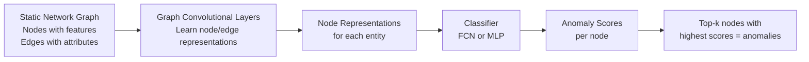

**Step-by-step process:**
1. The **graph convolutional layer** learns representations for nodes (and optionally edges) by aggregating neighborhood information
2. The **classifier** (Fully Connected Network or Multi-Layer Perceptron) is trained on labeled nodes to assign **anomaly scores** — higher scores indicate higher likelihood of being malicious
3. The **top-k nodes** with the highest anomaly scores are flagged as anomalies

**Example anomaly scores from the slides:**

| Node | Anomaly Score |
|------|---------------|
| Node 1 (attacker node) | 0.9 |
| Node 2 (compromised node) | 0.8 |
| Node 3 (suspicious) | 0.7 |
| ... | ... |
| Node 9 (normal user) | 0.1 |

### 8.5 Node-Level Detection on a Dynamic Graph

In reality, network traffic is not static — it is a continuous stream of events that evolve over time. The **dynamic graph** setting models the network as a sequence of **graph snapshots** $G^{t-2}, G^{t-1}, G^t$ taken at successive time intervals.

**Architecture for dynamic graph node-level detection:**

```mermaid
graph LR
    A[Graph Snapshot G^{t-2}] --> D[GCN\nSpatial embedding]
    B[Graph Snapshot G^{t-1}] --> D
    C[Graph Snapshot G^t] --> D
    D --> E[Node Embeddings\nfrom each snapshot]
    E --> F[GRU\nSynthesizes current hidden state\nby integrating node embeddings\nwith preceding hidden states]
    F --> G[Hidden State H^t]
    G --> H[Attention Mechanism]
    H --> I[Edge Scoring Function\nTrained to allocate anomalous scores]
    I --> J[Top-k data points\nas anomalies]
```

**Step-by-step process:**
1. For each graph snapshot, the **GCN** computes node embeddings from the temporal graph at that discrete time interval
2. The **GRU (Gated Recurrent Unit)** synthesizes the current hidden state $H^t$ by integrating the current snapshot's GCN embeddings with the preceding hidden state $H^{t-1}$. This allows the model to maintain "memory" of past network behavior.
3. An **attention mechanism** weights different temporal signals
4. The **edge scoring function** is trained to allocate anomalous scores to edges — anomalous edges represent suspicious connections. The top-k highest-scoring edges are flagged as anomalies.

**Example anomaly scores for edges:**

| Edge | Anomaly Score |
|------|---------------|
| E₅,₆ (bot → C&C server) | 0.9 |
| E₁,₂ (lateral movement) | 0.8 |
| E₇,₉ (suspicious data transfer) | 0.6 |
| E₈,₉ | 0.6 |
| ... | ... |
| E₃,₆ (normal traffic) | 0.1 |

**Why the dynamic setting is better:** Real attacks unfold over time — an attacker first scans the network (small anomalies), then exploits a vulnerability, then moves laterally, then exfiltrates data. The GRU's hidden state captures this temporal progression, allowing the model to recognize attack campaigns that span multiple time steps, even if each individual step looks only slightly anomalous.

### 8.6 Graph-Level Intrusion Detection on Static Graph

Instead of classifying individual nodes, **graph-level detection** aims to classify entire graphs (or subgraphs) as anomalous or normal. In IDS, this corresponds to flagging an entire **traffic pattern or session** as an intrusion attempt.

**Architecture:**

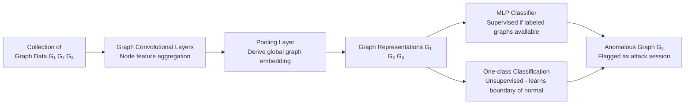

**Step-by-step process:**
1. **Node features aggregation** in graph convolutional layers — standard GCN-based message passing
2. **Global graph embedding** is derived through a **pooling layer** (e.g., mean pooling, attention pooling, hierarchical pooling like DiffPool) — compresses the entire graph into a single fixed-dimensional vector
3. By generating one representation per graph:
   - **MLP:** Supervised classification if labeled attack graphs are available
   - **One-class classification:** Unsupervised — learns the boundary of "normal" graph representations during training; at test time, graphs far from the normal boundary are flagged as anomalies

**When to use graph-level detection:** When an attack manifests as a distinctive overall traffic pattern (e.g., a DDoS attack changes the global structure of the traffic graph dramatically) rather than just affecting individual nodes.

### 8.7 Graph-Level Detection on Dynamic Graph

In the dynamic graph-level setting, the graph evolves over time as a sequence of **graph sketches** (compressed graph representations capturing structural properties at each time step).

**Architecture:**

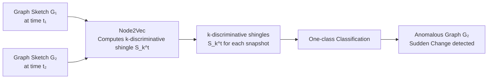

**Key concept: $k$-discriminative shingle $S_k^t$:**
For each graph sketch, **Node2Vec** (a graph embedding algorithm using random walks) computes a compact vector representation capturing the local neighborhood structure around nodes. The $k$-discriminative shingle $S_k^t$ is a hash-based sketch of the graph's structural properties at time $t$.

**Detection mechanism:** One-class classification is applied to the sequence of shingles. A graph at time $t$ is considered **anomalous if it exhibits a sudden change** — a dramatic shift in its structural properties compared to the historical sequence. This "sudden change" detection is ideal for catching attack onsets: a botnet C&C activation, a data exfiltration event, or a network scan that rapidly changes the global graph topology.

---

### 📝 Q&A — Section 8

**Q1. Explain the three advantages of GNNs over conventional CNNs/RNNs for intrusion detection. Provide a concrete example for each.**

A: (1) **Structural property:** Network data is inherently relational. Conventional methods treat each connection as independent features. GNNs model the actual graph structure — example: a GNN on the Host Graph can detect that 50 hosts are all communicating with the same external IP at regular intervals (C&C botnet pattern), which is invisible when each host's connections are analyzed independently. (2) **Higher-order interaction:** Multi-step attacks span many nodes. A GNN with $L$ layers captures $L$-hop patterns — example: reconnaissance (step 1) → exploitation (step 2) → lateral movement (step 3) creates a 3-hop attack subgraph that a 3-layer GNN can learn to recognize. (3) **Behavioral supervisory signal:** Sparse attack labels are amplified through the graph. Example: if only 10 labeled malicious hosts are known, the GNN propagates their "suspiciousness" to their neighbors (other hosts they communicate with), effectively expanding the supervision signal across hundreds of unlabeled nodes.

**Q2. Compare and contrast node-level and graph-level intrusion detection. When is each approach appropriate?**

A: **Node-level detection** classifies individual entities (hosts, accounts, IPs) as malicious or benign — assigns an anomaly score per node. Appropriate when: the attack affects specific nodes (compromised hosts, malicious users) identifiable by their individual behavior and network connections. Example: identifying which specific hosts in a network are part of a botnet. **Graph-level detection** classifies entire graphs (traffic sessions, time windows) as attack or normal — requires a global view of the network state. Appropriate when: attacks manifest as changes in the overall network topology rather than in specific nodes. Example: a DDoS attack during a specific time window dramatically changes the global traffic graph structure — many sources attacking one target. A graph-level classifier would flag the time window as an attack, even without identifying which specific IPs are malicious.

**Q3. Why is the GRU component essential in dynamic graph IDS, and what temporal pattern does it specifically enable the system to detect?**

A: The GRU maintains a **hidden state** that persists across time steps, allowing the model to accumulate information about past network behavior. Without GRU, each snapshot would be analyzed independently — the model could not detect attacks that span multiple time steps. The GRU enables detection of: (1) **Multi-stage attacks:** An attacker scans the network (minor anomaly at $t-2$), then waits (normal at $t-1$), then exploits and moves laterally (major anomaly at $t$). The GRU's hidden state remembers the earlier scan, connecting it to the later exploitation. (2) **Slow-and-low attacks:** Attackers deliberately slow their activity to avoid triggering per-snapshot thresholds. The GRU accumulates tiny anomaly signals across many time steps, allowing the aggregate to exceed the detection threshold.

**Q4. What is one-class classification in the context of graph-level IDS, and why is it preferred over binary classification for graph-level anomaly detection?**

A: One-class classification trains the model using **only normal graph samples** — it learns a compact representation of what "normal" traffic looks like and defines a boundary around the normal region in embedding space. At test time, graphs whose embeddings fall outside this boundary are flagged as anomalies. It is preferred for graph-level IDS because: (1) **Labeled attack graphs are extremely rare** — you may have thousands of normal traffic captures but only a handful of attack captures. Binary classification would be severely imbalanced. (2) **Attack types are open-ended** — new attack types constantly emerge. A binary classifier trained on known attacks will fail on new ones. A one-class classifier doesn't assume knowledge of any specific attack type — it only needs to know what "normal" looks like. Any deviation from normal, whether a known or novel attack, will be flagged.

**Q5. How does the k-discriminative shingle $S_k^t$ computed by Node2Vec enable anomaly detection in dynamic graphs? What does "sudden change" mean quantitatively?**

A: Node2Vec generates embeddings for all nodes in a graph sketch using random walks that capture local neighborhood structure. The $k$-discriminative shingle $S_k^t$ is a compact hash-based vector representing the distribution of $k$-hop neighborhoods across the graph — essentially a fingerprint of the graph's local structural properties at time $t$. "Sudden change" means that the distance between consecutive shingles $\|S_k^t - S_k^{t-1}\|$ (in embedding space) exceeds a threshold significantly above the historical baseline variance. Quantitatively, if the historical shingle distances form a distribution with mean $\mu$ and standard deviation $\sigma$, a distance $> \mu + 3\sigma$ would constitute a statistically significant sudden change. An attack that rapidly adds many new connections or dramatically reorganizes the network topology will produce a large shingle distance, triggering the anomaly alert.

**Q6. What are the failure modes of signature-based IDS and anomaly-based IDS respectively? How does a hybrid GNN-based approach mitigate both?**

A: **Signature-based failure:** Cannot detect novel attacks (zero-day exploits, new malware variants) because no signature exists. Attackers exploit this by slightly modifying known attack patterns to evade signature databases. **Anomaly-based failure:** High false positive rate — legitimate but unusual activities (sysadmin maintenance, new employee onboarding, holiday traffic spikes) trigger alerts. Also susceptible to "slow poisoning" — an attacker gradually shifts the baseline over time to make malicious behavior appear normal. **GNN hybrid mitigation:** A GNN trained on both known attack subgraphs (from signatures) and the overall normal graph structure can: (1) flag known attack patterns via supervised classification on signature-matched subgraphs (reducing false negatives); (2) flag structural deviations from normal network topology via anomaly detection (catching novel attacks); (3) use the graph context to resolve ambiguity — an "unusual" action by a sysadmin on their regular workstation (low suspicion node) differs from the same action on a random user machine (high suspicion context).

---

## 9. Final Summary: Concept Tree

```
CYBERSECURITY AND GNN
│
├── 1. BACKGROUND
│   ├── Growing Internet attack surface → need for automated detection
│   ├── Cybersecurity data is graph-structured → GNNs are the natural tool
│   └── GNN applications: spammer detection, fake news, fraud, botnet, malware, IDS
│
├── 2. CYBERSECURITY TAXONOMY
│   ├── APPLICATION SECURITY
│   │   ├── Transaction Security
│   │   │   ├── Financial Fraud (money laundering, cash-out, loan default, insurance)
│   │   │   └── Underground Market (darknet, cryptocurrency, anonymous trade)
│   │   └── Cognition Security
│   │       ├── Web Spam (drive-by download attacks)
│   │       ├── Fake News (social media manipulation)
│   │       ├── Review Spam (individual + collective)
│   │       └── Fake Account (astroturfing, engagement manipulation)
│   └── NETWORK INFRASTRUCTURE SECURITY
│       ├── Network Security
│       │   ├── BotNet (infect → C&C → attack; 3-stage model)
│       │   ├── Malicious Domain (DNS abuse: phishing, spam, DGA)
│       │   └── Intrusion Detection (see Case Study 2)
│       └── System Security
│           ├── Malware (virus, worm, trojan, spyware, bot, rootkit, ransomware)
│           ├── System Vulnerability (CFG, AST, PDG analysis)
│           └── Blockchain Security (smart contract vulnerabilities)
│
├── 3. APPLICATION-SPECIFIC GRAPHS
│   ├── Web Relation: Web Link Graph, Web Redirect Graph
│   ├── File/Graph Relation: File Dependency, File Distribution
│   ├── Network Traffic: Host, Domain Resolution, TAG, Flow Similarity, Packet Sequence
│   ├── Code: CFG, AST, PDG, FCG, CPG
│   ├── News: News Similarity, News Propagation
│   ├── User Behavior: Account-Device, Social Media Interaction, Review, Transaction, Underground Forum
│   └── Others: Power Grid, Vulnerability Dependency, Alert, Sensor, UAV
│
├── 4. DATASETS
│   ├── Application Security: Elliptic, FakeNewsNet, YelpChi, PHEME, D-GEF...
│   └── Network Infrastructure: CTU-13, NSL-KDD, CICIDS2017, Drebin, Devign...
│
├── 5. CASE STUDY 1: MALICIOUS ACCOUNT DETECTION
│   ├── Graph: Account-Device bipartite graph
│   ├── Two behavioral patterns:
│   │   ├── Device sharing → hub structure in graph
│   │   └── Temporal bursting → encoded in input features X
│   ├── Task: Binary semi-supervised node classification
│   └── GNN Formula:
│       F^(l) = σ(XΘ^(l-1) + (1/|D|) Σ_d A^(d) F^(l-1) Θ^(l-1)_(d))
│       Output: Z = softmax(F^(out) Θ₂)
│       → Heterogeneous GNN with per-device-type weight matrices
│
└── 6. CASE STUDY 2: INTRUSION DETECTION
    ├── GNN advantages: structural property, higher-order interaction, behavioral supervision
    ├── IDS types: Network-IDS (traffic monitoring) vs. Host-IDS (system calls, logs)
    ├── Detection methods: Signature-based (known threats) vs. Anomaly-based (deviations)
    └── Four GNN-IDS architectures:
        ├── Static Node-level: GCN → representations → MLP classifier → top-k anomalies
        ├── Dynamic Node-level: GCN (per snapshot) → GRU → attention → edge scoring
        ├── Static Graph-level: GCN → pooling → graph embedding → MLP or one-class classifier
        └── Dynamic Graph-level: Node2Vec → k-discriminative shingle → one-class + sudden change detection
```

---

*Notebook compiled for: Interdisciplinary Deep Learning on Graphs — UE23AM342BA1*  
*Contact: bhaskarjyotidas@pes.edu*


# 📘 Interdisciplinary Deep Learning on Graphs — Complete Tutor Notebook

**Course:** Interdisciplinary Deep Learning on Graphs (UE23AM342BA1)
**Instructor:** Dr. Bhaskarjyoti Das, Department of Computer Science and Engineering in AI & ML, PES University Online
**Lectures Covered:**
- Lecture 19: Fake News Detection
- Lecture 23: GNN and LLM

---

## 📋 Table of Contents

**PART A — Fake News Detection**
1. [Background and Motivation](#1-background-and-motivation)
2. [Modelling Every Post as a Graph](#2-modelling-every-post-as-a-graph)
3. [Fake News Detection as a Graph Classification Problem — Formal Setup](#3-fake-news-detection-as-a-graph-classification-problem--formal-setup)
4. [GCN Pipeline for Fake News Detection](#4-gcn-pipeline-for-fake-news-detection)
5. [Rumor Detection with Bidirectional GCN on Rumor Tree](#5-rumor-detection-with-bidirectional-gcn-on-rumor-tree)
6. [Node Features in Rumor Detection](#6-node-features-in-rumor-detection)
7. [Experimental Results — Bidirectional GCN](#7-experimental-results--bidirectional-gcn)
8. [Rumor Detection with Co-Attention](#8-rumor-detection-with-co-attention)
9. [Emerging Area: Continual Graph Learning](#9-emerging-area-continual-graph-learning)
10. [GEM and EWC — Continual Learning Algorithms](#10-gem-and-ewc--continual-learning-algorithms)
11. [Fisher Information Matrix and Mathematical Formulations](#11-fisher-information-matrix-and-mathematical-formulations)
12. [Summary of GCN-Based Fake News Detection Methods](#12-summary-of-gcn-based-fake-news-detection-methods)

**PART B — GNN and LLM**
13. [GNN Recap — Strengths and Limitations](#13-gnn-recap--strengths-and-limitations)
14. [LLM Recap — Strengths and Limitations](#14-llm-recap--strengths-and-limitations)
15. [Complementary Strengths of GNN and LLM](#15-complementary-strengths-of-gnn-and-llm)
16. [Configuration 1: LLM as Enhancer](#16-configuration-1-llm-as-enhancer)
17. [Configuration 2: LLM as Predictor](#17-configuration-2-llm-as-predictor)
18. [Unified GNN-LLM Architecture](#18-unified-gnn-llm-architecture)
19. [GNN + LLM Use Cases](#19-gnn--llm-use-cases)
20. [Final Summary — Concept Connection Tree](#20-final-summary--concept-connection-tree)

---

## 🗒️ How to Use This Notebook

This notebook is designed as a **first-principles tutor**: every concept is explained from scratch — what it is, why it exists, what problem it solves, and what happens when you don't use it. After each major section, you will find a **Q&A block** with exam-quality questions that test deep understanding, not just recall. Read the prose explanations first, then challenge yourself with the Q&A before checking the answers. The Q&A covers conceptual, mathematical, comparative, failure-mode, application, and reasoning question types.

---

# PART A: FAKE NEWS DETECTION

---

## 1. Background and Motivation

### 1.1 The Rise of Social Media as a News Source

Online social media platforms — Twitter, Facebook, Reddit, WhatsApp — have fundamentally changed how the world consumes news. Prior to the social media era, news was produced and filtered by professional journalists, editorial boards, and fact-checkers before reaching the public. The gatekeeping role of traditional journalism acted as a natural barrier against the mass propagation of false information. However, social media collapsed this barrier entirely: any user can publish any claim to millions of followers in seconds, without editorial review, without fact-checking, and without accountability.

This speed and accessibility is immensely valuable in many contexts — breaking news, citizen journalism, disaster reporting — but it comes with a severe cost. The same properties that make social media efficient for spreading genuine information also make it a perfect vehicle for spreading false information, i.e., **fake news**.

### 1.2 Why Fake News is Dangerous

Fake news is not merely an intellectual annoyance. It has measurable, sometimes catastrophic real-world consequences:

- **Societal harm:** False health claims (e.g., vaccine misinformation) have led to preventable disease outbreaks. Political misinformation has been linked to election interference and civil unrest.
- **Financial harm:** Stock prices have been manipulated by false news stories. The 2013 "AP Twitter Hack" — where a fake tweet about a White House explosion was posted — caused a flash crash that wiped approximately $130 billion from US equity markets within minutes before recovery.
- **Violence:** False rumours have incited mob violence in multiple countries.

Because the harms are real and severe, **automated fake news detection** is a critical research problem. Manual fact-checking cannot scale to the billions of posts published daily.

### 1.3 The Core Challenge of Automated Detection

Why is this hard for machines? A fake news article can be grammatically perfect, stylistically convincing, and even cite real statistics selectively misrepresented. Traditional text classifiers, which look only at words and phrases, can be fooled because the text alone may not carry enough signal. The key insight that motivates the graph-based approach is that **fake news tends to spread differently from real news** — it propagates through different kinds of users, at different speeds, with different reply patterns — and this propagation pattern is a powerful signal for detection.

---

## 2. Modelling Every Post as a Graph

### 2.1 The Core Insight: Propagation Patterns as Signal

A fundamental empirical finding in computational social science is that **fake news and real news exhibit statistically different propagation patterns in social networks**. Real news tends to spread through geographically and topically diverse users; fake news often spreads in tighter ideological bubbles, may spread more rapidly in the early hours, and generates different types of reactions (more emotional, more divisive).

This finding motivates the following powerful re-framing: instead of treating a news post as a bag of words (the classical NLP approach), we can model it as a **graph** that captures how it spreads through the social network. The nodes in the graph represent users or concepts, and the edges represent interactions (retweets, replies, quotes).

### 2.2 The Graph Representation

Concretely, for each news story or post $p$:

- **Nodes** $u \in V$: represent users who interacted with the post, or concepts/terms extracted from the post content.
- **Edges** $e \in E$: represent relationships between nodes — for example, "user A retweeted user B" or "term X co-occurs with term Y in the same post."
- The result is a graph $G = (V, E)$ associated with each post $p$.

```
Post p ──→  Graph G = (V, E)
             │
             ├── V = {u₁, u₂, ..., uₙ}  (users or concepts as nodes)
             │
             └── E = {e₁, e₂, ..., eₘ}  (interactions or co-occurrences as edges)
```

### 2.3 Reformulation as Binary Graph Classification

Once each post is represented as a graph, the fake news detection problem is re-stated as:

> **Given a set of graphs $\{G_1, G_2, \ldots, G_n\}$, each corresponding to a news post, classify each graph as FAKE or REAL.**

This is a **binary graph classification task**, and it is ideally suited for **Graph Neural Networks (GNNs)**, which are specifically designed to learn representations of entire graphs by aggregating information from nodes and their neighbourhoods.

> **Key Insight:** The power here is that we are not just asking "what does this article say?" but "how did this article spread, who shared it, and what is the structure of that propagation?" — a fundamentally richer source of information.

---

## 3. Fake News Detection as a Graph Classification Problem — Formal Setup

### 3.1 Problem Definition

The formal pipeline begins with a set of news posts:

$$P = \{p_1, p_2, \ldots, p_n\}$$

Each post $p_i$ contains:
- **Textual content** (title, body, tweets, replies)
- **Visual content** (images, thumbnails)
- **Side information** (user profile of the poster, timestamp, geolocation, etc.)

### 3.2 Feature Extraction: From Raw Content to Embeddings

The raw content of each post is pre-processed to extract **key concepts, terms, and features**. These are then mapped to embedding vectors using pre-trained models:

- **Textual embeddings** $R_t$: produced by models like **GloVe** (Global Vectors for Word Representation), which maps words to dense vectors in a continuous space where semantically similar words are nearby.
- **Visual embeddings** $R_v$: produced by models like **VGG-19**, a deep convolutional neural network pre-trained on ImageNet that produces rich feature vectors for images.

The combined (concatenated) embedding for a concept is:

$$R = [R_t \| R_v]$$

where $\|$ denotes vector concatenation.

**Why pre-trained models?** Training embedding models from scratch on a fake news dataset would require enormous amounts of labelled data and compute. Pre-trained models have already learned rich representations from massive corpora (billions of words, millions of images) and can be directly used to produce high-quality features.

### 3.3 Graph Construction: Nodes, Edges, Matrices

After extracting embeddings, the graph is built:

**Nodes $u \in V$:** Each extracted concept, term, or entity becomes a node. Its feature vector is its embedding $R$.

**Edges $e \in E$:** An edge between two nodes is drawn based on a **relation criterion** — most commonly, **co-occurrence**: if concept $A$ and concept $B$ appear together in the same post or within a short window, they are connected. The edge may be weighted by the strength of co-occurrence (e.g., using **PMI — Pointwise Mutual Information**).

This gives us two fundamental matrices:

**Input feature matrix:**
$$X \in \mathbb{R}^{n \times d}$$
- $n$ = number of nodes (concepts/terms)
- $d$ = dimensionality of the node embeddings (e.g., 300 for GloVe, 4096 for VGG-19)
- Row $i$ of $X$ is the embedding vector of node $i$

**Adjacency matrix:**
$$A \in \mathbb{R}^{n \times n}$$
- $A_{ij} = 1$ (or a weight $w_{ij}$) if there is an edge between nodes $i$ and $j$
- $A_{ij} = 0$ otherwise
- Encodes the full graph structure

> **Why do we need both $X$ and $A$?** $X$ tells the GNN **what each node is** (its content/semantics). $A$ tells the GNN **how nodes are connected** (the structure/relationships). Both are essential: without $X$, all nodes are indistinguishable by content; without $A$, the model has no structural information and degenerates to a standard classifier.

---

## 4. GCN Pipeline for Fake News Detection

### 4.1 The Graph Convolutional Network Layer

The **Graph Convolutional Network (GCN)** is the core computational tool for learning node representations that take into account the local neighbourhood structure. The fundamental operation of one GCN layer is:

$$Z^{(j+1)} = \sigma\!\left(\hat{A}\, Z^{(j)}\, W^{(j)}\right)$$

**Symbol glossary:**
- $Z^{(j)}$ — feature matrix at layer $j$; rows are node feature vectors. At layer 0, $Z^{(0)} = X$ (the input feature matrix).
- $Z^{(j+1)}$ — output feature matrix at layer $j+1$; rows are updated (higher-level) node representations.
- $\hat{A}$ — normalised adjacency matrix (typically $\hat{A} = \tilde{D}^{-1/2} \tilde{A} \tilde{D}^{-1/2}$ where $\tilde{A} = A + I$ adds self-loops and $\tilde{D}$ is the degree matrix of $\tilde{A}$). This normalisation prevents feature vectors from exploding or vanishing during aggregation.
- $W^{(j)}$ — learnable weight matrix at layer $j$; transforms the aggregated features into a new representation space.
- $\sigma$ — non-linear activation function (e.g., ReLU: $\sigma(x) = \max(0, x)$).

**Intuitive explanation:** Multiplying $\hat{A} \cdot Z^{(j)}$ aggregates the feature vectors of each node's neighbours (and the node itself, due to the self-loop). Then multiplying by $W^{(j)}$ applies a learnable linear transformation. The activation $\sigma$ introduces non-linearity so the network can learn complex patterns. After $L$ layers, each node's representation encodes information from its $L$-hop neighbourhood.

**Why does this help?** In the fake news context, a concept node (e.g., "explosion") in isolation might appear in both fake and real news. But if its neighbours in the graph (e.g., "bomb", "government", "protest") have a particular pattern of co-occurrence typical of fake news, the GCN will learn to update the "explosion" node's representation to reflect this neighbourhood context.

### 4.2 Global Mean Pooling

After $L$ GCN layers, each node has a rich representation that encodes local and semi-global structural information. But for **graph classification**, we need a single vector representing the **entire graph** (i.e., the entire post). This is achieved via **global mean pooling**:

$$\mathbf{h}_G = \frac{1}{|V|} \sum_{u \in V} z_u^{(L)}$$

**Symbol glossary:**
- $\mathbf{h}_G$ — the graph-level representation vector (a single vector summarising the whole graph)
- $|V|$ — number of nodes in the graph
- $z_u^{(L)}$ — the representation of node $u$ after $L$ GCN layers

**Intuitive explanation:** We average all node representations to obtain a fixed-size vector for the graph. This is analogous to computing the "mean sentiment" of all words in a document.

**Alternative: Max Pooling.** The slide also mentions Max Pooling (in the diagram). Global max pooling takes the element-wise maximum over all node vectors: $(\mathbf{h}_G)_k = \max_{u \in V} (z_u^{(L)})_k$. This captures the most prominent feature across all nodes rather than the average.

### 4.3 Binary Classifier and Cross-Entropy Loss

The graph representation vector $\mathbf{h}_G$ is fed to a **binary classifier** (typically a fully connected layer followed by a Softmax):

$$\hat{y} = \text{softmax}(W_c \cdot \mathbf{h}_G + b_c) = \frac{e^{z_i}}{\sum_{j=1}^{K} e^{z_j}}$$

**Symbol glossary:**
- $W_c, b_c$ — learnable weight matrix and bias of the classifier
- $\hat{y}$ — predicted probability distribution over classes (FAKE, REAL)
- $z_i$ — the logit (raw score) for class $i$
- $K$ — number of classes ($K = 2$ for binary classification: FAKE and NOT FAKE)

**Cross-entropy loss** is used to train the model:

$$\mathcal{L} = -\sum_{i=1}^{N} y_i \log(\hat{y}_i)$$

- $y_i$ — true label (1 for FAKE, 0 for REAL, or a one-hot vector)
- $\hat{y}_i$ — predicted probability for the correct class

The entire pipeline is trained end-to-end using backpropagation and gradient descent.

### 4.4 Full Pipeline Diagram

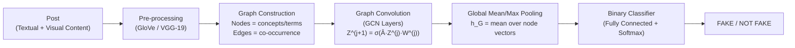

---

## 5. Rumor Detection with Bidirectional GCN on Rumor Tree

### 5.1 Motivation: Why a Rumor Tree?

When a claim (a potential rumour) is posted on Twitter, it does not spread in a flat, undifferentiated mass. It spreads in a structured, hierarchical way:

- The **source tweet** is the root.
- Users **reply** to the source tweet (first level of the tree).
- Other users **reply to replies** (deeper levels).
- Retweets spread the content to entirely new branches.

This structure forms a **tree** (or more precisely, a directed graph that is approximately tree-shaped). The tree encodes two fundamentally different kinds of information:

1. **Propagation (Top-Down):** How does a claim spread from the source outward? Top-down traversal captures how a claim influences subsequent users.
2. **Dispersion (Bottom-Up):** How do reactions and responses aggregate back toward the source? Bottom-up traversal captures how the community collectively responds to and (dis)believes the claim.

The hypothesis behind **Bidirectional GCN (Bi-GCN)** is that **both directions** of information flow — propagation and dispersion — are discriminative signals for rumour detection. A rumour might spread quickly (strong top-down signal) but generate sceptical, debunking replies that aggregate strongly bottom-up. Real news generates a different combination.

### 5.2 The Bidirectional GCN Architecture

The Bi-GCN processes the rumour tree in two parallel streams:

**Stream 1: Top-Down GCN (TD-GCN)**
- The tree is oriented top-down: edges point from parent to child (from source tweet toward leaf replies).
- This models **propagation**: how information flows from the source outward.
- Two GCN layers aggregate features in the top-down direction, followed by pooling.

**Stream 2: Bottom-Up GCN (BU-GCN)**
- The same tree is now oriented bottom-up: edges are reversed, pointing from child to parent.
- This models **dispersion**: how community response aggregates back toward the source.
- Two GCN layers aggregate features in the bottom-up direction, followed by pooling.

**Concatenation and Classification:**
The pooled representations from both streams are concatenated and fed to a fully connected layer, followed by a Softmax classifier that outputs the predicted label.

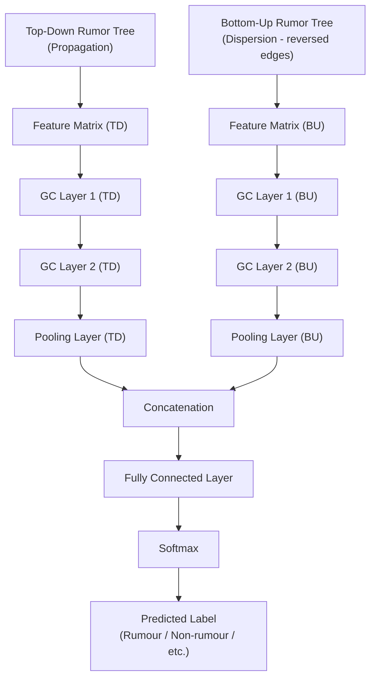

### 5.3 Why Bidirectionality Matters

Consider the following scenario: a fake news article about a celebrity's death is posted. The source tweet has a sensationalist, emotional character (top-down signal). Within minutes, verified accounts and journalists start replying with corrections and denials (bottom-up signal). A unidirectional (top-down only) GCN would capture the spread pattern but might miss the debunking signal accumulating from the leaves. The Bi-GCN captures both, making it more robust.

> **Analogy:** Think of it like listening to a conversation with two ears. Each ear picks up slightly different signals, and your brain fuses them for a richer understanding. TD-GCN is one ear; BU-GCN is the other.

---

## 6. Node Features in Rumor Detection

### 6.1 The Three Feature Groups

In the Bi-GCN framework for rumour detection, each node (tweet) in the rumour tree has a feature vector composed of three groups of features, each capturing a different aspect of the tweet and its author.

#### 6.1.1 User Features (6 features)

These are metadata features extracted from the **Twitter user profile** of the tweet's author:

| Feature | Description |
|---|---|
| Favorites count | Total number of posts the user has liked |
| Followers count | Number of accounts following the user |
| Friends count | Number of accounts the user follows |
| Listed count | Number of Twitter lists the user is a member of |
| Statuses count | Total number of tweets the user has posted |
| Verified | Whether the account has a verified (blue tick) status |

**Why are these useful?** Bot accounts and suspicious users tend to have anomalous profiles — very high follower counts with no verification, or accounts with zero activity. Verified accounts are less likely to originate fake news. These 6 features give the model a simple but effective social credibility signal.

#### 6.1.2 Empath Category Features (194 features)

**Empath** is a text analysis tool developed at Stanford (by Ethan Fast et al.) that maps text to scores across approximately **200 semantic/emotional categories** (it covers affect, cognition, social roles, activities, and many more).

Example categories:
- `weakness`, `home`, `fire`, `breaking`, `disappointment`
- `weapon`, `reading`, `kill`, `fight`, `war`, `speaking`, `power`

Each tweet's text is mapped to a 194-dimensional vector of Empath scores. These capture the **emotional and topical character** of the tweet. Rumours tend to use emotionally charged language — fear, outrage, urgency — that Empath can quantify. This gives the model a rich signal about the psychological tone of content beyond individual word frequencies.

**Why Empath over raw TF-IDF?** TF-IDF gives term frequency counts, which are high-dimensional and sparse. Empath categories are dense, semantically meaningful, and interpretable — they directly capture the psychological and topical profile of text.

#### 6.1.3 RoBERTa Features (concatenation of last 4 layers)

**RoBERTa** (Robustly Optimised BERT Pre-training Approach) is a large pre-trained transformer language model. When a tweet is passed through RoBERTa, the last 4 hidden layers of the model produce representations that encode deep contextual linguistic meaning.

The feature vector for each tweet is computed as the concatenation of the [CLS] token representations from the last 4 layers:

$$\text{RoBERTa features} = [L_1 \| L_2 \| L_3 \| L_4]$$

- For RoBERTa-BASE: each layer produces a 768-dimensional vector → concatenation = 4 × 768 = **3072 dimensions**
- For RoBERTa-LARGE: each layer produces a 1024-dimensional vector → concatenation = 4 × 1024 = **4096 dimensions**

**Why concatenate the last 4 layers?** Research (and the BERT paper itself) shows that different layers encode different types of linguistic information: early layers capture syntactic patterns, middle layers capture semantic relations, and later layers capture task-specific features. Concatenating the last 4 layers gives a richer representation than using only the final layer.

### 6.2 Preprocessing Pipeline Diagram

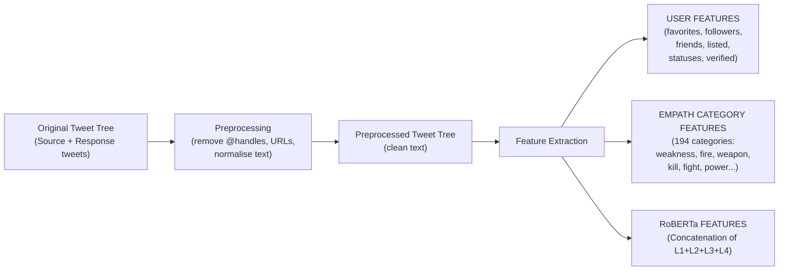

### 6.3 Feature Set Baselines (as defined in the experiments)

| Baseline | Feature Composition | Total Dimension |
|---|---|---|
| Baseline 1 | 5000 TF-IDF features | 5000 |
| Baseline 2 | 5000 TF-IDF + Empath (194) | 5194 |
| Baseline 3 | 5000 TF-IDF + Empath (194) + User (6) | 5200 |
| Baseline 4 | RoBERTa-BASE layers (3072) + Empath (194) + User (6) | 3272 |
| Baseline 5 | RoBERTa-LARGE layers (4096) + Empath (194) + User (6) | 4296 |

---

## 7. Experimental Results — Bidirectional GCN

### 7.1 Results Table

The models were evaluated on two Twitter datasets: **Twitter15** and **Twitter16**, using Accuracy, F1 for Rumours (F1 R), and F1 for Non-Rumours (F1 NR).

| Baseline | Model | Dataset | Accuracy | F1 R | F1 NR |
|---|---|---|---|---|---|
| 1 | TD-GCN | Twitter15 | 0.9512 | 0.9211 | 0.9667 |
| 1 | TD-GCN | Twitter16 | 0.9437 | 0.8889 | 0.9697 |
| 1 | BI-GCN | Twitter15 | 0.9160 | 0.8603 | 0.9254 |
| 1 | BI-GCN | Twitter16 | 0.8750 | 0.7836 | 0.8940 |
| 5 | **TD-GCN** | Twitter15 | **0.9728** | **0.9727** | **0.9729** |
| 5 | **TD-GCN** | Twitter16 | **0.9747** | **0.9740** | **0.9754** |
| 5 | BI-GCN | Twitter15 | 0.9693 | 0.9684 | 0.9696 |
| 5 | BI-GCN | Twitter16 | 0.9538 | 0.9524 | 0.9551 |

### 7.2 Key Observations and Explanations

**Observation 1: Baseline 5 (RoBERTa-LARGE + Empath + User) dramatically outperforms Baseline 1 (TF-IDF only).** This confirms that deep contextual embeddings from large pre-trained transformers capture far more semantic richness than simple term frequency statistics.

**Observation 2: TD-GCN outperforms BI-GCN with Baseline 5.** This seems counterintuitive — shouldn't using more information (bidirectional) be better? The explanation is important: **the dispersion signal (bottom-up) was rather small in these datasets.** The Twitter15 and Twitter16 datasets contain chains of replies where the bottom-up information is limited. When dispersion is small, the BU component adds noise rather than signal, and the TD component alone is more discriminative. This illustrates a key principle: **more complex models don't always win — the complexity must be matched to the data.**

**Observation 3: The best accuracy (0.9747 on Twitter16 for TD-GCN) is extremely high.** This suggests that the combination of propagation structure + RoBERTa embeddings + Empath + user features provides almost complete discrimination between rumours and non-rumours in these datasets.

---

## 8. Rumor Detection with Co-Attention

### 8.1 Motivation for Co-Attention

The Bi-GCN model treats the **propagation network** (graph of retweet/reply chains) and the **news article content** as separate inputs that are processed independently and then combined. However, there is a richer interaction possible: the article's content can highlight which parts of the propagation network are most relevant, and the propagation network can highlight which parts of the article are most credible or suspicious.

**Co-Attention** is a mechanism that explicitly models this mutual interaction. It computes a joint attention weight between the article content representation and the propagation graph representation, allowing each to condition on the other.

### 8.2 Architecture of the Co-Attention Framework

The pipeline is as follows:

1. **Propagation Network (GNN branch):** User nodes in the propagation graph are processed by a **Graph Attention Network (GAT)**, producing user node embedding matrix. This captures the social graph structure and user attributes (profile, comments).

2. **News Content (LM branch):** The news article text is encoded using **word2vec** or **BERT**, producing a news content attention vector $\mathbf{c}$.

3. **Co-Attention Layer:** The news content vector $\mathbf{c}$ and the graph attention vector $\mathbf{g}$ are combined through co-attention to produce a **final attention vector** $\mathbf{f} = [\mathbf{c} \| \phi]$, where $\phi$ is the co-attended fusion.

4. **Neural Classifier:** $\mathbf{f}$ is passed to a classifier outputting prediction probabilities $F$ (Fake) and $T$ (True).

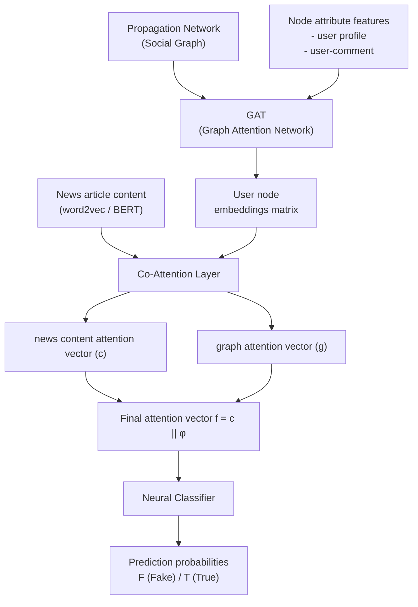

### 8.3 Comparative Results on Gossipcop and Politifact

**Gossipcop Dataset:**

| Model | Accuracy | F1-macro | Precision | Recall | ROC-AUC | AP |
|---|---|---|---|---|---|---|
| BiGCN | 0.8965 | 0.8955 | 0.9485 | 0.8374 | 0.9638 | 0.9664 |
| GCNFN | 0.8913 | 0.8909 | 0.9100 | 0.8695 | 0.9496 | 0.9553 |
| UPFD | 0.9522 | 0.9519 | 0.9743 | 0.9296 | **0.9887** | **0.9897** |
| GNNCL | 0.9496 | 0.9494 | 0.9494 | 0.9494 | 0.9786 | 0.9740 |
| SVMW | 0.6680 | 0.6673 | 0.690 | 0.6108 | 0.7269 | 0.7453 |
| SVMB | 0.6793 | 0.6781 | 0.7110 | 0.6150 | 0.7350 | 0.7460 |
| **Ours (Co-Attention)** | **0.9647** | **0.9634** | **0.9624** | **0.9683** | 0.9823 | 0.9827 |

**Politifact Dataset:**

| Model | Accuracy | F1-macro | Precision | Recall | ROC-AUC | AP |
|---|---|---|---|---|---|---|
| BiGCN | 0.7692 | 0.7655 | 0.7604 | 0.7857 | 0.8274 | 0.8204 |
| GCNFN | 0.7647 | 0.7629 | 0.7713 | 0.7691 | 0.8333 | 0.7863 |
| UPFD | 0.8054 | 0.8030 | 0.7882 | 0.8488 | 0.8924 | 0.9086 |
| GNNCL | 0.6652 | 0.6585 | 0.7361 | 0.5278 | 0.7682 | 0.7730 |
| SVMW | 0.8095 | 0.8063 | 0.7614 | 0.9025 | 0.8055 | 0.7735 |
| **Ours (Co-Attention)** | **0.8688** | **0.8651** | **0.8838** | **0.8657** | **0.9516** | **0.9520** |

The Co-Attention model achieves the best or near-best performance on most metrics for both datasets, demonstrating that the mutual interaction between article content and propagation graph is highly beneficial.

---

## 9. Emerging Area: Continual Graph Learning

### 9.1 The Problem: Catastrophic Forgetting in Fake News Detection

Fake news is not a static phenomenon. News events change continuously — a pandemic story, an election, an economic crisis — and the language, themes, actors, and propagation patterns of fake news evolve with each event. This creates a fundamental challenge for machine learning models trained on static datasets:

**Catastrophic Forgetting** is the phenomenon where a neural network, after being trained to perform well on Task A, loses its ability to perform Task A when it is subsequently trained on Task B. This happens because the gradient updates for Task B overwrite the weights that were crucial for Task A. In the context of fake news detection:

- A model trained on COVID-19 misinformation (dataset $D_1$) performs well.
- When retrained on election misinformation (dataset $D_2$), the model's weights are updated to fit $D_2$ at the expense of $D_1$.
- The model now performs poorly on COVID-19 misinformation even though it was trained on it before.

Naively maintaining a separate model for every news event is not scalable. **Continual Graph Learning** addresses this by enabling a model to learn from a sequence of graph-based tasks without forgetting previous ones.

### 9.2 What is Continual Graph Learning?

**Continual Learning** (also called **Lifelong Learning** or **Sequential Learning**) is the branch of machine learning concerned with training models that learn a sequence of tasks $\{T_1, T_2, T_3, \ldots\}$ without forgetting earlier tasks. **Continual Graph Learning (CGL)** is the application of these ideas specifically to graph-structured data (GNNs).

In 2022, a **CGL Benchmark** was introduced at NeurIPS to standardise evaluation of continual learning algorithms on graph tasks. This benchmark provides a structured way to compare algorithms across multiple graph tasks.

### 9.3 Application to Fake News Detection

In the fake news context:

- **Task 1:** Learn to detect fake news from dataset $D_1$ (e.g., Twitter15 — 2015 rumours).
- **Task 2:** Learn to detect fake news from dataset $D_2$ (e.g., Twitter16 — 2016 rumours) *without forgetting* what was learned from $D_1$.

The graph characteristics change between events: different topics produce different graph structures, different user communities, different propagation speeds. Simply fine-tuning on $D_2$ causes catastrophic forgetting of $D_1$'s patterns.

> **Key Reference:** "Graph Neural Networks with Continual Learning for Fake News Detection from Social Media" by Yi Han et al.

---

## 10. GEM and EWC — Continual Learning Algorithms

### 10.1 Gradient Episodic Memory (GEM)

**GEM** is a continual learning algorithm that uses an **episodic memory** to store a representative subset of training examples from previous tasks. When learning a new task, GEM ensures that the model does not increase its loss on the stored examples from previous tasks.

**Core Mechanism:**
- Let $\mathcal{M}$ be the episodic memory — a set of $(G_j, y_j)$ pairs sampled from the first dataset $D_1$ after learning Task 1.
- When learning Task 2, the optimisation is **constrained** so that the loss on $\mathcal{M}$ does not increase beyond what it was at the end of Task 1 training.

**Why this works:** By constraining the gradient updates to not increase loss on stored examples, GEM ensures the model retains its ability to classify the types of examples seen in Task 1. The model can only move in directions in parameter space that are simultaneously helpful for Task 2 and not harmful for the stored Task 1 examples.

**Limitation:** GEM requires storing actual training examples from previous tasks, which raises privacy concerns and storage costs as the number of tasks grows.

### 10.2 Elastic Weight Consolidation (EWC)

**EWC** is a continual learning algorithm inspired by neuroscience. It is based on the Bayesian perspective that after learning Task 1, the posterior distribution over parameters $p(\theta | D_1)$ encodes what the model has learned. EWC approximates this posterior with a **Gaussian distribution**, and when learning Task 2, it adds a regularisation term to the loss that penalises changes to parameters that were important for Task 1.

**Core Mechanism:**
- After learning Task 1, compute the **Fisher Information Matrix (FIM)** $F$ with respect to the model parameters. $F$ measures how sensitive the model's predictions are to changes in each parameter.
- Parameters with **high Fisher information** are those most critical to Task 1 performance — these should not be changed drastically.
- When learning Task 2, add a quadratic penalty to the loss that penalises large changes to high-Fisher parameters.

**Why this works:** EWC simulates the biological process of synaptic consolidation, where important memories are "protected" against overwriting by new learning. High-Fisher parameters are the model's "important synapses."

### 10.3 Comparison: GEM vs EWC

| Property | GEM | EWC |
|---|---|---|
| Memory type | Explicit: stores samples from previous tasks | Implicit: stores parameter importance (FIM) |
| Constraint type | Gradient constraint (loss on memory must not increase) | Loss regularisation (quadratic penalty on parameter change) |
| Privacy | Requires storing actual data → privacy risk | No raw data stored → privacy-friendly |
| Storage cost | Grows with number of tasks (stores examples) | Fixed: stores FIM (one matrix per task) |
| Computation overhead | Must evaluate loss on memory at each step | Must compute FIM after each task |
| Flexibility | Exact constraint — may be too rigid | Soft constraint — more flexible |

---

## 11. Fisher Information Matrix and Mathematical Formulations

### 11.1 The Fisher Information Matrix (FIM)

The **Fisher Information Matrix (FIM)** is a concept from mathematical statistics. For a model with parameters $\theta$ and a log-likelihood function $\log p(y | x; \theta)$, the FIM is:

$$F_{ij} = \mathbb{E}\!\left[\frac{\partial \log p(y | x;\theta)}{\partial \theta_i} \cdot \frac{\partial \log p(y | x;\theta)}{\partial \theta_j}\right]$$

**Intuitive explanation:** The FIM measures how much the model's predictions change when you slightly perturb each parameter. A parameter with high Fisher information is one that, if changed even slightly, causes large changes in the model's output — meaning it is "important" to the model's current task. A parameter with low Fisher information can be changed substantially without affecting predictions.

**Symbol glossary:**
- $F_{ij}$ — the $(i,j)$ entry of the FIM; measures the covariance of the gradients with respect to parameters $\theta_i$ and $\theta_j$
- $\mathbb{E}[\cdot]$ — expectation over the data distribution
- $\log p(y | x; \theta)$ — log-likelihood of the model's prediction

In practice, the FIM is approximated as a **diagonal matrix** (each parameter's own Fisher information, ignoring cross-parameter interactions), computed on a sample of training data.

### 11.2 GEM Optimisation Problem

Let:
- $\theta_1$ = model parameters after learning Task 1 (on dataset $D_1$)
- $\mathcal{M}$ = set of instances sampled from $D_1$ (the episodic memory)

When learning Task 2 (on dataset $D_2$), the GEM optimisation problem is:

$$\min_\theta \sum_{(G_i, y_i) \in \mathcal{D}_2} \text{loss}\!\left(f(A_i^{(k)}, H_i^{(k)}; \theta^{(k)}),\, y_i\right)$$

subject to:

$$\sum_{(G_j, y_j) \in \mathcal{M}} \text{loss}\!\left(f(A_j^{(k)}, H_j^{(k)}; \theta^{(k)}), y_j\right) \;\leq\; \sum_{(G_j, y_j) \in \mathcal{M}} \text{loss}\!\left(f(A_j^{(k)}, H_j^{(k)}; \theta_1^{(k)}), y_j\right)$$

**Symbol glossary:**
- $f(A_i^{(k)}, H_i^{(k)}; \theta^{(k)})$ — the GNN's output for graph $G_i$ with adjacency matrix $A_i^{(k)}$, node feature matrix $H_i^{(k)}$, and current parameters $\theta^{(k)}$ at GCN layer $k$
- $y_i$ — true label for graph $G_i$
- $\theta_1^{(k)}$ — the GNN parameters at layer $k$ after training on Task 1
- The constraint says: the loss on the memory set $\mathcal{M}$ with current parameters must not exceed the loss with the Task-1-trained parameters $\theta_1$

**Intuitive meaning:** "While learning Task 2, ensure you don't get worse at the Task-1 examples stored in memory."

### 11.3 EWC Loss Function

Let:
- $\lambda$ = regularisation strength (hyperparameter controlling the trade-off between learning Task 2 and preserving Task 1)
- $F$ = Fisher Information Matrix (diagonal approximation, computed from $D_1$ samples)
- $\theta^*_{D_1}$ = optimal parameters for Task 1 (i.e., parameters after training on $D_1$)

The EWC loss function for Task 2 is:

$$\mathcal{L}_{\text{EWC}} = \sum_{(G_i, y_i) \in \mathcal{D}_2} \text{loss}\!\left(f(A_i^{(k)}, H_i^{(k)}; \theta^{(k)}),\, y_i\right) + \frac{\lambda}{2} F\!\left(\theta - \theta^*_{\mathcal{D}_1}\right)^2$$

**Symbol glossary:**
- First term: Standard task loss on $D_2$ (learn the new task)
- Second term: Regularisation penalty — $\frac{\lambda}{2} F (\theta - \theta^*_{D_1})^2$ penalises changes from the Task-1-optimal parameters, weighted by Fisher information
- $\frac{\lambda}{2}$ — controls how strongly we penalise forgetting; larger $\lambda$ = more protection of Task 1 knowledge at the cost of plasticity for Task 2
- $F(\theta - \theta^*_{D_1})^2$ — for each parameter $\theta_i$, the penalty is $F_{ii}(\theta_i - \theta^*_{D_1,i})^2$; parameters with high Fisher information $F_{ii}$ receive a large penalty if changed

**What happens if $\lambda = 0$?** The regularisation term vanishes and EWC degenerates to ordinary fine-tuning on $D_2$ — which causes catastrophic forgetting.

**What happens if $\lambda \to \infty$?** The model is prevented from changing any important parameters at all — it cannot learn Task 2.

**The key insight:** EWC finds a middle ground by learning Task 2 while selectively protecting the parameters that mattered most for Task 1, as identified by the Fisher Information Matrix.

---

## 12. Summary of GCN-Based Fake News Detection Methods

The slide presents a comprehensive summary table of all methods that use GCN for detecting fake news, fake accounts, and fake propagation networks. This table is reproduced and explained below.

| Detection Task | Input | Graph Type | Nodes | Edges | GCN Type | Dataset |
|---|---|---|---|---|---|---|
| **Fake content** | post text + images | undirected, weighted | post words, concepts, image labels | PMI-based node similarity | Knowledge-driven Multimodal GCN | PHEME, Weibo |
| **Fake content** | post + user profile | undirected, unweighted | posted documents | user profile similarity | Multi-Depth GCN | LIAR |
| **Fake content** | post text + images | 3x undirected, weighted | words, concepts | PMI-based similarity | GCN + VGG-19 for images | Weibo, MediaEval, PHEME |
| **Fake content** | posts, users, reviews, domains | undirected, unweighted | news, domains, reviews, sources | content similarity; between node types | GCN | Weibo, Fakeddit |
| **Bot detection** | user profile, posts, neighbour profiles | directed, unweighted | users | follow | GCN | TwiBot-20 |
| **Bot detection** | posts, users | undirected, unweighted | users | retweets, mentions | GCN + altmetrics | Altmetrics |
| **Bot detection** | posts | undirected, weighted | words, posts | word-post (TF-IDF); word-word (PMI) | GCN + BERT | RTbust, Gilani, etc. |
| **Bot detection** | social graph | directed, unweighted | users | bidirectional, unidirectional in/out | GCN + MRF | Twitter Social, 1KS-10KN |
| **Rumour source detection** | social graph infection snapshots | undirected, unweighted | users | social relations | modified GCN | General purpose social graphs |
| **Rumour source detection** | social graph | undirected, unweighted | users | social relations | GCN | PHEME |
| **Fake news propagation** | propagation & dispersion; chains of posts | directed, unweighted | original post, reposts, responses | reference between posts | Bi-Directional GCN | Weibo, Twitter15, Twitter16 |
| **Fake news propagation** | news items, propagation graphs | undirected, unweighted | political users, twitter users, posts | users follow political accounts; users post news | GCN | Custom dataset |
| **Fake news propagation** | Graph snapshots | directed, unweighted | posts, reposts | reference between posts | Dynamic bi-directional GCN | Twitter15, Twitter16, Weibo |
| **Fake news propagation** | reply tree + user graph | directed, unweighted | posts, replies, users | post references, follow | GCN | PHEME |

**Key Observations from the Summary:**

1. **Undirected graphs dominate** fake content detection (where content co-occurrence is the main signal), while **directed graphs** are more common for propagation detection (where the direction of spread matters).
2. **PMI (Pointwise Mutual Information)** is the most common edge weight for text-based graphs, as it measures how much more often two terms co-occur than would be expected by chance.
3. **Bi-Directional GCN** is uniquely used for propagation/dispersion modelling, confirming the theoretical motivation discussed in Section 5.
4. The datasets used most are PHEME, Weibo, Twitter15, and Twitter16 — all social media datasets with verified ground truth labels.

---

### 📝 Q&A — Part A: Fake News Detection

**Q1. Why is fake news detection particularly difficult for traditional text classifiers, and how does the graph-based approach address this limitation?**

A: Traditional text classifiers operate on the **content** of news articles — they look at word frequencies, TF-IDF scores, or sentence embeddings. A well-crafted fake news article can be grammatically and stylistically indistinguishable from real news at the content level, making pure text approaches unreliable. The graph-based approach addresses this by exploiting **propagation patterns**: how a piece of news spreads through the social network reveals information that the content alone cannot. Fake news tends to spread through ideological echo chambers, generates specific emotional response patterns, and triggers different reply behaviours from real news. By modelling the propagation as a graph and using GNNs to classify it, the model leverages this structural signal that is much harder for fake news creators to fake.

**Q2. Formally define the matrices $X$ and $A$ in the fake news GCN pipeline, and explain what information each encodes.**

A: $X \in \mathbb{R}^{n \times d}$ is the **node feature matrix** where $n$ is the number of nodes (concepts/terms extracted from the post) and $d$ is the embedding dimensionality. Row $i$ of $X$ is the feature vector (e.g., GloVe + VGG-19 embedding) of node $i$, encoding the semantic and visual content of that concept. $A \in \mathbb{R}^{n \times n}$ is the **adjacency matrix** where $A_{ij} = 1$ (or a weight) if there is an edge between nodes $i$ and $j$ (e.g., co-occurrence in the post), and 0 otherwise. $X$ encodes *what each node is* (content semantics), while $A$ encodes *how nodes relate to each other* (graph structure). Both are essential inputs to the GCN: without $X$, all nodes are featureless; without $A$, the GCN cannot propagate information across the graph.

**Q3. Write and explain the GCN layer update equation, including every symbol.**

A: The GCN layer update is: $Z^{(j+1)} = \sigma(\hat{A} Z^{(j)} W^{(j)})$. Here, $Z^{(j)}$ is the node feature matrix at layer $j$ (at layer 0, $Z^{(0)} = X$, the raw input features). $\hat{A}$ is the normalised adjacency matrix with self-loops, which aggregates each node's own features and those of its neighbours in a weighted average. $W^{(j)}$ is the learnable weight matrix at layer $j$, which transforms the aggregated features into a new representation space. $\sigma$ is a non-linear activation function (e.g., ReLU), which allows the network to learn non-linear relationships. The operation $\hat{A} Z^{(j)}$ spreads feature information from each node to its neighbours, and $W^{(j)}$ learns which linear combinations of these aggregated features are discriminative. After $L$ layers, each node's representation encodes information from its $L$-hop neighbourhood.

**Q4. Why does Bidirectional GCN NOT always outperform TD-GCN, even though it uses more information?**

A: Bi-GCN processes the rumour tree in both top-down (propagation) and bottom-up (dispersion) directions. While this is theoretically richer, it only provides an advantage when **both directions carry discriminative signals**. In the Twitter15 and Twitter16 datasets, the dispersion signal (bottom-up) was relatively small — meaning the reply/response chains that aggregate back toward the source were not informative enough to boost performance. In such cases, the bottom-up GCN stream adds noise rather than signal, and its pooled representation dilutes the strong top-down signal when the two are concatenated. The lesson is that model complexity should match the information available in the data: Bi-GCN would be expected to outperform TD-GCN on datasets where rumours trigger extensive, structurally distinctive dispersion patterns.

**Q5. Explain what Empath is, what it captures, and why it is more suitable than TF-IDF for rumour detection.**

A: Empath is a text analysis tool from Stanford (Ethan Fast et al.) that maps any piece of text to scores across approximately 200 semantic and emotional categories — including affect categories like `fear`, `anger`, `joy`; social categories like `violence`, `power`, `weapon`; and cognitive categories like `reading`, `thinking`. It produces a dense, 194-dimensional vector of category scores. TF-IDF produces a high-dimensional sparse vector of raw term frequencies — it tells you *which words* appear but not *what they mean emotionally or topically*. Rumours typically use emotionally charged, sensationalist language; Empath directly quantifies this by measuring how strongly the text activates categories like `urgency`, `danger`, or `breaking`. This makes Empath features semantically meaningful, interpretable, and far more directly tied to the psychological characteristics of rumour content than term frequency counts.

**Q6. What is catastrophic forgetting, and why is it a particularly acute problem for fake news detection systems?**

A: Catastrophic forgetting is the phenomenon where a neural network, upon being trained on a new task, loses performance on previously learned tasks because the weight updates for the new task overwrite the weights crucial for the old task. For fake news detection, this is especially problematic because news events change continuously: the topics, language, user communities, and propagation patterns of fake news evolve with each new event. A model trained on COVID-19 misinformation that is then fine-tuned on election misinformation will forget the COVID-specific patterns. This means a detector would need to be retrained from scratch for every new event, which is not scalable. Continual Graph Learning addresses this by enabling models to learn new event-specific patterns without forgetting the structure of fake news propagation from prior events.

**Q7. Compare GEM and EWC in terms of their mechanism, advantages, and when one is preferred over the other.**

A: GEM stores **actual data samples** from previous tasks in an episodic memory and constrains the gradient update during new task learning so that the loss on those samples does not increase. EWC stores **parameter importance information** (the Fisher Information Matrix) and adds a regularisation term to the loss that penalises large changes to important parameters. GEM provides an exact constraint based on real examples, making it reliable when the stored samples are representative; it works well with small episodic memories but has privacy implications (raw data storage) and storage costs that grow with the number of tasks. EWC is privacy-friendly (stores no raw data), has fixed storage cost per task (one FIM), and is easier to implement; however, its Gaussian approximation of the parameter posterior may be insufficiently accurate for complex models. EWC is preferred when data privacy is a concern or storage is limited; GEM is preferred when a small set of representative samples can be stored and the constraint needs to be exact.

**Q8. Derive and explain the EWC loss function, describing what happens at the extreme values of $\lambda$.**

A: The EWC loss for Task 2 is: $\mathcal{L}_{\text{EWC}} = \sum_{(G_i, y_i) \in D_2} \text{loss}(f(\ldots; \theta), y_i) + \frac{\lambda}{2} F(\theta - \theta^*_{D_1})^2$. The first term is the standard classification loss on Task 2 data — it drives the model to perform well on the new task. The second term penalises deviation of the current parameters $\theta$ from the Task-1-optimal parameters $\theta^*_{D_1}$, weighted by the Fisher information $F$ — parameters that were highly informative for Task 1 (high $F_{ii}$) are penalised heavily if changed. When $\lambda = 0$, the regularisation vanishes and the model performs ordinary gradient descent on Task 2, leading to catastrophic forgetting. When $\lambda \to \infty$, no parameters are allowed to change (the penalty for any change becomes infinite), so the model cannot learn Task 2 at all. The optimal $\lambda$ is a hyperparameter found via validation that balances plasticity (learning Task 2) with stability (preserving Task 1 knowledge).

---

# PART B: GNN AND LLM

---

## 13. GNN Recap — Strengths and Limitations

### 13.1 What GNNs Are Good At

Graph Neural Networks are a family of deep learning models specifically designed to operate on graph-structured data, where entities (nodes) are related to each other in non-trivial ways (edges). The defining feature of GNNs is their ability to perform **message passing**: each node aggregates information from its neighbouring nodes over multiple layers, resulting in representations that capture both the node's own features and the local graph structure.

**GNNs excel at detecting patterns of connections.** This makes them powerful for:

- **Fraud detection:** A GNN can learn to identify a suspicious fraud ring by aggregating signals across a subgraph of interacting bank accounts. Individual transactions may look innocent, but their pattern of interaction — who pays whom, at what frequency, in what amounts — reveals the ring. No single node/transaction looks suspicious; the pattern across the subgraph does.
- **Recommender systems:** A GNN can predict a user's interest in an item by looking at the interaction graph connecting similar users (collaborative filtering) and similar items (item-item graph). The multi-hop neighbourhood (friends of friends who liked item X) gives much richer signal than looking at the user in isolation.
- **Social network analysis:** Community detection, influence propagation, identification of bots.
- **Molecular property prediction:** Atoms as nodes, bonds as edges — GNNs can predict molecular properties for drug discovery.

### 13.2 Limitations of Traditional GNNs

Despite their power for relational reasoning, traditional GNNs have significant limitations:

**Reliance on simple initial features:** Standard GNN inputs are either one-hot node encodings (which carry no semantic meaning) or basic hand-crafted attributes (degree, colour, label). These are often insufficient to capture the rich, nuanced meaning of real-world entities. For example, in a citation network, the features of a paper node might be a simple bag-of-words vector — this discards the full semantic content of the paper's abstract and body.

**Struggle with rich semantic information:** When nodes have associated text (product descriptions, user bios, paper abstracts, news articles), traditional GNNs cannot effectively leverage that text unless it is first encoded into feature vectors through a separate process. If the encoding is poor (e.g., simple TF-IDF), the GNN loses critical semantic signal that a language model would have retained. The GNN may not be able to distinguish two nodes with similar graph positions but vastly different semantic meanings.

> **Summary:** GNNs are strong at *structure* but weak at *semantics.*

---

## 14. LLM Recap — Strengths and Limitations

### 14.1 What LLMs Are Good At

**Large Language Models (LLMs)** — such as GPT-4, Claude, BERT, RoBERTa, LLaMA — are trained on massive text corpora (trillions of tokens) using self-supervised objectives (masked language modelling, next-token prediction). Through this training, they develop extraordinary capabilities for **semantic understanding**:

- They create **high-dimensional vector representations (embeddings)** of text that encode meaning in a way useful for downstream tasks. Two sentences with different words but the same meaning will have similar embeddings.
- An LLM can read a product description and user reviews and **condense their meaning into an embedding vector** that captures the product's features, quality perception, and customer sentiment.
- They can generate coherent, contextually appropriate text, answer questions, summarise documents, translate languages, and perform complex reasoning — all in natural language.

### 14.2 Limitations of Pure LLMs

Despite their extraordinary language capabilities, LLMs have fundamental limitations when it comes to structured, relational data:

**No innate understanding of explicit structure:** Pure LLMs process text as linear sequences. They do not naturally understand that "Record A is linked to Record B" unless that linkage is explicitly described in text. If you feed an LLM a list of transactions without describing which accounts are connected, the LLM cannot infer the network structure.

**Hallucination:** LLMs generate responses based on statistical patterns learned during training. They can confidently produce plausible-sounding but factually incorrect answers, especially for specific numerical facts, rare entities, or out-of-distribution queries. This happens because they reason from learned correlations, not from verified explicit relationships.

**Multi-hop relational reasoning failure:** If answering a question requires following a chain of relationships (A→B→C→D), an LLM must either have memorised this chain or be able to infer it from text. For long chains in complex domains (e.g., tracing financial flows through 10 intermediary companies), pure LLMs fail because each hop introduces uncertainty and the composed error can be large.

> **Summary:** LLMs are strong at *semantics* but weak at *structure.*

---

## 15. Complementary Strengths of GNN and LLM

### 15.1 The Complementarity

The limitations of GNNs and LLMs are mirror images of each other:

| Dimension | GNN | LLM |
|---|---|---|
| **Strength** | Relational reasoning; structural pattern detection | Semantic understanding; language generation |
| **Weakness** | Limited with rich textual/semantic features | Cannot handle explicit graph structure naturally |
| **Input type** | Graph-structured data (adjacency matrix + node features) | Text sequences (tokens) |
| **Reasoning type** | Local neighbourhood aggregation; multi-hop graph traversal | Global contextual understanding; statistical pattern matching |

### 15.2 The Combined Vision

This complementarity directly motivates a **combined GNN + LLM approach**: a system that simultaneously understands **both structure and semantics**. Such a system would:

- Use the GNN to reason about who is connected to whom, what subgraph patterns indicate fraud, and how information propagates.
- Use the LLM to understand what each node means, what the content says, and what contextual knowledge applies.

Fusing these two types of intelligence is one of the most active and promising research directions in AI as of 2023–2025.

---

## 16. Configuration 1: LLM as Enhancer

### 16.1 Core Idea

In the **LLM-as-Enhancer** configuration, the **GNN remains the primary model** for reasoning over graph structure, but the LLM provides richer input features to the GNN. The LLM acts as a **feature generator** or **label assistant** that enriches the graph nodes before the GNN processes them.

The workflow is:
1. For each node in the graph, the LLM processes the associated text and produces a rich embedding (or an explanation).
2. These LLM-derived embeddings are used as node features — the $X$ matrix — fed into the GNN.
3. The GNN then performs its standard message-passing over the graph structure, refining the LLM-enhanced features in light of the graph connections.

With LLM-derived embeddings, nodes have **stronger descriptive features** that capture deep contextual aspects of their associated text, which the GNN can then further refine by incorporating neighbourhood information.

### 16.2 Two Sub-Variants

There are two main ways the LLM can enhance the GNN:

#### (a) Explanation-Based Enhancement

```
Text Attributes ──→ [Frozen LLM] ──→ Explanation (natural language)
                                         ↓
                               [Tunable LM]
                                         ↓
                               Embeddings ──→ [Tunable GNN] ←── Graph Structure
```

- The (large, possibly frozen) LLM reads the text attributes of each node and **generates a natural-language explanation** — e.g., "This paper proposes a new method for graph classification using spectral convolutions."
- A smaller, tunable language model then encodes this explanation into an embedding.
- These embeddings are used as node features for the GNN.
- **Why?** The LLM's explanation may distil and highlight the most semantically important aspects of the text, removing noise and creating a cleaner input for the GNN.

#### (b) Embedding-Based Enhancement

```
Text Attributes ──→ [Tunable LLM] ──→ Embeddings ──→ [Tunable GNN] ←── Graph Structure
```

- The LLM directly encodes the text attributes of each node into **dense embedding vectors**.
- These vectors are directly used as node features for the GNN.
- The LLM and GNN may be trained jointly or the LLM may be frozen.
- **Why?** Pre-trained LLMs produce extremely rich, high-quality embeddings (e.g., BERT, RoBERTa) that capture semantic meaning far better than simple word count methods.

### 16.3 When LLM-as-Enhancer Shines

This approach is ideal when:
- The **graph structure is important** (the GNN is needed for relational reasoning) but
- The graph's node features are initially **poor or information-sparse** (basic attributes don't capture the full semantic content of nodes)
- There is **rich text data** associated with each node (user bios, product descriptions, paper abstracts, news articles, etc.)

Examples: Citation networks (each node = a paper with abstract); product recommendation (each node = a product with description); fake news detection (each node = a tweet with text).

### 16.4 Advantages and Disadvantages

| | Description |
|---|---|
| **Advantage** | Strong flexibility — this is a **plug-and-play** approach. Any LLM can be used as the feature encoder, and any GNN can process the resulting features. No architectural coupling between the LLM and GNN is required. |
| **Disadvantage** | **Significant computational overhead** for large-scale graphs. In explanation-based approaches, the LLM's API must be queried **once per node** — for a graph with $N$ nodes, this requires $N$ LLM API calls. For graphs with millions of nodes (e.g., large social networks), this is prohibitively expensive. |

---

## 17. Configuration 2: LLM as Predictor

### 17.1 Core Idea: Graph-Assisted Language Reasoning

In the **LLM-as-Predictor** (or **LLM-as-Primary**) configuration, the roles are reversed: the **LLM is the primary reasoning and prediction engine**, but it is **informed and guided by computations from a GNN**. The GNN acts as a **structured knowledge provider** or **reasoning module** that extracts relevant structural information from the graph and feeds it to the LLM.

The LLM generates the final output — an answer, a classification, a summary — but it does so grounded in the relational facts extracted from the graph by the GNN/graph algorithm.

### 17.2 GraphRAG — A Concrete Example

**RAG (Retrieval-Augmented Generation)** is a popular LLM technique where, before generating an answer, the system retrieves relevant documents from a knowledge base and feeds them as context to the LLM. Standard RAG uses **vector similarity search** (nearest neighbours in embedding space) to find relevant passages.

**GraphRAG** extends this by replacing (or augmenting) vector search with **graph-based retrieval**:

1. A knowledge graph of the domain is built (entities as nodes, relations as edges).
2. When a query arrives, graph algorithms or a GNN are used to retrieve a **structured chain of facts or entities** relevant to the query (e.g., multi-hop reasoning: "What company does the CEO of Company X invest in?" requires traversing CEO→Company→Investments).
3. This structured chain is converted to a textual or tabular form and provided as context to the LLM.
4. The LLM uses this grounded context to produce a well-reasoned, factually accurate answer.

**Why does pure vector search fail for some queries?** Vector search retrieves documents by semantic similarity to the query, but it cannot follow explicit relational chains. A question like "Who is the sibling of the spouse of the CEO of Apple?" requires multi-hop traversal (CEO→Spouse→Sibling), not just similarity. Graph traversal handles this naturally.

### 17.3 Two Sub-Variants of LLM-as-Predictor

#### (a) Flatten-Based Prediction

```
Graph Structure ──┐
                  ├──→ [Flattening] ──→ Text Sequence (1-hop: ..., 2-hop: ...) ──→ [LLM (frozen/tuned)] ──→ Prediction
Text Attributes ──┘
```

The graph is **serialised (flattened) into a text sequence**. For example, a node's neighbourhood can be described as: "Node A is connected to Node B (1-hop) and Node C (1-hop). Node B is connected to Node D (2-hop)." This text is then processed by the LLM as part of its input context.

**Advantage:** Simple and straightforward — the LLM needs no architectural modification. **Disadvantage:** Flattening can lose structural information (e.g., cycles, parallel paths). Serialisation order is arbitrary and may confuse the LLM for complex graphs.

#### (b) GNN-Based Prediction

```
Graph Structure + Initial Features ──→ [Tunable GNN] ──→ Graph Embeddings ──→ [Tunable LLM] ──→ Prediction
```

The GNN processes the graph structure and initial features to produce **graph embeddings** (node-level or graph-level). These embeddings are fed to the LLM as additional input — for example, as a special prefix or via a **cross-modal projection** that maps the GNN embedding space to the LLM's token embedding space.

**Advantage:** Preserves full structural information; allows joint end-to-end training. **Disadvantage:** Requires architectural integration of GNN and LLM, making the system more complex to train and maintain.

### 17.4 When LLM-as-Predictor Shines and Reduces Hallucination

Graph-assisted LLM usage is ideal when the problem requires **explicit relational reasoning** that the LLM cannot learn implicitly from text alone:

- Tracing money flow through a network of financial accounts (fraud investigation)
- Answering multi-hop questions over a knowledge graph
- Explaining why a subgraph triggered a fraud alert

Importantly, grounding the LLM's reasoning in verified graph-extracted relations **reduces hallucination**: instead of the LLM inventing a chain of facts based on statistical patterns, it is explicitly given the verified relational chain by the graph system. This improves **factuality and reliability**.

---

## 18. Unified GNN-LLM Architecture

### 18.1 The Vision: End-to-End Joint Learning

Configurations 1 and 2 are "modular" approaches where GNN and LLM are separate components that interact at defined interfaces. The most ambitious approach is a **unified architecture** that jointly learns from graph data and language data in a **single end-to-end framework**. These models aim to seamlessly blend the strengths of GNNs and Transformers (the architecture underlying most modern LLMs) into one framework.

The unified model has both **graph learning components** (e.g., graph attention layers) and **language components** (e.g., transformer self-attention layers), and they are trained together on a **multimodal objective** that combines graph-level and language-level losses.

**Why is this powerful?** In modular approaches, the GNN and LLM are separately optimised and then stitched together — there is no guarantee that their representations are mutually compatible or jointly optimal. In a unified model, every gradient update optimises the entire system jointly, allowing each component to learn representations that are maximally useful for the other.

### 18.2 Approach 1: Graph Transformers

**Graph Transformers** are architectures that extend the standard Transformer to operate on graphs. Examples include:
- **Graphormer** (Microsoft Research, 2021): adds graph structural encodings (shortest path distances, degree centrality) as biases in the Transformer's attention mechanism.
- **Graph Attention Networks (GAT)**: a specialised form where attention weights between nodes are computed based on node features, mimicking the Transformer's self-attention but on graph edges.
- More recent graph transformer architectures (2023–2024) further integrate positional encodings and graph-level representations.

In a unified GNN-LLM model:
- The Graph Transformer serves as the "graph part," processing the structural aspects of the data.
- A language encoder provides initial node embeddings (from associated text) or processes textual queries.
- Both components interact through shared attention or cross-attention mechanisms.

### 18.3 Approach 2: Knowledge Distillation

**Knowledge Distillation** is a technique where a small "student" model is trained to mimic the outputs of a large "teacher" model. In the GNN-LLM context:

- **LLM teaches GNN:** A large, powerful LLM labels a large amount of unlabelled graph data (e.g., classifying nodes based on their text), providing pseudo-labels. The GNN is then trained to match both the task labels and the LLM's predictions. The LLM's rich semantic understanding is "distilled" into the GNN.
- **GNN teaches LLM:** The GNN processes the graph and produces graph embeddings that encode structural knowledge. An LLM is fine-tuned to take these GNN embeddings as additional input when generating explanations or making predictions for downstream tasks.

**Practical strategy — Pre-train/Freeze one component:**

A common implementation is:
1. Pre-train or use a pre-trained LLM (possibly fine-tuned on domain text) to generate node embeddings.
2. **Freeze** the LLM (fix its weights so they don't change during GNN training).
3. Train the GNN on the downstream graph task using the frozen LLM embeddings as input features.

This avoids the complexity of joint end-to-end training while still getting LLM-quality features for the GNN. Alternatively, the GNN can be trained first, and then an LLM fine-tuned to use the GNN's output for tasks like natural language explanation of predictions.

| | Approach 1: Graph Transformers | Approach 2: Knowledge Distillation |
|---|---|---|
| **Integration level** | Deep — shared architecture | Loose — separate models, one teaches the other |
| **Training** | Joint end-to-end | Sequential or iterative |
| **Flexibility** | Less modular | More modular |
| **Complexity** | High architectural complexity | Lower architectural complexity |
| **Best when** | Sufficient data for joint training | LLM/GNN pre-trained components available |

---

## 19. GNN + LLM Use Cases

### 19.1 Intelligent Engineering Assistant

**Problem:** Modern engineered systems (aircraft, spacecraft, industrial plants) are enormously complex networks of interdependent components. Engineers need to understand the downstream consequences of any design change — but the web of dependencies is too complex for any human to track manually, and technical documentation is vast.

**GNN role:** Models the full **system architecture** as a graph — components as nodes, dependencies/connections as directed edges. Can predict which downstream subsystems are affected if a specific component is modified.

**LLM role:** Reads and understands **requirements documents, design rationale, certification rules, and technical specifications** — thousands of pages of natural language.

**Fusion:** Enables queries like *"If we change this compressor, what downstream systems are impacted?"* The GNN traverses the dependency graph to identify all affected components; the LLM grounds the answer in the documentation's requirements and certification constraints.

**Impact:** Moves AI from simple chatbots to **engineering copilots** — systems that can reason about complex technical systems in both structural (graph) and semantic (language) dimensions simultaneously.

### 19.2 Manufacturing Planning and Optimization

**Problem:** Factory production lines are complex networks of machines, workflows, materials, workers, and dependencies. Bottlenecks can be caused by subtle interactions between distant parts of the line that are hard to detect until they occur.

**GNN role:** Models the **production line graph** — machines and stations as nodes, material/workflow flows as edges. Can detect subgraph patterns associated with historical bottlenecks and predict future ones.

**LLM role:** Understands **process documentation, standard operating procedures, work instructions, and historical incident reports** — the textual knowledge of how the factory should and does operate.

**Fusion:** Predicts bottlenecks before they happen (GNN signal), explains *why* they are likely to occur in natural language (LLM), and recommends corrective actions grounded in documented plant knowledge (LLM, informed by GNN's structural analysis).

### 19.3 Supply Chain Resilience

**Problem:** Modern supply chains are global, multi-tier networks of suppliers, logistics providers, and manufacturers. A disruption at one supplier can cascade unpredictably through the network.

**GNN role:** Models the **supplier network as a directed graph** — suppliers as nodes, supply relationships as edges. Can compute the risk exposure of each node to disruptions at upstream suppliers using graph algorithms or GNN-based predictions.

**LLM role:** Reads and understands **contracts, risk reports, geopolitical news, and supplier communications** — the textual signals of emerging risks.

**Fusion:** Enables early detection of supply chain risk, impact analysis of specific supplier disruptions (which downstream customers are affected?), and natural-language explanation of mitigation strategies (which alternative suppliers exist, what are the contractual constraints?).

### 19.4 Recommendation Systems

**Problem:** Recommender systems must understand both the content of items (what are they? do they match the user's taste?) and the social/interaction structure (who else liked this? who is similar to this user?). Content alone misses social signals; interaction patterns alone miss cold-start items with no history.

**GNN role:** Captures the **interaction graph** — users and items as nodes, clicks/purchases/ratings as edges. Multi-hop reasoning (friend-of-friend similarity, item co-purchase chains) allows the GNN to identify complex patterns of preference.

**LLM role:** Produces rich **item embeddings** from product descriptions, reviews, and metadata, and rich **user embeddings** from user bios, past review texts, and preference statements.

**Fusion:**
- When interaction data is **sparse** (new user, new item — the cold-start problem), the LLM's content-based embeddings fill the gap.
- When item descriptions are **ambiguous**, the GNN's interaction patterns clarify the item's actual appeal.
- Multi-hop reasoning (graph) + content-based similarity (LLM) together cover all recommendation scenarios.

### 19.5 Social Network Analysis

**Problem:** Understanding social networks requires both structural analysis (who influences whom, what are the communities?) and semantic analysis (what do they talk about, what is the sentiment?).

**Community characterization:**
- GNN: detects communities in the social graph (groups of densely interconnected users)
- LLM: reads representative posts and profiles from each community cluster and summarises *what the community is about* in natural language
- Fusion: community detection that is not only graph-cohesive (tight connections) but also **topically coherent** (members share similar semantic interests)

**Influence and Information Spread:**
- GNN: identifies central nodes (high betweenness centrality, high degree) and bridge nodes that connect different communities — predicts how influence propagates through the graph structure
- LLM: analyses the **content** produced by central/bridge users — evaluates persuasiveness, emotional resonance, misinformation level
- Fusion: predicts **how and why** specific content will spread — the GNN gives structural reach (*who connects to whom*), the LLM gives semantic traction (*why the content might resonate or not*)
- Applications: viral marketing (target structurally central users with highly resonant content), countering fake news (identify structurally central users spreading misinformation, evaluate the misinformation level of their content)

---

### 📝 Q&A — Part B: GNN and LLM

**Q1. What specific limitation of traditional GNNs motivates incorporating LLMs, and what specific limitation of LLMs motivates incorporating GNNs?**

A: Traditional GNNs rely on relatively simple initial node features (one-hot encodings, basic attributes, sparse TF-IDF vectors) and struggle to leverage rich semantic information associated with nodes — for instance, the full text of a news article, product description, or user bio. When such text is present but poorly encoded, the GNN cannot fully exploit it and performance suffers. LLMs solve this by providing semantically rich, deep contextual embeddings. Conversely, LLMs process text as linear sequences and have no innate understanding of explicit graph structure — they cannot natively reason about who is connected to whom, or follow multi-hop relational chains, unless the entire graph is laboriously described in text. GNNs solve this by performing structure-aware message passing that explicitly propagates information across edges. The two limitations are therefore complementary: GNN fixes LLM's structural blindness, and LLM fixes GNN's semantic shallowness.

**Q2. A researcher wants to apply LLM-as-Enhancer to a citation network with 10 million nodes. What specific problem will they encounter and how can it be mitigated?**

A: In the explanation-based LLM-as-Enhancer approach, the LLM must be queried once per node to generate an explanation or embedding for each node's text. For 10 million nodes, this requires 10 million LLM API calls, which is enormously expensive (both financially and computationally) and potentially infeasible due to API rate limits and latency. Mitigation strategies include: (1) using the **embedding-based approach** with a smaller, locally deployable LLM (e.g., a distilled BERT model) that can process batches of nodes efficiently without API calls; (2) **pre-computing embeddings** for all nodes once (offline) and caching them, so the overhead is paid only once; (3) using **selective enhancement** — only querying the LLM for nodes where the simple features are insufficient (e.g., nodes with low confidence in an initial classifier's output).

**Q3. Explain the difference between the Flatten-based and GNN-based variants of LLM-as-Predictor. In what scenario would Flatten-based fail but GNN-based succeed?**

A: In the **Flatten-based** variant, the graph structure is serialised into a text sequence (e.g., "Node A connects to B, B connects to C...") which the LLM processes as text. No GNN is used — the LLM directly reads the serialised graph. In the **GNN-based** variant, a GNN processes the graph structure to produce graph embeddings (node or graph level), which are then fed to the LLM as structured inputs (via cross-modal projection or as a special token prefix). The GNN-based approach preserves the full structural expressiveness of the graph, including complex patterns like cycles, parallel paths, and hierarchical communities, which the flattening process can distort or lose. A scenario where Flatten fails but GNN-based succeeds: a query requiring reasoning over a dense social network with thousands of nodes and cycles. Flattening such a graph into text would produce a sequence too long for the LLM's context window and would not preserve structural properties (e.g., betweenness centrality) that are implicit in the edge list. The GNN-based approach computes these structural features naturally through message passing.

**Q4. What is GraphRAG and what problem does it solve that standard RAG cannot?**

A: GraphRAG is a variant of Retrieval-Augmented Generation where, instead of using vector similarity search to retrieve relevant text passages for an LLM, a knowledge graph and graph algorithms are used to retrieve a structured chain of facts or entities. Standard RAG uses nearest-neighbour search in embedding space, which works well for single-hop queries ("What is the capital of France?") but fails for multi-hop relational queries ("Who is the CEO of the parent company of the company that supplied components to the firm involved in the 2019 scandal?"). For such multi-hop queries, vector similarity retrieves documents that mention the surface-level entities in the query but cannot traverse the relational chain. GraphRAG builds a knowledge graph of the domain and uses graph traversal (or GNN-based retrieval) to explicitly follow the relational chain, retrieving a structured, multi-hop fact path. This path is then given to the LLM as grounded context, dramatically reducing hallucination and improving factual accuracy.

**Q5. Describe the Knowledge Distillation approach in the unified GNN-LLM framework. Which model is the teacher and which is the student, and how does learning transfer?**

A: In the knowledge distillation approach, a **teacher model** (typically the larger, more powerful model) generates soft targets or enriched representations that a **student model** is trained to mimic. In the GNN-LLM context, the most common setup is: the **LLM acts as the teacher** and the **GNN acts as the student**. The LLM, with its vast pre-trained knowledge of language and semantics, labels a large corpus of unlabelled graph data — for instance, it reads each node's associated text and generates predicted class labels or probability distributions (soft labels). The GNN is then trained not only to predict the true task labels but also to match the LLM's soft labels on the unlabelled data. This transfers the LLM's semantic understanding into the GNN, enabling the GNN to perform well even on nodes with ambiguous or limited structural signals, guided by the LLM's linguistic intelligence. The reverse direction (GNN as teacher, LLM as student) can also occur when a trained GNN provides graph-structure-aware embeddings that an LLM is fine-tuned to interpret for explanation generation.

**Q6. In the social network use case, explain exactly how the GNN and LLM work together to counter fake news spread, specifying what each component provides.**

A: The GNN analyses the structural topology of the social graph to identify **key structural positions**: which users have high betweenness centrality (they bridge different communities and thus can amplify messages across bubbles), which users are deeply embedded within specific communities (they have strong in-group influence), and which users are the likely early spreaders of viral content. The GNN can also model how content historically has propagated — predicting the likely reach of a new post based on the poster's structural position and the post's initial diffusion pattern. The LLM analyses the **content** of posts from these structurally central users: it evaluates the semantic credibility of claims, detects characteristic linguistic markers of misinformation (urgency cues, emotional amplification, lack of attributable sources), and assesses the persuasive techniques used. Together, the system produces a compound signal: *this user is structurally positioned to spread content very widely AND this specific content has high misinformation signals*, enabling early intervention before viral spread occurs.

**Q7. What is the key advantage of a unified (end-to-end joint training) GNN-LLM model compared to the modular (LLM-as-Enhancer or LLM-as-Predictor) approaches?**

A: In modular approaches, the GNN and LLM are separately optimised — the LLM is trained on language tasks, produces embeddings, and then the GNN is trained on graph tasks using those embeddings. There is no mechanism for the GNN's graph learning objective to influence how the LLM encodes features, and vice versa. The result is that the LLM produces features that are optimal for language tasks, not necessarily for the specific graph reasoning task at hand. In a unified, jointly-trained model, every gradient update propagates through the entire system simultaneously. This means the LLM component learns to produce embeddings that are specifically tailored to be useful for the GNN's graph reasoning, and the GNN learns to use the LLM's representations most effectively. The representations are co-optimised — the whole system learns to work together rather than each part learning independently. The disadvantage is that joint training is computationally more demanding and requires careful engineering to stabilise.

**Q8. In what scenario would LLM-as-Predictor (with GNN as knowledge provider) be more appropriate than LLM-as-Enhancer, and what scenario calls for the reverse?**

A: **LLM-as-Predictor is preferred when:** (1) The final output must be in natural language (explanation, answer, narrative report) — the LLM must be the one generating the output; (2) The task requires complex reasoning and contextual understanding that the GNN alone cannot provide; (3) The graph serves as a structured knowledge base that must be traversed to answer relational queries. Examples: question answering over a knowledge graph, generating natural language explanations of fraud alerts, supply chain risk narration. **LLM-as-Enhancer is preferred when:** (1) The task requires a single structured prediction (classification, regression) that a GNN can produce naturally; (2) The graph structure is the primary discriminative signal and the LLM's main role is to enrich node features; (3) Computational budget is limited and running the LLM as the primary model is too expensive at inference time. Examples: node classification in citation networks (paper topic prediction), fake news classification at scale, molecular property prediction with text-augmented node features.

---

## 20. Final Summary — Concept Connection Tree

```
Interdisciplinary Deep Learning on Graphs
│
├── PART A: FAKE NEWS DETECTION
│   │
│   ├── 1. PROBLEM
│   │   ├── Social media → fast, unchecked news spread
│   │   ├── Fake news → societal + financial harm
│   │   └── Scale → manual fact-checking infeasible
│   │
│   ├── 2. GRAPH FORMULATION
│   │   ├── Each post → graph G = (V, E)
│   │   ├── Nodes = concepts/users  |  Edges = relations/co-occurrence
│   │   └── Task → binary GRAPH CLASSIFICATION (FAKE / REAL)
│   │
│   ├── 3. DATA REPRESENTATION
│   │   ├── Input: posts P = {p₁,...,pₙ}
│   │   ├── Text embeddings: Rₜ (GloVe)
│   │   ├── Visual embeddings: Rᵥ (VGG-19)
│   │   ├── Node feature matrix: X ∈ ℝⁿˣᵈ
│   │   └── Adjacency matrix: A ∈ ℝⁿˣⁿ
│   │
│   ├── 4. GCN PIPELINE
│   │   ├── GCN layers: Z^(j+1) = σ(·Z^(j)·W^(j))
│   │   ├── Global mean/max pooling → graph vector h_G
│   │   └── Classifier: Softmax → FAKE / NOT FAKE (cross-entropy loss)
│   │
│   ├── 5. BIDIRECTIONAL GCN (Bi-GCN) for RUMOR DETECTION
│   │   ├── Rumor spreads as a tree (source + replies)
│   │   ├── TOP-DOWN (propagation): source → leaves
│   │   ├── BOTTOM-UP (dispersion): leaves → source
│   │   ├── Both streams: GCN layers → Pool → Concatenate → FC → Softmax
│   │   └── Key finding: TD-GCN ≥ Bi-GCN when dispersion signal is small
│   │
│   ├── 6. NODE FEATURES
│   │   ├── USER FEATURES (6): followers, friends, verified, etc.
│   │   ├── EMPATH FEATURES (194): semantic/emotional categories
│   │   └── RoBERTa FEATURES: concat of last 4 layers (3072 or 4096 dims)
│   │
│   ├── 7. CO-ATTENTION EXTENSION
│   │   ├── GAT on propagation graph → user embeddings
│   │   ├── LM on article text → content attention vector
│   │   └── Co-attention fuses both → classifier → F/T
│   │
│   ├── 8. CONTINUAL GRAPH LEARNING
│   │   ├── Problem: catastrophic forgetting across news events
│   │   ├── GEM: episodic memory + gradient constraint
│   │   │   └── Optimisation: min loss on D₂ s.t. loss on memory ≤ post-T1 loss
│   │   └── EWC: Fisher Information Matrix + quadratic regularisation
│   │       └── L_EWC = task loss on D₂ + (λ/2)·F·(θ - θ*_D₁)²
│   │
│   └── 9. METHOD TAXONOMY (from Summary Table)
│       ├── Fake content detection (GCN on co-occurrence graphs)
│       ├── Bot detection (GCN on user interaction graphs)
│       ├── Rumour source detection (GCN on social graphs)
│       └── Fake news propagation (Bi-Directional GCN on propagation trees)
│
└── PART B: GNN AND LLM
    │
    ├── 1. WHY COMBINE?
    │   ├── GNN: strong at STRUCTURE, weak at SEMANTICS
    │   └── LLM: strong at SEMANTICS, weak at STRUCTURE
    │
    ├── 2. CONFIGURATION 1: LLM as ENHANCER
    │   ├── GNN = primary model
    │   ├── LLM = feature generator for node embeddings
    │   ├── Explanation-based: LLM → explanation → LM → embeddings → GNN
    │   ├── Embedding-based: LLM → embeddings directly → GNN
    │   ├── Advantage: plug-and-play flexibility
    │   └── Disadvantage: N LLM calls for N nodes (expensive at scale)
    │
    ├── 3. CONFIGURATION 2: LLM as PREDICTOR
    │   ├── LLM = primary reasoning engine
    │   ├── GNN = structured knowledge provider
    │   ├── GraphRAG: knowledge graph + GNN retrieval → grounded LLM answers
    │   ├── Flatten-based: graph serialised to text → LLM processes
    │   ├── GNN-based: GNN embeddings → cross-modal projection → LLM
    │   └── Benefit: reduces hallucination, improves multi-hop reasoning
    │
    ├── 4. UNIFIED GNN-LLM (end-to-end)
    │   ├── Approach 1: Graph Transformers (Graphormer, GAT-based)
    │   └── Approach 2: Knowledge Distillation (LLM teaches GNN or vice versa)
    │       └── Practical: freeze LLM, train GNN on LLM features
    │
    └── 5. USE CASES
        ├── Engineering Copilot: GNN (system graph) + LLM (docs) → impact analysis
        ├── Manufacturing: GNN (production graph) + LLM (SOPs) → bottleneck prediction
        ├── Supply Chain: GNN (supplier network) + LLM (contracts/reports) → risk detection
        ├── Recommender: GNN (interaction graph) + LLM (content) → hybrid recommendations
        └── Social Networks: GNN (structure) + LLM (content) → community characterisation + fake news counter
```

---

*End of Tutor Notebook — Interdisciplinary Deep Learning on Graphs*
*Dr. Bhaskarjyoti Das | PES University Online | Lectures 19 & 23*


# 📘 Tutor Notebook: GNN in Molecular Chemistry, Healthcare, and Bioinformatics

**Course:** Interdisciplinary Deep Learning on Graphs (UE23AM342BA1)  
**Instructor:** Dr. Bhaskarjyoti Das  
**Department:** Computer Science and Engineering in AI & ML  
**Institution:** PES University Online  
**Lecture Set:** DLG19 — Applications of GNN in Bio/Chem/Health Domains

---

## 📋 Table of Contents

1. [Molecular Chemistry](#1-molecular-chemistry)
   - 1.1 Modeling Chemistry Basics
   - 1.2 SMILES Representation
   - 1.3 RDKit Toolkit
   - 1.4 Extended Connectivity Fingerprints (ECFP)
   - 1.5 Molecule Representation Learning — Traditional Deep Learning
   - 1.6 Molecule Representation Learning — Graph Deep Learning
   - 📝 Q&A — Section 1

2. [Healthcare — Adverse Drug Reaction (ADR) from Clinical Data](#2-healthcare--adverse-drug-reaction-adr-from-clinical-data)
   - 2.1 ADR Overview
   - 2.2 Embedding Drug and Disease Nodes
   - 2.3 Creating Edges — Homogeneous and Heterogeneous
   - 2.4 ADR Prediction Pipeline (Bilinear Approach)
   - 📝 Q&A — Section 2

3. [Healthcare — Rare Disease Prediction from Phenotypes](#3-healthcare--rare-disease-prediction-from-phenotypes)
   - 3.1 The Rare Disease Prediction Gap
   - 3.2 Human Phenotype Ontology (HPO)
   - 3.3 Graph Construction from EMR and HPO
   - 3.4 Detection Pipeline
   - 📝 Q&A — Section 3

4. [Healthcare — RNA-Disease Association Prediction](#4-healthcare--rna-disease-association-prediction)
   - 4.1 Biological Foundations: DNA, RNA, and Genes
   - 4.2 RNA Dysregulation and Disease
   - 4.3 RNA-Disease Prediction via GNN (DimiG)
   - 📝 Q&A — Section 4

5. [Bioinformatics — Drug Discovery](#5-bioinformatics--drug-discovery)
   - 5.1 The Drug Discovery Problem
   - 5.2 Role of Machine Learning
   - 5.3 Virtual Screening and Property Prediction
   - 5.4 Virtual Screening vs. De Novo Design
   - 📝 Q&A — Section 5

6. [Bioinformatics — Drug-Target Affinity Prediction](#6-bioinformatics--drug-target-affinity-prediction)
   - 6.1 Drug-Target Interaction Overview
   - 6.2 GNN-Based Affinity Prediction Framework
   - 📝 Q&A — Section 6

7. [Bioinformatics — Polypharmacy Side Effect Prediction](#7-bioinformatics--polypharmacy-side-effect-prediction)
   - 7.1 What is Polypharmacy?
   - 7.2 Multi-Modal Graph Construction
   - 7.3 Relational Link Prediction
   - 📝 Q&A — Section 7

8. [Bioinformatics — Protein-Protein Interaction (PPI)](#8-bioinformatics--protein-protein-interaction-ppi)
   - 8.1 PPI Network Fundamentals
   - 8.2 Network Analysis vs. Bioinformatics Approaches
   - 8.3 Proteins, Amino Acids, and Residues
   - 8.4 Residue-Level Interaction and Interface Prediction
   - 8.5 PPI Datasets
   - 8.6 Transfer Learning with Protein Language Models
   - 8.7 PPI Network Case Study
   - 📝 Q&A — Section 8

9. [Bioinformatics — MultiOmics](#9-bioinformatics--multiomics)
   - 9.1 The "-Omes" in MultiOmics
   - 9.2 Why MultiOmics?
   - 9.3 GNN in MultiOmics
   - 9.4 Student Research Examples
   - 📝 Q&A — Section 9

10. [Final Summary — Topic Connectivity Tree](#10-final-summary--topic-connectivity-tree)

---

## 📖 How to Use This Notebook

This notebook is designed around a **first-principles, Q&A-first** approach to learning. For every concept, we answer: *What is it? Why does it exist? What problem does it solve? What breaks without it?*

- **Read the prose** to build deep conceptual understanding.
- **Study formulas** — every symbol is explained immediately after its equation.
- **Trace the diagrams** — every diagram from the slides is reproduced inline in Mermaid, ASCII, or table form.
- **Drill the Q&A** — questions are exam-style, requiring deep reasoning, not rote recall.

---

## 1. Molecular Chemistry

### 1.1 Modeling Chemistry Basics

At the heart of applying machine learning to chemistry is the question: **how do we represent a molecule so that a computer can process it?** A molecule has atoms (the "things") and bonds between those atoms (the "relationships"). This maps perfectly to a graph, where atoms are nodes and bonds are edges. This is not just a metaphor — it is the fundamental data structure used in modern molecular machine learning.

When building a **molecular graph**, atoms or valid chemical substructures are placed as nodes and bonds as edges. But molecules have richer structure than simple graphs capture. Several key concepts govern how molecules behave and interact:

**Covalent Bonds** are the "strong" bonds in which two atoms literally share electrons. The same electrons spend time orbiting both atomic nuclei. These are the bonds that hold the molecule together and are what we typically draw as lines in chemical diagrams (e.g., the C–C bond in ethane). In a molecular graph, covalent bonds are the primary edges.

**Non-Covalent Bonds** are weaker electromagnetic interactions that do *not* involve electron sharing. Types include hydrogen bonds, salt bridges, and pi-stacking. They do not covalently link atoms, yet they are critically important in drug design because most drug molecules interact with biological targets (proteins, DNA) through these weaker forces, not through covalent bonding. A graph model that only captures covalent bonds misses this entire category of chemically relevant interactions.

**Molecular Conformations** describe how atoms are spatially arranged relative to each other in 3D space. Two molecules can have the same bonding connectivity but very different 3D shapes. Conformation directly affects how a molecule fits into a protein binding pocket, and therefore determines its biological activity. Atoms, bonds, and conformations are all interrelated: the bond types and lengths constrain which 3D conformations are possible.

**Chirality** is one of the most important and subtle challenges in molecular modeling. Some molecules exist in two forms that are *mirror images* of each other — like left and right hands — but are otherwise structurally identical. These are called **enantiomers**. Many drugs are chiral: one enantiomer may be therapeutic while the other may be toxic or inactive. The critical problem is that a standard molecular graph, which only encodes connectivity, **cannot distinguish between enantiomers**. A GNN that relies purely on graph topology will treat both as identical, introducing a potentially dangerous modeling error.

Molecular graphs have two major categories of downstream tasks:
- **Property prediction**: Given a molecule, predict a property (e.g., solubility, toxicity, drug-likeness). This is a graph-level classification or regression task.
- **De novo molecular design**: Generate entirely new molecular structures from scratch that satisfy desired properties. This is "from-scratch" generation of novel chemical structures designed to fit specific biological targets or desired physio-chemical properties.

```
Molecular Graph Construction Pipeline:

  Molecule
     │
     ├──► Atoms → Nodes (features: atom type, charge, mass, etc.)
     │
     ├──► Covalent Bonds → Edges (features: bond type, length, etc.)
     │
     ├──► (Optional) Conformation → 3D positional embeddings
     │
     └──► (Optional) Chirality → Stereo-specific node/edge features
```

> **Elegant Insight:** The molecule-as-graph representation is perhaps the most natural encoding of chemical structure. The challenge is that real molecular behavior (conformations, non-covalent interactions, chirality) extends *beyond* the graph, requiring richer representations.

---

### 1.2 Modeling Molecules — SMILES

Before graph-based methods can operate on molecules, the molecules must be stored and communicated digitally. **SMILES** (Simplified Molecular Input Line Entry System) is the standard text-based encoding for this purpose. It is a compact, ASCII-based text format that encodes atoms, bonds, ring structures, and branching in a linear, human-readable string.

Think of SMILES as a "reading path" through a molecular graph. You traverse the molecule and write down what you see, using conventions to handle branches and ring closures.

**SMILES Encoding Rules:**

| Feature | SMILES Convention | Example |
|---|---|---|
| Atoms | Written by atomic symbol (C, N, O, etc.) | `C` = carbon |
| Hydrogen | Usually implied (implicit hydrogens) | `CH4` written as `C` |
| Single Bond | Implied (or `-`) | `CC` = ethane |
| Double Bond | `=` | `C=C` = ethylene |
| Triple Bond | `#` | `C#N` = hydrogen cyanide |
| Aromatic atoms | Lowercase letters | `c1ccccc1` = benzene |
| Branches | Parentheses `()` | `CC(C)C` = isobutane |
| Rings | Ring-opening/closing numbers | `C1CCCCC1` = cyclohexane |

**The Canonicalization Problem:** A key subtlety is that many different SMILES strings can represent the same molecule — the traversal path through the graph is not unique. For example, ethanol can be written as `CCO` or `OCC`. This creates ambiguity when comparing molecules by string. A **canonical SMILES** algorithm is therefore used: it applies a standardized traversal rule (typically based on Morgan's algorithm) to generate a unique, standardized SMILES string for any given molecular structure. This ensures that one molecule maps to exactly one string, enabling reliable database lookups and comparisons.

---

### 1.3 Modeling Molecules — RDKit

While SMILES provides a text encoding, working with molecules computationally requires a full toolkit. **RDKit** is the dominant open-source library for cheminformatics and machine learning on molecular data. It allows researchers to manipulate molecules, calculate descriptors, perform substructure searches, and generate molecular fingerprints. It is available in Python (the primary interface), C++, and Java.

**Core Capabilities of RDKit:**

**Molecule Handling:** RDKit can read molecular structures from multiple formats including SMILES strings, SDF (structure-data files), and Mol blocks. It can generate 2D and 3D coordinate representations and visualize molecular structures.

**Cheminformatics Operations:** Researchers can perform *substructure matching* (does molecule A contain the functional group pattern B?), *similarity searching* using metrics like the Tanimoto coefficient and Dice similarity, and model chemical reactions (applying reaction SMARTS to transform molecules).

**Machine Learning and Data Analysis:** RDKit generates molecular descriptors (numerical properties) and molecular fingerprints (bit-vector encodings), particularly Morgan/circular fingerprints. These numerical representations serve as features for traditional ML models (e.g., with Scikit-Learn) and form the baseline against which graph neural network approaches are compared.

**Versatility:** The core computation-heavy algorithms are implemented in C++ for performance, while Python 3.x wrappers provide a clean, Pythonic API for integration into data science pipelines.

```python
# Example RDKit workflow
from rdkit import Chem
from rdkit.Chem import AllChem

mol = Chem.MolFromSmiles('CC(=O)Oc1ccccc1C(=O)O')  # Aspirin
fp = AllChem.GetMorganFingerprintAsBitVect(mol, radius=2, nBits=2048)
# fp is now a 2048-bit vector representing the molecule
```

---

### 1.4 Modeling Molecules — ECFP (Extended Connectivity Fingerprints)

**ECFP** (Extended Connectivity Fingerprints), also known as **Morgan fingerprints**, are the most widely used molecular fingerprints in drug discovery. They are **topological molecular descriptors** — they encode the local chemical environment around each atom in the molecule as a binary (0/1) or count vector.

**Why do we need fingerprints?** Many machine learning models require fixed-size numerical inputs. A molecule can have anywhere from a few atoms to hundreds of atoms — the graph is variable-sized. Fingerprints solve this by creating a fixed-length vector representation regardless of molecule size.

**How ECFPs Work — The Morgan Algorithm:**

The generation process is iterative and elegant:

```
ECFP Generation Algorithm:

Step 1 — Initialize: 
  Assign each atom an initial identifier based on its local atomic properties
  (atomic number, charge, degree, etc.)

Step 2 — Iterate (for r rounds = radius):
  For each atom i:
    Collect identifiers of all neighbors within the current radius
    Hash (combine) them with the current atom's identifier
    → New, updated identifier for atom i

Step 3 — Collect Substructures:
  All identifiers generated at all radii represent circular substructures
  (neighborhoods around each atom)

Step 4 — Hash to Fixed-Length Vector:
  Map all identifiers to positions in a fixed-length bit vector (1024, 2048, or 4096 bits)
  If a substructure is present → set the corresponding bit to 1
```

The "Extended" in ECFP refers to the use of iterative neighbor aggregation, directly analogous to what GNN message passing does. In fact, **ECFPs can be understood as a precursor to GNNs** — they perform fixed iterations of neighbor aggregation, but without learned weights.

**The ECFP naming convention** uses the diameter (not radius): ECFP4 uses radius=2 (diameter=4), ECFP6 uses radius=3.

**Usage in Drug Discovery:** ECFPs are the gold standard for comparing molecular similarity (two molecules with similar ECFPs likely have similar biological activities — this is called the **molecular similarity principle**). They are used for virtual screening, compound clustering, and scaffold hopping.

**Critical Limitation:** ECFPs are **2D topological** representations. They encode the graph connectivity of the molecule but explicitly ignore 3D conformational information. For many tasks where 3D shape matters (e.g., fitting into a protein binding pocket), this is a fundamental weakness that 3D-aware GNN methods address.

| Property | ECFP |
|---|---|
| Type | Topological (2D) fingerprint |
| Encoding | Binary or count vector |
| Mechanism | Morgan algorithm — iterative neighbor hashing |
| Common sizes | 1024, 2048, or 4096 bits |
| Also known as | Morgan fingerprint |
| Gold standard for | Similarity searching, virtual screening |
| Limitation | Does NOT encode 3D conformation |

---

### 1.5 Molecule Representation Learning — Traditional Deep Learning Approach

Before GNNs were applied to molecules, researchers used a **two-stage pipeline**: first extract a molecular fingerprint (like ECFP) using off-the-shelf software, then feed that fingerprint into a standard deep learning model (feed-forward network, CNN, etc.) to predict properties.

**Stage 1 — Feature Extraction:** A software tool (like RDKit) converts the molecular structure into a fixed-length fingerprint vector. This encoding is **non-differentiable** — it is a hand-crafted, rule-based transformation that does not learn from data.

**Stage 2 — Property Prediction:** The fingerprint vector is fed as input to a neural network (e.g., a multi-layer perceptron) which predicts the target property (solubility, toxicity, activity).

**The Fundamental Problem with This Approach:**

The fingerprint extraction step is entirely disconnected from the downstream prediction task. The fingerprint was designed to be a general-purpose representation of molecular structure, not optimized for any particular prediction objective. As a result, the extracted representations might not be optimal for the downstream tasks — important information for predicting solubility might not be captured in a fingerprint designed for general similarity search. There is no feedback from the loss function back into the fingerprint generation process, creating a bottleneck.

```
Traditional Pipeline:

  Molecule (SMILES/SDF)
        │
        ▼
  [Non-differentiable Fingerprint Software]  ← NO gradient here
        │
        ▼
  Fixed Fingerprint Vector (e.g., 2048 bits)
        │
        ▼
  Deep Learning Model (MLP)
        │
        ▼
  Predicted Property
        │
  Loss Function ──► Backpropagation (only reaches MLP, NOT fingerprint)
```

---

### 1.6 Molecule Representation Learning — Graph Deep Learning Approach

The solution to the two-stage bottleneck is to make the entire pipeline end-to-end differentiable using a **Graph Neural Network**. Instead of using a pre-computed fingerprint, the GNN learns the molecular fingerprint directly from the raw graph structure, guided by the prediction task.

**Why standard deep learning (CNNs, RNNs) cannot work directly:** CNNs operate on fixed-size grids (images). RNNs operate on sequences. Molecules are neither — they are **graphs of arbitrary size and shape**. A molecule can have 5 atoms or 500. There is no natural ordering. Standard architectures cannot handle this variable-sized, unordered, graph-structured input.

**The Graph Formulation:** A molecule is represented as a graph $G = (V, E)$ where:
- $V$ = set of nodes (atoms)
- $E$ = set of edges (bonds between atoms)
- Each node $v_i \in V$ has a feature vector (atom type, charge, degree, etc.)
- Each edge $(v_i, v_j) \in E$ has a feature vector (bond type, bond length, etc.)

The learned graph-level representation is what we call a **molecular fingerprint** in this context — but now it is learned, not hand-crafted.

**Task Formulation:** Molecular property prediction becomes:
- **Graph classification**: Is this molecule toxic? (binary label per graph)
- **Graph regression**: What is this molecule's solubility? (real-valued label per graph)

Both require **graph-level representations**, not just node-level ones.

**GNN Architecture for Molecules:**

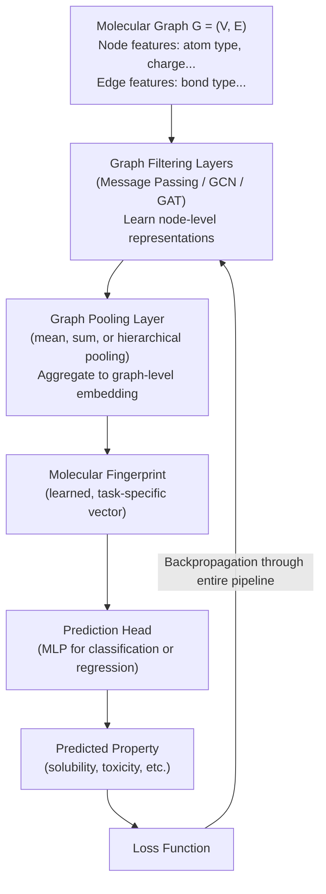

The key advantage is the backpropagation arrow going all the way back to the graph filtering layers: **the entire representation is learned end-to-end, optimized for the specific prediction task.** This is fundamentally more powerful than the disconnected two-stage approach.

---

### 📝 Q&A — Section 1

**Q1. What is a molecular graph, and why is this representation chosen for GNN-based molecular modeling?**

A: A molecular graph $G = (V, E)$ represents a molecule where atoms are nodes $V$ and chemical bonds are edges $E$. This representation is chosen because molecules are inherently graph-structured — atoms connect to other atoms through bonds, with no natural grid or sequence ordering. Standard neural networks (CNNs, MLPs) require fixed-size, regularly structured inputs and cannot process variable-sized molecules directly. GNNs, by contrast, can handle arbitrary graph sizes and naturally aggregate information from chemical neighborhoods, mirroring how chemical reactivity depends on local atomic environments.

**Q2. Why can chirality not be distinguished by a standard molecular graph, and why does this matter practically?**

A: A molecular graph encodes only connectivity — which atom is bonded to which — without encoding 3D spatial arrangement. Chiral molecules (enantiomers) have identical connectivity but mirror-image 3D structures. A GNN processing only the graph topology will compute identical embeddings for both enantiomers. This matters enormously in drug discovery: one enantiomer of thalidomide causes birth defects while the other is therapeutic. Distinguishing enantiomers requires encoding 3D coordinates, stereo-bond annotations, or other chirality-aware features as node/edge attributes beyond simple connectivity.

**Q3. Write and explain the ECFP generation procedure step by step. What is the radius parameter controlling?**

A: ECFP generation follows the Morgan algorithm. First, each atom is assigned an initial identifier encoding its local properties (atomic number, degree, charge, etc.). For $r$ iterations (where $r$ is the radius), each atom's identifier is updated by hashing together its current identifier with those of all its immediate neighbors. This "grows" the circular neighborhood captured by each atom's identifier: after radius $r$, the identifier encodes a substructure of diameter $2r$. All identifiers generated across all iterations are collected, then hashed to positions in a fixed-length bit vector. The radius controls the size of the chemical neighborhood captured: ECFP2 (radius=1) captures immediate neighbors only, ECFP4 (radius=2) captures two hops away, and so on. Larger radii capture more global molecular context but may lose local specificity.

**Q4. What is the fundamental limitation of the traditional two-stage (fingerprint + MLP) molecular property prediction pipeline?**

A: The critical flaw is that fingerprint extraction is non-differentiable and disconnected from the downstream task. The fingerprint (e.g., ECFP) is computed by fixed, hand-crafted rules without regard to what information is actually useful for predicting the target property. Backpropagation during training can only update the MLP parameters, not the fingerprint representation. The representation is therefore not optimal for any specific prediction task — it is a general-purpose encoding. GNN-based end-to-end learning solves this by making the entire pipeline differentiable, allowing the representation itself to be learned and optimized specifically for the target task.

**Q5. What is the difference between virtual screening and de novo molecular design? How do they relate to "chemical space" and "functional space"?**

A: In virtual screening, we start in chemical space (a large library of known or enumerable molecules) and use a predictive model to score each candidate — mapping chemical space to functional space (predicted properties). Molecules predicted to have ideal properties are selected for experimental testing. In de novo design, the direction is reversed: we start in functional space (desired properties like activity, safety) and use a generative model to generate a new molecular structure in chemical space that satisfies those properties. Virtual screening selects from existing molecules; de novo design creates new ones from scratch.

**Q6. What is the role of canonical SMILES, and why would non-canonical SMILES cause problems in a machine learning pipeline?**

A: The same molecule can be written as multiple valid SMILES strings depending on the starting atom and traversal path chosen. Non-canonical SMILES means the same molecule may appear multiple times in a dataset with different string representations, making deduplication impossible and making string-based equality checks fail. More critically, if a sequence model (like an LSTM or Transformer) processes SMILES strings directly, non-canonical representations will produce different embeddings for the same molecule, introducing noise. Canonical SMILES algorithms apply a standardized traversal rule (usually Morgan-based) to produce a unique string for any given structure, eliminating ambiguity.

**Q7. Why do GNN-based molecular models require both graph filtering AND graph pooling layers?**

A: Graph filtering (message passing) layers learn node-level representations — each atom gets an embedding encoding its local chemical environment. However, property prediction is a graph-level task: we need a single vector representing the entire molecule, not one vector per atom. Graph pooling layers aggregate all node representations into a single graph-level representation (e.g., by summing, averaging, or using hierarchical pooling). Without pooling, we have per-atom features but no global molecular fingerprint. Without filtering, the pooled representation would ignore the rich structural context. Both are necessary: filtering to learn rich local representations, pooling to aggregate them into a global molecular representation.

**Q8. Why are non-covalent bonds important in drug design even though they are "weaker" than covalent bonds?**

A: Non-covalent bonds (hydrogen bonds, salt bridges, pi-stacking, van der Waals forces) are the primary mode of interaction between a drug molecule and its biological target (typically a protein). Drug molecules generally do not react covalently with their targets (with some important exceptions); instead, they recognize and bind to a specific binding pocket through complementary non-covalent interactions. The sum of many weak non-covalent interactions can produce high-affinity, selective binding. A molecular model that only encodes covalent bonds cannot predict how a molecule will interact with a biological target, making non-covalent interaction modeling essential for drug design applications.

---

## 2. Healthcare — Adverse Drug Reaction (ADR) from Clinical Data

### 2.1 ADR Overview

An **Adverse Drug Reaction (ADR)** is any harmful, unintended response to a medicine at doses normally used for treatment. ADRs represent a significant global public health concern — they are a leading cause of hospital admissions, increased healthcare costs, and patient morbidity. The challenge of identifying ADRs exists at two stages of a drug's life cycle:

**Pre-marketing assessment:** Before a drug is approved, clinical trials are conducted to assess safety. However, trials are limited in sample size, duration, and population diversity. Rare ADRs that occur in 1-in-10,000 patients may not surface until millions of people use the drug. GNN-based methods applied to biomedical knowledge graphs have been developed to predict ADRs during this pre-approval phase.

**Post-market surveillance:** After a drug is approved and widely used, real-world clinical data from millions of patients becomes available. Mining this large-scale clinical data for ADR signals is critical — some serious ADRs are only discovered post-approval. The insight driving this research area is that patterns in *who receives which drugs* alongside *which diseases they have* can reveal drug-disease associations linked to ADR risk.

A key resource for this problem is the **SIDER (Side Effect Resource) Dataset**, which compiles known drug side effects extracted from drug labels and medical literature. This provides the ground truth labels for training and evaluating ADR prediction models.

The seminal work in this space is: *Kwak, Heeyoung, et al. "Drug-disease graph: predicting adverse drug reaction signals via graph neural network with clinical data." PAKDD 2020.* This paper uses clinical prescription and diagnosis records to build a drug-disease graph and applies GNN for ADR signal prediction.

---

### 2.2 Embedding Drug and Disease Nodes

To build a graph for ADR prediction, we need meaningful feature representations (embeddings) for both drug nodes and disease nodes. These embeddings should capture the semantic relationships encoded in clinical data — drugs that are co-prescribed with similar diseases should have similar embeddings.

**Step 1 — Word2Vec SkipGram Embeddings from Clinical Data:**

Clinical records (prescriptions + diagnoses) naturally form "sentences" of co-occurring medical entities. The Word2Vec SkipGram model is applied to clinical datasets where each patient's record is treated as a "sentence" of drugs and diagnoses. The SkipGram objective trains embeddings such that drugs and diseases that frequently appear together in patient records have similar vector representations. This captures the clinical co-occurrence patterns from large-scale Electronic Health Records.

**Step 2 — One-Hot Category Vectors:**

Beyond co-occurrence, drugs and diseases belong to hierarchical classification systems. Drugs are categorized using the **ATC Code** (Anatomical Therapeutic Chemical classification — e.g., Aspirin → A01AD05). Diseases are categorized using the **ICD-10 Code** (e.g., Type 2 Diabetes → E11). These codes are converted to one-hot vectors that encode the categorical membership.

**Step 3 — Combined Node Embedding:**

The skip-gram embedding (capturing clinical co-occurrence semantics) and the one-hot category vector (capturing structural classification) are concatenated or combined to form the final node embedding for each drug and disease node.

```
Node Embedding Construction:

Drug Node (e.g., Aspirin):
  Skip-gram embedding (from clinical data) → [0.2, -0.5, 0.8, ...]
  +
  ATC Code one-hot (A01AD05) → [0, 0, ..., 1, ..., 0]
  ───────────────────────────────────────────────────────
  Combined Drug Node Embedding → [0.2, -0.5, 0.8, ..., 0, 0, 1, 0]

Disease Node (e.g., Type 2 Diabetes):
  Skip-gram embedding (from clinical data) → [0.1, 0.3, -0.2, ...]
  +
  ICD-10 Code one-hot (E11) → [0, ..., 1, ..., 0]
  ───────────────────────────────────────────────────────
  Combined Disease Node Embedding → [0.1, 0.3, -0.2, ..., 0, 1, 0]
```

---

### 2.3 Creating Edges — Homogeneous and Heterogeneous

Once nodes are embedded, edges must be defined. There are two types of edges in this drug-disease graph:

**Homogeneous Edges (drug-drug or disease-disease):**

These edges connect two nodes of the *same type* (two drugs, or two diseases). The edge weight is defined using a **Gaussian weighting function** based on the similarity between the two node embeddings. A threshold $\theta$ controls the sparsity of the graph — only pairs of nodes whose embeddings are close enough (within the threshold) get connected:

$$
w_{ij} = \begin{cases} \exp\!\left(-\dfrac{\|\mathbf{v}'_i - \mathbf{v}'_j\|^2}{2\theta^2}\right) & \text{if } \|\mathbf{v}'_i - \mathbf{v}'_j\| \leq \text{threshold} \\ 0 & \text{otherwise} \end{cases}
\tag{Def. 4}
$$

**Symbol glossary:**
- $w_{ij}$: Edge weight between nodes $i$ and $j$
- $\mathbf{v}'_i$, $\mathbf{v}'_j$: Embedding vectors for nodes $i$ and $j$
- $\|\mathbf{v}'_i - \mathbf{v}'_j\|$: Euclidean distance between the two embeddings
- $\theta$: Bandwidth parameter — larger $\theta$ means the Gaussian is wider (less steep decay), connecting more pairs; smaller $\theta$ creates a sparser graph
- "threshold": A distance cutoff; pairs further apart than this get weight 0

**Intuitive English:** This formula says: connect two drugs (or two diseases) if they are similar (close in embedding space), and assign an edge weight that decays smoothly with distance. The Gaussian form ensures that very similar nodes get weight close to 1, while moderately similar nodes get lower weights, and dissimilar nodes are not connected at all.

**Heterogeneous Edges (drug-disease):**

These edges connect nodes of *different types* — one drug node to one disease node. The edge weight is based on **clinical co-occurrence frequency** in the NHIS-NSC (National Health Insurance Service — National Sample Cohort) database:

$$
w_{ij} = \frac{n_{ij}}{n_j}
\tag{Def. 5}
$$

**Symbol glossary:**
- $w_{ij}$: Edge weight between drug $i$ and disease $j$
- $n_{ij}$: Number of patient records in the database that contain *both* diagnosis $j$ and prescription $i$ (co-occurrence count)
- $n_j$: Total number of patient records with diagnosis $j$

**Intuitive English:** This is a conditional probability: given that a patient has disease $j$, what fraction of the time are they also prescribed drug $i$? If a drug is frequently prescribed to patients with a particular disease, this indicates a clinical relationship (the drug is used to treat that disease), and the edge weight will be high.

**Special case:** If drug $i$ is never co-prescribed with disease $j$, then $n_{ij} = 0$ and $w_{ij} = 0$ (no edge). If the drug is always prescribed when the disease is present, $w_{ij} = 1$.

---

### 2.4 ADR Prediction Pipeline (Bilinear Approach)

Once the drug-disease graph is built, a GNN (specifically GCN) processes the graph to learn enriched node representations. The ADR prediction is then performed using a **Bilinear** layer.

**What is the Bilinear approach?** A bilinear layer models interactions between two input vectors by computing their **outer product**. Given a drug embedding $\mathbf{u}$ (an $m \times 1$ vector) and a disease embedding $\mathbf{v}$ (an $n \times 1$ vector), the outer product $\mathbf{u}\mathbf{v}^T$ produces an $m \times n$ matrix. This matrix is then flattened into a vector and normalized (e.g., via sigmoid) to produce a prediction score $\hat{y}$.

The bilinear approach is more expressive than a simple dot product (which produces a scalar) because it captures all pairwise interactions between dimensions of the drug and disease embeddings, rather than just the sum of element-wise products.

**Complete ADR Prediction Pipeline:**

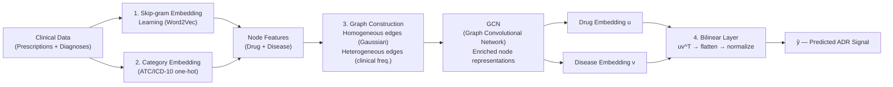

---

### 📝 Q&A — Section 2

**Q1. Why is post-market ADR surveillance necessary if clinical trials already assess drug safety?**

A: Clinical trials are limited in scale (typically hundreds to a few thousand patients), duration (weeks to months), and diversity (strict inclusion/exclusion criteria may exclude elderly patients, those with comorbidities, or certain genetic profiles). Rare ADRs that occur in 1-in-10,000 patients are statistically unlikely to appear in trial data. Once a drug is approved and used by millions of people over years, the signal-to-noise ratio for rare ADRs improves dramatically. Post-market surveillance using real-world clinical data from millions of patients is therefore essential for detecting rare, delayed, or population-specific ADRs that were invisible during trials.

**Q2. Explain the Gaussian weighting function for homogeneous edges. What happens when θ approaches zero, and what happens when θ becomes very large?**

A: The formula is $w_{ij} = \exp(-\|\mathbf{v}'_i - \mathbf{v}'_j\|^2 / 2\theta^2)$ when the distance is within the threshold. As $\theta \to 0$, the Gaussian becomes extremely narrow: only nodes with nearly identical embeddings get non-zero weights, and even small distances produce weights near zero. The graph becomes maximally sparse. Conversely, as $\theta \to \infty$, the denominator $2\theta^2$ becomes huge, making the exponent approach zero, so $w_{ij} \to \exp(0) = 1$ for all pairs within the threshold distance. Every pair of connected nodes gets weight 1, making the Gaussian effectively flat. The parameter $\theta$ thus controls how discriminatively the edge weights reflect embedding similarity.

**Q3. What does the heterogeneous edge weight $w_{ij} = n_{ij}/n_j$ capture, and why is this appropriate for a drug-disease relationship?**

A: This ratio represents a conditional probability: given a patient has disease $j$, the fraction of such patients who are also prescribed drug $i$. A high weight indicates that drug $i$ is commonly used to treat disease $j$ — a strong clinical relationship. This is appropriate because ADRs often emerge from the interaction between a drug and a disease context: the same drug may cause different side effects depending on what conditions the patient has. Using actual prescription-diagnosis co-occurrence from large population-scale databases captures real clinical practice patterns rather than relying on hand-curated relationships.

**Q4. Why is the bilinear approach preferred over a simple dot product for ADR prediction?**

A: A dot product $\mathbf{u}^T\mathbf{v} = \sum_i u_i v_i$ computes a single scalar by summing element-wise products — it only captures interactions between corresponding dimensions of the two embeddings. The bilinear approach computes the outer product $\mathbf{u}\mathbf{v}^T$, which is an $m \times n$ matrix capturing every pairwise interaction between all dimensions of the drug embedding and all dimensions of the disease embedding. This is far more expressive: an ADR may be triggered by a complex combination of drug and disease features that involves cross-dimensional interactions, not just aligned dimensions. The richer interaction modeling of the bilinear approach can capture these complex relationships.

**Q5. What role does the SIDER dataset play in this ADR prediction framework?**

A: SIDER (Side Effect Resource) compiles known drug side effects extracted from FDA drug labels and medical literature. In the ADR prediction framework, SIDER provides the **ground truth labels** — the known drug-ADR associations used to train the model. Without known positive examples of drug-ADR relationships, there would be no supervised signal for training. SIDER essentially defines what the model must learn to predict: given a drug and a potential ADR, does a known association exist? The model is then evaluated on its ability to predict novel or unconfirmed associations from the clinical data.

**Q6. How does the Word2Vec SkipGram model generate embeddings from clinical records? Why is this appropriate for drug-disease relationships?**

A: In the SkipGram model, each patient's clinical record is treated as a "sentence" — an ordered sequence of medical events (drugs prescribed, diagnoses made). The model trains embeddings by optimizing a prediction objective: given a drug or disease entity, predict the other entities that appear in the same patient record (within a context window). Entities that frequently co-occur with similar contexts (other drugs and diseases) end up with similar embeddings. This is appropriate for drug-disease relationships because clinical co-occurrence reflects genuine medical practice: drugs prescribed alongside certain diseases reveal therapeutic relationships, which are exactly the patterns relevant for ADR prediction. Drugs with similar clinical contexts likely interact with similar biological systems and may share ADR profiles.

**Q7. What happens to the graph structure if the threshold parameter θ in the homogeneous edge formula is set too high?**

A: Setting $\theta$ too high makes the Gaussian weighting function very permissive — even highly dissimilar drug-drug or disease-disease pairs will get non-zero edge weights. The resulting graph becomes nearly fully connected (a dense graph). This is problematic for several reasons: (1) computational cost scales with edge count, making the GNN slow; (2) information aggregation becomes noisy — every drug gets messages from all other drugs regardless of similarity, diluting the signal from truly similar drugs; (3) the graph loses its meaningful structure — the topology no longer encodes useful similarity information. The threshold $\theta$ must be tuned to create a graph that is sparse enough to be computationally tractable but connected enough to capture meaningful drug-drug and disease-disease similarities.

---

## 3. Healthcare — Rare Disease Prediction from Phenotypes

### 3.1 The Rare Disease Prediction Gap

A **rare disease** is typically defined as one affecting fewer than 1 in 2,000 people (EU definition) or fewer than 200,000 people total (US Orphan Drug Act definition). There are over 7,000 known rare diseases, affecting collectively ~300 million people worldwide. Despite this scale, rare diseases present unique machine learning challenges that standard approaches fail to address.

**Challenge 1 — Data Scarcity:** For any individual rare disease, the number of available patient records in Electronic Medical Records (EMR) is extremely small. A supervised model requires labeled examples for each disease class; rare diseases have too few positive examples to train reliably. The model cannot distinguish rare disease $X$ from common disease $Y$ with similar symptoms because it has seen only a handful of examples of $X$.

**Challenge 2 — Symptom Overlap:** Many rare diseases share symptoms with more common conditions. A patient presenting with fatigue, joint pain, and rash might have lupus (common), one of dozens of rare autoimmune conditions, or something else entirely. With limited data and overlapping symptom profiles, correctly identifying the rare disease among many similar options is extremely difficult.

**Challenge 3 — Dependence on Sequential EMR History:** Most existing disease prediction systems are designed around sequential patient records — they rely on a patient's history of visits, test results, and diagnoses accumulated over time. A patient presenting for the *first time* (a new patient, or one new to a healthcare system) has no historical EMR. These systems completely fail for new patients, severely limiting practical deployment.

> **Key Insight:** The solution is to leverage **external biological knowledge** — specifically, what is already known about which symptoms and phenotypic abnormalities are associated with which diseases — to compensate for the scarcity of patient EMR data.

---

### 3.2 Human Phenotype Ontology (HPO)

The approach to solving rare disease prediction borrows from biology and ontology engineering.

**What is a Phenotype?** A phenotype refers to an individual's observable, measurable traits — things that can be clinically documented. Examples include height, eye color, blood type, skin rash pattern, neurological symptoms, and biochemical markers. Critically, a person's phenotype is determined by both their **genotype** (their DNA sequence) and **environmental factors**. This distinction matters: two people with the same genotype may have different phenotypes due to environmental influences, and vice versa.

**What is an Ontology?** In computer science and knowledge engineering, an ontology is a formal data model representing **concepts, their attributes, and the relationships between them** in a structured, machine-readable form. Ontologies are typically represented as **directed acyclic graphs (DAGs)** — nodes are concepts (e.g., "Abnormal heart rate"), edges are relationships (e.g., "is-a" parent-child relationships in a hierarchy). The DAG structure allows reasoning about hierarchies: a model that knows about "Abnormal cardiac rhythm" also implicitly knows about "Abnormal heart function" if the former is a child of the latter.

**The Human Phenotype Ontology (HPO)** is a standardized, community-curated vocabulary of phenotypic abnormalities encountered in human diseases. It was specifically constructed to cover all phenotypic abnormalities commonly encountered in **human monogenic diseases** (diseases caused by mutations in a single gene). The HPO provides a formal, hierarchical vocabulary linking diseases to their characteristic symptom phenotypes.

**Why HPO is useful for rare disease prediction:** Both a patient's symptoms (extracted from their EMR) and a disease's characteristic features can be mapped to HPO terms. This creates a shared vocabulary that enables comparison between patient presentations and disease profiles — even when very few patient examples of the rare disease exist. The HPO graph structure itself also provides additional relational information (parent-child relationships between phenotype terms).

---

### 3.3 Graph Construction from EMR and HPO

Two separate graphs are constructed, using the same shared symptom vocabulary (HPO terms):

**Graph 1 — Patient Record Graph (from EMR):**
Patient records are converted to a bipartite graph connecting patients to the symptoms they exhibit:

```
Patient Record Graph (from EMR):

Patient P1  ────── Symptom S1
            ────── Symptom S2

Patient P2  ────── Symptom S2
            ────── Symptom S3

Patient P3  ────── Symptom S1
            ────── Symptom S4
            ────── Symptom S5
```

**Graph 2 — Medical Concept Graph (from HPO):**
The HPO knowledge base provides a bipartite graph connecting diseases (medical concepts) to their characteristic symptoms:

```
Medical Concept Graph (from HPO):

Disease M1 (Medical Concept 1)  ────── Symptom S1
                                 ────── Symptom S2

Disease M2 (Medical Concept 2)  ────── Symptom S2
                                 ────── Symptom S3
                                 ────── Symptom S4

Disease M3 (Medical Concept 3)  ────── Symptom S4
                                 ────── Symptom S5
```

The **shared symptom nodes** (S1 through S5) serve as the bridge between the patient graph and the disease graph. A patient who presents with symptoms S1 and S2 overlaps with disease M1 (which is characterized by S1 and S2) more than with disease M3 (characterized by S4 and S5).

---

### 3.4 Detection Pipeline

The pipeline uses GNNs to generate embeddings from both graphs, then measures how close a patient's embedding is to each disease's embedding:

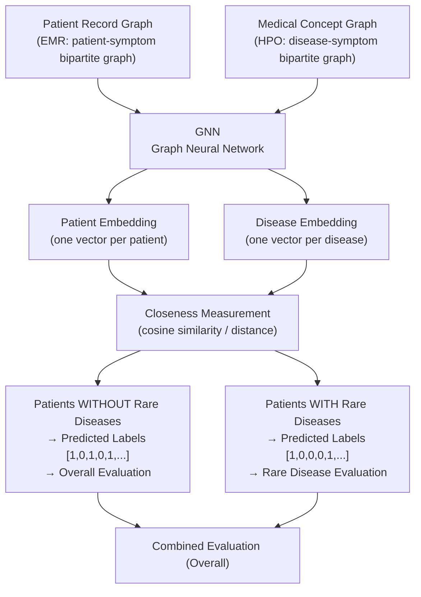

The key insight is that a patient is predicted to have disease $d$ if their GNN-generated embedding is close to disease $d$'s embedding in the latent space. Since both embeddings are generated by the same GNN processing the same shared symptom vocabulary, closeness in embedding space reflects similarity in symptom profiles — even for patients with no historical records.

---

### 📝 Q&A — Section 3

**Q1. Why do traditional sequential EMR-based disease prediction models fail for new patients, and how does the HPO-based approach address this?**

A: Sequential EMR-based models (e.g., RNN-based models processing visit histories) require a temporal sequence of past clinical events to make predictions. A new patient presenting for the first time has zero historical records, so these models have no input to process and cannot make predictions. The HPO-based graph approach solves this because it requires only the patient's *current* symptoms — what they present with right now — to generate a patient embedding. As long as the symptoms can be mapped to HPO terms, the patient is represented in the graph regardless of whether they have prior records.

**Q2. What is an ontology, and why is a DAG structure specifically used to represent the HPO?**

A: An ontology is a formal, machine-readable data model defining concepts, their attributes, and their relationships. A Directed Acyclic Graph (DAG) is used for the HPO because phenotypic concepts have hierarchical "is-a" relationships: "Abnormal heart rhythm" is a type of "Abnormal cardiac function," which is a type of "Abnormal cardiovascular system morphology." The DAG encodes these hierarchies without cycles (a concept cannot be its own ancestor), allowing inference through the hierarchy. The DAG structure also naturally captures the HPO's multi-inheritance property: a single phenotypic term may belong under multiple parent categories simultaneously.

**Q3. How does sharing symptom nodes between the patient graph and the HPO graph enable rare disease prediction?**

A: Both graphs use the same HPO symptom vocabulary as nodes. In the patient graph, patients connect to symptoms they exhibit. In the HPO graph, diseases connect to symptoms they characteristically cause. When a GNN processes both graphs, symptom node representations are shared and influenced by all connected entities (patients and diseases). A patient embedding will be pulled toward disease embeddings that share many of the same symptom connections. The more a patient's symptom profile matches a disease's characteristic symptoms, the closer their embeddings will be in the learned space, enabling similarity-based prediction.

**Q4. What is the distinction between a patient's genotype and phenotype, and why does this distinction matter for the HPO?**

A: The genotype is the actual DNA sequence — the genetic code. The phenotype is the observable expression of that genetic code, shaped by both the genotype and environmental factors. The distinction matters for HPO because doctors observe phenotypes (symptoms, signs, lab values) not genotypes. A rare disease may be caused by a specific gene mutation (genotype), but it is diagnosed based on its characteristic manifestations (phenotype). The HPO standardizes the phenotypic vocabulary — what can actually be observed and measured clinically — enabling computational systems to work with clinically observable data rather than requiring genetic testing for every patient.

**Q5. Why is the data scarcity problem for rare diseases fundamentally different from general class imbalance in machine learning?**

A: Standard class imbalance (e.g., 99% negative, 1% positive examples) can often be addressed with oversampling (SMOTE), undersampling, or class-weighted loss functions. Rare disease data scarcity is more severe: there may be only single-digit or tens of examples of a particular rare disease in an entire national health database. At this extreme, synthetic oversampling fails because there are too few real examples to interpolate meaningfully. More fundamentally, the model cannot learn the decision boundary separating one rare disease from clinically similar rare diseases with so few examples. The HPO approach sidesteps this by incorporating structured biological knowledge about the disease rather than relying solely on data-driven patterns.

**Q6. Why is the bipartite graph structure (patients connected to symptoms, diseases connected to symptoms) more informative than directly connecting patients to diseases?**

A: Directly connecting patients to diseases would only work for patients with confirmed diagnoses — it would encode what we already know and provide no basis for prediction. The bipartite patient-symptom structure allows the model to represent any patient based on what is observable (their symptoms) without requiring a prior diagnosis. Similarly, the disease-symptom structure represents diseases based on their known manifestations. The shared symptom "middle layer" creates an implicit channel of information flow between patients and diseases through their common symptoms, enabling comparison even when no direct patient-disease connection exists.

---

## 4. Healthcare — RNA-Disease Association Prediction

### 4.1 Biological Foundations: DNA, RNA, and Genes

To understand RNA-disease prediction, we need foundational molecular biology concepts:

**DNA (Deoxyribonucleic Acid):** DNA is the master information storage molecule of life. It is primarily responsible for storing and transmitting genetic information across cell divisions and generations. DNA carries the genetic instructions for the development and functioning of an organism, and it is found in nearly all cells (contained in the cell nucleus). DNA is a double-stranded helix made of four nucleotide bases: Adenine (A), Thymine (T), Guanine (G), and Cytosine (C). The sequence of these bases encodes all biological information.

**RNA (Ribonucleic Acid):** RNA is involved in protein synthesis and other cellular processes, including the critical role of carrying genetic information from DNA to ribosomes (where proteins are made). RNA differs from DNA in three key ways: it is single-stranded, it uses ribose sugar instead of deoxyribose, and it replaces Thymine (T) with Uracil (U). RNA serves as the intermediate step between the stored information in DNA and the actual functional proteins.

| Feature | DNA | RNA |
|---|---|---|
| Strands | Double-stranded | Single-stranded |
| Sugar | Deoxyribose | Ribose |
| Bases | A, T, G, C | A, U, G, C |
| Primary role | Information storage | Protein synthesis (and more) |
| Location | Nucleus (primarily) | Nucleus + Cytoplasm |

**Genes:** A gene is a specific sequence of DNA that contains the instructions for making a particular protein. Genes are discrete segments of the genome — the human genome contains approximately 20,000-25,000 protein-coding genes embedded within ~3 billion base pairs of DNA.

**Protein-Coding Genes (PCGs):** A protein-coding gene (PCG) is a segment of DNA that contains the instructions — the genetic code — for building a specific protein. Proteins are the molecular machines of the cell: they catalyze reactions (enzymes), provide structure (structural proteins), transmit signals (receptor proteins), and perform countless other functions. PCGs are the best-characterized portion of the genome and are the starting point for understanding gene-disease relationships.

---

### 4.2 RNA Dysregulation and Disease

Beyond their role in protein synthesis (messenger RNA, mRNA), many RNA molecules have regulatory functions that do not involve protein production. When these regulatory functions go wrong — **RNA dysregulation or dysfunction** — it increasingly recognized as a major factor in disease development.

**Types of Disease-Associated Non-Coding RNAs:**

- **miRNAs (MicroRNAs):** Small RNA molecules (~22 nucleotides) that regulate gene expression by binding to mRNA molecules and either degrading them or blocking their translation into protein. Dysregulated miRNAs can silence tumor-suppressor genes or activate oncogenes.

- **lncRNAs (Long Non-Coding RNAs):** RNA molecules longer than 200 nucleotides that do not code for protein but regulate gene expression at multiple levels (chromatin remodeling, transcription, splicing). Many lncRNAs are aberrantly expressed in cancer.

- **circRNAs (Circular RNAs):** Covalently closed circular RNA molecules that can act as "sponges" for miRNAs, absorbing them and preventing them from silencing their target mRNAs. Dysregulated circRNAs alter miRNA activity and gene expression patterns.

- **piRNAs (Piwi-Interacting RNAs):** Small RNAs that interact with Piwi proteins to silence transposable elements (jumping genes) in the germline. Disruption of piRNA pathways is linked to infertility and cancer.

**Disease examples:** Cancer, neurodegenerative diseases (Alzheimer's, Parkinson's), COVID-19 (SARS-CoV-2 produces viral RNA that disrupts host RNA processing), cardiovascular disease.

**Why computational prediction matters:** Experimentally validating RNA-disease associations requires costly and time-consuming biological experiments (cell lines, animal models, clinical samples). Computational models that can predict which RNA molecules are likely associated with which diseases dramatically reduce the experimental burden by prioritizing the most promising hypotheses for wet-lab validation.

---

### 4.3 RNA-Disease Prediction via GNN (DimiG)

**The Dataset and Prediction Problem:**

RNA-disease association prediction leverages:
- Known RNA-disease associations (positive examples)
- Protein-coding gene-disease associations (known which genes cause which diseases)
- PCG-RNA interaction networks (which RNA molecules regulate which protein-coding genes)
- Gene-gene interaction networks

The computational challenge is: given these heterogeneous data sources integrated into a graph, predict which unlabeled RNA molecules (e.g., miRNAs) are associated with which diseases.

**Applications:**

- **Disease-Gene Associations → RNA Risk Identification:** Known disease-related PCGs help identify *risk lncRNAs or miRNAs*. If a miRNA regulates a PCG that is known to cause cancer, the miRNA is a risk candidate for that cancer — even if no direct miRNA-cancer association has been established yet.

- **Path Inference:** Models predict associations by identifying pathways where an lncRNA regulates a protein-coding gene which is already known to cause a specific disease. The indirect path (lncRNA → PCG → Disease) provides evidence for a lncRNA-disease association.

**The DimiG Architecture:**

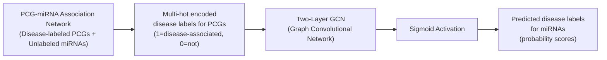

**Key Steps:**
1. Construct the PCG-miRNA interaction network (nodes: PCGs and miRNAs, edges: regulatory interactions)
2. Label PCG nodes with known disease associations (multi-hot vector — a PCG can be associated with multiple diseases)
3. miRNA nodes are *unlabeled* at this stage
4. Run a two-layer GCN: the labeled PCG information propagates through the interaction network edges to the unlabeled miRNA nodes
5. The GCN learns to assign disease labels to miRNAs based on their regulatory relationships with labeled PCGs
6. A sigmoid activation converts the GCN output to probability scores

The yellow highlighted nodes in the network represent the *weighted sum of neighbor embeddings* — the GCN aggregation step. The final output infers the probability of association between diseases and unlabeled miRNAs.

---

### 📝 Q&A — Section 4

**Q1. What distinguishes non-coding RNAs (ncRNAs) from messenger RNAs (mRNAs), and why do ncRNAs matter for disease?**

A: Messenger RNAs (mRNAs) are transcribed from protein-coding genes and carry the genetic blueprint to ribosomes for protein synthesis — their information is "used up" in making proteins. Non-coding RNAs (ncRNAs like miRNAs, lncRNAs, circRNAs) are transcribed but never translated into protein. Instead, they have regulatory functions: miRNAs silence gene expression, lncRNAs modify chromatin structure, circRNAs sponge miRNAs. NCRNAs are fundamentally important because they orchestrate the regulatory programs of the cell — controlling which genes are expressed when and at what level. When ncRNAs are dysregulated (overexpressed, silenced, mutated), these regulatory programs collapse, which can drive cancer, neurodegeneration, and other diseases. Understanding ncRNA-disease links therefore opens new avenues for both diagnosis and therapeutic targeting.

**Q2. Explain the path inference concept in RNA-disease association prediction. Why is an indirect path (lncRNA → PCG → Disease) valid evidence for an lncRNA-disease association?**

A: If a PCG is known to cause disease D (established experimentally), and an lncRNA is known to regulate (e.g., activate or suppress) that PCG, then the lncRNA indirectly controls disease-relevant biological processes. Suppressing the lncRNA may upregulate the disease-causing PCG, or the lncRNA may be required for the PCG to function correctly. This transitive chain of biological causation — lncRNA regulates PCG, PCG causes Disease, therefore lncRNA influences Disease — provides valid evidence for an association even without direct lncRNA-disease experiments. This is particularly valuable for rare diseases where direct experimental validation of all lncRNA-disease pairs is impractical.

**Q3. Why does the DimiG model label PCG nodes but not miRNA nodes as input to the GCN? What is the GCN doing in this context?**

A: PCGs have well-established disease associations accumulated over decades of molecular biology research. miRNAs are the entities we want to discover associations for. The GCN is performing **semi-supervised label propagation**: labeled nodes (PCGs) provide ground-truth disease association information, and the GCN propagates this information across the network edges (PCG-miRNA regulatory interactions) to unlabeled nodes (miRNAs). A miRNA that strongly regulates a PCG known to cause cancer will receive strong "cancer" signals through the network, leading the GCN to assign high probability of cancer association to that miRNA. The GCN is essentially learning to impute labels from labeled to unlabeled nodes based on network structure.

**Q4. Why are computational RNA-disease association prediction models scientifically valuable even if their predictions are probabilistic?**

A: Biological experiments for validating RNA-disease associations are expensive, time-consuming (months to years), and require significant expertise and resources. The universe of potential RNA-disease associations is astronomically large: ~30,000 lncRNAs × 7,000+ diseases alone generates billions of potential pairs. Experimentally testing even a small fraction is infeasible. A computational model that assigns probability scores to these pairs provides a ranked list: researchers can focus their limited experimental resources on the highest-probability predictions. Even if the model is imperfect, if it can correctly rank the top 10% of true positives in the top 1% of predicted candidates, it provides a 10× acceleration of biological discovery.

**Q5. What is the key difference between how DNA and RNA relate to protein production, and why does this make RNA a relevant therapeutic target?**

A: DNA is the master copy — it is too important to use directly (it stays in the nucleus). RNA is the working copy: DNA is transcribed into mRNA, which is then translated into protein. To modulate protein production — increasing or decreasing a protein's abundance — one can intervene at the RNA level rather than the DNA level. RNA-targeting therapies (RNA interference, antisense oligonucleotides, mRNA vaccines) are reversible, tissue-specific, and do not require permanently altering the genome. Since dysregulated ncRNAs often drive disease by misregulating protein levels, restoring ncRNA function or blocking a disease-promoting ncRNA with complementary oligonucleotides is a tractable therapeutic strategy.

---

## 5. Bioinformatics — Drug Discovery

### 5.1 The Drug Discovery Problem

Drug discovery is perhaps the most consequential application of GNNs. The problem is simple to state but staggering in scale: when a disease threatens human health, we need to find a chemical compound that can combat it safely and effectively.

**The Chemical Search Space:** Nature permits an essentially unlimited variety of organic molecules, but drug-like molecules (satisfying properties like appropriate molecular weight, solubility, and cell permeability — collectively called **Lipinski's Rule of Five**) number approximately $10^{63}$. To put this in perspective, there are an estimated $10^{24}$ grains of sand on Earth. If you examined each grain of sand individually, you would still need to repeat that process $10^{39}$ more times to cover all drug-like chemical space. This vastness makes brute-force experimental screening of all possible molecules completely impossible.

**The Biological Search Space:** Not only must we find a chemical compound, it must bind to a specific **biological target** — a biomolecule whose activity we want to modulate to produce a therapeutic effect. Targets are primarily proteins (enzymes, receptors, ion channels, transporters), but also include nucleic acids (DNA, RNA), lipids, and carbohydrates. The human proteome contains approximately $10^5$ (100,000) known proteins — each is a potential target.

**The Intersection:** Drug discovery exists at the intersection of these two vast spaces. For each of the ~100,000 proteins, we need to find which of the $10^{63}$ molecules binds it with appropriate affinity and selectivity, is non-toxic, can be absorbed and reach the target in the body, and is chemically synthesizable. This is not just a big problem — it is an astronomically large combinatorial search problem.

**The Timeline of Failure:** Industry facilities using **High-Throughput Screening (HTS)** can test $10^5$ to $10^7$ compounds per day. Even at the optimistic end, testing $10^{63}$ compounds would require at least $2.7 \times 10^{53}$ years — compared to the age of the universe at $1.37 \times 10^{10}$ years, this is incomprehensibly longer. Experimental screening alone can never cover chemical space.

---

### 5.2 Role of Machine Learning

Machine Learning's primary value proposition in drug discovery is to **automate the search process computationally**, dramatically reducing the number of compounds that need experimental testing. ML models can:

- **Score and prioritize** candidate molecules from chemical space without physical testing
- **Learn structure-activity relationships (SAR)**: what molecular features correlate with desired biological activity
- **Generalize**: predict properties for molecules that have never been synthesized or tested
- **Guide synthesis**: identify which chemical modifications would improve a candidate molecule

The economics are compelling: computational evaluation of a molecule costs microseconds and fractions of a cent. Physical experimental testing costs hours to days and hundreds to thousands of dollars per compound. By using ML to filter $10^{63}$ candidates down to $10^6$ or fewer high-confidence candidates for experimental validation, the practical search space becomes tractable.

**Traditional Drug Discovery Pipeline vs. AI-Guided Pipeline:**

```
Traditional Pipeline:                    AI-Guided Pipeline:
Drug Discovery (large funnel)            Drug Discovery (small funnel — AI pre-filters)
        │                                        │
        ▼                                        ▼
Preclinical Development (smaller)        Preclinical Development (much smaller)
        │                                        │
        ▼                                        ▼
Clinical Development (smaller)           Clinical Development (small)
        │                                        │
        ▼                                        ▼
FDA Review                               FDA Review
        │                                        │
        ▼                                        ▼
Drug Approval                            Drug Approval

Key: AI narrows the funnel much earlier,
identifying failures when they are cheap
rather than in expensive late-stage trials
```

Drug Discovery → Identify and develop therapeutic compounds
Preclinical Development → Laboratory and animal testing
Clinical Development → Human clinical trials (safety, efficacy, dosages)
FDA Review → Seek approval for use

The AI-guided pipeline is narrower at each stage — AI ensures only the most promising candidates advance, reducing the enormous cost of late-stage failures.

---

### 5.3 Virtual Screening and Property Prediction

**Virtual Screening (VS)** is a computational framework to predict and prioritize compounds as drug candidates by simulating their interactions with a target receptor or predicting other properties relevant to drug discovery. It is essentially a computational filter applied to large chemical libraries before any physical synthesis or testing.

The goal of VS is to reduce the number of compounds that need to be experimentally tested by computationally identifying those most likely to have the desired properties. VS can be:

- **Structure-based VS**: Use the known 3D structure of the target protein (from X-ray crystallography or AlphaFold) and simulate how candidate molecules dock into the binding site
- **Ligand-based VS**: If no 3D protein structure is available, use known active molecules (ligands) and find candidates similar to them (similarity searching, QSAR modeling)

**The mapping direction:** Virtual screening maps **chemical space → functional space**. You start with a molecule's chemical structure and predict its functional properties (activity, selectivity, toxicity). A predictive model has learned this mapping from training data.

The workflow: if the compound is predicted to have optimal properties, it is carried over for further experiments. This prioritizes experimental resources toward the most promising compounds.

---

### 5.4 Virtual Screening vs. De Novo Design

These two paradigms represent opposite directions of traversing the chemical-functional space relationship:

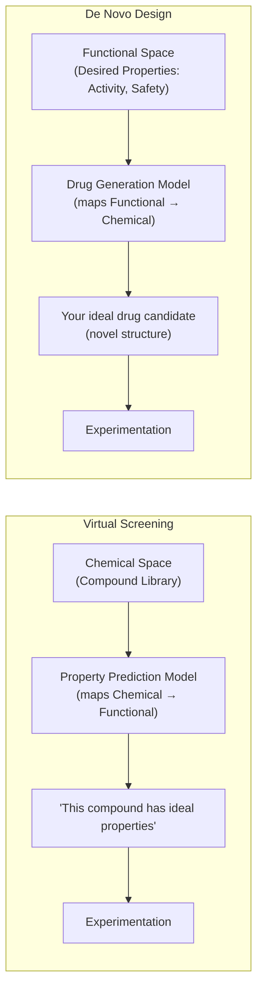

| Feature | Virtual Screening | De Novo Design |
|---|---|---|
| Starting point | Existing chemical library | Desired property criteria |
| Direction | Chemical → Functional space | Functional → Chemical space |
| Model type | Predictive (discriminative) | Generative |
| Output | Ranked candidates from existing molecules | Novel molecular structures |
| Constraint | Limited to known chemical space | Can explore entirely new chemical space |
| Risk | Misses novel scaffolds | May generate invalid or unsynthesizable molecules |

> **Elegant Insight:** Virtual screening is like searching through a catalog to find the right item. De novo design is like designing a custom item from specifications. Both approaches are complementary and are often used in sequence — de novo design generates novel candidates, virtual screening evaluates their properties.

---

### 📝 Q&A — Section 5

**Q1. Why is the chemical search space of $10^{63}$ molecules an insurmountable challenge for experimental approaches, even with modern high-throughput screening?**

A: High-throughput screening facilities can test $10^5$ to $10^7$ compounds per day — an impressive rate enabled by robotic automation and miniaturized assays. However, testing $10^{63}$ compounds at even $10^7$ per day would require $10^{56}$ days, or approximately $2.7 \times 10^{53}$ years. The age of the universe is ~$1.37 \times 10^{10}$ years, so experimental screening would take roughly $10^{43}$ times the age of the universe. No physical process can bridge this gap. Furthermore, synthesizing and physically storing $10^{63}$ compounds is itself physically impossible — the total number of atoms in the observable universe is estimated at $10^{80}$, so there is simply not enough matter in existence to make one molecule of each drug-like compound.

**Q2. What is the difference between structure-based and ligand-based virtual screening? When would you prefer one over the other?**

A: Structure-based VS uses the known 3D structure of the target protein (binding site geometry and residue chemistry) to simulate how candidate molecules physically dock into that site. It directly models protein-ligand complementarity. Ligand-based VS, by contrast, has no 3D protein structure; instead, it relies on the assumption that molecules similar to known active compounds (ligands) will also be active (the molecular similarity principle). You prefer structure-based VS when a high-quality protein structure is available (e.g., from X-ray crystallography) and when the binding mechanism is understood. You prefer ligand-based VS when the protein structure is unknown or unreliable, or when you have a set of experimentally confirmed active molecules to use as reference.

**Q3. How does de novo molecular design differ from virtual screening in terms of the underlying model architecture?**

A: Virtual screening uses a **discriminative/predictive model** — given a molecular structure, it outputs a score or property prediction. The model has learned to map the chemical space to the functional space, but it cannot generate new molecules; it can only evaluate existing ones. De novo design uses a **generative model** — given property criteria (desired activity, selectivity, toxicity profile), it generates novel molecular structures. Generative models have learned the reverse mapping: functional space to chemical space. Architecturally, VS models are typically classifiers or regressors (GNNs, random forests), while de novo design uses generative architectures (variational autoencoders, generative adversarial networks, reinforcement learning over molecular graphs).

**Q4. Why does the AI-guided drug discovery pipeline identify failures "earlier when they are relatively inexpensive"? What makes early vs. late failure cost-different?**

A: The cost of drug development escalates dramatically at each stage. Computational evaluation costs nearly nothing. Synthesizing a compound and running a cell-based assay costs hundreds of dollars. Animal (in vivo) studies cost tens to hundreds of thousands of dollars. Phase I human clinical trials cost millions. Phase III trials cost tens to hundreds of millions. When a compound fails in Phase III (the most common and expensive failure point), the investment is largely wasted. If AI virtual screening can predict that a compound is likely to fail — due to toxicity, poor selectivity, or poor pharmacokinetics — this failure is identified computationally for nearly zero cost, before any synthesis or animal or clinical testing. Moving the failure point earlier (left on the timeline) dramatically reduces the total cost of drug development.

**Q5. What is "Lipinski's Rule of Five" conceptually, and why does it bound the drug-like chemical space?**

A: Lipinski's Rule of Five (Ro5) is an empirical set of guidelines identifying molecule properties associated with good oral bioavailability (the ability of a drug to be absorbed when taken by mouth). The rules stipulate limits on molecular weight (≤500 Da), lipophilicity (LogP ≤5), number of hydrogen bond donors (≤5), and number of hydrogen bond acceptors (≤10). Molecules violating more than one rule are unlikely to be orally bioavailable. Applying these filters reduces the chemical space from all organic molecules (essentially infinite) to approximately $10^{63}$ drug-like molecules. This bound is what defines the drug-like chemical space — a vast but somewhat constrained subset of all possible chemistry. GNN-based property prediction models often learn to predict Ro5-related properties as part of virtual screening workflows.

---

## 6. Bioinformatics — Drug-Target Affinity Prediction

### 6.1 Drug-Target Interaction Overview

Developing a new drug is both expensive (averaging over a billion dollars) and time-consuming (10-15 years from discovery to approval). A fundamental bottleneck is identifying which drug candidates actually bind to their intended biological target — and how strongly.

**Drug-Target Interaction (DTI)** prediction addresses this: given a drug molecule and a protein target, does the drug bind to the target? If so, how strongly? Early, accurate identification of effective drug-target interactions drastically narrows the search space and eliminates poor candidates before costly wet-lab experiments are performed.

**Four Main Types of Biological Targets:**

| Target Type | Description | Examples |
|---|---|---|
| Protein | Most common drug target — enzymes, receptors, ion channels | Kinases, GPCRs, nuclear receptors |
| Disease | Disease-associated processes | Oncogenic signaling pathways |
| Gene | Regulatory genes | Oncogenes, tumor suppressors |
| Side Effect | Off-target proteins causing adverse effects | HERG channel (cardiac toxicity) |

**Drug Repurposing:** DTI prediction is also used to find new therapeutic uses for existing drugs. A drug approved for one disease might bind to a protein relevant to a completely different disease — computational DTI prediction can identify these opportunities without starting drug development from scratch. This is significantly faster and cheaper since the drug's safety profile is already known.

**Binding Affinity Prediction as Regression:** The strength of the drug-target interaction is quantified as the **binding affinity** — typically expressed as a dissociation constant $K_d$ or inhibition constant $K_i$ (lower values mean tighter binding) or as $pK_d = -\log_{10}(K_d)$ (higher values mean tighter binding). This makes the task a **regression problem**: predict a continuous binding strength value for a given drug-target pair.

---

### 6.2 GNN-Based Affinity Prediction Framework

**Problem Formulation:**

A drug-protein pair is denoted as $(G_d, p)$, where:
- $G_d$: the drug molecule, represented as a molecular graph with atoms as nodes and chemical bonds as edges
- $p$: the target protein, represented as either an amino acid sequence or a 3D graph of residues

**Architecture:**

```mermaid
graph TD
    A["Drug G_d<br/>(Molecular Graph)"] --> B["GNNs<br/>(Graph Neural Network)<br/>Processes molecular graph structure"]
    C["Protein p<br/>(Amino Acid Sequence)"] --> D["Sequence Model<br/>(CNN / LSTM / Transformer)<br/>Processes amino acid sequence"]
    B --> E["Drug Representation<br/>(graph-level embedding)"]
    D --> F["Protein Representation<br/>(sequence-level embedding)"]
    E --> G["Concatenation<br/>(Drug || Protein)"]
    F --> G
    G --> H["Predict<br/>(Fully Connected Layers)"]
    H --> I["Output<br/>(Binding Affinity Score)"]
```

**Dual Encoder Architecture:**

The drug and protein require different encoders because they have fundamentally different structural representations:

1. **Drug encoder (GNN):** The drug $G_d$ is fed into a graph neural network. The GNN applies multiple layers of message passing, aggregating information from neighboring atoms. A graph pooling operation produces a single fixed-size vector — the **graph-level drug representation** — encoding the overall molecular structure.

2. **Protein encoder (Sequence Model):** The protein $p$ is encoded as a sequence of amino acids (a string over a 20-character alphabet — one character per standard amino acid). A sequence model (CNN with character-level convolutions, LSTM, or Transformer) processes this sequence to produce a fixed-size protein representation vector.

3. **Joint representation:** The drug representation vector and the protein representation vector are **concatenated** (placed side-by-side) to form a combined vector representing the drug-target pair. This concatenated vector captures features of both the drug and the protein simultaneously.

4. **Affinity prediction:** The combined representation is passed through fully connected layers to predict the binding affinity score.

**Why concatenation?** Concatenation is a simple way to allow the final prediction layers to learn which drug features interact with which protein features to determine binding affinity. More sophisticated approaches use attention mechanisms or bilinear layers (as in the ADR task) to explicitly model drug-protein feature interactions.

---

### 📝 Q&A — Section 6

**Q1. Why is drug-target binding affinity prediction framed as a regression task rather than a classification task?**

A: Binding affinity is a continuous physical quantity measured in concentration units (e.g., nanomolar, $K_d$). A regression model predicts this continuous value directly, providing quantitative information about how strongly a drug binds. A binary classification approach (binds/doesn't bind) loses the crucial distinction between weakly binding compounds (low affinity — high $K_d$) and strongly binding compounds (high affinity — low $K_d$). In drug discovery, the affinity value itself drives decisions: only compounds with affinity below a target threshold (e.g., $K_d < 10$ nM) advance to further development. Regression also allows ranking of many candidates by predicted affinity, whereas classification only provides a binary split.

**Q2. Why are two different model architectures (GNN for drug, sequence model for protein) used rather than one unified architecture?**

A: Drugs and proteins are fundamentally different data structures requiring specialized encoders. A drug molecule is naturally a graph (atoms and bonds) — GNNs are designed for exactly this structure and leverage the molecular topology. A protein can be represented as a sequence (the amino acid sequence — 1D) or as a 3D residue graph (nodes = residues, edges = spatial proximity). Sequence models (CNNs, LSTMs, Transformers) are optimized for 1D sequential data. Representing a protein as a molecular graph (every atom as a node) would produce enormously large graphs (proteins have thousands of atoms), making GNN processing intractable. The dual-encoder architecture uses the best-suited model for each data type, then combines representations at a higher level of abstraction.

**Q3. What is drug repurposing, and how does DTI prediction enable it computationally?**

A: Drug repurposing (or repositioning) is the strategy of identifying new therapeutic applications for drugs that are already approved (or were developed but abandoned). Since the drug's safety, pharmacokinetics, and manufacturing process are already established, repurposing dramatically reduces development time and cost. Computationally, DTI prediction enables repurposing by systematically evaluating all approved drugs against all disease-relevant target proteins. A drug approved for disease A may be predicted to have high affinity for a protein critical in disease B — this computational prediction generates a testable hypothesis for repurposing, which can then be validated experimentally. Notable examples include sildenafil (originally a cardiac drug, repurposed for erectile dysfunction) and thalidomide (repurposed for multiple myeloma after its original use was withdrawn).

**Q4. What happens if the protein is represented as a graph of residues rather than as a sequence? What are the trade-offs?**

A: When the protein is represented as a residue graph (nodes = amino acid residues, edges = spatial proximity based on 3D coordinates), a GNN can be used as the protein encoder instead of a sequence model. This captures 3D structural information — the spatial arrangement of residues in the folded protein — which is directly relevant to binding: the binding pocket's 3D shape determines which drug molecules can fit. However, this requires 3D protein structures (from X-ray crystallography, cryo-EM, or AlphaFold prediction), which are not always available. Sequence models are more universally applicable since protein sequences are available for virtually all known proteins, but they miss 3D structural context. The 3D graph approach is more accurate when structural data is available but less general.

**Q5. Why are there "mainly four types of targets" — protein, disease, gene, and side effect — in DTI prediction?**

A: This classification reflects the multiple levels at which drug action can be modeled. Protein targets are the most direct — a drug physically binds a protein. Disease targets represent the disease state that a drug modulates — useful for disease-level knowledge graphs. Gene targets represent regulatory genes whose expression is modulated by a drug (relevant for epigenetic drugs or gene therapy adjuvants). Side effect targets represent off-target proteins that a drug accidentally binds, causing adverse effects. Incorporating all four types of targets allows DTI models to reason not only about desired therapeutic effects but also about off-target interactions that produce toxicity — a critical consideration for drug safety.

---

## 7. Bioinformatics — Polypharmacy Side Effect Prediction

### 7.1 What is Polypharmacy?

**Polypharmacy** refers to the use of multiple drugs simultaneously to treat a patient. The term comes from Greek: "poly" (many) + "pharmakon" (drug). Polypharmacy is not inherently a problem — in fact, for many complex diseases (HIV/AIDS, cancer, heart failure, tuberculosis), no single drug is sufficient and combination therapy is the standard of care.

**Why polypharmacy is necessary:** Many complex diseases cannot be treated by a single drug because:
- The disease involves multiple molecular pathways simultaneously
- Using a single drug at high enough dose to be effective may be too toxic
- Drug resistance develops faster with monotherapy than with multi-drug therapy
- Combination drugs can have synergistic effects (the combination is more effective than the sum of individual effects)

**The Major Hazard — Drug-Drug Interactions (DDI):**

When two drugs are taken simultaneously, they can interact in the body in unexpected ways. One drug may change how another is metabolized (e.g., inhibiting the enzyme that breaks it down, causing it to accumulate to toxic levels). Two drugs may compete for the same protein target, altering the effect of each. These **drug-drug interactions (DDIs)** can produce **polypharmacy side effects** — adverse effects that neither drug would cause alone but that emerge from the combination.

**The Prediction Challenge:**

The polypharmacy side effect prediction task is not only to predict whether a side effect exists between a pair of drugs but also to tell what type of side effect it is. This is a harder task than binary prediction — there are potentially hundreds of different types of side effects, and the model must identify which specific type(s) occur.

**Key empirical finding:** Exploratory analysis shows that *co-prescribed drugs tend to have more target proteins in common than random drug pairs*. This is not accidental — it indicates that drug-drug interactions are mediated through shared protein targets. Two drugs that both target the same protein (or proteins in the same pathway) are more likely to interact. This motivates incorporating protein-protein interaction information into the polypharmacy side effect model.

---

### 7.2 Multi-Modal Graph Construction

A **multi-modal (heterogeneous) graph** $G = (V, E, R)$ is built incorporating three types of biological interactions:

- **V**: Set of nodes = Drugs ∪ Proteins
- **E**: Set of directed edges, each of the form $e = (v_i, r, v_j)$ where $r \in R$
- **R**: Set of relation types, including:
  1. **Protein-protein interactions (PPI)**: edges between protein nodes encoding physical binding relations
  2. **Drug-protein target relationships**: edges from a drug node to each protein it physically targets
  3. **Drug-drug side effects**: typed edges between pairs of drugs, where each edge type $r$ represents a different type of side effect

```
Two-Layer Multi-Modal Graph Structure:

Layer 1 — Drug Layer:
  D (Doxycycline) ─── r₁ ──► S (Simvastatin)    [Gastrointestinal bleed side effect]
  D (Doxycycline) ─── r₂ ──► S (Simvastatin)    [Bradycardia side effect]
  C (Ciprofloxacin) ─ r₂ ──► S (Simvastatin)    [Bradycardia side effect]
  C (Ciprofloxacin) ─ r₁ ──► M (Mupirocin)      [Gastrointestinal bleed side effect]

Drug-Protein Edges (cross-layer):
  C (Ciprofloxacin) ──────────► P₁, P₂, P₃, P₄  [targets 4 proteins]
  D (Doxycycline) ──────────── ► P₁, P₃            [targets 2 proteins]

Layer 2 — Protein Layer:
  P₁ ──── P₂    [protein-protein interaction]
  P₂ ──── P₃    [protein-protein interaction]
  P₃ ──── P₄    [protein-protein interaction]

Legend:
  △ = Drug node    ● = Protein node
  r₁ = Gastrointestinal bleed side effect
  r₂ = Bradycardia side effect
```

**Concrete Example from Slides:**
- Doxycycline (node D) and Ciprofloxacin (node C) are connected by relation $r_2$ (bradycardia side effect) — taking this combination likely causes bradycardia
- Ciprofloxacin (node C) targets 4 proteins (shown as drug-protein interaction edges)

---

### 7.3 Relational Link Prediction

**Task Formulation:**

Polypharmacy side effect prediction is modeled as a **multi-relational link prediction task**. Formally:

Given the multi-modal graph $G = (V, E, R)$ and a pair of drug nodes $\{v_i, v_j\}$, the task is to predict how likely an edge $e_{ij} = (v_i, r, v_j)$ of type $r \in R$ exists between them.

This is more complex than standard (single-relation) link prediction because the model must:
1. First predict WHETHER any interaction exists
2. If so, WHICH TYPE(S) of side effect it causes

**GNN Processing:**

Graph filtering (message passing) operations are applied to learn node representations for both drug and protein nodes. The message passing propagates information across the graph: a drug node aggregates information from the proteins it targets and from other drugs connected to it. This means a drug's learned embedding encodes not just its own properties but also information about its protein targets and its known interactions with other drugs.

**Prediction:**

After learning node representations, the prediction for a drug pair $(v_i, v_j)$ and relation type $r$ uses a **relational decoder** (e.g., a bilinear model or DistMult-style scoring) that scores the triplet $(v_i, r, v_j)$.

```mermaid
graph TD
    A["Multi-Modal Graph G = (V, E, R)<br/>Drugs + Proteins<br/>PPI + Drug-Protein + Drug-Drug relations"] --> B["Graph Filtering<br/>(Message Passing GNN)<br/>Learn drug and protein node representations"]
    B --> C["Drug Embedding v_i"] 
    B --> D["Drug Embedding v_j"]
    B --> E["Protein Embeddings<br/>(intermediate, aid drug representations)"]
    C --> F["Relational Decoder<br/>Score triplet (v_i, r, v_j)<br/>for each relation type r"]
    D --> F
    F --> G["Predicted Side Effect Probabilities<br/>P(r₁ | v_i, v_j), P(r₂ | v_i, v_j), ..."]
```

---

### 📝 Q&A — Section 7

**Q1. Why is polypharmacy side effect prediction framed as a multi-relational link prediction rather than binary link prediction?**

A: The fundamental challenge is that drug-drug interactions are typed — the same pair of drugs may cause multiple distinct side effects (e.g., both bradycardia and gastrointestinal bleeding). Binary link prediction would only tell us "this drug pair is dangerous" without identifying which type of danger. For clinical decision-making, knowing the specific type of side effect is critical: a cardiologist prescribing drugs to a patient with heart disease needs to know whether a combination causes cardiac side effects specifically. Multi-relational link prediction explicitly models the type of each drug-drug interaction, enabling clinically actionable predictions. The relation type $r$ identifies the specific adverse event, not just the existence of an interaction.

**Q2. Why is protein-protein interaction (PPI) information incorporated into the polypharmacy side effect model? What would be missed without it?**

A: Co-prescribed drugs tend to share protein targets more than random drug pairs — their pharmacological effects are often mediated through overlapping biological pathways involving multiple proteins. These proteins interact with each other in the PPI network, creating multi-step chains of interaction. Drug A targets protein P1, which interacts with protein P2, which is also targeted by drug B — this indirect shared pathway can cause an emergent interaction not predictable from just the drug-protein edges alone. Without PPI information, the model cannot reason about these indirect pathway-mediated interactions. Incorporating the PPI layer allows the GNN to learn that drugs connected through multiple protein hops are more likely to interact than would appear from direct drug-protein edges alone.

**Q3. What does the relation set R in the graph G = (V, E, R) represent, and how large is it practically?**

A: The relation set R contains all distinct types of side effects that can occur between drug pairs, plus the drug-protein target relation and the protein-protein interaction relation. In practice, the number of drug-drug side effect types in datasets like SIDER or TWOSIDES runs to hundreds of distinct adverse event types (e.g., nausea, hepatotoxicity, bradycardia, rhabdomyolysis, etc.). The model must simultaneously learn to predict all of these relation types. Each relation type has its own learned parameters in the relational decoder, allowing the model to capture the fact that different side effect types have different structural signatures in the drug-protein interaction graph.

**Q4. How does the GNN's message passing enable a drug node to incorporate information about its protein targets?**

A: In the multi-modal graph, drug nodes are directly connected to their protein target nodes via drug-protein edges. During GNN message passing, each node aggregates (e.g., sums or averages) the embeddings of its neighbors and transforms this aggregated message. In the first message passing step, a drug node receives messages from all its protein targets. After this step, the drug's embedding encodes information about its target proteins. In subsequent steps, proteins receive information from their PPI neighbors, and drugs receive updated protein information. After $k$ steps, a drug node's embedding reflects not just its direct protein targets but also the proteins those targets interact with — capturing the broader biological pathway context. This enriched drug representation, informed by the biological context of its targets, is what enables accurate side effect prediction.

**Q5. What is the significance of the empirical finding that co-prescribed drugs share more protein targets than random drug pairs?**

A: This finding establishes a mechanistic biological basis for why GNNs incorporating protein interaction data should work for polypharmacy side effect prediction. If side effects were random phenomena unrelated to molecular targets, there would be no reason to model drug-protein and protein-protein interactions — we could just model drugs in isolation. The empirical finding that shared targets correlate with co-prescription (and by extension, with clinical interaction) validates the hypothesis that **molecular-level target sharing is mechanistically linked to clinical drug-drug interactions**. This justifies the design choice to build a multi-modal graph incorporating the biological machinery (proteins and their interactions) rather than modeling only the drug-drug level.

---

## 8. Bioinformatics — Protein-Protein Interaction (PPI)

### 8.1 PPI Network Fundamentals

Proteins rarely act in isolation. To carry out their functions — catalyzing metabolic reactions, transmitting cellular signals, building cellular structures, regulating gene expression — proteins must interact with other proteins. These physical contacts between proteins are called **protein-protein interactions (PPIs)**, and the complete map of all such interactions in a cell or organism is called the **interactome**.

A **PPI network** is a graph-based representation of this interactome:
- **Nodes**: Represent individual protein molecules
- **Edges**: Represent physical interactions between protein pairs

**Types of Interactions:**
- **Direct (physical) interactions**: Two proteins physically contact each other at their molecular surfaces (relevant to this lecture)
- **Indirect interactions**: Two proteins influence each other's activity through intermediary proteins (connected by a path in the network but not directly bonded)

**Biological Significance:** PPI interactions are fundamental to virtually every cellular process:
- **Signal transduction**: Extracellular signals are relayed into the cell through cascades of proteins that phosphorylate (activate/deactivate) each other
- **Enzymatic reactions**: Many enzymes require cofactors or activating proteins to function
- **Gene regulation**: Transcription factors interact with co-factors and with the transcription machinery
- **Cellular metabolism**: Metabolic enzymes are organized into complexes for efficiency

**The Interactome:** The complete set of PPI in a cell or organism. The human interactome is estimated to contain hundreds of thousands of interactions among ~20,000 proteins. Most of these interactions are not yet experimentally characterized — the known interactome is an underestimate of the true interactome.

---

### 8.2 Network Analysis vs. Bioinformatics Approaches

Two distinct approaches are used to study PPI networks, and the course focuses specifically on the bioinformatics computational approach:

| Aspect | Network Analysis | Bioinformatics |
|---|---|---|
| Goal | Understand network topology | Predict interactions computationally |
| Input | Known PPI network | Protein sequences and structures |
| Methods | Graph metrics (centrality, clustering) | ML models on sequence/structure features |
| Output | Key proteins, hub nodes, pathways | Predicted new interactions |
| Our focus | Background context | **This is the focus** |

**Network Analysis** analyzes the structure and topology of PPI networks to identify key proteins and pathways. A **biological pathway** is a series of molecular actions among molecules in a cell that leads to a certain product or a change in the cell — for example, the MAPK signaling pathway that controls cell proliferation. Network analysis can identify "hub" proteins (with many interaction partners) that are critical network nodes and potential drug targets.

**Bioinformatics** uses computational tools to predict interactions between proteins based on their sequence and structural information. This is the ML application focus: given protein A and protein B, will they physically interact? This is a binary classification problem at the protein level, or a binary classification at the residue level (which specific residues form the interface?).

**Integration of Data:** The most powerful approaches combine PPI data with other types of biological data, such as gene expression data (which genes are expressed together in the same tissue?) or co-evolutionary data (which proteins evolve together across species?), to improve prediction accuracy.

---

### 8.3 Proteins, Amino Acids, and Residues

Understanding PPI at the molecular level requires understanding protein structure from the bottom up.

**What is a protein?** Proteins are long chains (polymers) of amino acids with specific biochemical functions. The chain folds into a specific 3D shape that determines its function. To perform their functions, proteins need to interact with other proteins.

**What is an amino acid?** An amino acid is the monomer unit of proteins. Every amino acid contains three parts:
- An **amine group** ($-\text{NH}_2$): The nitrogen-containing "head" that forms the peptide bond with the next amino acid
- A **carboxyl group** ($-\text{COOH}$): The acidic "tail" that forms the peptide bond with the previous amino acid
- A **side chain (R group)**: The unique chemical group that differs among amino acids

There are 20 standard amino acids, each with a different side chain (R group). The side chain determines the amino acid's specific properties — its size, charge (positive, negative, or neutral), polarity (hydrophilic or hydrophobic), and chemical reactivity (can it form hydrogen bonds? disulfide bonds?).

**How side chains drive protein folding:** When a chain of amino acids folds into its 3D structure, the thermodynamics of the folding are determined by side chain properties. Hydrophobic (water-fearing) side chains minimize their exposure to water by packing into the protein's interior — this is the "hydrophobic core." Hydrophilic (polar or charged) side chains are typically found on the protein surface, where they interact favorably with the surrounding water.

**What is a residue?** When an amino acid is incorporated into a polypeptide chain, it undergoes a **condensation reaction**: the amine group of one amino acid reacts with the carboxyl group of the next, releasing a water molecule ($\text{H}_2\text{O}$) and forming a **peptide bond**. The resulting unit — the amino acid minus the water molecule — is called a **residue**. Proteins are described by their residue count (e.g., "a 100-residue protein") and residue sequence.

```
Amino Acid → (incorporated into chain) → Residue

Free Amino Acid:     H₂N - C(R)(H) - COOH
                          │
                     (loses H from NH₂ and OH from COOH when forming peptide bond)
                          │
Residue in chain:    HN - C(R)(H) - CO-
                     ↑                ↑
              Backbone amine     Backbone carbonyl
              (shared backbone,  (shared backbone,
               same for all)      same for all)

R = unique side chain, different for each of the 20 amino acids
```

---

### 8.4 Residue-Level Interaction and Interface Prediction

**From Protein-Level to Residue-Level:**

When we say "Protein A binds to Protein B," this is a molecular-level description. Physically, this binding is realized through specific residues that contact each other at the **protein interface** — the molecular surface where the two proteins touch.

The overall, stable 3D structure of Protein A matches the 3D surface of Protein B like a "hand in a glove," allowing specific amino acid residues to come close enough (usually within 6 Å — 6 Ångströms, where 1 Å = $10^{-10}$ meters) to form weak non-covalent bonds (hydrogen bonds, electrostatic interactions, van der Waals contacts).

**Definition of Interface Residues:**

Two amino acid residues (one from each protein) are considered part of the protein interface if any non-hydrogen atom in one residue is within **6 Å** of any non-hydrogen atom in the other residue.

The **6 Å threshold** is used because:
- Hydrogen bond lengths are ~2-3 Å
- Van der Waals interactions extend to ~4-6 Å
- Beyond 6 Å, direct non-covalent interactions are negligible

Residues that contribute to binding are called **interfacial residues**. In the isolated, unbound protein, these residues are typically surface-exposed (accessible to solvent). Upon complex formation, they become buried at the interface.

**Interface Prediction as Binary Classification:**

The protein interface prediction problem is formulated as a binary classification problem: given a pair of amino acid residues $(v_l, v_r)$, one from a ligand protein $G_l$ and one from a receptor protein $G_r$, are these two residues part of the protein interface?

- **Input**: A pair $(v_l, v_r)$ with $v_l \in V_l$ (ligand protein) and $v_r \in V_r$ (receptor protein)
- **Output**: Binary label (1 = interface pair, 0 = non-interface pair)

**Graph Representation of a Protein for Interface Prediction:**

A protein is modeled as a graph $G = (V, E)$ where:
- Nodes $v_i \in V$: amino acid residues
- Edges: residue pairs within the protein that are spatially close (within a distance threshold)
- Each node is connected to its $k$ closest amino acid residues determined by the mean distance between their atoms (k-NN graph in 3D space)
- Node features $\mathbf{x}_i$: biochemical properties of residue $i$ (residue type one-hot, physicochemical properties)
- Edge features $\mathbf{e}_{ij}$: spatial relationship between residues $i$ and $j$ (distance, relative orientation)

**Inference Pipeline:**

```mermaid
graph TD
    A["Ligand Protein G_l<br/>(residues as nodes, spatial edges)"] --> C["Graph Filtering (GNN)<br/>Learn residue-level representations for G_l"]
    B["Receptor Protein G_r<br/>(residues as nodes, spatial edges)"] --> D["Graph Filtering (GNN)<br/>Learn residue-level representations for G_r"]
    C --> E["Residue embedding v_l<br/>(for target residue in ligand)"]
    D --> F["Residue embedding v_r<br/>(for target residue in receptor)"]
    E --> G["Combine v_l and v_r<br/>(concatenation or cross-attention)"]
    F --> G
    G --> H["Fully Connected Layers"]
    H --> I["Binary Classification:<br/>Interface pair? (Yes/No)"]
```

---

### 8.5 PPI Datasets

Several curated databases provide the training and evaluation data for PPI prediction models:

| Database | Focus | Key Features |
|---|---|---|
| **STRING** | Comprehensive PPI across species | >5000 organisms; v11+ includes SHS27k and SHS148k subsets widely used in ML research; updated 2021, 2023 |
| **HPRD** (Human Protein Reference Database) | Human proteins only | Provides sequences, structures, functions, disease associations |
| **DIP** (Database of Interacting Proteins) | Multi-species PPI | Curated manually and algorithmically for reliability |
| **HIPPIE** | Human PPI with interaction scores | Confidence scores for each interaction |
| **Negatome** | Non-interacting protein pairs | Provides negative examples — crucial for training classifiers |
| **IntAct** | Multi-species PPI | Large-scale, manually curated |

**SHS27k and SHS148k:** These are subsets of the STRING database frequently used in deep learning research — 27,000 and 148,000 protein pairs respectively. They have become standard ML benchmarks for PPI prediction.

**Protein Data Bank (PDB):** For residue-level interaction prediction, 3D structural data from the PDB is essential — it provides the 3D atomic coordinates needed to determine which residues are within 6 Å of each other at the interface.

**The Critical Role of Negative Examples:** Negatome provides confirmed non-interacting protein pairs. This is important because the negative training data for PPI classifiers (protein pairs that do NOT interact) cannot simply be taken as all pairs not in the positive set — the interactome is heavily under-characterized, so a protein pair not in the database may truly not interact, or it may interact but hasn't been tested yet.

---

### 8.6 Transfer Learning with Protein Language Models

A key challenge in GNN-based PPI prediction is generating rich node features for residue nodes. Traditional features include one-hot encoding of the amino acid type (20 dimensions) and physicochemical properties (hydrophobicity, charge, etc., ~7 dimensions). But these sparse features miss the rich evolutionary and functional context encoded in protein sequences.

**Protein Language Models** treat the amino acid sequence of a protein like a "sentence" in the language of life — the sequences encode biological meaning that can be learned from massive unlabeled databases (billions of protein sequences are available in databases like UniRef90).

**SeqVec:**

SeqVec models protein sequences using the **ELMo** (Embeddings from Language Models) architecture. ELMo is a character-level language model using CharCNN and bidirectional LSTM layers. For a protein sequence of length $L$:
- A CharCNN layer processes the character-level (amino acid) input: produces $L \times 1024$ dimensional features
- Two BiLSTM layers process the sequence bidirectionally: each produces $L \times 1024$ features
- The outputs of all three layers are summed/weighted: resulting in $L \times 1024$ amino acid embeddings (one 1024-dimensional vector per residue)

SeqVec was trained on massive unlabeled sequence databases using transfer learning. It modeled the language of life — the principles underlying protein sequences — better than any features suggested by textbooks and prediction methods. The transfer learning succeeded in extracting information from unlabeled sequence databases relevant for various protein prediction tasks.

**ProteinBERT:**

ProteinBERT is inspired by BERT (Bidirectional Encoder Representations from Transformers) but is not the exact same architecture. Key facts:
- Pretrained on ~106 million proteins from UniRef90
- Training: 28 days over ~670 million records (~6.4 epochs over the entire dataset)
- Architecture: Transformer-based with tokenization and encoding layers; last hidden layer provides residue embeddings
- Output: $L \times 1024$ dimensional amino acid embeddings
- Built on Keras/TensorFlow
- Can be fine-tuned on any protein-related task in minutes
- Achieves state-of-the-art performance on a wide range of benchmarks

**Feature Comparison Table:**

| Method | Architecture | Embedding Dimension |
|---|---|---|
| LSTM-based language model (SeqVec) | CharCNN + 2× BiLSTM | 1024 |
| BERT-based language model (ProteinBERT) | Transformer | 1024 |
| One-hot encoding of amino acids | Manual encoding | 20 |
| Physicochemical properties of amino acids | Manual features | 7 |

The language model embeddings (1024-dimensional) are far richer than the manual features (20 or 7 dimensional), capturing evolutionary conservation, structural propensity, and functional context learned from millions of related sequences.

---

### 8.7 PPI Network Case Study

An existing research work demonstrates the complete GNN-based PPI prediction pipeline:

**Data:** The Pan's Human Dataset is used — a curated set of human protein-protein interaction pairs.

**Graph Construction:**
- Protein graphs are built from PDB (Protein Data Bank) files, which contain 3D coordinates of all atoms in the protein
- Each protein is represented as an **amino acid network** (also called a residue contact network): nodes are residues, edges connect residues whose atom pairs are within 6 Å

**Node Features:** Residue embeddings are extracted using both SeqVec and ProteinBERT. These 1024-dimensional language model embeddings serve as node features for the GNN.

**Baseline Model (Language Model Only — No Graph):**

```
Protein-1 Sequence ──► CharCNN ──► Bi-LSTM ──► Bi-LSTM ──► Embedding
Protein-2 Sequence ──► CharCNN ──► Bi-LSTM ──► Bi-LSTM ──► Embedding
                                                             │
                                      [Concatenate both embeddings]
                                                             │
                                               Predicted Labels (PPI?)
```

**GNN-Based Model (Graph + Language Model Features):**

```
Protein-1 Graph ──► GCN/GAT Layer ──► Pooling Layer ──► Fully Connected ──► Protein-1 Embedding
Protein-2 Graph ──► GCN/GAT Layer ──► Pooling Layer ──► Fully Connected ──► Protein-2 Embedding
                                                                                      │
                                                           [Concatenate both embeddings]
                                                                                      │
                                                                          Predicted Labels (PPI?)
```

The GNN model uses either GCN (Graph Convolutional Network) or GAT (Graph Attention Network) layers to process the residue contact graph, followed by a pooling layer (to get a graph-level protein representation) and fully connected layers. This is compared to the baseline that only uses the language model embedding without graph structure.

**The GNN model improves upon the baseline** by explicitly modeling the spatial structure of the protein — which residues are close to which others in 3D — rather than only using the linear sequence embedding.

---

### 📝 Q&A — Section 8

**Q1. Why are two amino acid residues defined as being at the interface if they are within 6 Å, and why are hydrogen atoms excluded?**

A: The 6 Å threshold is chosen because it encompasses the range of non-covalent interactions relevant to protein binding: hydrogen bonds (~2-3 Å), salt bridges (~3-4 Å), and van der Waals contacts (~4-6 Å). Beyond 6 Å, these forces become negligible and are not strong enough to contribute meaningfully to binding. Hydrogen atoms are excluded because: (1) hydrogen atoms are small, numerous, and their positions are often not experimentally resolved in X-ray structures; (2) the relevant contacts for binding are determined by heavy atoms (carbon, nitrogen, oxygen, sulfur); using heavy atom positions is both more accurate and computationally more tractable. The interface definition based on heavy atoms within 6 Å provides a consistent, reproducible criterion across different experimental structures.

**Q2. What is the key advantage of protein language model embeddings (SeqVec, ProteinBERT) over one-hot amino acid encoding for GNN node features?**

A: One-hot encoding treats each amino acid as an independent symbol with no relationship to others — a 20-dimensional binary vector where only one position is 1. This encoding captures zero information about the biochemical properties of the amino acid or its evolutionary context. Protein language models, trained on millions of protein sequences, learn that amino acids with similar functions (e.g., leucine, isoleucine, and valine — all hydrophobic aliphatic residues) should have similar embeddings. They also learn position-specific context: the same amino acid at different positions in the sequence (with different neighboring amino acids) gets different embeddings, capturing the importance of local sequence context. This rich, contextual, evolutionarily-informed representation dramatically improves the quality of node features available to the GNN.

**Q3. What is the difference between the baseline (language model only) and the GNN model for PPI prediction? What does the graph add?**

A: The baseline model processes the protein sequence with language models (BiLSTM layers in SeqVec or Transformer in ProteinBERT), producing residue-level embeddings. These are aggregated into a protein-level embedding, then two protein embeddings are concatenated and classified. This captures information from the protein sequence (evolutionary context, local sequence patterns) but ignores the 3D spatial arrangement of residues. The GNN model explicitly builds the residue contact graph from 3D PDB coordinates and applies graph convolutional operations over this graph. This allows the model to aggregate information from spatially proximate residues — regardless of their sequence position — capturing the 3D structural context critical for understanding which residues form the binding interface. The GNN enriches the representation with 3D structural information that the sequence model alone cannot capture.

**Q4. Why does the interactome being "under-characterized" create a problem for training binary classifiers for PPI prediction?**

A: A binary PPI classifier needs positive examples (interacting pairs) and negative examples (non-interacting pairs). Positive examples come from experimental databases like STRING or DIP. A naive approach for negatives is to take all protein pairs NOT in the positive database as negatives. However, the interactome is under-characterized — most protein-protein interactions haven't been tested experimentally. A protein pair not in the database may still genuinely interact; it simply hasn't been discovered yet. Training a classifier with these "false negatives" (true interactions labeled as non-interactions) produces a biased model. This is why dedicated negative datasets like Negatome (experimentally confirmed non-interacting pairs) are important — they provide reliable negative examples rather than defaulting to "not yet known to interact."

**Q5. What does "transfer learning" mean in the context of SeqVec and ProteinBERT, and why is it essential for protein sequence modeling?**

A: Transfer learning is the practice of pretraining a model on a large, general dataset, then applying the learned representations to a specific downstream task. For protein sequences, pretraining is done on databases of hundreds of millions of unlabeled protein sequences (no experimental annotations needed). The model learns general properties of protein sequences — what amino acid patterns are common, which residues co-evolve, what the "grammar" of proteins looks like. This learned knowledge is then transferred to a specific downstream task (PPI prediction, secondary structure prediction, etc.) by either directly using the pretrained embeddings as features or by fine-tuning the model on labeled task data. Transfer learning is essential because labeled protein data (experimentally characterized interactions, structures, functions) is scarce compared to unlabeled sequence data. A model trained from scratch on limited labeled data would severely underfit; a pretrained model provides a rich starting representation.

**Q6. What is a biological pathway, and why is identifying key proteins in a PPI network relevant to pathway analysis?**

A: A biological pathway is a series of molecular actions among cellular molecules that leads to a particular product or change in the cell. For example, a signaling pathway might involve a growth factor binding to a surface receptor, which activates an intracellular kinase, which phosphorylates a transcription factor, which then activates genes for cell division. In a PPI network, pathway members are interconnected subgraphs — the proteins in a pathway interact with each other to relay information. Identifying "hub" proteins (proteins with many interactions, high network centrality) reveals candidates that could be bottlenecks in the pathway — disrupting a hub protein disrupts the entire pathway. These hubs are high-value drug targets because blocking them can shut down disease pathways. PPI network analysis thus guides target selection in drug discovery.

**Q7. Why is GAT (Graph Attention Network) potentially more appropriate than GCN (Graph Convolutional Network) for protein structure graphs?**

A: GCN aggregates messages from all neighboring nodes with equal weights (normalized by degree). In a protein residue contact graph, not all spatial neighbors are equally important for determining the binding interface — some residue contacts are crucial (forming key hydrogen bonds or electrostatic interactions) while others are incidental (just spatially nearby but not directly interacting). GAT learns attention weights for each edge, allowing it to emphasize the most relevant neighbors when aggregating. For example, a charged residue that forms a critical salt bridge at the interface would receive high attention weight from the GAT, while a distant hydrophobic residue contributing little to interface formation would receive low attention. This dynamic, data-driven weighting is better suited to the heterogeneous importance of spatial contacts in protein structures.

---

## 9. Bioinformatics — MultiOmics

### 9.1 The "-Omes" in MultiOmics

**Omics** is a collective term for disciplines in biology ending in "-omics" — the comprehensive study of all molecules of a given type within a biological system. The suffix "-ome" (from Greek, meaning "all") refers to the complete collection of that type of molecule.

The major "-omes" relevant to MultiOmics studies:

| Ome | Definition | Data Type |
|---|---|---|
| **Proteome** | The dynamic collection of all proteins in a cell or organism | Protein expression levels, post-translational modifications |
| **Genome** | The collection of all genes and other stretches of DNA in a cell or organism | DNA sequence, copy number variations, single nucleotide polymorphisms (SNPs) |
| **Transcriptome** | The collection of all RNA molecules in a cell or organism | mRNA expression levels (gene expression), ncRNA abundances |
| **Epigenome** | The collection of all modifications to DNA and proteins associated with DNA that alter how genes are expressed and to what extent | DNA methylation patterns, histone modifications |
| **Metabolome** | The collection of all small molecules (metabolites) in a cell or organism | Metabolite concentrations (glucose, amino acids, lipids, etc.) |

**Critical distinctions:**
- The **genome** is relatively static (same in almost every cell of an organism, barring mutations)
- The **transcriptome** and **proteome** are dynamic — they change with cell type, developmental stage, and disease state
- The **epigenome** is stable but reversible — it controls gene expression without changing the DNA sequence
- The **metabolome** is highly dynamic — reflecting real-time metabolic activity

---

### 9.2 Why MultiOmics?

Single-omics analysis studies only one layer (e.g., only gene expression). MultiOmics combines information from multiple layers simultaneously, revealing interactions that are invisible when any one layer is studied in isolation.

**Combining comprehensive information from each Ome using a MultiOmics approach can reveal previously hidden facets of biology.** Consider these examples:

**Example 1 — Proteomics + Metabolomics:**
Scientists may observe that a particular protein is more common in people with a certain type of cancer. But knowing the protein abundance alone doesn't reveal its mechanistic role. Metabolomics can show which metabolic pathways are altered in these cancer cells, and combining this with proteomics can reveal how the aberrant protein changes the cell's metabolic state — providing both a biomarker (the protein) and a mechanistic explanation (the metabolic pathway it disrupts).

**Example 2 — Transcriptomics + Epigenomics + Proteomics:**
Transcriptomics shows which genes are being transcribed into RNA. Epigenomics shows which genomic regions are methylated or have modified histones — these modifications control gene accessibility. Proteomics shows which proteins are actually abundant. Combining these three reveals: epigenetic changes silence certain genes (epigenomics), reducing their RNA (transcriptomics), which reduces their protein product (proteomics). This causal chain cannot be inferred from any single layer.

**Clinical Significance:** Effective diagnostic tests and therapeutic drugs depend on biology at each of these levels. Understanding them more deeply provides more options to scientists and clinicians working to diagnose, treat, and cure disease. A multi-omic signature may be far more diagnostically accurate than a single-omic marker.

---

### 9.3 GNN in MultiOmics

**Why GNNs for MultiOmics?**

MultiOmics data is inherently heterogeneous and relational — different types of biological entities (genes, proteins, miRNAs, methylation sites, metabolites) interact through complex networks. Importantly, these interactions are:
- **Nonlinear**: The effect of gene A on protein B may depend on the activity of gene C
- **Heterogeneous**: Interactions cross multiple data types (gene-protein, protein-metabolite, etc.)
- **Patient-specific**: The same molecular network may function differently in different patients

GNNs are uniquely suited because they can model the complex, nonlinear, and heterogeneous relationships between different biological entities and integrate patient-level data within a unified graph-based framework.

**MultiOmics GNN Capabilities:**

**Integration and Fusion:** GNNs combine multiple omics layers — genomics, transcriptomics, epigenomics, proteomics — into a unified graph framework. Different node types represent entities from different omic layers (e.g., gene nodes, protein nodes, metabolite nodes), and edges represent cross-omic interactions (e.g., a gene node connected to the mRNA it produces, connected to the protein that mRNA encodes, connected to the metabolites that protein acts on). This captures interactions that are completely missed by single-omics analysis.

**Applications of GNN-based MultiOmics:**
- **Cancer subtyping**: Classify cancer patients into biologically distinct subtypes using combined genomic + transcriptomic + proteomic profiles
- **Tumor classification**: Distinguish between tumor types based on multi-omic signatures
- **Prognosis prediction**: Predict patient survival time using integrated molecular profiles
- **Cancer driver gene identification**: Identify which mutated genes are causally driving cancer (drivers) vs. which are incidentally mutated (passengers)
- **Biomarker discovery**: Find multi-omic signatures that can serve as diagnostic or prognostic biomarkers

**Interpretability:** GNN-based MultiOmics frameworks often integrate interpretability tools, particularly **GNNExplainer**, which identifies the most important subgraph (key nodes and edges) for a given prediction. This allows researchers to discover which specific genes, proteins, and their interactions are most responsible for a particular classification decision — translating the model's predictions into biological hypotheses.

```mermaid
graph TD
    A["Genomics Data<br/>(SNPs, copy number)"] --> E["MultiOmics Heterogeneous Graph<br/>Nodes: genes, proteins, miRNAs,<br/>methylation sites, metabolites<br/>Edges: cross-omic interactions"]
    B["Transcriptomics Data<br/>(gene expression)"] --> E
    C["Epigenomics Data<br/>(methylation, histone mods)"] --> E
    D["Proteomics Data<br/>(protein abundances)"] --> E
    E --> F["GNN<br/>(Heterogeneous Graph Neural Network)"]
    F --> G["Patient Embeddings"]
    G --> H1["Cancer Subtyping"]
    G --> H2["Prognosis Prediction"]
    G --> H3["Biomarker Discovery"]
    F --> I["GNNExplainer<br/>Identifies key genes/pathways"]
```

---

### 9.4 Student Research Examples

The slides reference two student research papers from PES University applying GNNs to MultiOmics tasks, demonstrating active research in the field:

**Paper 1 — KG-HeteroGNN:**
"KG-HeteroGNN: A Framework for Multi-Omics Data Harmonization and Knowledge-Enhanced Heterogeneous Graph Attention Network for Breast Cancer Survival Prediction"
*Authors: CSE (AI & ML) students and Dr. Bhaskarjyoti Das, PES University*

This work applies a **Heterogeneous Graph Attention Network** combined with a **Knowledge Graph** to harmonize multi-omics data for predicting breast cancer patient survival. The key innovation is incorporating domain knowledge (biological pathways, gene-disease associations) into the graph structure, enabling a knowledge-enhanced prediction model.

**Paper 2 — Hypergraph for Rare Disease:**
"A Hypergraph Powered Approach to Phenotype Driven Gene Prioritization and Rare Disease Prediction"
*Authors: Shrinithi Natarajan, Niveditha Kundapuram, Nisarga Bhaskar, Sai Sailaja Policharla, and Dr. Bhaskarjyoti Das*

This work extends the rare disease prediction problem (Section 3) by using a **hypergraph** instead of a standard graph. A hypergraph allows edges (called hyperedges) to connect more than two nodes simultaneously — for example, a single hyperedge can connect a gene, a phenotype, and a disease all at once, modeling the complex multi-way relationships in phenotype-gene-disease associations. This is biologically more accurate than pairwise-only graph edges.

---

### 📝 Q&A — Section 9

**Q1. Why can single-omics analysis fail to explain a disease mechanism even when it identifies a strong biomarker association?**

A: A biomarker association (e.g., "protein X is elevated in cancer patients") establishes correlation but not mechanism. Protein X might be elevated because: (a) its gene is overexpressed (transcriptomics would show this), (b) a methylation change removed an epigenetic silencer of that gene (epigenomics would reveal this), (c) another protein normally degrading X is absent (proteomics would show this), or (d) a metabolite that normally inhibits X's synthesis is depleted (metabolomics would reveal this). Without knowing which of these (or what combination) is the true cause, targeted therapy is impossible. MultiOmics traces the full causal chain, providing mechanistic understanding rather than just correlative biomarker discovery.

**Q2. What is the key difference between the genome and the epigenome, and why does the epigenome matter for disease?**

A: The genome is the DNA sequence itself — the "hardware" of heredity, largely identical in every cell of an organism and inherited from parents. The epigenome consists of chemical modifications to DNA (primarily methylation of cytosine bases) and to histones (proteins around which DNA is wrapped) that alter gene expression without changing the DNA sequence — it is the "software" that controls which genes are read. The epigenome can be altered by environmental exposures, aging, and disease. Epigenetic changes are heritable through cell division, can persist across generations, and are reversible — making them attractive therapeutic targets. Many cancers exhibit characteristic patterns of epigenetic dysregulation: tumor-suppressor genes may be silenced by hypermethylation, while oncogenes may be activated by hypomethylation.

**Q3. Why does a heterogeneous GNN (as in KG-HeteroGNN) outperform a homogeneous GNN for MultiOmics data?**

A: A homogeneous GNN assumes all nodes and edges are of the same type, using identical message passing rules everywhere. In MultiOmics, nodes are fundamentally different entities — gene nodes, protein nodes, miRNA nodes, metabolite nodes — each with different feature spaces and biological semantics. Edges also represent different relationship types — regulatory (gene → RNA), translational (RNA → protein), enzymatic (protein → metabolite). A homogeneous GNN cannot distinguish between these types and applies the same aggregation rule regardless, conflating biologically distinct interactions. A heterogeneous GNN uses type-specific transformation matrices and aggregation functions for each node and edge type, respecting the biological heterogeneity of the data and enabling the model to learn appropriate interaction patterns for each type.

**Q4. What is a hypergraph, and why might it be more appropriate than a standard graph for modeling phenotype-gene-disease relationships?**

A: A standard graph connects pairs of nodes (binary edges). A hypergraph generalizes this by allowing a single hyperedge to connect any number of nodes simultaneously. For example, in biological knowledge, the relationship "Gene G causes Disease D through Phenotype P" is a three-way relationship — it involves all three entities simultaneously and cannot be accurately decomposed into pairwise edges without information loss. A hyperedge directly encodes this three-way relationship: hyperedge {G, P, D} expresses that all three are jointly related. Using a standard graph would require either ignoring one entity or adding proxy edges (G-P and P-D), which doesn't capture the joint relationship. Hypergraphs therefore provide a more faithful representation of complex multi-entity biological relationships.

**Q5. What role does GNNExplainer play in making MultiOmics GNN models scientifically useful, beyond just predictive accuracy?**

A: A black-box model with high predictive accuracy tells clinicians and researchers "this patient will have poor prognosis" but not "why." Without understanding which molecular features drive the prediction, the model cannot generate testable scientific hypotheses or guide targeted therapeutic interventions. GNNExplainer identifies the subgraph (set of nodes and edges) most responsible for a given prediction — for example, "the model predicts poor prognosis because of aberrant interactions among genes G1, G3, G7 and their connected proteins." These identified genes and their interactions become biological hypotheses for experimental validation. GNNExplainer thus transforms a predictive model into a hypothesis-generation tool, bridging the gap between computational prediction and biological discovery.

**Q6. Why is the metabolome considered the most dynamic of all the omes?**

A: The genome changes only through mutations (slow, rare events). The epigenome changes over development and in response to sustained environmental exposures (moderate speed). The transcriptome responds to signals over hours. The proteome responds over hours to days (limited by protein synthesis and degradation rates). The metabolome, by contrast, reflects the real-time biochemical activity of the cell — metabolite concentrations can change within seconds or minutes in response to cellular signals, nutrient availability, or drug treatment. Blood glucose levels change within minutes of eating. The metabolome is therefore the most immediate readout of the cell's current functional state. This dynamism makes it valuable for studying real-time drug effects and acute responses to disease, but also challenging to measure reproducibly.

---

## 10. Final Summary — Topic Connectivity Tree

The following hierarchical tree shows how all topics in this lecture interconnect within the overarching theme of **GNN Applications in Molecular Chemistry, Healthcare, and Bioinformatics:**

```
GNN Applications in Molecular Chemistry, Healthcare, and Bioinformatics
│
├── 1. MOLECULAR CHEMISTRY
│   │
│   ├── Molecular Representation
│   │   ├── SMILES (text encoding)
│   │   ├── RDKit (cheminformatics toolkit)
│   │   └── ECFP/Morgan Fingerprints (topological descriptors)
│   │       └── ⚠ Limitation: 2D only, no 3D conformation
│   │
│   └── Deep Learning on Molecules
│       ├── Traditional: Non-differentiable fingerprint + MLP
│       │   └── ⚠ Problem: Representations not task-optimized
│       └── GNN: End-to-end graph learning
│           ├── G = (V, E): atoms = nodes, bonds = edges
│           ├── Graph Filtering → node representations
│           ├── Graph Pooling → graph-level molecular fingerprint
│           └── Tasks: Property Prediction (classification/regression)
│
├── 2. HEALTHCARE
│   │
│   ├── ADR Prediction
│   │   ├── Data: SIDER dataset + NHIS-NSC clinical records
│   │   ├── Node Embeddings: Word2Vec SkipGram + ATC/ICD-10 one-hot
│   │   ├── Homogeneous Edges: Gaussian similarity (drug-drug, disease-disease)
│   │   ├── Heterogeneous Edges: Clinical co-occurrence frequency (drug-disease)
│   │   └── Pipeline: GCN → Bilinear layer → ADR signal prediction
│   │
│   ├── Rare Disease Prediction
│   │   ├── Challenge: Data scarcity + symptom overlap + no EMR history
│   │   ├── HPO: Human Phenotype Ontology (DAG of phenotypic abnormalities)
│   │   ├── Graph 1: Patient-Symptom (from EMR)
│   │   ├── Graph 2: Disease-Symptom (from HPO)
│   │   └── GNN → Patient & Disease Embeddings → Closeness Measurement
│   │
│   └── RNA-Disease Association
│       ├── Biology: DNA → RNA → Protein
│       ├── ncRNAs: miRNA, lncRNA, circRNA, piRNA
│       ├── Problem: RNA dysregulation drives cancer, neurodegeneration, etc.
│       └── DimiG: PCG-miRNA network → 2-layer GCN → Sigmoid → miRNA-disease prediction
│
├── 3. BIOINFORMATICS
│   │
│   ├── Drug Discovery
│   │   ├── Problem: 10^63 chemical × 10^5 biological search space
│   │   ├── ML Role: Automate computational search
│   │   ├── Virtual Screening: Chemical → Functional (predictive model)
│   │   └── De Novo Design: Functional → Chemical (generative model)
│   │
│   ├── Drug-Target Affinity Prediction
│   │   ├── Drug: GNN on molecular graph → drug embedding
│   │   ├── Protein: Sequence model → protein embedding
│   │   ├── Concatenate → Predict affinity (regression)
│   │   └── Application: Drug repurposing
│   │
│   ├── Polypharmacy Side Effect Prediction
│   │   ├── Multi-modal graph: Drugs + Proteins
│   │   ├── Relation types: PPI + Drug-Protein + Drug-Drug side effects
│   │   ├── Task: Multi-relational link prediction
│   │   └── GNN → Node representations → Relational decoder
│   │
│   ├── Protein-Protein Interaction (PPI)
│   │   ├── Proteins: Chains of amino acids (20 types of residues)
│   │   ├── PPI Network: Proteins = nodes, interactions = edges
│   │   ├── Interface Prediction: Binary classification (residue pairs within 6Å)
│   │   ├── Protein as Graph: Residues = nodes, spatial edges (k-NN in 3D)
│   │   ├── Node Features: SeqVec (ELMo, 1024D) + ProteinBERT (Transformer, 1024D)
│   │   ├── Datasets: STRING, HPRD, DIP, Negatome, IntAct
│   │   └── GNN (GCN/GAT) → Pooling → Protein embedding → PPI classification
│   │
│   └── MultiOmics
│       ├── Five Omes: Genome, Transcriptome, Epigenome, Proteome, Metabolome
│       ├── Integration: Cross-omic interactions in heterogeneous graphs
│       ├── GNN Applications: Cancer subtyping, prognosis, biomarker discovery
│       ├── Interpretability: GNNExplainer → key genes/pathways
│       └── Student Research:
│           ├── KG-HeteroGNN: Breast cancer survival (MultiOmics + Knowledge Graph)
│           └── Hypergraph: Rare disease prediction (phenotype-gene-disease)
│
└── CROSS-CUTTING THEMES
    ├── Graph Construction: Biological entities → nodes, relationships → edges
    ├── Heterogeneous Graphs: Multiple node/edge types (drug, protein, disease, RNA)
    ├── Node Embeddings: Learned representations encoding biological context
    ├── Link Prediction: Core task in drug-target, ADR, PPI, polypharmacy prediction
    ├── Graph Classification/Regression: Core task in molecular property prediction
    ├── Transfer Learning: Language models (SeqVec, ProteinBERT) as feature extractors
    └── Bilinear / Relational Decoders: Modeling cross-entity interactions for prediction
```

---

*End of Notebook*

**Prepared by:** AI Tutor (based on lecture slides by Dr. Bhaskarjyoti Das)  
**Course:** UE23AM342BA1 — Interdisciplinary Deep Learning on Graphs  
**Institution:** PES University Online


# 📘 Interdisciplinary Deep Learning on Graphs — Complete Tutor Notebook
## Lecture 20: QA, KBQA, Graph2Seq, Image, VQA, and Action Recognition

**Course:** Interdisciplinary Deep Learning on Graphs (UE23AM342BA1)
**Instructor:** Dr. Bhaskarjyoti Das, Department of Computer Science and Engineering in AI & ML, PES University Online

---

## 📋 Table of Contents

1. [QA and Graph Neural Networks — Introduction](#1-qa-and-graph-neural-networks--introduction)
2. [Why GNNs for Multi-hop QA?](#2-why-gnns-for-multi-hop-qa)
3. [WikiHop Dataset and Multi-hop QA — Case Study](#3-wikihop-dataset-and-multi-hop-qa--case-study)
4. [Entity Graph Construction](#4-entity-graph-construction)
5. [MPNN Framework and Multistep QA with Entity-GCN](#5-mpnn-framework-and-multistep-qa-with-entity-gcn)
6. [Entity-GCN: Full Mathematical Formulation](#6-entity-gcn-full-mathematical-formulation)
7. [Selecting the Answer — Probability Formulations](#7-selecting-the-answer--probability-formulations)
8. [Multi-hop KBQA — Case Study](#8-multi-hop-kbqa--case-study)
9. [Forming the Knowledge Graph for KBQA](#9-forming-the-knowledge-graph-for-kbqa)
10. [Obtaining the Query Subgraph](#10-obtaining-the-query-subgraph)
11. [Message Passing Implementation for KBQA](#11-message-passing-implementation-for-kbqa)
12. [Attention-based GNN for Country GDP Prediction](#12-attention-based-gnn-for-country-gdp-prediction)
13. [Combining GNN and LLM for QA (GraphRAG)](#13-combining-gnn-and-llm-for-qa-graphrag)
14. [Graph2Seq: SQL to Text Generator — Case Study](#14-graph2seq-sql-to-text-generator--case-study)
15. [Seq2Seq Models and Their Limitations](#15-seq2seq-models-and-their-limitations)
16. [The Need for Graph-to-Sequence Learning](#16-the-need-for-graph-to-sequence-learning)
17. [WikiSQL Dataset](#17-wikisql-dataset)
18. [Graph Representation of SQL Queries](#18-graph-representation-of-sql-queries)
19. [The Graph-to-Sequence Model Pipeline](#19-the-graph-to-sequence-model-pipeline)
20. [GNN for Image-Guided Disease Diagnosis — Case Study](#20-gnn-for-image-guided-disease-diagnosis--case-study)
21. [Image Classification Recap](#21-image-classification-recap)
22. [Graph Construction and Modelling for Disease Diagnosis](#22-graph-construction-and-modelling-for-disease-diagnosis)
23. [VQA and Graph Neural Networks](#23-vqa-and-graph-neural-networks)
24. [Modelling the VQA Task](#24-modelling-the-vqa-task)
25. [Conventional Deep Learning Approach to VQA](#25-conventional-deep-learning-approach-to-vqa)
26. [Image as a Graph for VQA](#26-image-as-a-graph-for-vqa)
27. [Images and Questions Both as Graphs](#27-images-and-questions-both-as-graphs)
28. [Generations of Visual QA Systems](#28-generations-of-visual-qa-systems)
29. [Challenges in VQA](#29-challenges-in-vqa)
30. [Visual QA Datasets](#30-visual-qa-datasets)
31. [Skeleton-Based Action Recognition and GNN](#31-skeleton-based-action-recognition-and-gnn)
32. [Skeleton Graph Types](#32-skeleton-graph-types)
33. [Action Classification with ST-GCN](#33-action-classification-with-st-gcn)
34. [Spatial and Spatiotemporal Approaches](#34-spatial-and-spatiotemporal-approaches)
35. [Final Summary — Concept Connection Tree](#35-final-summary--concept-connection-tree)

---

## 🗒️ How to Use This Notebook

Every concept is explained from **first principles** — what it is, why it exists, what problem it solves, and what happens if you omit it. After each major section you will find a **Q&A block** with exam-quality questions testing deep understanding, derivation, comparison, failure modes, and real-world application. Challenge yourself with the Q&A before checking the answers. Section numbers follow the slide order; nothing has been skipped or compressed.

---

## 1. QA and Graph Neural Networks — Introduction

### 1.1 What is Machine Reading Comprehension / Question Answering?

**Machine Reading Comprehension (RC)**, also called **Question Answering (QA)**, is the task of automatically generating a correct answer to a given query by reading and understanding one or more documents. The system must not merely retrieve a document but must genuinely "comprehend" the content — understanding entities, relations, and the logical connections between statements across potentially many documents.

This problem is foundational to AI assistants, search engines, and knowledge retrieval systems. For simple, factual questions (e.g., "What is the capital of France?"), a single document lookup suffices. However, for complex questions that require synthesising information spread across multiple passages or documents, the problem becomes dramatically harder.

### 1.2 The Special Challenge of Multi-hop QA

**Multi-hop QA** refers to questions that cannot be answered by looking at a single document or passage in isolation. To reach the correct answer, the system must perform a **chain of reasoning steps**, each step consuming information from one document and connecting it to information in another. For example:

> "What is the nationality of the director of the film that won the Academy Award for Best Picture in 2020?"

This requires: (1) identify which film won Best Picture in 2020; (2) identify that film's director; (3) look up the director's nationality. Each step depends on the previous, and no single document contains all three pieces.

Graph Neural Networks have been widely adopted to enhance QA performance, especially in multi-hop settings, because the **reasoning path** across documents is naturally represented as a graph traversal problem.

---

## 2. Why GNNs for Multi-hop QA?

### 2.1 Early Approaches: Semantic Parsing

Early systems for multi-hop questions used **semantic parsing**: the question is converted into a formal structured query (e.g., in **SPARQL** — a query language for RDF knowledge bases) and then executed against a Knowledge Base (KB) or a graph database such as **Neo4j** to retrieve the answer entity.

For example, "Who directed the movie that starred Tom Hanks in 1994?" could be converted to a SPARQL query that traverses (Tom Hanks, starred_in, ?) → (?, directed_by, ?) and returns the director's name.

**Limitation:** Semantic parsing requires the question to be fully and unambiguously parseable into formal logic, which fails for natural language questions with vague or ambiguous phrasing. It also requires a perfectly structured KB, and the KB may be incomplete.

### 2.2 Why GNN Message Passing Naturally Simulates Multi-hop Reasoning

The fundamental reason GNNs are powerful for multi-hop QA is that **GNN message passing directly simulates human multi-hop reasoning**:

- To answer a multi-hop question, a human starts from the **topic entity** mentioned in the question and follows a chain of relations through intermediate entities until reaching the answer.
- In GNN message passing, a node at layer 0 knows only its own features. At layer 1 (one hop), it has aggregated information from its direct neighbours. At layer 2 (two hops), it has aggregated information from its 2-hop neighbourhood. After $L$ layers, it has information from its $L$-hop neighbourhood.

This is the key correspondence: **$L$ layers of GNN message passing = $L$ hops of reasoning.** A node that receives, at layer $L$, information that traces a path starting from the topic entity — and if this path matches the relation chain implied by the question — then that node is very likely to be the answer entity.

> **Key Insight:** GNN retains a state that can represent information from its neighbourhood with **arbitrary depth**. The GNN-based information propagation process directly simulates the human multi-hop reasoning process of following relational chains.

### 2.3 The Message Passing Mechanism for QA

In one hop of message passing:
- Information of neighbouring nodes is passed to the current node (aggregation step).

After multiple propagation rounds, nodes at the end of multi-hop paths obtain the information of the full reasoning path starting from the topic entity. If this accumulated path representation is **highly matched with the question**, the probability that this node is the answer is very high. The GNN essentially performs a soft, learnable version of SPARQL execution — instead of exact symbolic matching, it learns to compute relevance scores between path representations and question representations.

```
Topic Entity (Layer 0)
      ↓  1 hop
Intermediate Entity 1 (Layer 1: knows about topic entity)
      ↓  2 hops
Intermediate Entity 2 (Layer 2: knows about topic and intermediary)
      ↓  3 hops
Answer Entity (Layer 3: knows full reasoning chain from topic entity)
```

---

## 3. WikiHop Dataset and Multi-hop QA — Case Study

### 3.1 Dataset Structure

The **WikiHop** dataset is a benchmark specifically designed for multi-hop QA. Each sample is a tuple:

$$\text{sample} = (q,\; S_q,\; C_q,\; a^*)$$

**Symbol glossary:**
- $q$ — the query/question
- $S_q$ — a set of supporting documents (Wikipedia passages) that collectively contain the information needed to answer $q$
- $C_q$ — a set of candidate answers, all of which are entities that appear in $S_q$
- $a^* \in C_q$ — the correct answer (the gold answer entity)

### 3.2 The Query Format

Instead of a natural language question, the query $q$ is structured as a **relational triple with a missing object**:

$$q = (s,\; r,\; ?)$$

- $s$ — the **subject** entity (the starting point of reasoning, also called the **topic entity**)
- $r$ — the **relation** (the property being asked about)
- $?$ — the unknown **object** entity to be inferred

**Example:**

| Query component | Value |
|---|---|
| Subject $s$ | "Hanging Gardens of Mumbai" |
| Relation $r$ | "country" |
| Object $?$ | Unknown |
| Candidate answers $C_q$ | {Iran, India, Pakistan, Somalia, ...} |
| Correct answer $a^*$ | India |

The supporting documents $S_q$ might be:
1. *"The Hanging Gardens, in **Mumbai**, also known as Pherozeshah Mehta Gardens, are terraced gardens… They provide sunset views over the **Arabian Sea**…"*
2. *"**Mumbai** (also known as Bombay, the official name until 1995) is the capital city of the Indian state of Maharashtra. It is the most populous city in **India**…"*
3. *"The **Arabian Sea** is a region of the northern Indian Ocean bounded on the north by Pakistan and Iran, on the west by northeastern Somalia and the Arabian Peninsula, and on the east by **India**…"*

No single document directly answers "What country is the Hanging Gardens in?" The system must chain: Hanging Gardens → Mumbai → India.

### 3.3 The Goal

The goal is to learn a model that can:
$$\text{identify } a^* \in C_q \text{ by reading and comprehending } S_q \text{ given query } q$$

This is a **multiple-choice classification problem** where the classes are the candidate answer entities.

---

## 4. Entity Graph Construction

### 4.1 Motivation: Why Build a Graph?

The supporting documents $S_q$ are a flat collection of text passages. If we treat them separately, it is difficult to connect information across documents. By building a **graph where entities are nodes**, we create an explicit structure that links mentions of the same or related entities across documents, enabling cross-document reasoning.

### 4.2 Node Construction: Entity Mentions

For a given sample $(q, S_q, C_q, a^*)$, the graph is built as follows:

**Step 1 — Identify entity mentions:** All mentions of entities in the set $C_q \cup \{s\}$ (candidate answers plus the subject entity) are identified within the supporting documents $S_q$. These mentions come in two forms:
1. **Exact matches:** An entity string in $S_q$ that exactly matches an element in $C_q \cup \{s\}$
2. **Coreference chains:** Entities in $S_q$ that refer to the same entity as an element in $C_q \cup \{s\}$ via coreference resolution (e.g., "he," "the city," "it" referring to "Mumbai")

**Each mention becomes a node** in the entity graph. A single entity (e.g., "India") may have multiple mentions across documents — each mention is a separate node.

### 4.3 The Four Types of Edges

Four types of edges connect nodes in the entity graph:

| Edge Type | Condition | Purpose |
|---|---|---|
| **MATCH** | Two mentions (in same or different documents) are identical in string | Connects references to the same entity across all documents |
| **DOC-BASED** | Two mentions co-occur in the same supporting document | Captures entities that are contextually related (same document = likely same topic) |
| **COREF** | Two mentions are in the same coreference chain | Captures pronoun and alias references to the same entity |
| **COMPLEMENT** | Any pair of nodes not connected by the above three | Ensures the graph is fully connected — no disconnected components |

**Important technical note:** In this formulation, **edge features are not used** — the edge type is used to select different learnable parameters (RGCN-style), but no raw feature vector is attached to edges.

**Why COMPLEMENT edges?** If the graph has disconnected components, information from one component cannot propagate to another during GNN message passing. Disconnected entities could never inform each other about the reasoning path. COMPLEMENT edges ensure that, at worst, weak signals can still flow between any two nodes, making the entire graph one connected component.

```mermaid
graph LR
    A["India (Doc 2)\nMATCH"] -- MATCH --> B["India (Doc 3)"]
    C["Mumbai (Doc 1)"] -- DOC_BASED --> D["Arabian Sea (Doc 1)"]
    C -- DOC_BASED --> A
    B -- COMPLEMENT --> E["Iran (Doc 3)"]
    B -- COMPLEMENT --> F["Somalia (Doc 3)"]
```

---

## 5. MPNN Framework and Multistep QA with Entity-GCN

### 5.1 MPNN: A General Framework, Not an Algorithm

The **Message Passing Neural Network (MPNN)** is a **general framework** that unifies many GNN variants. It is important to understand that MPNN is **not a specific algorithm** — rather, it defines a family of methods by specifying two abstract functions. Concrete algorithms (GCN, GraphSAGE, GAT, RGCN) are all **special instantiations** of MPNN.

For a node $v_i$, the MPNN framework updates its features in two phases:

**Phase 1 — Message computation:**

$$\mathbf{m}_i = \sum_{v_j \in \mathcal{N}(v_i)} M(\mathbf{F}_i,\; \mathbf{F}_j,\; \mathbf{e}_{(v_i, v_j)}) \tag{5.39}$$

**Symbol glossary:**
- $\mathbf{m}_i$ — the aggregated message for node $v_i$
- $\mathcal{N}(v_i)$ — the neighbourhood of node $v_i$ (all nodes directly connected to $v_i$)
- $M(\cdot)$ — the **message function** (learnable); takes the current node's features, a neighbour's features, and the edge features, and produces a message vector
- $\mathbf{F}_i$ — feature vector of node $v_i$ at the current layer
- $\mathbf{F}_j$ — feature vector of neighbour $v_j$
- $\mathbf{e}_{(v_i, v_j)}$ — edge features for the edge from $v_j$ to $v_i$ (if available)

**Phase 2 — Node update:**

$$\mathbf{F}'_i = U(\mathbf{F}_i,\; \mathbf{m}_i) \tag{5.40}$$

**Symbol glossary:**
- $\mathbf{F}'_i$ — updated feature vector of node $v_i$ after this layer
- $U(\cdot)$ — the **update function** (learnable); combines the node's old features with the aggregated message to produce the new features

**Why is the framework general?** By choosing different forms of $M()$ and $U()$, you recover different GNN algorithms. The summation in (5.39) can also be replaced by mean, max, or attention-weighted aggregation for even more generality.

### 5.2 Practical Implementation: RGATConv

The slides note that for multi-relational graphs (graphs with multiple edge types, like our entity graph with MATCH, DOC-BASED, COREF, COMPLEMENT edges), a practical implementation is `RGATConv` from **PyTorch Geometric**. This layer implements **Relational Graph Attention Networks** and provides:
- GAT-style attention weights on edges
- Multi-relational graph support (different weight matrices per relation type)
- Optional edge feature usage

**Critical limitation of RGATConv:** It does **not update edge features** during message passing. If your task requires edge features to evolve (e.g., in KBQA where predicate representations should be updated), you must write a custom message passing layer. This is an important practical constraint that the slides explicitly flag.

---

## 6. Entity-GCN: Full Mathematical Formulation

### 6.1 The Entity-GCN Model

The **Entity-GCN** model is a specific instantiation of the MPNN framework designed for multistep QA. It handles multiple relation types (MATCH, DOC-BASED, COREF, COMPLEMENT) with a shared parameter approach, and uses a gating mechanism for aggregation.

**Layer $l$ computation for node $v_i$:**

**Step 1 — Message aggregation (Eq. 10.3):**

$$\mathbf{m}_i^{(l-1)} = \mathbf{F}_i^{(l-1)} \boldsymbol{\Theta}_s^{(l-1)} + \frac{1}{|\mathcal{N}(v_i)|} \sum_{r \in \mathcal{R}} \sum_{v_j \in \mathcal{N}_r(v_i)} \mathbf{F}_j^{(l-1)} \boldsymbol{\Theta}_r^{(l-1)} \tag{10.3}$$

**Symbol glossary:**
- $\mathbf{m}_i^{(l-1)}$ — the aggregated message for node $v_i$ at layer $l-1$
- $\mathbf{F}_i^{(l-1)}$ — feature vector of node $v_i$ from the previous layer
- $\boldsymbol{\Theta}_s^{(l-1)}$ — the **self-loop** weight matrix (shared across all nodes); transforms the node's own features
- $\frac{1}{|\mathcal{N}(v_i)|}$ — normalisation factor (number of neighbours of $v_i$, regardless of relation type)
- $\mathcal{R} = \{MATCH, DOC\text{-}BASED, COREF, COMPLEMENT\}$ — the set of all relation types
- $\mathcal{N}_r(v_i)$ — the set of nodes connected to $v_i$ via edges of relation type $r$
- $\boldsymbol{\Theta}_r^{(l-1)}$ — the weight matrix shared by **all edges of type $r$** at layer $l-1$ (RGCN-style: one matrix per relation type)

**Intuitive explanation:** The message to node $v_i$ is the weighted sum of two components: (1) the node's own transformed features (self-loop, capturing the node's identity) and (2) the normalised sum of all neighbours' features, where each neighbour's contribution is transformed by the weight matrix appropriate for the relation type connecting them. Different relation types (MATCH vs DOC-BASED vs COREF vs COMPLEMENT) use different weight matrices, allowing the model to learn different kinds of influence for each relation type.

**Step 2 — Gating computation (Eq. 10.4):**

$$\mathbf{a}_i^{(l-1)} = \sigma\!\left(\left[\mathbf{m}_i^{(l)},\; \mathbf{F}_i^{(l-1)}\right] \boldsymbol{\Theta}_a^{(l-1)}\right) \tag{10.4}$$

**Symbol glossary:**
- $\mathbf{a}_i^{(l-1)}$ — the **gating vector** for node $v_i$ at this layer; values in $(0, 1)$ due to sigmoid $\sigma$
- $[\mathbf{m}_i^{(l)}, \mathbf{F}_i^{(l-1)}]$ — concatenation of the aggregated message and the previous node features
- $\boldsymbol{\Theta}_a^{(l-1)}$ — the gating weight matrix (shared by all nodes)
- $\sigma$ — sigmoid activation function

**Purpose:** The gating vector $\mathbf{a}_i$ controls **how much of the new aggregated information to incorporate vs. how much of the old features to retain**. This is analogous to an LSTM/GRU gate and prevents the model from blindly overwriting useful old information with potentially noisy new information.

**Step 3 — Gated update (Eq. 10.5):**

$$\mathbf{h}_i^{(l)} = \rho\!\left(\mathbf{m}_i^{(l-1)}\right) \odot \mathbf{a}_i^{(l-1)} + \mathbf{F}_i^{(l-1)} \odot \left(1 - \mathbf{a}_i^{(l-1)}\right) \tag{10.5}$$

**Symbol glossary:**
- $\mathbf{h}_i^{(l)}$ — the new node representation after layer $l$
- $\rho(\cdot)$ — a non-linear activation function (e.g., ReLU or tanh) applied to the aggregated message
- $\odot$ — element-wise (Hadamard) product
- $\mathbf{a}_i^{(l-1)}$ — the gate (from Eq. 10.4); close to 1 = incorporate more new information; close to 0 = retain more old information
- $(1 - \mathbf{a}_i^{(l-1)})$ — the complement gate for retaining old information

**Intuitive explanation:** The final node representation is a **convex combination** of the transformed new message and the old features, weighted by the learned gate. When $\mathbf{a}_i = 1$, the node fully replaces its features with the new aggregated information. When $\mathbf{a}_i = 0$, the node keeps its original features unchanged. This soft gating mechanism makes the model robust to irrelevant neighbours.

### 6.2 Node Initialisation: ELMo Embeddings

The initial node representation $\mathbf{F}_i^{(0)}$ (i.e., $Z^{(0)}$ in standard GCN notation) is defined as:

$$\mathbf{F}_i^{(0)} = f_x(\mathbf{q},\; \mathbf{x}_i)$$

**Symbol glossary:**
- $f_x(\cdot)$ — a function that combines the query embedding and the node's text embedding
- $\mathbf{q}$ — the query representation (vector encoding the question)
- $\mathbf{x}_i$ — the text representation of the entity mention at node $v_i$

Both $\mathbf{q}$ and $\mathbf{x}_i$ are encoded using **ELMo (Embeddings from Language Models)** — a contextual word embedding model that produces different embeddings for the same word depending on context. The query-conditioned initialisation means that each node starts with a representation that already encodes how relevant it is to the specific question being asked, rather than a generic entity representation.

---

## 7. Selecting the Answer — Probability Formulations

### 7.1 Method 1: Max-Operator Scoring (Song et al., 2018)

After $L$ layers of Entity-GCN, each node $v_i$ has a final representation $\mathbf{F}_i^{(L)}$. To score a candidate answer $c$, all mentions of $c$ in the entity graph form the set $\mathcal{M}_c$. The probability that $c$ is the correct answer is:

$$P\!\left(c \mid q, C_q, S_q\right) \propto \exp\!\left(\max_{v_i \in \mathcal{M}_c} f_o\!\left(\left[\mathbf{q}, \mathbf{F}_i^{(L)}\right]\right)\right)$$

**Symbol glossary:**
- $P(c | q, C_q, S_q)$ — probability that candidate $c$ is the correct answer given query $q$, candidates $C_q$, and documents $S_q$
- $\exp(\cdot)$ — exponential function (makes the score positive for softmax normalisation)
- $\max_{v_i \in \mathcal{M}_c}$ — take the maximum score over all mentions of candidate $c$ (only the best-matching mention counts)
- $f_o(\cdot)$ — a parameterised transformation (e.g., a feedforward network) that scores the concatenation of the query vector $\mathbf{q}$ and the final node representation $\mathbf{F}_i^{(L)}$

**Intuitive explanation:** "Among all the places in the documents where candidate $c$ is mentioned, find the one whose final GNN representation best matches the query. That maximum matching score determines how likely $c$ is to be the answer."

### 7.2 Method 2: Softmax Pooling Over All Mentions

An alternative (also referenced in the slides) uses **all mentions** of a candidate to compute its probability:

$$P\!\left(c \mid q, C_q, S_q\right) = \frac{\displaystyle\sum_{v_i \in \mathcal{M}_c} \alpha_i}{\displaystyle\sum_{v_i \in \mathcal{M}} \alpha_i}$$

where $\mathcal{M}$ denotes all mentions (all nodes in the entity graph), and $\alpha_i$ is the individual softmax score for node $v_i$:

$$\alpha_i = \frac{\exp\!\left(f_o\!\left(\left[\mathbf{q}, \mathbf{F}_i^{(L)}\right]\right)\right)}{\displaystyle\sum_{v_k \in \mathcal{M}} \exp\!\left(f_o\!\left(\left[\mathbf{q}, \mathbf{F}_k^{(L)}\right]\right)\right)}$$

**Symbol glossary:**
- $\alpha_i$ — the softmax attention weight for node $v_i$ (how much node $v_i$ contributes to the overall answer probability)
- $f_o([\mathbf{q}, \mathbf{F}_i^{(L)}])$ — the raw score (logit) computed by applying a parameterised function to the concatenation of the query and the final node representation
- The denominator normalises over **all** nodes in the graph, so $\sum_i \alpha_i = 1$

**Intuitive explanation:** Rather than taking only the best mention, this method aggregates the probability mass from all mentions of candidate $c$ (numerator) relative to the total probability mass across all entity mentions in the graph (denominator). If most mentions of "India" in the graph have high relevance scores, "India" will have a high overall probability.

---

### 📝 Q&A — Sections 1–7 (QA and Entity-GCN)

**Q1. What is multi-hop QA and why do traditional single-document reading comprehension models fail on it?**

A: Multi-hop QA requires following a chain of reasoning steps across multiple documents to arrive at an answer — no single document contains all the necessary information. Traditional RC models read one passage and extract an answer span from it; when the answer cannot be found in any single passage, these models fail because they have no mechanism to chain information across documents. The path from question to answer requires traversing intermediate entities, and single-document models have no graph structure to represent these cross-document relational links.

**Q2. Explain precisely how GNN message passing simulates multi-hop reasoning. What is the correspondence between GNN layers and reasoning hops?**

A: In a GNN, one round of message passing (one layer) aggregates each node's features with those of its direct neighbours — this corresponds to one "hop" of reasoning. After layer 1, each node's representation encodes information from its 1-hop neighbourhood. After layer 2, it encodes 2-hop information. After $L$ layers, each node's representation encodes the entire $L$-hop neighbourhood starting from any initial node. In multi-hop QA, the topic entity is the starting node; after $L$ rounds of propagation, a candidate answer node at hop $L$ from the topic entity will have received, through the GNN, a representation that encodes the full reasoning path connecting it to the topic entity. If this aggregated representation closely matches the question's representation, the candidate is likely the answer.

**Q3. Describe all four edge types in the entity graph, explain why each is needed, and explain the specific role of COMPLEMENT edges.**

A: The four edge types are: (1) **MATCH** — connects identical mentions across documents, ensuring that the same entity name in different passages shares information and is recognised as the same entity; (2) **DOC-BASED** — connects any two entities co-occurring in the same document, modelling the implicit relevance relationship between entities in the same context; (3) **COREF** — connects entities in the same coreference chain, resolving pronouns and aliases so the model understands that "he," "the director," and "Spielberg" are the same entity; (4) **COMPLEMENT** — connects any pair of nodes not linked by the first three types, ensuring the graph has no disconnected components. Without COMPLEMENT edges, the graph could fragment into isolated subgraphs where entities in different fragments can never exchange information during GNN propagation, potentially cutting off the reasoning path between topic entities and answer candidates.

**Q4. Write out the full Entity-GCN layer update equations (10.3, 10.4, 10.5) and explain the role of the gating mechanism.**

A: The message aggregation (10.3): $\mathbf{m}_i^{(l-1)} = \mathbf{F}_i^{(l-1)} \boldsymbol{\Theta}_s^{(l-1)} + \frac{1}{|\mathcal{N}(v_i)|} \sum_{r \in \mathcal{R}} \sum_{v_j \in \mathcal{N}_r(v_i)} \mathbf{F}_j^{(l-1)} \boldsymbol{\Theta}_r^{(l-1)}$ aggregates the node's own features (via $\boldsymbol{\Theta}_s$) and its neighbours' features (via relation-specific matrices $\boldsymbol{\Theta}_r$). The gating (10.4): $\mathbf{a}_i^{(l-1)} = \sigma([\mathbf{m}_i^{(l)}, \mathbf{F}_i^{(l-1)}] \boldsymbol{\Theta}_a^{(l-1)})$ produces a sigmoid gate based on both the new message and the old features. The update (10.5): $\mathbf{h}_i^{(l)} = \rho(\mathbf{m}_i^{(l-1)}) \odot \mathbf{a}_i^{(l-1)} + \mathbf{F}_i^{(l-1)} \odot (1 - \mathbf{a}_i^{(l-1)})$ is a convex combination controlled by the gate. The gating mechanism prevents irrelevant neighbour messages from overwriting informative original features — when a node's neighbourhood contains mostly COMPLEMENT edges (which carry no meaningful relation), the gate can learn to keep $\mathbf{a}_i$ close to 0, retaining the original features.

**Q5. Why are node embeddings initialised using ELMo and conditioned on the query? What would go wrong if you used static word embeddings without query conditioning?**

A: ELMo produces **contextual embeddings** — the same word "bank" gets a different vector depending on whether it appears in a financial or geographical context. This prevents polysemy from confusing entity matching. Query conditioning ($\mathbf{F}_i^{(0)} = f_x(\mathbf{q}, \mathbf{x}_i)$) initialises each node with an awareness of the specific question being asked. Without query conditioning, all entities start with the same generic representation, and the GNN must learn to incorporate query relevance entirely through the message passing layers — an inefficient approach that discards valuable prior signal. With query-conditioned initialisation, the model already knows at layer 0 which entities are potentially relevant to the question, giving the GNN a stronger starting point for propagation.

**Q6. Compare the max-operator scoring vs. the softmax pooling method for answer selection. When would each be preferred?**

A: The **max-operator** method selects the single best-matching mention of each candidate: $P(c | ...) \propto \exp(\max_{v_i \in \mathcal{M}_c} f_o([\mathbf{q}, \mathbf{F}_i^{(L)}]))$. This is appropriate when one particular mention of the candidate is clearly more relevant than others and is sufficient evidence. It is computationally simple but discards information from other mentions. The **softmax pooling** method aggregates evidence from all mentions: $P(c | ...) = \sum_{v_i \in \mathcal{M}_c} \alpha_i / \sum_{v_k \in \mathcal{M}} \alpha_k$. This is appropriate when multiple mentions of the same candidate each contribute partial evidence, and their combined signal is more reliable than any single mention. Softmax pooling is generally more robust but computationally slightly heavier. In practice, for answer entities that appear many times across documents with consistent relevance, softmax pooling is preferred.

**Q7. What is the role of RGATConv in practical implementation, and what is its key limitation for KBQA?**

A: `RGATConv` from PyTorch Geometric implements relational graph attention convolution — it supports multiple edge types (different weight matrices per relation) and applies attention-weighted aggregation, making it a natural fit for multi-relational entity graphs. It directly instantiates the MPNN framework with attention-based message functions. Its key limitation for KBQA is that **it does not update edge features during message passing** — the edge (predicate) representations remain static throughout the propagation. In KBQA, the predicate (relation) labels on edges are crucial for determining whether a relational path matches the question, and ideally these predicate representations should evolve with the context accumulated by the GNN layers. When dynamic edge feature updates are needed (as in the edge-aware GNN for KBQA), a custom message-passing implementation must be written.

**Q8. What would happen if COMPLEMENT edges were removed from the entity graph? Provide a concrete example of how this breaks reasoning.**

A: Without COMPLEMENT edges, the entity graph can have **disconnected components** — groups of nodes with no path between them. Consider a WikiHop example where the topic entity and a candidate answer entity are mentioned in different documents and never co-occur in the same document and are not matched/coreferred to each other. Without COMPLEMENT edges, the topic entity and this candidate are in different components. GNN message passing cannot propagate information across disconnected components, so the candidate entity's node will never accumulate any signal from the topic entity's reasoning path. The model would therefore be unable to score this candidate relative to the question and would assign it a random or default probability, leading to systematic errors on questions where the relevant reasoning path happens to cross disconnected graph regions.

---

## 8. Multi-hop KBQA — Case Study

### 8.1 What is Knowledge Base Question Answering (KBQA)?

**Knowledge Base Question Answering (KBQA)** is the task of finding entity answers to natural language questions using a structured **Knowledge Base (KB)**. A KB is a large-scale collection of facts represented as triples $(e_1, r, e_2)$ — where $e_1$ and $e_2$ are entities and $r$ is a relation (predicate) — organised as a directed graph. Examples of KBs include Freebase, Wikidata, and DBpedia.

KBQA differs from WikiHop-style QA in that the supporting "documents" are not natural language passages but **structured relational triples in a KB**. The answer must be found by traversing the KB graph along a chain of relations.

### 8.2 The 3-hop Example: Dick Tracy

The slides present a canonical 3-hop KBQA example:

**Question:** *"What languages are the movies that share directors with Dick Tracy in?"*

**Topic entity:** Dick Tracy (the film)

**Required multi-hop path:**
```
Dick Tracy ──(directed_by)──→ Warren Beatty ──(directed)──→ Reds ──(in_language)──→ Russian
```

This is a 3-hop path: the answer "Russian" is found by following three relational edges in the KB. A 1-hop or 2-hop traversal from "Dick Tracy" cannot reach "Russian." The model must:
1. Identify all directors of Dick Tracy (1-hop)
2. Identify all films directed by those directors (2-hop)
3. Identify the languages of those films (3-hop)

The answer "Russian" is retrieved only after all three hops.

**Why is this hard?** From the topic entity "Dick Tracy," there are hundreds of candidate entities at 1, 2, and 3 hops, forming a dense subgraph. The model must score all of them and identify that the specific path through "Warren Beatty" and "Reds" leads to the correct answer "Russian."

---

## 9. Forming the Knowledge Graph for KBQA

### 9.1 The Role of Predicates (Relations)

In a knowledge graph, the key structural element that distinguishes it from a plain graph is the **predicate** (also called a **relation** or **property**): a labeled, directed edge between two entity nodes that specifies the type of relationship. For example:

```
(Warren Beatty) ──[directed_by]──→ (Dick Tracy)
(Warren Beatty) ──[directed]──→ (Reds)
(Reds) ──[in_language]──→ (Russian)
```

Unlike WikiHop entity graphs (where edge types were MATCH/DOC-BASED/COREF/COMPLEMENT), KBQA edges carry **semantic predicates** from the KB (directed_by, directed, in_language, etc.). These predicates are crucial for answering the question — the model must learn that the question "what languages are the movies directed by..." corresponds to the path pattern $(?_1, directed\_by, ?_2) \circ (?_2, directed, ?_3) \circ (?_3, in\_language, ?_4)$.

### 9.2 The Edge-Aware GNN

Because predicate labels on edges are semantically critical for KBQA path reasoning, the approach uses an **edge-aware Graph Neural Network** — a GNN that explicitly uses and updates edge features (predicate representations) during message passing, not just node features. This is the key innovation over WikiHop entity graph approaches.

### 9.3 The Query Graph $G_q$

The key architectural choice is to **treat the question itself as a node** in the graph, not just a global context vector:

1. A **query node $q$** is added to the KB subgraph.
2. The query node is connected to the **topic entity $s_1$** via a special predicate $r_q$.
3. This creates the **query graph** $G_q$ — a subgraph of the KB augmented with the query node.

**Why treat the question as a node?** By making $q$ a node connected to $s_1$, the question's representation can flow through the GNN alongside entity representations. As the GNN propagates information across $L$ layers, the question's semantic signal travels along the relational paths in the KB, directly influencing the representations of entities at each hop. Entities along paths that match the question's relational structure will receive stronger question-aligned signals, making them more likely to be identified as the answer.

### 9.4 Node and Edge Initialisation

- **Query node $q$:** Initialised using a **Long Short-Term Memory (LSTM)** network that encodes the question token by token, producing a contextualised representation of the query.
- **Entity nodes and predicate edges** in $G_q$: Initialised using **pre-trained word vectors** (e.g., GloVe) for the entity and relation names.

The LSTM for the query is motivated by the sequential, compositional nature of language: "What languages are the movies that share directors with Dick Tracy in?" — the meaning emerges from the word order and grammatical structure, which the LSTM captures.

---

## 10. Obtaining the Query Subgraph

### 10.1 The Subgraph Extraction Pipeline

Given a question $Q$, constructing the query graph $G_q$ proceeds in steps:

**Step 1 — Entity linking:** The **topic entity $s_1$** is identified from the question using an **entity linker** (a system that maps a text mention like "Dick Tracy" to its KB entity ID). Any entity linker can be used here.

**Step 2 — Subgraph retrieval:** A subgraph $G_c$ (the **candidate subgraph**) is retrieved from the full KB by querying all entities within $N$ hops of $s_1$. This $N$-hop subgraph contains the answer entities for questions up to $N$ hops deep.

**Step 3 — Candidate identification:** All entity nodes in $G_c$ become candidate entities $\{C_q\}$ — any of them could potentially be the answer.

**Step 4 — Query node insertion:** To strengthen information flow between the question and entity nodes, the **query node $q$** is introduced into $G_c$, connected to $s_1$ via the special predicate type $r_q$. The resulting graph $G_q$ = (query node $q$) + (KB subgraph $G_c$).

```mermaid
graph TD
    Q["Query node q\n(LSTM encoding of question)"] -- r_q --> S1["Topic Entity s₁\n(e.g., Dick Tracy)"]
    S1 -- directed_by --> WB["Warren Beatty (1-hop)"]
    WB -- directed --> REDS["Reds (2-hop)"]
    REDS -- in_language --> RUS["Russian (3-hop)\n= Answer"]
    S1 -- starred_by --> DC["Diane Keaton (1-hop)"]
    WB -- starred_actors --> JC["Julie Christie (2-hop)"]
    S1 -- has_genre --> ACT["Action (1-hop)"]
```

**Step 5 — Message propagation:** The GNN runs $L$ steps of message passing on $G_q$. Because $q$ is connected to $s_1$, the question's representation propagates along the relational paths of the KB, reaching the 3-hop answer entity after 3 GNN layers.

### 10.2 Traditional vs. Query-Augmented Approach

| Approach | Graph Used | Question Handled As |
|---|---|---|
| **Traditional GNN-based KBQA** | Subgraph $G_c$ only | Global context vector (not a node) |
| **Query-augmented (this approach)** | Query graph $G_q = G_c + $ query node | A node in the graph, connected to topic entity |

The query-augmented approach allows the question's semantic signal to **flow directly through the relational structure** of the KB, rather than being applied only at the final answer scoring step.

---

## 11. Message Passing Implementation for KBQA

### 11.1 Representation Storage

The nodes and edges in the KBQA query graph are stored in two matrices:

- **Entity matrix:** Each row $\mathbf{e}_m$ is the vector representation of entity node $m$ in $G_c$.
- **Fact matrix:** Each row $\mathbf{x}_r$ is the vector representation of predicate edge $r$ in $G_q$.

Both are initialised with pre-trained word vectors (or LSTM encoding for the query node).

### 11.2 The Iterative Message Passing Loop

The message passing phase runs for $L$ time steps (hops). At each step, node representations are updated by aggregating information from their graph neighbours. This directly mirrors the $L$-hop reasoning required by the question.

### 11.3 Practical Implementation Note: When to Write Custom Layers

The slides provide important practical guidance:

- **Use `RGATConv`** (PyTorch Geometric) when: you have multi-relational graphs and only need to update node features, with edge features remaining static throughout propagation.
- **Write a custom layer** when: you need **edge features to be updated during message passing**. In KBQA, the predicate representations ideally should evolve as the GNN aggregates multi-hop context — a fixed initial predicate vector for "directed_by" cannot reflect whether the propagation has successfully connected through the "directed_by" edge in the context of the current question. The referenced paper implements a custom edge-updating MPNN for this purpose.

---

## 12. Attention-based GNN for Country GDP Prediction

### 12.1 Problem Formulation

This is a **node-level regression problem** (not classification), where the target is a continuous value (GDP). It is structured as a **regression** using a GATConv-based architecture.

### 12.2 Graph Construction

| Graph Element | Meaning |
|---|---|
| **Nodes** | Countries |
| **Node features** | Country-level macroeconomic statistics (population, unemployment rate, CPI) |
| **Edges** | Trading partnerships between countries |
| **Edge features** | Quantities of particular traded goods/commodities |

This is a natural graph: real-world economies are interconnected networks where the GDP of one country is influenced by its trading partners' economies and the volume/type of trade.

### 12.3 Data Sources

| Feature | Source |
|---|---|
| GDP | World Bank `NY.GDP.MKTP.CD` |
| Population | World Bank `SP.POP.TOTL` |
| Unemployment | World Bank `SL.UEM.TOTL.ZS` |
| CPI | World Bank `FP.CPI.TOTL.ZG` |

### 12.4 Network Architecture (GATConv Pipeline)

The architecture consists of two GATConv blocks:

```mermaid
graph LR
    A["Pre-Process\n(normalise features)"] --> B["GATConv\n(attention over neighbours)"]
    B --> C["ReLU\n(non-linearity)"]
    C --> D["Dropout\n(regularisation)"]
    D --> E["GATConv\n(second layer)"]
    E --> F["Linear\n(projection)"]
    F --> G["ReLU"]
    G --> H["Prediction\n(GDP value)"]
```

**GATConv operation for node $v$:**

$$h_v^{l+1} = \sigma\!\left(\sum_{u \in \mathcal{N}(v)} \alpha_{u \to v} W^l h_u^l\right)$$

where $\alpha_{u \to v}$ is the learned **attention weight** from neighbour $u$ to node $v$, computed as:

$$\alpha_{u \to v} = \text{softmax}\!\left(\text{LeakyReLU}\!\left(a^T [W h_u \| W h_v]\right)\right)$$

**Symbol glossary:**
- $h_u^l$ — feature vector of neighbour $u$ at layer $l$
- $W^l$ — learnable weight matrix at layer $l$
- $\alpha_{u \to v}$ — attention coefficient (how much attention node $v$ pays to neighbour $u$)
- $a$ — learnable attention vector
- $\|$ — vector concatenation

**Why attention for GDP?** Not all trading partners affect a country's GDP equally. A country that is a major trading partner (e.g., the US and China) should have much higher influence on GDP estimation than a country with minimal trade. The attention mechanism learns these importance weights from data.

---

## 13. Combining GNN and LLM for QA (GraphRAG)

### 13.1 The RAG + Graph Idea

This approach combines the **language understanding** abilities of LLMs with the **structured reasoning** abilities of GNNs in a **Retrieval-Augmented Generation (RAG)** style pipeline specifically designed for KBQA:

**Step 1:** A GNN **reasons over a dense KG subgraph** to retrieve a set of **answer candidates** for a given question. The GNN propagates the question's signal through the KB, scoring all candidate entities.

**Step 2:** The **shortest paths in the KG** connecting the question's topic entities to the top answer candidates are extracted. These shortest paths represent the **KG reasoning paths** — the relational chains explaining how the answer is connected to the question.

**Step 3:** These extracted KG paths are **verbalized** (converted to natural language descriptions, e.g., "Dick Tracy was directed by Warren Beatty, who also directed Reds, which is in Russian") and given as **context input to an LLM** for final reasoning.

**Step 4:** The LLM reads the question plus the verbalized reasoning paths and produces a **well-grounded, factually accurate answer**, justified by explicit evidence from the KB.

### 13.2 Why This is Better Than Pure GNN or Pure LLM

- **Pure GNN:** Cannot generate natural language explanations; limited by KB completeness; cannot leverage world knowledge not in the KB.
- **Pure LLM:** Cannot reliably perform multi-hop KB traversal; may hallucinate relational chains; limited to patterns seen in training text.
- **GNN + LLM (GraphRAG):** The GNN handles the structural, multi-hop retrieval (what it does best); the LLM handles language understanding and generation (what it does best). The verbalized paths ground the LLM's reasoning in verified KB facts, reducing hallucination.

```mermaid
graph LR
    Q["Question Q"] --> GNN["GNN over KG subgraph\n(multi-hop reasoning)"]
    GNN --> CANDS["Answer candidates\n+ top KG reasoning paths"]
    CANDS --> VERB["Path verbalization\n(paths to natural language)"]
    VERB --> LLM["LLM (RAG)\n(question + verbalized paths)"]
    LLM --> ANS["Final Answer\n(grounded, explained)"]
```

---

## 14. Graph2Seq: SQL to Text Generator — Case Study

### 14.1 Motivation for the Case Study

This case study addresses a specific but important **Graph-to-Sequence (Graph2Seq)** task: **converting a SQL query into a natural language sentence** that describes what the query does. This is important for making database queries human-readable, for documentation, and for NLP interfaces to databases.

The task is: given a SQL query like `SELECT company WHERE assets > val₀ AND sales > val₀ AND industry_rank <= val₂ AND profits = val₃`, generate the natural language explanation: *"Which company has both the market value and assets higher than val₀, ranking in top val₂ and revenue of val₃"*.

---

## 15. Seq2Seq Models and Their Limitations

### 15.1 What is Seq2Seq?

The **Sequence-to-Sequence (Seq2Seq)** model is an encoder-decoder neural architecture designed for transforming one sequence into another. It has been enormously successful for:
- **Neural Machine Translation** (English → French)
- **Natural Language Generation** (data → text)
- **Speech Recognition** (audio → text)
- **Text Summarisation** (long text → short summary)

**Core architecture:**
1. **Encoder:** Reads the input sequence token by token and compresses it into a fixed-dimensional context vector (or a sequence of hidden states).
2. **Decoder:** Takes the context vector and generates the output sequence token by token, attending to the encoder's hidden states.

```mermaid
graph LR
    INPUT["Input sequence\n(tokens)"] --> ENC["Encoder\n(RNN/LSTM/Transformer)"]
    ENC --> CTX["Context vector"]
    CTX --> DEC["Decoder\n(RNN/LSTM/Transformer)"]
    DEC --> OUTPUT["Output sequence\n(tokens)"]
```

### 15.2 The Critical Limitation of Seq2Seq

Seq2Seq models are fundamentally designed for **sequential inputs**. They process input as a one-dimensional ordered sequence. This is fine for text (words in order) but **structurally inappropriate for graph-structured data**.

When you force a graph (SQL query, knowledge graph, AMR) to be fed into a Seq2Seq model:
- You must first **linearise (flatten)** the graph into a sequence (e.g., an adjacency list, or DFS/BFS traversal)
- The linearisation process **destroys structural information**: the tree/graph topology, the direction of edges, the simultaneous multi-hop relationships
- **Critical information is lost**, leading to suboptimal performance

This motivates the need for models that can directly operate on graphs as input — the **Graph-to-Sequence** paradigm.

---

## 16. The Need for Graph-to-Sequence Learning

### 16.1 Why Graphs Are the Natural Representation

Many real-world structures are inherently graph-like, not sequential:

- **SQL queries:** Have a parse tree where clauses (SELECT, WHERE, AND) are nodes connected to column nodes — this is a tree (a special case of a graph), not a sequence.
- **Abstract Meaning Representation (AMR):** A graph-based semantic representation of sentences where concepts are nodes and relations between concepts are edges.
- **Knowledge graphs:** Entities as nodes, relations as edges — the very definition of a graph.
- **Robotics path planning:** A graph of states connected by actions.
- **Molecule structure:** Atoms as nodes, bonds as edges.

In all these cases, the **graph structure encodes essential semantic relationships** that are not recoverable from a linearised sequence.

### 16.2 What is Lost When Graphs are Flattened?

Consider the SQL graph: `SELECT ← AND → assets → > val₀`. In this graph, AND is simultaneously connected to SELECT (the output clause) and to multiple condition nodes (assets, sales, industry, profits). A sequential linearisation might produce: "SELECT AND assets > val₀ AND sales > val₀ AND..." — which loses the fact that SELECT and AND are at the same level in the parse tree and that AND is a multi-way junction, not a binary operator.

**Graph-to-Sequence models** directly encode the graph structure using a GNN encoder and decode a sequence using a standard RNN/Transformer decoder, preserving all structural information through the encoding phase.

---

## 17. WikiSQL Dataset

### 17.1 Dataset Description

The **WikiSQL** dataset is a large benchmark for developing and evaluating systems that translate natural language questions into SQL queries (and the reverse direction: SQL to natural language).

| Property | Value |
|---|---|
| Total examples | 80,654 hand-annotated question-SQL pairs |
| Tables | 24,241 tables extracted from Wikipedia |
| Task direction | NL ↔ SQL (bidirectional) |
| Purpose | Natural language interfaces for relational databases |

**Each example has three fields:**

| Field | Type | Description |
|---|---|---|
| `question` | String | The natural language question asked by a user |
| `table` | String | The Wikipedia table the question refers to |
| `sql` | String | The SQL query that answers the question |

**Why this dataset matters:** WikiSQL enables training models to bridge the gap between natural language and structured database queries, which is fundamental for making databases accessible to non-technical users. The Graph2Seq SQL-to-text direction (SQL → natural language) is the reverse: given the SQL, generate the natural language explanation.

---

## 18. Graph Representation of SQL Queries

### 18.1 Converting SQL to a Graph

The key insight of this case study is that a SQL query has an inherent tree/graph structure that can be explicitly represented as a labeled graph, which is then processed by a GNN encoder.

**Example SQL query:**
```sql
SELECT company
WHERE assets > val₀
AND sales > val₀
AND industry_rank <= val₂
AND profits = val₃
```

**Graph construction rules:**

**SELECT clause:**
- Create a `SELECT` node (labeled "select")
- For each column in the SELECT clause, create a `column` node (labeled with the column name, e.g., "company")
- Connect: `SELECT` ← `company` (arrow from column to SELECT)
- For aggregation functions (COUNT, MAX, SUM): add an `aggregation` node labeled with the function name, connected to the relevant column nodes

**WHERE clause:**
- Each condition in WHERE creates its own subgraph
- For `assets > val₀`: create `assets` (column node), `> val₀` (operator-value node), connect them: `assets` → `> val₀`
- The `AND` node serves as a junction connecting all conditions and the SELECT node

**Reconstructed graph for the example:**

```
        company
           ↑
        SELECT ←── AND ──→ assets ──→ > val₀
                    │  \
                    │   → sales ──→ > val₀
                    │
                    └──→ industry ──→ <= val₂
                    │
                    └──→ profits ──→ = val₃
```

The dashed boxes in the original diagram group condition columns (assets, sales) that share the same comparison operator and value, showing that the WHERE clause conditions form a subgraph centred on the AND node.

This method can be extended to handle **more complex SQL** with JOIN clauses (connecting multiple table subgraphs), ORDER BY (adding ordering nodes), GROUP BY, etc.

### 18.2 Why Graph Representation?

This graph preserves:
- **Clause hierarchy:** SELECT is structurally separate from WHERE conditions
- **Multi-way AND:** AND is explicitly a junction node connecting all conditions simultaneously
- **Operator specificity:** Each condition's comparison operator is a distinct node with a specific type
- **Column-value relationships:** Each condition's column and value are explicitly connected

A sequence linearisation would turn this into a flat string "company SELECT AND assets val₀ sales val₀ industry val₂ profits val₃" — losing all hierarchical and relational structure.

---

## 19. The Graph-to-Sequence Model Pipeline

### 19.1 Full Pipeline Architecture

```mermaid
graph LR
    SQL["SQL Query\n(text)"] -- Transform --> GRAPH["SQL Graph\n(nodes + edges)"]
    GRAPH --> G2S["Graph-to-Sequence Model\n(GNN encoder + RNN/Attn decoder)"]
    G2S -- Generation --> NL["Natural Language\nInterpretation"]
```

**Concrete example flow:**

**Input SQL:**
```sql
SELECT company WHERE assets > val₀ AND sales > val₀
AND industry_rank <= val₂ AND profits = val₃
```

**Transform step:** The SQL is parsed into its graph representation (as described in Section 18).

**Graph-to-Sequence model:**
- **GNN Encoder:** Processes the SQL graph using message passing to produce a rich node representation for each node. The graph structure (SELECT/AND hierarchy, column-operator-value connectivity) is directly encoded.
- **Readout/Aggregation:** A graph-level representation is computed (e.g., using mean/max pooling or an attention-based readout over all node representations).
- **Sequence Decoder:** An RNN or attention-based decoder generates the natural language output token by token, attending to the graph-level and node-level representations from the encoder.

**Output NL:**
> "Which company has both the market value and assets higher than val₀, ranking in top val₂ and revenue of val₃"

---

### 📝 Q&A — Sections 8–19 (KBQA, Graph2Seq)

**Q1. What is the key difference between WikiHop QA and KBQA? Why does KBQA require edge-aware GNNs?**

A: WikiHop QA uses unstructured natural language passages as supporting documents; the entity graph is built from text mentions connected by co-occurrence/coreference relations (MATCH, DOC-BASED, COREF, COMPLEMENT). Edge types are structural and carry no semantic content of their own. KBQA uses a structured Knowledge Base (KB) where facts are stored as typed triples $(e_1, r, e_2)$; the KB is already a labeled directed graph where edge labels (predicates like `directed_by`, `in_language`) carry critical semantic content. To determine if a KG path answers a question like "what languages do movies share directors with Dick Tracy?" the model must compare the question's relational structure with the predicates along candidate paths. This requires an **edge-aware GNN** that uses, and ideally updates, edge feature representations during message passing.

**Q2. Explain the 3-hop Dick Tracy example step by step, identifying what happens at each GNN layer.**

A: Layer 0: the topic entity node "Dick Tracy" is initialised with its entity embedding and the query node is initialised with an LSTM encoding of the question. Layer 1 (1-hop): the "Warren Beatty" entity node receives a message from "Dick Tracy" via the `directed_by` edge, so "Warren Beatty"'s representation now encodes the information that it is the director of "Dick Tracy." Layer 2 (2-hop): the "Reds" entity node receives a message from "Warren Beatty" via the `directed` edge, so "Reds"'s representation now encodes that it is a film by the director of Dick Tracy. Layer 3 (3-hop): the "Russian" entity node receives a message from "Reds" via the `in_language` edge, so "Russian"'s representation now encodes that it is the language of a film directed by the director of Dick Tracy. When the final scoring function compares "Russian"'s 3-hop representation with the question representation, the high match yields "Russian" as the top answer candidate.

**Q3. Why is treating the question as a node in the query graph $G_q$ better than treating it as a global context vector?**

A: When the question is a global context vector, it is applied as a uniform conditioning signal at the final scoring step, after all GNN message passing has occurred on the KB subgraph alone. The question signal does not directly influence which relational paths get stronger or weaker representations during propagation. When the question is a node connected to the topic entity $s_1$, its LSTM-encoded representation propagates through the graph alongside entity representations. At each GNN layer, entity nodes adjacent to query-consistent relational paths receive question-influenced messages, causing their representations to evolve differently from nodes on irrelevant paths. After $L$ layers, the question signal has permeated the entire graph, making candidates at the end of question-relevant paths more distinguishable from irrelevant candidates.

**Q4. Explain the complete Graph2Seq pipeline for SQL-to-text generation, and why each step is necessary.**

A: Step 1 (SQL parsing to graph): the SQL's parse tree structure — SELECT clause, WHERE conditions, AND junction, column-operator-value triples — is converted into a labeled directed graph with distinct node types and edges. This is necessary because the SQL structure is inherently relational, not sequential. Step 2 (GNN encoding): a GNN processes the SQL graph via message passing, producing a node representation for each SQL component that incorporates its structural context (e.g., the `company` node's representation reflects that it is the SELECT target, not a WHERE column). This captures the multi-relational SQL structure that sequential encoding destroys. Step 3 (graph-level readout): node representations are aggregated into a graph-level representation via pooling or attention-based readout. Step 4 (RNN/attention decoding): the decoder generates the natural language token by token, attending to the graph-level and node-level representations to produce a faithful NL description. Without the graph representation step, feeding linearised SQL to a Seq2Seq model would lose hierarchical and relational structure, producing incorrect or incomplete NL descriptions.

**Q5. What types of SQL clauses beyond SELECT and WHERE can be represented in the graph formulation, and what additional nodes would they require?**

A: The SQL graph approach is extensible to all SQL clauses. A **JOIN** clause would be represented by adding table nodes for each joined table, connected to their respective column nodes, with a `join_condition` edge connecting the matched columns from the two tables. An **ORDER BY** clause would add an `order_by` node connected to the column being ordered, with a directed edge indicating ascending or descending order. A **GROUP BY** clause would add a `group_by` node connected to the grouping column. An **aggregation function** (COUNT, MAX, AVG) in SELECT would add an `aggregation` node labeled with the function name, connected to the column it aggregates. The graph approach scales naturally to these extensions because the tree structure of SQL's parse tree directly maps to a labeled directed graph.

---

## 20. GNN for Image-Guided Disease Diagnosis — Case Study

### 20.1 Background and Motivation

Medical imaging — MRI, CT scans, PET scans, DTI (Diffusion Tensor Imaging), sMRI (structural MRI) — is central to modern disease diagnosis. Deep learning has dramatically improved automated diagnosis from medical images. However, most deep learning approaches use **standard CNNs applied to the regular image grid** — treating the image as a rectangular array of pixels and applying convolutional filters.

**The limitation of CNNs for medical image analysis:** CNNs are excellent at detecting **local spatial patterns** on regular grids (textures, shapes, edge patterns). However, medical images often contain **irregular spatial patterns** — the diagnostic signal comes not from local patches but from the **spatial relationships between distant image regions**:

- **Focal lesions** in an MRI scan: multiple lesions may appear scattered across the brain, and their **spatial configuration** relative to each other is more diagnostically informative than the appearance of any individual lesion.
- **Alzheimer's disease vs. healthy control:** The difference is not a local texture but a pattern of **atrophy spread across multiple brain regions** — a global structural change whose nature requires understanding relationships between brain regions, not just local features.

CNNs, by design, aggregate only local neighbourhood information through convolutional kernels. They cannot directly model the long-range, non-local relationships between spatially separated image regions that characterise many diseases.

**Graphs solve this problem:** Graphs can explicitly represent entities (brain regions, lesions) as nodes and their relationships as edges, regardless of how spatially distant they are. GNNs then learn over these graphs, capturing both local node features and complex relational patterns.

---

## 21. Image Classification Recap

### 21.1 Standard CNN Architecture for Image Classification

A standard CNN-based image classifier has two parts:
1. **Feature extraction:** Convolutional layers + pooling layers learn hierarchical visual features (edges → textures → parts → objects).
2. **Classification component:** A **Fully Connected (FC) layer** that maps the extracted features to class scores.

The classification layer (ignoring Softmax) is formally represented as a weight matrix:

$$W \in \mathbb{R}^{d \times c}$$

**Symbol glossary:**
- $d$ — dimensionality of extracted features from the CNN (e.g., 2048 for ResNet-50's feature vector)
- $c$ — number of categories in the classification task

The $i$-th row of $W$, denoted $\mathbf{w}_i \in \mathbb{R}^d$, corresponds to the $i$-th category. When the CNN extracts feature vector $\mathbf{f}$ for an input image, the score for category $i$ is $\mathbf{w}_i \cdot \mathbf{f}$. We loosely call $\mathbf{w}_i$ the **"classifier" of the $i$-th category** — it is the prototype weight vector that the extracted features are compared against to determine class membership.

**Relevance to GNNs:** GNNs have been adopted to advance image classification under challenging settings:
- **Zero-shot learning:** Recognising categories with no training examples, by transferring knowledge from seen to unseen categories via a semantic graph connecting class labels.
- **Few-shot learning:** Recognising categories with only a few training examples, using a graph of class relationships.
- **Multi-label classification:** An image belongs to multiple categories simultaneously; a GNN models the label co-occurrence graph.

---

## 22. Graph Construction and Modelling for Disease Diagnosis

### 22.1 Two Graph Construction Modalities

The medical imaging workflow produces two types of input images, each leading to a different graph:

**Modality 1: DTI (Diffusion Tensor Imaging)**
- Used for brain network analysis (white matter connectivity)
- **Graph construction:** Brain regions are localised using a **brain atlas** (a standardised map dividing the brain into anatomically defined regions). Each region becomes a node. Edges are constructed based on white matter tract connectivity between regions.
- Result: **Brain Network** graph (nodes = brain regions, edges = neural connections)

**Modality 2: sMRI (Structural MRI)**
- Used for lesion analysis (e.g., multiple sclerosis, brain tumours)
- **Graph construction:** Lesions are segmented and labelled from the sMRI scan. Each labelled lesion becomes a node. Edges are constructed based on spatial relationships between lesions (distance, relative position).
- Result: **Lesion Graph** (nodes = lesions, edges = spatial relations between lesions)

```
Graph Construction Summary:
DTI Image → Atlas registration → Brain region localisation 
         → Node identification (brain regions) 
         → Edge construction (neural tracts) 
         → Brain Network Graph

sMRI Image → Lesion segmentation → Lesion labelling 
          → Node identification (lesions as ROIs) 
          → Edge construction (spatial relations) 
          → Lesion Graph
```

### 22.2 Two Modelling Approaches

After graph construction, two modelling paradigms apply depending on the clinical question:

**Approach 1: Population Graph for Node Classification**

- A single large **population graph** is built using all patients/subjects.
- **Nodes** = individual subjects (patients)
- **Node features** = the patient's imaging features (CNN-extracted from their MRI) plus non-imaging data (age, sex, genetic markers)
- **Edges** = similarity between patients based on demographic or phenotypic features
- **Task:** Node classification — classify each subject node as, e.g., "Alzheimer's disease" or "Healthy Control"
- **GNN operation:** GNN layers aggregate features between subjects; a subject's diagnosis is influenced by the diagnoses of similar subjects in the population.

```
Subjects (nodes) → Population Graph Construction 
→ Labelling (known diagnoses) → GNN Layers → Classification
(Training data = labelled nodes; Test data = unlabelled nodes)
```

**Approach 2: Individual Graph for Graph Classification**

- For each **individual subject/patient**, a separate graph is built (e.g., their lesion graph or brain network).
- **Task:** Graph classification — classify the entire patient's graph as a disease state (e.g., "MS lesion pattern" vs. "healthy").
- **GNN operation:** GNN layers learn node representations → Pooling layer clusters/reduces nodes → Readout layer produces graph-level embedding → Classification

```
Individual patient graph → GNN Layers → Pooling 
→ Readout (graph embedding) → Classification (disease / healthy)
```

| Property | Population Graph | Individual Graph |
|---|---|---|
| **Level** | Graph contains all subjects | Graph is per subject |
| **Task type** | Node classification | Graph classification |
| **Uses** | Similarity between patients | Structure of a patient's pathology |
| **GNN operation** | Aggregates features between subjects | Learns within-subject lesion/region relations |
| **Example** | Autism spectrum vs. control | MS lesion pattern classification |

### 22.3 Importance of Graph Construction

The slides emphasise that the **key step — and major domain-specific challenge — is the detection of lesions (or brain regions)**. The quality of the graph depends entirely on the quality of:

- **Lesion segmentation** algorithms (to identify which voxels are lesions)
- **Atlas registration** (to correctly map brain scans to standardised anatomical regions)

These are active research areas in medical imaging that require domain expertise beyond GNN design. Reference: Zhang et al. (2023), "Graph neural networks for image-guided disease diagnosis: A review," *iRADIOLOGY*, 1(2), 151–166.

---

## 23. VQA and Graph Neural Networks

### 23.1 What is Visual Question Answering (VQA)?

**Visual Question Answering (VQA)** is a multimodal AI task where, given an **image $I$** and a **natural language question $q$** about that image, the system must produce the correct answer based on the information in the image.

**Example:**
- Image: a row of fruits (red tomato and yellow/brown kiwis)
- Question: "What is the color of the fruit at the left?"
- Answer: "Red"

VQA requires:
1. **Computer vision** to understand the image content (object detection, attribute recognition, spatial relationships)
2. **Natural Language Processing** to understand the question (question type, key words, spatial references)
3. **Multimodal fusion** to connect the visual and linguistic representations
4. **Reasoning** to answer correctly based on the fusion

### 23.2 Why Relations Between Objects Matter

A critical insight is that **many VQA questions require understanding relationships between objects**, not just recognising individual objects in isolation:

- "What is to the left of the red ball?" — requires spatial relation reasoning
- "Is the cup bigger than the book?" — requires size comparison
- "What color is the object next to the dog?" — requires identifying adjacency

Standard CNN image encoders extract a global feature vector for the entire image or local patch features for each region. They do not explicitly model **pairwise relationships** between detected objects. GNNs fill this gap: by representing each detected object as a node and their relationships as edges, the GNN can learn explicit object-object relation representations that support relational question answering.

---

## 24. Modelling the VQA Task

### 24.1 VQA as a Classification Problem

The VQA task is formally modelled as a **multi-class classification problem**:

- Each training sample is a tuple $(q, I)$ where $q$ is the question and $I$ is the image.
- The answer space is a fixed vocabulary of the **most common answers** in the training set (e.g., the 3000 most frequent answers). Each possible answer is a class.
- The model outputs a probability distribution over this answer vocabulary.
- The predicted answer is $\hat{a} = \arg\max_{a \in \text{vocab}} P(a | q, I)$

**Typical pipeline:**
1. Extract **image representation** $I_f$ using a CNN (e.g., VGGNet extracts 4096-dim features)
2. Extract **question representation** $Q_f$ using an RNN/LSTM (processes the word sequence)
3. **Fuse** $I_f$ and $Q_f$ (e.g., element-wise product, bilinear fusion, attention)
4. Pass the fused representation to a **prediction layer** (feedforward network + Softmax)
5. Output the predicted answer

**VQA as Regression:** In some formulations (especially for questions with numerical answers or graded annotations), VQA is structured as a regression problem. The model outputs a continuous score rather than a discrete class label.

---

## 25. Conventional Deep Learning Approach to VQA

### 25.1 The Standard Architecture (Illustrated in the Slides)

The conventional DL approach to VQA processes image and question separately, then fuses them:

**Image branch:**
```
Input Image → CNN (VGGNet, ResNet...) → 4096-dim feature vector
              [Convolution Layer + Non-Linearity] × N
              + Pooling Layer + Non-Linear Pooling Layer
              → Fully-Connected → 1024-dim
```

**Question branch:**
```
Question words → Embedding lookup → 2×2×512 LSTM 
                (bidirectional LSTM over word sequence)
                → 1024-dim question vector
```

**Fusion and prediction:**
```
Image features (1024) × Question features (1024) → Point-wise multiplication
→ Fully-Connected → 1000 → Fully-Connected → 1000 → Softmax → Answer (e.g., "2")
```

**The right diagram in the slides** shows a general VQA pipeline:
- **Inputs:** Image $I$ + Question ("Who is wearing glasses?")
- **Feature extraction:** CNN → image features $I_f$; embedding/RNN → question features $Q_f$
- **Fusion:** $I_f$ and $Q_f$ are combined (concatenation or product)
- **Prediction/Answer generation:** Fused representation → answer ("He is wearing glasses")

**Limitation:** This approach extracts a **single global image feature vector**, discarding the spatial structure and object-level organisation of the image. For relational questions ("What is between X and Y?"), the global feature vector cannot capture fine-grained spatial relationships between objects.

---

## 26. Image as a Graph for VQA

### 26.1 Graph Construction from Image Bounding Boxes

To enable relational reasoning over image content, the image $I$ is converted to a graph $G_I$:

**Step 1 — Object detection:** An object detector (e.g., Faster R-CNN) produces $n$ bounding boxes, each enclosing a detected object/region in the image.

**Step 2 — Node creation:** Each bounding box becomes a node $v_i \in V_I$. The initial feature of node $v_i$ is computed as:

$$\mathbf{x}_i = \text{average of convolutional feature maps within bounding box } i$$

This gives each node a vector representation encoding the visual content of that bounding box.

**Step 3 — Question-conditioned node representation:** To make edges question-relevant (different questions care about different object relationships), a **question-dependent representation** is computed for each node:

$$\mathbf{e}_i = h([\mathbf{x}_i,\; \mathbf{q}])$$

- $\mathbf{e}_i$ — question-dependent node representation for node $v_i$
- $[\mathbf{x}_i, \mathbf{q}]$ — concatenation of the visual features of the bounding box and the question vector
- $h(\cdot)$ — a non-linear function (e.g., MLP) combining the visual and question information

**Step 4 — Adjacency matrix computation:**

$$A = E E^T$$

where $E$ is the matrix whose $i$-th row is $\mathbf{e}_i$. The adjacency matrix $A$ is computed as an **outer product** — the $(i,j)$ entry is the dot product $\mathbf{e}_i \cdot \mathbf{e}_j$, which is high if nodes $i$ and $j$ have similar question-conditioned representations (i.e., both are highly relevant to the question and similar in visual content).

**Why $A = EE^T$?** This computes pairwise similarity scores between all question-conditioned node representations. Nodes that are both visually similar AND relevant to the question will have a high mutual affinity and therefore a strong edge weight.

### 26.2 Sparsification of the Adjacency Matrix

The matrix $A = EE^T$ is **fully connected** (every node pair has a non-zero affinity). A fully connected graph has computational overhead $O(n^2)$ per GCN layer, and it is also suboptimal: edges between weakly related nodes add noise to the message passing.

**Solution — Top-$m$ sparsification:** For each node (each row of $A$), keep only the **top $m$ connection values** and set all others to 0. The hyperparameter $m$ controls the maximum degree of each node.

$$A_{ij}^{\text{sparse}} = \begin{cases} A_{ij} & \text{if } A_{ij} \text{ is in top-}m\text{ for row }i \\ 0 & \text{otherwise} \end{cases}$$

The resulting **sparse graph** $G_I$ retains only the strongest, most question-relevant object-object connections.

### 26.3 Graph Convolution and Answer Prediction

**Step 5 — GCN on $G_I$:** Graph convolution is applied on the sparse graph $G_I$, updating each node's representation to incorporate information from its most relevant neighbours.

**Step 6 — Max-pooling:** After GCN, a **max-pooling** layer produces the graph-level representation $F_I$:
$$F_I = \max_{v_i \in V_I} z_i^{(L)}$$

**Step 7 — Fusion and classification:**
$$\text{task representation} = F_I \odot \mathbf{q}$$
$$\text{answer} = \text{Softmax}(\text{FC}(\text{task representation}))$$

The image graph representation $F_I$ and question vector $\mathbf{q}$ are combined via **element-wise product** (Hadamard product), which effectively selects the image features that are most relevant to the question content. This fused representation is passed to a feedforward prediction layer.

---

## 27. Images and Questions Both as Graphs

### 27.1 Dual Graph Formulation

A more advanced approach represents **both the question and the image as separate graphs**, processes them independently with GNNs, and then combines the resulting node representations.

**Question graph $G_q = \{V_q, E_q, R_q\}$:**
- The question is modelled as a **syntactic dependency tree** — especially useful for long, complex questions
- **Nodes $V_q$:** Each word in the question is a node
- **Edges $E_q$:** Dependency relations between words (e.g., subject-verb, adjective-noun) are edges
- **Relation types $R_q$:** The set of possible dependency relation labels (subject, object, modifier, etc.)
- **Why dependency tree?** The syntactic structure of a question encodes which words are most relevant and how they relate: in "What is beside the red cup?", "beside" and "cup" are the semantically critical dependency-linked words.

**Image graph $G_I = \{V_I, E_I\}$:**
- The image is pre-processed as a **fully connected graph** (initially)
- **Nodes $V_I$:** Detected objects in the image, each associated with visual feature vector $\mathbf{x}_i$
- **Edges $E_I$:** All pairs of objects are connected; each edge $(v_i, v_j)$ is associated with a vector $\mathbf{x}_{ij}$ encoding the **relative spatial relation** between objects $v_i$ and $v_j$ (e.g., bounding box overlap, relative position, distance)

**Processing and fusion:**
Both graphs are independently processed by GNNs (possibly different GNN architectures for each modality). The resulting node representations from both graphs are then combined to generate a joint representation for the pair $(q, I)$, which is passed to the answer prediction layer.

**Why this helps:** Modelling the question as a dependency tree allows the model to identify the most syntactically important parts of the question (the focus word, the relation type being asked about) and use them more effectively in the fusion step. Modelling spatial relations between objects explicitly in $\mathbf{x}_{ij}$ provides the model with precise geometric information that is needed for spatial relational questions.

---

## 28. Generations of Visual QA Systems

### 28.1 Generation 1: Language Joint Embedding

The earliest VQA approaches focused on **language joint embedding**: both the question and the image are embedded into a shared vector space, and the answer is predicted based on the combined embedding.

- Works well for **open-ended** and **multiple-choice** questions.
- **Critical limitation:** Can only generate answers that **appeared in the training set**. Completely fails on novel answer vocabulary at test time (closed vocabulary problem).

### 28.2 Generation 2: Attention Mechanism

Attention-based approaches improve over global embeddings by allowing the model to **focus on the relevant region of the image** for each question:

- The model computes attention weights over image regions based on their relevance to the question.
- For "What size is the book?": the attention mechanism focuses on the book region, and the words "size" and "book" receive the highest attention weights in the question.
- Feature vectors for image regions at a more **local level** are computed and ranked by their similarity to the question features.
- **Still a limitation:** Attention operates on individual regions independently; it does not model **relationships between regions**.

### 28.3 Generation 3: Compositional Models

Compositional models break the question into a **sequence of reasoning sub-tasks**:

- "What is beside the cup?" → (1) Locate the cup; (2) Find the object beside it; (3) Name it.
- These approaches chain visual reasoning modules for different sub-tasks (find, compare, relate, etc.).
- **Limitation:** Mostly restricted to **visual reasoning only** — compositional questions about colour, shape, count, spatial position. Fail on questions requiring background knowledge or common sense.

### 28.4 Generation 4: Failure on Complex Questions and the Graph Opportunity

All prior approaches underperform on **complex, real-world questions** requiring common sense, external knowledge, or understanding of abstract spatial relationships:

- "Why is the baby smiling?" — requires common sense about human emotions
- "Can we get water here?" — requires recognising the type of place (river, shop) and common knowledge
- "What is between the dog and the door?" — requires precise spatial reasoning between multiple objects
- "Is this a mosque or a church?" — requires recognising architectural styles with external cultural knowledge

Most existing VQA systems also fail to adequately model **word-word interactions within the question itself**. Simply embedding the question as a bag-of-words or a sequence misses syntactic structure that determines what is being asked.

**Graph-based approaches** offer new opportunities because:
1. The question can be represented as a dependency graph (capturing word-word linguistic relations)
2. The image can be represented as a scene graph (capturing object-object spatial and semantic relations)
3. GNNs on both graphs enable reasoning that respects the relational structure of both modalities

---

## 29. Challenges in VQA

### 29.1 Technical Challenges

| Challenge | Description | Example |
|---|---|---|
| **Low image quality** | If the image is blurry or the target object is too small, visual features are unreliable | A tiny sign in the background cannot be read |
| **Answer variability** | Different techniques yield different answers for the same question | Some models answer "Red" vs. "Crimson" vs. "Dark red" |
| **Common sense reasoning** | Questions requiring background knowledge beyond the image | "Why is the boy running?" |
| **External knowledge** | Questions requiring facts not present in any training image | "Is this a mosque or a church?" |
| **Wordy/descriptive answers** | Questions requiring multi-sentence explanations | "What is the purpose of an umbrella?" |
| **Numerical answers** | Questions requiring counting or quantitative reasoning | "How many bicycles are there?" |
| **Spatial reasoning** | Questions requiring precise multi-object spatial understanding | "What is between the dog and the door?" |

### 29.2 The Common Sense Problem

The most difficult VQA challenges involve **common sense and knowledge base reasoning**. Existing systems, even with external knowledge bases, struggle because:
- The space of required common sense is vast and unstructured
- Common sense is rarely stated explicitly in training images
- Evaluating common sense answers is subjective (multiple valid answers exist)

The evolution of graph-based approaches — especially combining scene graphs with external knowledge graphs — offers new opportunities to address these challenges by explicitly representing and reasoning over world knowledge.

---

## 30. Visual QA Datasets

### 30.1 Reference Table of Major VQA Datasets

| Dataset | Focus Area |
|---|---|
| **VISUAL7W** | 7 question types (what, where, when, who, why, how, which) |
| **CLEVR** | Compositional visual reasoning with synthetic images |
| **VISUAL GENOME** | Dense scene annotation (objects, attributes, relations) |
| **TDIUC** | Task-driven (12 question types, diagnostic evaluation) |
| **TQA** | Textbook QA (diagrams + text) |
| **VQA 2.0** | Reduced language bias (paired complementary questions) |
| **FIGUREQA** | Figure-based QA (charts, plots) |
| **FVQA** | Fact-based VQA requiring external knowledge |
| **VIZWIZ** | VQA from blind users (real-world photos) |
| **DVQA** | Document visual QA |
| **VQA-MED** | Medical image VQA |
| **OCR-VQA** | Reading text in images |
| **OK-VQA** | Outside knowledge VQA |
| **ST-VQA** | Scene text VQA |
| **GQA** | Compositional scene understanding |
| **TEXTVQA** | Text reading in natural images |
| **VQA 3600** | 360-degree image VQA |

---

### 📝 Q&A — Sections 20–30 (Disease Diagnosis, VQA)

**Q1. Explain why CNNs are insufficient for medical image-guided disease diagnosis and how GNNs overcome this limitation.**

A: CNNs apply convolutional filters over local spatial neighbourhoods on a regular pixel grid. They excel at learning local texture and shape patterns but cannot explicitly model long-range, non-local relationships between spatially distant image regions. In medical imaging, disease diagnosis often depends on the spatial configuration of lesions (e.g., multiple sclerosis lesion distribution) or global structural changes across brain regions (e.g., the pattern of atrophy in Alzheimer's disease). These are **irregular spatial patterns** that do not align with the regular-grid assumption of CNNs. GNNs overcome this by constructing explicit graphs where brain regions or lesions are nodes and their relationships (neural connectivity, spatial proximity, co-activation) are edges. GNN message passing then aggregates information across the full graph, learning to detect patterns that span arbitrary spatial distances and involve complex multi-region interactions.

**Q2. Describe the Population Graph vs. Individual Graph approaches for disease diagnosis. In what clinical scenarios would each be preferred?**

A: The **Population Graph** approach builds a single graph over all patients/subjects, where each patient is a node and edges reflect patient-patient similarity (e.g., similar age, sex, genetic markers). GNN classifies nodes — each patient is diagnosed by looking at their similarity to other known-diagnosed patients. This is preferred for **group-level diagnostic classification** where the disease pattern is best understood by comparison to a large cohort, e.g., Autism Spectrum Disorder classification where the subtle neural differences are best detected by comparing brain connectivity patterns across hundreds of subjects. The **Individual Graph** approach builds a separate graph per patient (e.g., their lesion graph or brain connectivity graph) and classifies the entire graph. This is preferred for **within-patient pathology characterisation** where the disease manifests as a specific spatial pattern of lesions or regional abnormalities in a single scan, e.g., classifying whether a patient's lesion distribution pattern is consistent with multiple sclerosis.

**Q3. Walk through the complete image-to-graph conversion pipeline for VQA, explaining the purpose of each step.**

A: Step 1 — Object detection: a pre-trained detector produces bounding boxes around $n$ detected objects; this identifies the meaningful visual entities to include as nodes. Step 2 — Node feature extraction: for each bounding box, average the convolutional feature maps within it to produce a visual feature $\mathbf{x}_i$; this gives each node a rich visual representation. Step 3 — Question conditioning: compute $\mathbf{e}_i = h([\mathbf{x}_i, \mathbf{q}])$ for each node; this makes the graph question-dependent — nodes relevant to this specific question will produce representations that are more similar to each other, creating stronger edges between question-relevant objects. Step 4 — Adjacency matrix $A = EE^T$: the outer product computes pairwise affinities; nodes with similar question-conditioned representations get high-weight edges. Step 5 — Sparsification: keep only top-$m$ edges per node to avoid noise from weakly related object pairs. Step 6 — GCN + max-pooling: message passing propagates object-relation information, max-pooling aggregates to graph level. Step 7 — Element-wise product with $\mathbf{q}$: fuses visual graph representation with question representation, selecting visually relevant features for the specific question.

**Q4. Why is modelling the question as a syntactic dependency tree better than treating it as a word sequence for VQA?**

A: A word sequence representation (e.g., LSTM hidden states) captures sequential patterns but does not explicitly represent the grammatical relationships between words that determine meaning. In "What color is the large ball to the left of the small red cube?", the correct answer requires knowing that "large ball" is the subject being asked about and "to the left of the small red cube" is a relational qualifier. A dependency tree explicitly encodes: `color` depends on `ball` (the attribute being asked about), `ball` depends on `large` (modifier), `ball` is spatially related to `cube` (relational modifier), `cube` is `small` and `red`. The GNN on the dependency tree can aggregate these structural relationships and identify that the question is asking for the colour attribute of a large ball with a specific spatial constraint. A sequential model processes words left-to-right and may struggle to correctly associate distant but syntactically dependent words (e.g., "large" and "ball" may be several positions apart when the full sentence is considered).

**Q5. What are the five most significant challenges in VQA, and how do graph-based approaches specifically address them?**

A: (1) **Relational reasoning** (what is between X and Y): graph-based scene representation with spatial edge features explicitly models pairwise object relations, enabling the model to look up the spatial relationship between specific object nodes. (2) **Compositional questions** (multi-step reasoning): dependency tree GNNs on questions decompose the question into its relational steps, enabling the model to follow the question's compositional structure. (3) **Object co-reference** (the ball next to the cup): graph nodes representing detected objects are connected based on proximity, making it possible to find the object adjacent to a referenced one. (4) **Word-word interactions in question**: dependency tree edges explicitly encode which question words are syntactically related, preventing important word-pair relationships from being lost in sequential processing. (5) **Multi-label and multi-answer** scenarios: graph classification can aggregate signals from multiple relevant nodes, naturally supporting questions with multiple valid answer aspects.

---

## 31. Skeleton-Based Action Recognition and GNN

### 31.1 Motivation

**Human action recognition** is the task of automatically identifying the action being performed by a person (or group of people) in a video. It has applications in:
- **Video surveillance:** Detecting anomalous behaviour (falls, fights)
- **Human-computer interaction:** Gesture control, sign language recognition
- **Sports analysis:** Automated referee systems, performance analysis
- **Healthcare:** Patient monitoring, rehabilitation assessment

The key challenge is extracting a compact, discriminative representation of human motion from video frames.

### 31.2 Why Skeleton-Based?

Modern pose estimation algorithms (such as OpenPose) can extract **skeleton data** from video — the 2D or 3D coordinates of key body joints (keypoints) like head, shoulders, elbows, wrists, hips, knees, ankles. This provides a **compact, person-centric representation** that is:
- Invariant to clothing, lighting, and background
- Much more compact than raw pixel data
- Naturally structured as a graph

**The graph is natural:** The human body's physical anatomy defines a graph structure — joints are nodes, and bones (physical connections between joints) are edges. Elbow → Wrist, Shoulder → Elbow, Hip → Knee, etc. This physical connectivity graph can be directly used as the graph structure for GNN processing.

### 31.3 The Earliest Milestone: ST-GCN

The **Spatial-Temporal Graph Convolutional Network (ST-GCN)**, introduced by Yan et al. (2018), was the first major work to apply GCNs to skeleton graphs for action recognition, establishing the paradigm. The pipeline is:

```mermaid
graph LR
    VID["Input video"] --> PE["Pose Estimation\n(extract skeleton per frame)"]
    PE --> STGCN["ST-GCNs\n(spatial-temporal graph convolutions\nover skeleton sequence)"]
    STGCN --> AC["Action Classification\n(class scores)"]
    AC --> LABEL["Running / Walking /\nFalling..."]
```

---

## 32. Skeleton Graph Types

### 32.1 Spatial Graphs (Per-Frame)

The simplest approach takes the skeleton from **each frame independently** as a separate graph:

- $G = (V, E)$ where:
  - **Node set $V$** = set of body joints in a single frame, with features being 3D/2D coordinates and confidence scores from the pose estimator
  - **Edge set $E$** = physical bone connections between joints (e.g., left_shoulder ↔ left_elbow ↔ left_wrist)
- Adjacency: $A_{ij} = 1$ if joint $i$ and joint $j$ are physically connected; $A_{ij} = 0$ otherwise.

**Limitation:** A spatial graph captures the **configuration** of the body at one instant but ignores **temporal dynamics** — the motion pattern over time is what distinguishes "walking" from "running" from "falling."

### 32.2 Spatial-Temporal Graphs (ST-GCN)

Extending the spatial graph to include **temporal connections**:

- The skeleton sequence has $T$ frames, each with $N$ joints.
- **Intra-frame (spatial) edges:** Bone connections within each frame (blue in diagrams).
- **Inter-frame (temporal) edges:** Connections between the **same joint** in consecutive frames (green in diagrams) — e.g., left_wrist in frame $t$ ↔ left_wrist in frame $t+1$.
- The full ST graph has $T \times N$ nodes total.

```
Frame 1 joints: [head, shoulder, elbow, wrist, ...]   (spatial edges = bones)
     ↕ temporal edges (same joints across frames)
Frame 2 joints: [head, shoulder, elbow, wrist, ...]
     ↕ temporal edges
Frame 3 joints: [head, shoulder, elbow, wrist, ...]
```

**This graph is heterogeneous:** Two types of edges exist — spatial (anatomical bones) and temporal (same-joint-across-time links). This is handled by treating the two edge types with different weight matrices (relational GCN approach).

### 32.3 Interaction Graphs (Multi-person)

For human-**interaction** recognition (handshaking, hugging, fighting), a graph containing **two or more skeletons** is used:

- **Nodes** = joints from all persons; nodes are heterogeneous (from different subjects)
- **Edges** = two types:
  - **Intra-person edges:** Physical bone connections within each person's skeleton
  - **Inter-person edges:** Connections between joints of different persons (e.g., right hand of person A ↔ right hand of person B during a handshake)
- The inter-person edges are key for capturing interaction patterns (which body parts are most relevant to the specific interaction).

### 32.4 Generated Graphs

In some scenarios, the raw skeleton data is **incomplete or occluded** (e.g., one arm is occluded by the body). Generated graphs augment or replace missing structural information:

- If a limb is occluded, the graph may be missing nodes (hidden joints) or edges (missing bone connections)
- **Generated graphs** add **automatically generated nodes or edges** that go beyond physical anatomical connections
- For example, **action-specific edges** (shown in green in the slides) may connect joints that are not physically connected but are functionally related for a specific action (e.g., both hands during clapping, both feet during running)
- These generated edges provide the GNN with additional structural information that the anatomy alone does not provide

### 32.5 Summary: Graph Types and Their Challenges

| Graph Type | Key Challenge |
|---|---|
| **Spatial** | Temporal aggregation: how to combine per-frame spatial features to capture motion dynamics |
| **Spatiotemporal** | Joint spatial-temporal processing: handling the simultaneous modelling of static pose and dynamic motion |
| **Interaction** | Preserving cross-person interactions: modelling the cross-skeleton edges without losing within-skeleton anatomy |
| **Generated** | Relevant information addition: learning which non-anatomical edges improve action recognition |
| **Directed graph** | Efficient message passing: undirected GCN kernels must be modified to handle directional constraints |

---

## 33. Action Classification with ST-GCN

### 33.1 Formal Graph Definition for Skeletal Action Recognition

The skeleton sequence is formally represented as:

$$G = \{V, E\}$$

**Node set:**
$$V = \{v_{ti} \mid t = 1, \ldots, T;\; i = 1, \ldots, N\}$$

- $v_{ti}$ — the node for joint $i$ at time frame $t$
- $T$ — total number of frames in the action sequence
- $N$ — number of joints in a single skeleton (e.g., 18 for the human body in COCO-format)
- Total nodes: $T \times N$

**Edge set $E$ consists of two types:**

1. **Intra-skeleton edges** (spatial, green): within the same frame, defined by physical bone connections: $(v_{ti}, v_{tj})$ if joint $i$ and joint $j$ are connected by a bone in the same frame $t$. These capture the body's current spatial configuration (pose).

2. **Inter-skeleton edges** (temporal, blue): across consecutive frames, connecting the **same joint**: $(v_{ti}, v_{(t+1)i})$ for all joints $i$ across all consecutive frame pairs. These capture the joint's **movement** over time.

**Action classification pipeline:**

1. Graph filtering (GCN): a graph filtering operation learns node representations encoding both spatial pose and temporal motion at each joint.

$$\mathbf{Z}^{(l+1)} = \sigma\!\left(\hat{A} \mathbf{Z}^{(l)} W^{(l)}\right)$$

where $\hat{A}$ is the normalised adjacency matrix of the full $T \times N$ ST graph.

2. Global max-pooling: after $L$ layers, apply max-pooling over all $T \times N$ nodes to obtain a single graph-level representation vector $\mathbf{h}_G$.

3. Prediction: $\mathbf{h}_G$ is fed into a feedforward network with Softmax to classify the action (running, walking, falling, waving...).

---

## 34. Spatial and Spatiotemporal Approaches

### 34.1 Spatial-Based Approach

In the **spatial-based approach**, the GNN is used **only as a spatial feature extractor** (processing one or a few frames at a time), and the temporal evolution across frames is handled by a **separate temporal module**:

- **Spatial feature extraction:** GNN (spectral-domain GCN or spatial-domain GCN) processes the per-frame skeleton graph, producing a per-frame spatial feature vector.
- **Temporal evolution module:** Two options:
  - **CRF-based:** Traditional conditional random field (CRF) or Hidden CRF (HCRF) methods model temporal dependencies between consecutive frame features as a probabilistic graphical model.
  - **RNN-based:** LSTM/GRU processes the sequence of per-frame spatial features, capturing long-range temporal dependencies (which frame patterns precede which).

```
Frame 1 skeleton → GNN spatial filter → spatial feature → ]
Frame 2 skeleton → GNN spatial filter → spatial feature → ] LSTM → Action class
...                                                          ]
Frame T skeleton → GNN spatial filter → spatial feature → ]
```

The slides diagram shows: per-frame skeleton graphs → spectral graph filtering → action unit detection → dynamic weighting → temporal recurrent learning (LSTM) → FC + Softmax → Prediction.

### 34.2 Spatiotemporal Approach — Separate and Bidirectional Strategies

**The key observation:** Spatial and temporal information are **correlated but distinct**. Actions like "waking up" and "lying on the bed" have very **similar spatial configurations** (similar body poses) but occur at **different times** (different temporal positions in a sequence). A pure spatial approach cannot distinguish them; pure temporal approaches may miss the spatial configuration.

Two strategies for handling spatial-temporal information jointly:

**Separate Strategy:**
- GCN (spectral or spatial) extracts spatial features from each frame's skeleton graph.
- These per-frame deep features are **collected along consecutive temporal slices**.
- A **recurrent gated network** (LSTM or GRU) processes this temporal sequence of spatial features.
- Spatial and temporal processing are still separate pipelines, but the GCN's output feeds directly into the recurrent network for temporal encoding.

**Bidirectional Strategy:**
- Recognising that action sequences have both **forward** and **backward** temporal dependencies (e.g., identifying that you are watching a "throwing" action requires both knowing what came before — the windup — and what comes after — the release):
- **Bidirectional LSTM (BiLSTM)** processes the temporal sequence in both forward and backward directions simultaneously, producing a richer temporal representation that captures both past and future context at each time step.

| Strategy | Temporal Model | Advantage | Limitation |
|---|---|---|---|
| CRF-based | Hidden CRF | Principled probabilistic model | Limited capacity for long sequences |
| RNN-based | LSTM/GRU | Long-range temporal dependencies | Unidirectional (misses future context) |
| Bidirectional | BiLSTM | Captures past and future context | Higher computational cost |
| ST-GCN | Joint ST graph | Simultaneous spatial-temporal | Requires large graph; scalability |

---

### 📝 Q&A — Sections 31–34 (Action Recognition)

**Q1. Why is skeleton-based representation preferred over raw pixel-based representation for action recognition with GNNs?**

A: Skeleton data provides a **compact, structured, person-centric representation** that directly maps to a natural graph (joints as nodes, bones as edges), unlike raw pixel grids which have no inherent graph structure and contain vast amounts of background information irrelevant to the action. Skeleton data is invariant to clothing, lighting, viewpoint, and background clutter — common sources of variation that confuse pixel-based models. The joint coordinates and confidence scores are low-dimensional (typically 3D coordinates for ~18 joints = 54 values per frame vs. millions of pixels), making graph construction and GNN processing computationally efficient. The physical body graph topology provides a strong structural prior: the model knows a priori that elbow position is relevant to wrist position but irrelevant to ankle position, guiding the GNN's message passing.

**Q2. Describe the node set and edge set of an ST-GCN graph for a video sequence of $T = 30$ frames and $N = 18$ joints. How many nodes and how many intra-skeleton edges does this graph have?**

A: The node set is $V = \{v_{ti} \mid t = 1, \ldots, 30; i = 1, \ldots, 18\}$, containing $T \times N = 30 \times 18 = 540$ total nodes. The intra-skeleton (spatial) edges number $T \times |\text{bones}|$: if the human skeleton has 17 bone connections (a typical 18-joint skeleton has ~17 bones), then there are $30 \times 17 = 510$ intra-skeleton edges. The inter-skeleton (temporal) edges connect the same joint across consecutive frames: for each of the 18 joints, there are $T-1 = 29$ temporal edges, giving $18 \times 29 = 522$ inter-skeleton edges. Total edges ≈ 1,032. The edge set is heterogeneous: 510 spatial (physical bone) edges and 522 temporal (same-joint-over-time) edges, requiring different weight matrices for each type in a relational GCN formulation.

**Q3. What is the difference between the spatial-based approach and the spatiotemporal approach for action recognition? When does the limitation of the spatial approach become critical?**

A: In the **spatial-based approach**, the GNN processes each frame's skeleton graph independently as a spatial feature extractor. A separate module (LSTM or CRF) handles temporal modelling. The spatial and temporal processing are decoupled. This works well for actions whose spatial configuration (the pose) is highly discriminative — e.g., a standing pose vs. a lying pose. It fails when two actions have **similar spatial poses but different temporal dynamics** — e.g., "waking up" and "lying down" both involve a similar low-body-height pose but in opposite temporal directions. The spatial GNN cannot distinguish them without temporal context. The **spatiotemporal approach** (ST-GCN) builds a joint ST graph that connects joints both spatially (bones) and temporally (same-joint-across-frames), allowing the GNN to simultaneously process both spatial configurations and motion patterns in a single architecture, directly addressing this failure mode.

**Q4. In the context of skeleton-based action recognition, what is a "generated graph" and why is it needed? Give a concrete action example where anatomical edges alone are insufficient.**

A: A **generated graph** augments the basic anatomical skeleton graph with **automatically generated nodes or edges** that go beyond physical bone connections. These include edges between joints that are not physically connected but are functionally co-relevant for specific actions. For example, during **clapping**: the two hands (left hand and right hand) are not connected by any bone, yet their synchronised movement is the defining characteristic of clapping. An anatomical graph has no edge between left_wrist and right_wrist. A generated graph would add a **clapping-specific edge** between left and right hand nodes, allowing the GNN to directly model the correlation between both hands' movements. This is also necessary when **occlusions** cause joints to be missing (nodes are absent from the graph) — the generated graph can add virtual edges connecting the last known joint positions or inferred joint positions to maintain graph connectivity and information flow.

**Q5. Why must undirected GCN kernels be modified when the skeleton graph is directed? Provide a concrete directional edge example.**

A: Standard GCN kernels aggregate messages from **all neighbours symmetrically** — each neighbour contributes equally regardless of direction. In directed graphs, messages can only propagate in predefined directions; a node cannot receive a message from a node that only it points to. If we use an undirected GCN on a directed graph, we ignore the direction of information flow, which may encode semantically important information. For example, in a directed anatomical graph, edges might be oriented from **proximal to distal joints** (body centre → shoulder → elbow → wrist) to model how proximal joint movements constrain distal movements (shoulder rotation determines the range of elbow/wrist movement). A message from wrist to shoulder makes less biomechanical sense. Using an undirected kernel would allow wrist→shoulder propagation, potentially injecting noise. Modified kernels for directed graphs only aggregate from nodes that point to the current node, respecting the directionality and enabling the GNN to learn direction-specific motion patterns.

**Q6. Compare the four skeleton graph types (spatial, spatiotemporal, interaction, generated) in terms of their structure, what they capture, and their key computational challenge.**

A:

| Type | Structure | Captures | Key Challenge |
|---|---|---|---|
| **Spatial** | Per-frame anatomical connections | Instantaneous body pose; joint configuration | No temporal information; needs separate temporal module |
| **Spatiotemporal** | Anatomical + same-joint-across-consecutive-frames | Pose + motion trajectory over time | Graph scales with $T \times N$ nodes; heterogeneous edges need relational GCN |
| **Interaction** | Multi-skeleton (2+ persons) + cross-person edges | Within-person anatomy + between-person functional connections | Preserving meaningful cross-person interaction edges; heterogeneous nodes from different subjects |
| **Generated** | Anatomical + automatically added action-specific edges | Action-discriminative correlations beyond anatomy; handling occlusion | Learning which non-anatomical edges are relevant; graph structure is dynamic and action-dependent |

---

## 35. Final Summary — Concept Connection Tree

```
Interdisciplinary Deep Learning on Graphs — Lecture 20
│
├── 1. QA and GNN
│   ├── Machine Reading Comprehension: answer query by reading documents
│   ├── Multi-hop QA: chain of reasoning across multiple documents
│   └── GNN motivation: L layers = L reasoning hops; message passing = path traversal
│
├── 2. WikiHop Case Study (Multi-hop QA)
│   ├── Sample tuple: (q, Sq, Cq, a*)
│   ├── Query format: (subject s, relation r, ?) 
│   └── Goal: identify a* ∈ Cq by reading Sq
│
├── 3. Entity Graph Construction
│   ├── Nodes = entity mentions from Cq ∪ {s}
│   ├── Edge types: MATCH | DOC-BASED | COREF | COMPLEMENT
│   └── COMPLEMENT ensures full connectivity → no information barriers
│
├── 4. MPNN Framework
│   ├── m_i = Σ M(Fi, Fj, e_{vi,vj})   [message function]
│   ├── F'_i = U(Fi, mi)                [update function]
│   └── GCN, GraphSAGE, GAT, RGCN all instantiate MPNN
│
├── 5. Entity-GCN
│   ├── Eq 10.3: RGCN-style aggregation with per-relation matrices Θ_r
│   ├── Eq 10.4: Gating a_i = σ([m_i, F_i] Θ_a)   [how much to update]
│   ├── Eq 10.5: h_i = ρ(m_i) ⊙ a_i + F_i ⊙ (1-a_i)   [gated update]
│   └── Initialisation: F_i^(0) = f_x(q, x_i)   [ELMo + query conditioning]
│
├── 6. Answer Selection
│   ├── Max-operator: P(c|...) ∝ exp(max_{vi ∈ Mc} f_o([q, F_i^L]))
│   └── Softmax pooling: P(c|...) = Σ_{Mc} α_i / Σ_M α_i
│
├── 7. Multi-hop KBQA
│   ├── KB = structured triples (e1, r, e2)
│   ├── 3-hop example: Dick Tracy→Warren Beatty→Reds→Russian
│   └── Edge predicates carry semantic content → edge-aware GNN required
│
├── 8. KBQA Graph Formation
│   ├── Predicate = directed labeled edge between entities
│   ├── Query node q connected to topic entity s1 via rq
│   ├── Query node initialised: LSTM on question
│   └── Entity/edge nodes initialised: pre-trained word vectors
│
├── 9. Query Subgraph
│   ├── Step 1: Entity linker → topic entity s1
│   ├── Step 2: Retrieve N-hop subgraph Gc
│   ├── Step 3: All entity nodes = candidates Cq
│   ├── Step 4: Add query node q → Gq
│   └── Step 5: L-step message passing (L = reasoning depth)
│
├── 10. Implementation Notes
│   ├── RGATConv: GAT + multi-relational, but NO edge feature update
│   └── Custom layer needed when edge features must evolve
│
├── 11. GDP Prediction (GATConv)
│   ├── Regression problem (not classification)
│   ├── Nodes=countries, node features=population/unemployment/CPI
│   ├── Edges=trade partnerships, edge features=trade quantities
│   └── GATConv: attention weights α_{u→v} = softmax(LeakyReLU(a^T[Whu || Whv]))
│
├── 12. GNN+LLM for QA (GraphRAG)
│   ├── Step 1: GNN reasons over KG → retrieve answer candidates
│   ├── Step 2: Extract shortest paths (KG reasoning paths)
│   ├── Step 3: Verbalize paths → natural language
│   └── Step 4: LLM + verbalized paths → grounded answer
│
├── 13. Graph2Seq: SQL to Text
│   ├── Seq2Seq limitation: destroys graph structure when linearising
│   ├── SQL → graph: SELECT, AND, column, operator nodes + edges
│   ├── GNN encoder: message passing over SQL graph
│   └── RNN decoder: generates NL description token-by-token
│
├── 14. WikiSQL Dataset
│   ├── 80,654 NL-SQL pairs across 24,241 Wikipedia tables
│   └── Fields: question (String), table (String), sql (String)
│
├── 15. Image-Guided Disease Diagnosis
│   ├── CNN limitation: only local patterns; misses irregular spatial patterns
│   ├── DTI → Brain Network Graph (regions as nodes, tracts as edges)
│   ├── sMRI → Lesion Graph (lesions as nodes, spatial relations as edges)
│   ├── Population Graph → node classification (patient diagnosis)
│   └── Individual Graph → graph classification (per-patient pattern)
│
├── 16. VQA and GNN
│   ├── Task: (image I, question q) → answer a
│   ├── Image as graph: bounding boxes as nodes, A = EE^T
│   ├── Sparsification: keep top-m edges per node
│   ├── Question as dependency tree: words as nodes, grammar as edges
│   └── Generations: joint embedding → attention → compositional → graph-based
│
└── 17. Skeleton-Based Action Recognition
    ├── Skeleton: joints as nodes, bones as edges
    ├── Spatial graph: per-frame; captures pose
    ├── Spatiotemporal graph (ST-GCN): intra (spatial) + inter (temporal) edges
    │   V = {v_ti | t=1..T, i=1..N};  |V| = T×N nodes
    ├── Interaction graph: multi-person; intra + inter-person edges
    ├── Generated graph: action-specific + occlusion-handling edges
    └── Temporal handling: CRF | LSTM | Bidirectional LSTM
```

---

*End of Tutor Notebook — Lecture 20: QA, KBQA, Graph2Seq, Image, VQA, and Action Recognition*
*Dr. Bhaskarjyoti Das | PES University Online | Interdisciplinary Deep Learning on Graphs*


# 📘 Interdisciplinary Deep Learning on Graphs — Complete Tutor Notebook
## Lectures 21 & 22: Adversarial Attack & Defense on GNNs + Software Program Analysis

**Course:** Interdisciplinary Deep Learning on Graphs (UE23AM342BA1)
**Instructor:** Dr. Bhaskarjyoti Das, Department of Computer Science and Engineering in AI & ML, PES University Online
**Based on:** DLG21_AdversarialAttackDefense.pdf | DLG22_SWProgram.pdf

---

## 📋 Table of Contents

**Part A — Adversarial Attack and Defense on GNNs (Lecture 21)**

1. [Why Adversarial Attack on Graphs Is a New Frontier](#1-why-adversarial-attack-on-graphs-is-a-new-frontier)
2. [Adversarial Attack and Adversarial Examples — Definitions](#2-adversarial-attack-and-adversarial-examples--definitions)
3. [Model Extraction Attack](#3-model-extraction-attack)
4. [White-Box vs. Black-Box Attacks](#4-white-box-vs-black-box-attacks)
5. [Feature Attack vs. Structure Attack on Graphs](#5-feature-attack-vs-structure-attack-on-graphs)
6. [Direct Attack vs. Influencer Attack](#6-direct-attack-vs-influencer-attack)
7. [Poisoning Attack](#7-poisoning-attack)
8. [Data Poison ing vs. Model Poisoning](#8-data-poisoning-vs-model-poisoning)
9. [Evasion Attack in GNNs](#9-evasion-attack-in-gnns)
10. [Norm Bound of an Evasion Attack — Mathematical Formulation](#10-norm-bound-of-an-evasion-attack--mathematical-formulation)
11. [Fast Gradient Sign Method (FGSM) — Classification and Mechanism](#11-fast-gradient-sign-method-fgsm--classification-and-mechanism)
12. [FGSM — Full Mathematical Formulation](#12-fgsm--full-mathematical-formulation)
13. [Projected Gradient Descent (PGD) Attack](#13-projected-gradient-descent-pgd-attack)
14. [FGSM Adapted for GNNs](#14-fgsm-adapted-for-gnns)
15. [Defenses: Adversarial Training](#15-defenses-adversarial-training)
16. [Defenses: Mixed Training](#16-defenses-mixed-training)
17. [Graph Adversarial Attack Resources](#17-graph-adversarial-attack-resources)

**Part B — Software Program Analysis (Lecture 22)**

18. [Case Study: GNN for Software Quality — Overview](#18-case-study-gnn-for-software-quality--overview)
19. [Graph Embedding Generation: Abstract Syntax Tree (AST)](#19-graph-embedding-generation-abstract-syntax-tree-ast)
20. [Control Flow Graph (CFG)](#20-control-flow-graph-cfg)
21. [Data Flow Graph (DFG)](#21-data-flow-graph-dfg)
22. [Multilevel Code-Graph Embedding Generation — Integration](#22-multilevel-code-graph-embedding-generation--integration)
23. [Final Summary — Concept Connection Tree](#23-final-summary--concept-connection-tree)

---

## 🗒️ How to Use This Notebook

Every concept is explained from **first principles** — what it is, why it exists, what problem it solves, and what happens if you omit it. The Q&A blocks at the end of every major section contain exam-quality questions that test deep understanding, mathematical derivation, comparison between methods, failure modes, and real-world application. Challenge yourself with the Q&A before reading the answers.

---

# PART A: ADVERSARIAL ATTACK AND DEFENSE ON GNNs

---

## 1. Why Adversarial Attack on Graphs Is a New Frontier

### 1.1 The "Cold War" Analogy and the Research Landscape

The professor frames adversarial attack and defense on graphs as a **"new Cold War scenario"** — a dramatic metaphor that captures an essential truth: the arms race between attackers who craft perturbations and defenders who build robust models is ongoing, escalating, and existential for deployed AI systems. Just as in the Cold War, both sides continuously develop more sophisticated weapons and shields, and no permanent peace exists — only temporary equilibria.

To concretise the importance of this area, the slides document a live arXiv search conducted on **27-03-2025**:

| Search Query | Number of arXiv Results |
|---|---|
| "adversarial attack" | **854 results** |
| "adversarial attack on graph" | **418 results** |
| "adversarial attack graph neural" | **416 results** |

> **Key Insight:** The near-identical count between "adversarial attack on graph" (418) and "adversarial attack graph neural" (416) reveals that **virtually all graph-adversarial research uses Graph Neural Networks** as the model of choice. GNNs have become the de facto standard for graph learning, and therefore the primary target and tool in graph adversarial research.

This is a **recent area with not much work done** — which also means it is a high-opportunity area for new researchers. The explosive number of papers (418 on a niche topic!) confirms that the field is growing very rapidly despite being young. Anyone who builds expertise here now is well-positioned at the frontier.

Why does adversarial robustness matter so much for GNNs specifically? GNNs are used in critical applications: fraud detection in financial networks, drug discovery from molecular graphs, malware detection from call graphs, recommendation systems, and social network analysis. A successful attack on any of these deployed GNNs can cause financial loss, health risk, or security breach.

---

## 2. Adversarial Attack and Adversarial Examples — Definitions

### 2.1 What Is an Adversarial Attack?

An **adversarial attack** is formally defined as: *any method that exploits the weakness of the targeted system to cause it to work in a way that is unintended or undesirable for the original creator of the system.*

This is an extremely broad definition — it covers everything from cyberattacks on network infrastructure to subtle perturbations of input data that cause machine learning models to fail. In the context of this course, we restrict ourselves to attacks on ML models, specifically GNNs, where the "weakness" exploited is the model's learned decision boundary and its sensitivity to small, strategically placed changes in input.

The key phrase is **"unintended or undesirable for the original creator"** — this clarifies that the attacker's goal is misalignment. The original creator built the model to classify nodes correctly, predict links accurately, or classify graphs robustly. The adversary's entire purpose is to undermine this goal.

### 2.2 What Is an Adversarial Example?

An **adversarial example** is defined as: *an input to a machine learning model that is purposely designed to cause a model to make a mistake in its predictions despite resembling a valid input to a human.*

The second half of this definition — "despite resembling a valid input to a human" — is the most important and most alarming aspect. The perturbation is designed to be **imperceptible to human inspection** but highly effective at fooling the ML model. This exposes a fundamental gap between human perception and machine perception: features that are irrelevant to humans (tiny pixel-level noise, a single added edge in a graph) can completely change a model's prediction.

### 2.3 Adversarial Attacks in Image Recognition — The Classic Setting

The most extensive studies of adversarial ML have historically been in **image recognition**. In this setting:

- A trained image classifier (e.g., a CNN trained to classify animals) achieves high accuracy on clean images.
- An attacker computes a perturbation $\delta$ — a small matrix of pixel values — and adds it to a clean image $x$ to produce an adversarial image $x' = x + \delta$.
- The adversarial image $x'$ is virtually indistinguishable from $x$ to human eyes, yet the CNN confidently classifies it as a completely different class.

The canonical example is a panda image perturbed by adding noise aligned with the gradient of the loss — the CNN then classifies it as a "gibbon" with 99.3% confidence, while humans see only a slightly noisy panda image.

> **The adversarial attack is an optical illusion for the ML model** — it misperceives objects that have differences not visible to the naked eye.

### 2.4 Extension to Graph Neural Networks

While image adversarial attacks are the most famous and visually intuitive, **adversarial attacks are equally possible — and equally dangerous — on GNNs**. The core idea is the same: find a small perturbation to the graph input (adding/removing edges, modifying node features) that causes the GNN to produce wrong predictions. The challenge, as we will see, is that graph data is discrete (edges either exist or don't), making gradient-based methods require adaptation.

---

## 3. Model Extraction Attack

### 3.1 Definition and Mechanism

A **Model Extraction Attack** (also called **model stealing**) is a specific type of adversarial attack where the adversary's goal is not to misclassify a single input but to **reconstruct the entire model** — or at minimum, to build a copy model $\tilde{f}$ that approximates the target model $f$ well enough to be exploited.

The formal framing is:
- **Target:** The original trained model $f$ (black-box — the attacker cannot see its internal parameters)
- **Goal:** Construct a surrogate model $\tilde{f}$ such that $\tilde{f}(x) \approx f(x)$ for most inputs $x$
- **Method:** The attacker **queries** $f$ with carefully chosen inputs $x_1, x_2, \ldots, x_n$ and observes the outputs $f(x_1), f(x_2), \ldots, f(x_n)$. Using these input-output pairs, the attacker trains $\tilde{f}$ as a supervised learning problem.

```
Attacker                           Target System (Black Box)
  │                                         │
  ├──── Query: x₁ ────────────────────────► │
  │◄─── Response: f(x₁) ───────────────────┤
  ├──── Query: x₂ ────────────────────────► │
  │◄─── Response: f(x₂) ───────────────────┤
  │           ... (N queries) ...            │
  │                                         │
  ├── Train surrogate f̃ on {(xᵢ, f(xᵢ))} ──┘
  │
  └── Exploit f̃ (financial gain, further attacks, IP theft)
```

### 3.2 Why Model Extraction Is Significant

Model extraction attacks are especially significant when **either the training data or the model itself is sensitive and confidential**. Consider:

- A hospital trains a diagnostic model on years of patient records (sensitive training data). An attacker can extract this model and then deduce what patient patterns it learned, potentially inferring private medical information.
- A financial company trains a proprietary stock market prediction model. An attacker extracts it and uses it for their own financial gain — a concrete example given in the slides.
- A tech company trains a language model at enormous cost. A competitor extracts it to avoid the training cost.

In all these cases, the **intellectual property, competitive advantage, or privacy of training data** is violated without the attacker ever accessing the model's code or weights directly.

### 3.3 Why Model Extraction Is Hard to Prevent

The attacker only needs API access — the ability to send inputs and receive outputs. Any deployed model API (e.g., a cloud-based ML service) is in principle vulnerable. The defender can rate-limit queries, add noise to outputs, or monitor for extraction patterns, but sophisticated attackers can work around these defenses.

---

## 4. White-Box vs. Black-Box Attacks

### 4.1 The Two Fundamental Attack Settings

The adversarial attack literature classifies attacks along many dimensions, but the most fundamental is the **attacker's knowledge of the model**:

**White-Box Attack:** The attacker has **complete access to the model's parameters** — the architecture, weights, biases, loss function, and training procedure. This is the strongest attacker setting and yields the most effective attacks (because the attacker can compute exact gradients of the loss with respect to the input). FGSM and PGD (discussed later) are canonical white-box attacks.

**Black-Box Attack:** The attacker has **no access to the model's internal parameters**. They can only observe inputs and outputs (predictions, confidence scores, or just the predicted class). This is a more realistic setting for attacking deployed APIs. Model extraction attacks operate in the black-box setting. Black-box attacks are generally weaker than white-box attacks, but are more practically feasible.

| Property | White-Box Attack | Black-Box Attack |
|---|---|---|
| **Model parameter access** | Full access (weights, gradients) | No access |
| **Gradient computation** | Direct (exact) | Must be estimated or transferred |
| **Attack strength** | Stronger | Generally weaker |
| **Practical realism** | Less realistic (insider threat) | More realistic (external attacker) |
| **Example methods** | FGSM, PGD | Transfer attacks, model extraction + attack |
| **Defense difficulty** | Easier to study, harder to defend | Harder to study |

### 4.2 Grey-Box Attacks (Implicit Extension)

While not explicitly named in these slides, it is important to know that a **grey-box** setting exists: the attacker knows the model architecture but not the weights. This is intermediate — more knowledge than pure black-box, less than white-box.

---

## 5. Feature Attack vs. Structure Attack on Graphs

### 5.1 The Two Dimensions of Graph Perturbation

A graph $G$ is fully specified by two components:
- $A$ — the **adjacency matrix** (which nodes are connected by edges)
- $X$ — the **node feature matrix** (the feature vector for each node)

The formal goal of an adversarial attack on a graph is stated precisely as:

> Perform **small perturbations** on the original graph $G^{(0)} = (A^{(0)}, X^{(0)})$, leading to a perturbed graph $G' = (A', X')$, such that the **classification performance drops**.

This immediately gives rise to two types of attacks, depending on which component of the graph is modified:

**Structure Attack:** Modifies the adjacency matrix $A^{(0)}$, i.e., adds or removes edges. The node features remain unchanged. For example, in a social network, a structure attack adds a fake friendship connection between two nodes to change how the GNN aggregates their features.

**Feature Attack:** Modifies the node feature matrix $X^{(0)}$, i.e., changes the feature values of one or more nodes. The graph topology (edges) remains unchanged. For example, modifying a node's attributes (age, interests, text content) while keeping all connections the same.

| Property | Structure Attack | Feature Attack |
|---|---|---|
| **What is modified** | Adjacency matrix $A$ (edges) | Feature matrix $X$ (node attributes) |
| **Effect** | Changes graph topology | Changes node representations |
| **Discreteness** | Binary (edge exists or not) — gradient tricky | Continuous (easier gradient-based) |
| **Real-world analog** | Adding fake links in a social network | Modifying a user's profile |
| **Detection difficulty** | Structural changes may be detectable | Feature changes may be subtle |

### 5.2 The Non-i.i.d. Nature of Graph Data: Why You Can Attack Anywhere

A fundamental property of graph data that distinguishes it from image/text data is its **non-independent, non-identically-distributed (non-i.i.d.)** nature. In a standard image classification dataset, each image is independent — modifying image #5 has no effect on image #7. But in a graph, **all nodes are interdependent through the message passing mechanism**.

This has a profound consequence for adversarial attacks: the goal is to attack a specific target node $v_0 \in V$ (i.e., to change $v_0$'s prediction), but because $v_0$'s GNN representation depends on its neighbours, their neighbours, and so on, **the attacker is not limited to perturbing $v_0$ itself**. The attacker can achieve its aim by perturbing any node that lies in $v_0$'s computational neighbourhood within the GNN's depth.

> **Key Insight:** GNN message passing makes the entire graph a single interconnected computational unit. Perturbing any node within $L$ hops of the target (where $L$ is the number of GNN layers) can potentially change the target's prediction.

This dramatically expands the attack surface compared to non-graph ML models.

---

## 6. Direct Attack vs. Influencer Attack

### 6.1 Direct Attack

In a **direct attack**, the attacker **directly manipulates the target node $v_0$ itself** — either its features or its connections — to achieve a specific outcome such as misclassification or evasion.

**Example:** Imagine a GNN classifying nodes in a social network as "legitimate user" or "bot." A direct attack would modify the **features of the target node** (e.g., changing their profile picture, modifying their listed interests, altering their post frequency) to make the GNN misclassify them as a legitimate user.

The direct attack is the most obvious and intuitive approach, but it may also be the most detectable — modifications to the target node are more likely to be observed by a defender monitoring that specific node.

### 6.2 Influencer Attack

An **influencer attack** (also sometimes called an **indirect attack**) does not touch the target node at all. Instead, it manipulates nodes that are **not the target, but whose influence on the target node — propagated through GNN message passing — can lead to misclassification of the target**.

**Example:** In the same social network, an influencer attack might modify the features or connections of a node that is a **close friend (direct neighbour) of the target node**. Because the GNN aggregates the friend's features when computing the target's representation, changing the friend's information effectively changes how the GNN sees the target. The attacker hopes the GNN will be misled into misclassifying the target because of the corrupted signal from the friend.

```
Influencer Attack Mechanism:
                                   
  [Friend Node A] ←── MODIFIED    → target aggregation changes
         │
  [TARGET v₀] ←── GNN reads from A's modified representation
         │
  [GNN Output] → WRONG PREDICTION (e.g., classifies v₀ as bot when it's legitimate)
```

| Property | Direct Attack | Influencer Attack |
|---|---|---|
| **Node modified** | The target node $v_0$ itself | Nodes in the neighbourhood of $v_0$ |
| **Detection** | More detectable (target is suspicious) | Less detectable (modified nodes seem unrelated) |
| **Mechanism** | Directly corrupts target's features/edges | Corrupts the information flowing into target |
| **Exploits** | Target node's own feature space | GNN's message passing mechanism |
| **Real-world analog** | A spy changes their own disguise | A spy corrupts the testimony of witnesses |

> **Key Insight:** The influencer attack is uniquely powerful in the graph setting because it does not exist in the image classification setting — there is no analogue of "modifying pixel values of a different image to corrupt the prediction on the target image." The graph structure creates these inter-node dependencies that make influencer attacks possible.

---

### 📝 Q&A — Sections 1–6

**Q1. Why does the near-identical arXiv count between "adversarial attack on graph" (418) and "adversarial attack graph neural" (416) tell us something important about the state of the field?**

A: The near-identical counts reveal that almost all research on adversarial attacks specifically targeting graph-structured data uses Graph Neural Networks as the model of choice. This makes sense: GNNs are the dominant paradigm for graph learning, so they are both the most important models to attack (because they are deployed in critical applications) and the most natural models to use as the attacker's surrogate. The 2-paper difference between the two queries means only 2 papers on graph adversarial attacks did not involve GNNs, confirming that GNNs are essentially synonymous with graph ML in this research context.

**Q2. What is the precise distinction between an adversarial attack and an adversarial example? Why does "resembling a valid input to a human" matter so much?**

A: An adversarial attack is the broader term — it refers to any method that exploits a system's weakness. An adversarial example is a specific crafted input produced by such an attack. The phrase "resembling a valid input to a human" is critical because it defines what makes adversarial examples dangerous and surprising: the perturbation is designed to stay below the threshold of human perceptibility, meaning a human quality-checker would not flag the input as suspicious. If the adversarial input were obviously corrupted, it could be filtered by human review. The danger is that the ML model and the human perceive the same input completely differently — the human sees a panda, the model sees a gibbon — revealing a deep mismatch between human perception and machine perception.

**Q3. In model extraction, the attacker never sees the model's weights. Explain precisely how they can still reconstruct the model's behaviour. What does this imply about API security?**

A: The attacker treats the target model $f$ as a labelled dataset generator. By querying $f$ with inputs $x_i$ and observing outputs $f(x_i)$, the attacker collects a dataset $\{(x_i, f(x_i))\}$. They then train a surrogate model $\tilde{f}$ to minimise the prediction error on this dataset — exactly as one would train any supervised learning model. If enough diverse queries are made, $\tilde{f}$ can closely approximate $f$'s decision boundaries. This implies that any ML model exposed via an API is in principle vulnerable to extraction, even without internal access. Simply providing prediction outputs (which is unavoidable for a functional API) gives the attacker the information they need.

**Q4. Why is the non-i.i.d. nature of graph data the fundamental reason that graph adversarial attacks are more complex than image adversarial attacks?**

A: In image classification, each input (image) is independent — modifying one image has no effect on the model's output on another. The attack surface is therefore exactly the target image. In graph data, all nodes interact through the message passing mechanism: a GNN computes a node's representation by aggregating information from its neighbours, their neighbours, and so on up to $L$ hops (where $L$ is the number of layers). This means the computation of any node's output depends on the features and structure of a large portion of the graph. An adversary can therefore modify any node within the target's $L$-hop neighbourhood and affect the target's classification, dramatically expanding the attack surface. The non-i.i.d. property is both the power of GNNs (they use relational context) and their Achilles' heel (that same relational dependency can be exploited).

**Q5. Compare structure attacks and feature attacks on graphs in terms of their feasibility, discreteness challenges, and detectability.**

A: Structure attacks modify the adjacency matrix $A$ by adding or removing edges. The key challenge is **discreteness** — edges are binary (exist or don't exist), so gradient-based methods cannot be applied directly (gradients require continuous variables). Attackers must use approximations, relaxations, or greedy search. Feature attacks modify the node feature matrix $X$. If features are continuous (e.g., embedding vectors), gradient-based methods apply directly. If features are discrete (e.g., bag-of-words counts), similar discreteness challenges arise. In terms of detectability, structure attacks may be detectable by graph anomaly detection systems that look for unusual connectivity patterns. Feature attacks that stay within the natural feature range are harder to detect automatically.

**Q6. A GNN has 3 layers. An attacker wants to misclassify target node $v_0$. How far away (in hops) can they place their perturbation and still affect $v_0$'s prediction? Explain why.**

A: The attacker can perturb any node up to **3 hops away** from $v_0$. After 3 GNN layers, node $v_0$'s representation has aggregated information from its entire 3-hop neighbourhood. Any node $v_k$ at hop distance $\leq 3$ contributes (directly or through intermediate aggregations) to $v_0$'s final representation. Specifically: at layer 1, $v_0$ sees its 1-hop neighbours. At layer 2, it sees its 2-hop neighbours (via the 1-hop neighbours). At layer 3, it sees its 3-hop neighbours. Perturbing $v_k$ at hop distance 4 or beyond would have no effect on $v_0$'s prediction because the information from $v_k$ never reaches $v_0$ within 3 aggregation steps.

**Q7. Why is an influencer attack potentially more dangerous from a security perspective than a direct attack on the target node?**

A: From a defender's perspective, monitoring and protecting the target node $v_0$ is the obvious security measure — any anomalous change to $v_0$ would be flagged. But an influencer attack modifies nodes that appear unrelated to $v_0$ — perhaps distant friends, or nodes in different communities. These modifications may look perfectly legitimate in isolation (the friend node simply updated their profile). There is no obvious signal to alert the defender that these changes are coordinated to attack $v_0$. The defender must monitor the entire neighbourhood of every protected node, which is vastly more expensive and complex. Additionally, influencer attacks are harder to attribute — which node modification actually caused the misclassification?

**Q8. What makes model extraction attacks particularly dangerous for financial AI systems? How does the attacker use the extracted model?**

A: Financial AI models (e.g., credit scoring, fraud detection, stock prediction) are trained on proprietary datasets with significant investment. An extracted model $\tilde{f}$ allows the attacker to: (1) use the model's predictions for their own financial gain without paying licensing fees or incurring training costs; (2) probe the surrogate model in a white-box manner (since they now own it) to find adversarial inputs that cause misclassifications — inputs they can then feed to the original API to achieve fraud; (3) reverse-engineer what features the model considers important, revealing business logic or potentially inferring sensitive information about training data subjects. The financial stakes and the legal/reputational damage make this a critical threat.

---

## 7. Poisoning Attack

### 7.1 Definition: Contaminating the Training Data

A **Poisoning Attack** is an attack that targets the **training process** rather than the deployed model. The formal definition is: *the attacker influences the training data or its labels to cause the model to underperform during deployment.*

This can be understood as **adversarial contamination of training data** — the attacker infiltrates the data pipeline before or during training, so that the model that emerges from training is fundamentally compromised. Unlike evasion attacks (which attack a fixed, trained model), poisoning attacks modify what the model learns in the first place.

### 7.2 The Training Vulnerability

Modern ML systems — especially those that continuously learn from new data collected during operation — are particularly vulnerable to poisoning. The workflow is:

```
Normal Operation:
  Deployment → Collect new data during operation → Add to training set → Re-train model → Re-deploy

Poisoned Operation:
  Deployment → Collect new data (ATTACKER INJECTS MALICIOUS SAMPLES) → Add to training set 
             → Re-train model (now learns from poisoned data) → Re-deploy (compromised model)
```

The attacker exploits the **continuous learning loop**: because the system re-trains on data collected during operation, injecting malicious samples during operation causes those samples to be incorporated into the next training round. The corrupted model then fails systematically in ways the attacker designed.

---

## 8. Data Poisoning vs. Model Poisoning

### 8.1 Timing of Attack: The Fundamental Distinction

A typical supervised ML model has **two stages**: training time and decision/inference time. Adversarial attacks can occur at either stage:

```
Training Time                          Decision Time
     │                                      │
     ▼                                      ▼
[Data Poisoning]                    [Evasion Attack]
[Model Poisoning]                   [Model Poisoning (if weights accessible)]
```

### 8.2 Data Poisoning — Attack at Training Time

**Data Poisoning:** The attacker changes some **labels of training input instances** to mislead the output model. The inputs themselves may be unchanged, but their assigned labels are corrupted — so the model learns incorrect decision boundaries.

**Concrete examples from the slides:**

1. **Spam Filters:** An attacker could poison the training data of a spam filter to make it incorrectly classify legitimate emails as spam. The attacker submits legitimate emails with the "spam" label, causing the model to learn that legitimate content is spam. After re-training, the spam filter wrongly blocks legitimate communication.

2. **Deepfakes:** An attacker could poison the training data of a deepfake detection model to make it generate more convincing fake videos (or fail to detect them). By injecting training examples that confuse the boundary between real and fake, the defender's model is degraded.

> **Defense:** The answer (adversarial defense) to data poisoning is **Adversarial Training** — a technique discussed in Section 15.

### 8.3 Model Poisoning — Attack After Training

**Model Poisoning:** The hacker drives the model to produce false labels using some **perturbed instances after the model is created**. For a deep learning model, this can be done by **modifying the model's learning parameters (weights)**.

This is qualitatively different from data poisoning: the attacker needs access to the model's weights after training (perhaps through a compromised infrastructure) and directly edits them to introduce misclassification behaviour on specific inputs while maintaining normal behaviour elsewhere (a "backdoor").

> **Defense:** The defense mechanisms for model poisoning fall in an area called **Privacy Preserving Machine Learning** — techniques that prevent unauthorised access to or modification of model weights.

### 8.4 Summary Table: Data Poisoning vs. Model Poisoning

| Property | Data Poisoning | Model Poisoning |
|---|---|---|
| **When attack occurs** | Training time | After model is created (deployment) |
| **What is attacked** | Training data labels/inputs | Model weights directly |
| **Access required** | Access to data pipeline | Access to model parameters |
| **Effect** | Model learns wrong boundaries | Model has backdoor/corrupted weights |
| **Examples** | Spam filter mislabelling, deepfake training corruption | Weight manipulation |
| **Defense** | Adversarial Training | Privacy Preserving ML |

---

## 9. Evasion Attack in GNNs

### 9.1 Definition and Prevalence

**Evasion attacks** are the **most prevalent and most researched type of adversarial attack**. The key distinguishing feature is timing: unlike poisoning attacks (which occur during training), evasion attacks occur **during deployment** — the model is already trained and fixed, and the attacker manipulates the data at inference time to cause the trained model to fail.

The formal characterisation: the attacker **manipulates the data (making small, imperceptible changes that humans cannot detect but confuse the AI) during deployment to deceive previously trained classifiers**.

The word "evasion" is apt: the attacker is evading the trained model's decision boundary by finding inputs that cross that boundary while appearing legitimate.

### 9.2 Evasion Attacks on GNNs

Evasion attacks are **highly possible and effective on Graph Neural Networks (GNNs)**. The attacker can fool a trained GNN during the inference phase by making subtle, often imperceptible, perturbations to:
- **Graph structures:** adding or deleting edges in the graph
- **Node features:** modifying the feature vectors of existing nodes

These adversarial attacks can severely degrade GNN performance on tasks including:
- **Node classification** (misclassifying individual nodes)
- **Link prediction** (incorrectly predicting or not predicting edges)
- **Graph classification** (misclassifying entire graphs)

Critically, these attacks are effective **even in black-box scenarios**, where the attacker does not have access to the GNN's weights.

### 9.3 Common Evasion Attack Approaches for GNNs

Three main categories of evasion attack approaches exist for GNNs:

1. **Graph Manipulation:** Directly adding or removing edges from the graph to change the structural context of target nodes. Each edge addition/removal changes the neighbourhood aggregation in GNN message passing.

2. **Feature Manipulation:** Modifying node feature vectors within a permissible perturbation budget. Even small changes to key features can dramatically alter the GNN's output.

3. **Gradient & Decision-Based Attacks:** Using model knowledge (white-box: gradients of the loss with respect to graph inputs) or querying the model (black-box: observing how output changes with input changes) to find the optimal perturbation. FGSM and PGD are examples of gradient-based attacks (Section 12 and 13).

---

## 10. Norm Bound of an Evasion Attack — Mathematical Formulation

### 10.1 The Core Mathematical Framework

The mathematical formulation of an evasion attack introduces two key concepts: the **adversarial example construction** and the **norm bound constraint**.

**Adversarial Example Construction:**

$$x_{\text{adv}} = x + \delta \quad \text{such that} \quad f(x + \delta) \neq y$$

**Symbol glossary:**
- $x$ — the **original clean input** (e.g., a clean graph with its node features)
- $\delta$ — the **adversarial perturbation** (the carefully crafted noise added to the input)
- $x_{\text{adv}} = x + \delta$ — the **adversarial example** (the perturbed input)
- $f(\cdot)$ — the **trained model** (a fixed function from inputs to predictions)
- $y$ — the **true label** of input $x$
- $f(x + \delta) \neq y$ — the **attack success condition**: the model predicts a wrong class on the adversarial example

**Intuitive explanation:** The attacker starts from a clean input $x$ that the model correctly classifies as $y$. They compute a perturbation $\delta$ and add it to $x$. The adversarial example $x_{\text{adv}} = x + \delta$ still "looks like" $x$ to a human, but the model produces a different — wrong — prediction.

### 10.2 The Norm Bound Constraint

The constraint that makes the attack stealthy is the **norm bound**:

$$L(\delta) < T$$

**Symbol glossary:**
- $L(\cdot)$ — a **generic function that measures the norm** of the perturbation $\delta$. Common choices are $\ell_\infty$ norm (maximum absolute change in any dimension), $\ell_2$ norm (Euclidean size of perturbation), or $\ell_1$ norm (sum of absolute changes).
- $\delta$ — the perturbation vector
- $T$ — the **upper bound** on the norm (also called the **perturbation budget** or **radius**). $T$ controls how much the attacker is allowed to perturb the input.

**Intuitive explanation:** The norm bound ensures that the adversarial perturbation $\delta$ is **small** — specifically, that it lies within a ball of radius $T$ around the original input $x$ in the chosen norm's geometry. This "ball" is called the **$\epsilon$-ball** (or more generally, the **$T$-ball**). Without this constraint, the attacker could simply replace $x$ with any completely different input of the wrong class, which would be obvious and trivially detectable. The norm bound forces the attack to be **subtle** — the adversarial example must remain close to the original clean input.

> **Key Insight:** The norm ensures that the evasion attack is not simply a random, large distortion, but a **subtle, targeted change that crosses the model's decision boundary** — often targeting white-box or black-box settings, such as in gradient-based methods like PGD or FGSM.

**Special cases:**
- If $T = 0$: No perturbation is allowed, so no attack is possible.
- If $T \to \infty$: The attacker can make arbitrarily large changes, trivially defeating the model.
- In practice, $T$ (or $\epsilon$) is set small enough that human observers cannot detect the perturbation.

---

## 11. Fast Gradient Sign Method (FGSM) — Classification and Mechanism

### 11.1 What Kind of Attack Is FGSM?

The slides pose this as a direct exam question: **"What kind of attack is FGSM?"** The answer has four components:

**1. FGSM is an Evasion Attack, NOT a Poisoning Attack:**
- It aims to trick a **trained** model by generating adversarial examples that cause it to misclassify inputs.
- The training data itself is **not modified** — the model's weights are fixed.
- It operates during the **model's inference phase**, manipulating the input data before it is fed into the model for prediction.
- This contrasts with poisoning attacks, which manipulate the training data before or during training.

**2. FGSM is a White-Box Attack:**
- It requires knowledge of the model's **internal workings**, specifically the **loss function** and the **model's architecture** (to perform backpropagation and compute gradients).
- Without access to the model's parameters, the gradient $\nabla_x J(\theta, x, y)$ cannot be computed exactly.

**3. FGSM is a Single-Step (Non-Iterative) Attack:**
- Unlike PGD (Section 13), FGSM applies the perturbation in a single step, making it computationally very efficient.
- This single step makes it weaker than PGD but fast enough to generate adversarial training data in real time.

**4. FGSM is a Targeted or Untargeted Attack (depending on the objective):**
- In its standard form (as described here), FGSM is **untargeted** — it aims to cause any wrong prediction, not a specific wrong class.

---

## 12. FGSM — Full Mathematical Formulation

### 12.1 Core Insight: Perturbing Along the Gradient Direction

The fundamental idea behind FGSM is elegant: **to increase the model's error the most, add noise in the direction that increases the loss the most.** The loss function $J$ tells us how wrong the model's prediction is. Its gradient with respect to the input, $\nabla_x J$, points in the direction that increases the loss most rapidly. By adding noise in this direction, we maximally push the input across the decision boundary.

The word "Sign" in FGSM is key: instead of moving a continuous distance in the gradient direction (which could overshoot or be too dependent on gradient scale), FGSM uses only the **sign** of the gradient — whether each dimension should increase (+1) or decrease (−1). This normalises the direction and makes $\epsilon$ the exact size of perturbation in the $\ell_\infty$ sense.

### 12.2 The FGSM Formula

$$x' = x + \epsilon \cdot \text{sign}(\nabla_x J(\theta, x, y))$$

**Symbol glossary (complete):**
1. $x'$ — the **adversarial example** produced by FGSM
2. $x$ — the **original clean input** (testing data — the model has already been trained)
3. $\epsilon$ — the **perturbation magnitude** (how much noise to add). This is a small positive scalar that controls the attack strength. Larger $\epsilon$ = stronger attack but more detectable. Smaller $\epsilon$ = stealthier but weaker attack.
4. $\text{sign}(\cdot)$ — the **sign function**, which maps each element of a vector to $+1$ if positive, $-1$ if negative, $0$ if zero. This extracts the direction of the gradient without the magnitude.
5. $\nabla_x J(\theta, x, y)$ — the **gradient of the loss function with respect to the input $x$**. This is a vector of the same shape as $x$, computed by backpropagation.
6. $J(\theta, x, y)$ — the **loss function** (e.g., cross-entropy loss). This measures how wrong the model's prediction is for input $x$ with true label $y$.
7. $\theta$ — the **parameters of the model** (weights and biases of the neural network). These are fixed during the attack — the model is not being trained.
8. $y$ — the **actual label** (ground truth) of input $x$.

**Step-by-step computation:**

```
Step 1: Forward pass — compute model output f(x; θ)
Step 2: Compute loss J(θ, x, y) = CrossEntropy(f(x; θ), y)
Step 3: Backward pass — compute ∇_x J(θ, x, y) via backpropagation
        (gradient of loss w.r.t. INPUT x, not w.r.t. weights θ)
Step 4: Apply sign function element-wise: sign(∇_x J(θ, x, y))
        (each element becomes +1 or -1)
Step 5: Scale by ε: ε · sign(∇_x J(θ, x, y))
Step 6: Add to original input: x' = x + ε · sign(∇_x J(θ, x, y))
Step 7: Feed x' to model → model predicts wrong class
```

**Special cases:**
- If $\epsilon = 0$: $x' = x$ — no attack, the adversarial example is identical to the clean input.
- If $\epsilon$ is very large: the perturbation becomes obvious to humans; the attack is no longer "adversarial" in the stealthy sense.
- If the gradient is zero everywhere: no direction to perturb (model is at a flat loss landscape region) — FGSM fails to construct an adversarial example.

**Why the sign function (not the raw gradient)?**

The raw gradient $\nabla_x J$ has varying magnitudes across dimensions — some dimensions of $x$ have much larger gradient values than others. Using the raw gradient would concentrate the perturbation in high-gradient dimensions, potentially leaving the perturbation very unbalanced. The sign function creates a **uniform perturbation of exactly $\epsilon$ in the $\ell_\infty$ norm** — every dimension is changed by exactly $\epsilon$, which is the maximum change allowed per dimension. This is the tightest possible perturbation within the $\ell_\infty$ ball of radius $\epsilon$.

---

## 13. Projected Gradient Descent (PGD) Attack

### 13.1 Why PGD Was Developed: Weakness of FGSM

FGSM performs a **single step** along the gradient direction. This is fast but suboptimal: a single gradient step from the clean input $x$ may not find the closest adversarial example (the point on the decision boundary nearest to $x$). The loss landscape is generally non-linear, so one step may overshoot or land in a region where the prediction has not yet changed. More sophisticated attacks use **multiple steps**, iteratively refining the perturbation.

**Projected Gradient Descent (PGD)** is the standard iterative extension of FGSM, and is considered a **stronger adversarial attack**. It applies FGSM repeatedly, each time taking a smaller step $\alpha$, and after each step, **projects the perturbed input back onto the $\epsilon$-ball** around the original input to ensure the total perturbation never exceeds $\epsilon$.

### 13.2 The PGD Formula

$$x_{t+1} = \Pi_{x+\epsilon}\!\left(x_t + \alpha \cdot \text{sign}\!\left(\nabla_x J(\theta, x_t, y)\right)\right)$$

**Symbol glossary (complete):**
1. $x_{t+1}$ — the **perturbed input at iteration $t+1$**
2. $x_t$ — the **perturbed input at the current iteration $t$** (starts at $x_0 = x$, the clean input)
3. $\Pi_{x+\epsilon}(\cdot)$ — the **projection operator** that maps any point back to the $\epsilon$-ball around the original input $x$. Formally, $\Pi_{x+\epsilon}(z) = \arg\min_{z' : \|z' - x\| \leq \epsilon} \|z - z'\|$ — the nearest point to $z$ that is within the allowed perturbation budget.
4. $x + \epsilon$ — the **$\epsilon$-ball constraint** (the set of points within distance $\epsilon$ of the original $x$)
5. $\alpha$ — the **step size for every iteration** (the magnitude of perturbation at each step). Typically $\alpha < \epsilon$.
6. $\text{sign}(\nabla_x J(\theta, x_t, y))$ — the sign of the gradient (same as FGSM, but evaluated at the current iterate $x_t$, not the clean $x$)
7. $t$ — the **current iteration number** in the iterative process

**Step-by-step computation:**

```
Initialise: x₀ = x (or x₀ = x + small random noise within ε-ball)
For t = 0, 1, 2, ..., T-1:
  Step 1: Compute gradient at current iterate: ∇_x J(θ, xₜ, y)
  Step 2: Take FGSM step: xₜ + α · sign(∇_x J(θ, xₜ, y))
  Step 3: Project back onto ε-ball: xₜ₊₁ = Π_{x+ε}(xₜ + α · sign(∇_x J(θ, xₜ, y)))
Output: x_T as the adversarial example
```

### 13.3 Comparison: FGSM vs. PGD

| Property | FGSM | PGD |
|---|---|---|
| **Number of steps** | 1 (single step) | $T$ (iterative) |
| **Step size** | $\epsilon$ (full budget in one step) | $\alpha$ (small per-iteration) |
| **Projection** | Not needed (one step stays in ball if $\epsilon$ is the norm) | Required after each step |
| **Attack strength** | Weaker | Stronger |
| **Computational cost** | Very cheap (one forward + one backward pass) | Expensive ($T$ forward + backward passes) |
| **Use case** | Fast adversarial training data generation | Evaluating model robustness (gold standard) |
| **Formula** | $x' = x + \epsilon \cdot \text{sign}(\nabla_x J(\theta, x, y))$ | $x_{t+1} = \Pi_{x+\epsilon}(x_t + \alpha \cdot \text{sign}(\nabla_x J(\theta, x_t, y)))$ |

> **Key Insight:** PGD is considered the gold standard for white-box adversarial evaluation because its iterative nature explores the loss landscape more thoroughly, finding stronger adversarial examples. If a model is robust against PGD, it is considered robust against essentially all first-order attacks.

---

## 14. FGSM Adapted for GNNs

### 14.1 The Graph-Specific Challenge: Discrete Data

FGSM was originally designed for image data, where inputs are continuous pixel values. Graphs present a unique challenge: **graph data is often discrete**. Specifically:

- The adjacency matrix $A$ is binary: $A_{ij} \in \{0, 1\}$ (an edge either exists or it doesn't)
- Node features may be discrete (e.g., bag-of-words counts, categorical attributes)

Gradient-based methods require continuous variables (differentiable with respect to the input). A binary adjacency matrix is not differentiable in the usual sense.

### 14.2 How FGSM Is Adapted for GNNs

Despite the discreteness challenge, FGSM can be adapted to GNNs by treating the adjacency matrix as a continuous variable during gradient computation:

**Attack Mechanism:** The attack computes **gradients of the loss function with respect to the graph adjacency matrix or node features** to identify which structural elements or data points to modify to maximise the loss.

```
GNN FGSM Attack:

Step 1: Treat adjacency matrix A as continuous (relax binary constraint)
Step 2: Forward pass through GNN: h = GNN(A, X; θ)
Step 3: Compute loss: J = CrossEntropy(h_v₀, y_v₀)
Step 4: Backward pass: compute ∇_A J and ∇_X J
        (gradients w.r.t. adjacency matrix and node features)
Step 5: Identify high-gradient entries in A:
        - High positive gradient entry (i,j): adding edge (i,j) increases loss most
        - High negative gradient entry (i,j): removing edge (i,j) increases loss most
Step 6: Make strategic discrete modifications:
        - Add edges where ∇_A J is most positive (if A_{ij}=0)
        - Remove edges where ∇_A J is most negative (if A_{ij}=1)
Step 7: Evaluate: does the modified graph cause GNN to misclassify v₀?
```

**The gradient as a guide:** The gradient $\nabla_A J$ tells us: "if we slightly increase the value of entry $A_{ij}$, how much does the loss increase?" High positive values indicate edges whose addition would increase the loss most. This guides the attacker to make **small, strategic modifications** to the adjacency matrix — only adding/removing the few most impactful edges, keeping the perturbation small and the graph looking natural.

**Limitation vs. images:** Unlike images where $\epsilon \cdot \text{sign}(\nabla_x J)$ is directly applied, for graphs we must **threshold and round** — compute the continuous gradient-guided perturbation and then decide which discrete edge additions/deletions to make. This is an approximation, and more sophisticated methods (like the NETTACK algorithm, referenced in further reading) have been developed to handle discrete graph perturbations more rigorously.

---

## 15. Defenses: Adversarial Training

### 15.1 What Is Adversarial Training?

**Adversarial Training** is the primary defense against adversarial attacks (especially evasion attacks and data poisoning). The core idea is: **use adversarial examples to retrain the model to make it more robust against perturbations**.

Instead of training the model only on clean data, the training set is augmented with adversarial examples generated from the current model. The model learns not only to classify clean inputs correctly, but also to classify their adversarial perturbations correctly. Over multiple rounds of this process, the model becomes more robust to the types of perturbations used to generate the adversarial training data.

**The training objective with adversarial training** (min-max formulation):
$$\min_\theta \mathbb{E}_{(x,y) \sim \mathcal{D}}\left[\max_{\delta: L(\delta) < T} J(\theta, x + \delta, y)\right]$$

The inner maximisation finds the worst-case perturbation; the outer minimisation trains the model to be robust to it.

### 15.2 The Limitation: Slow and Expensive

**Adversarial training is a slow and expensive method.** The reason is computational: every training example must be tested for adversarial weaknesses (i.e., an attack must be run on each input to generate an adversarial version), and then the model must be retrained using all of these augmented examples.

Concretely:
- For FGSM-based adversarial training: each input requires one additional forward + backward pass to generate $x'$. This roughly doubles training time.
- For PGD-based adversarial training (considered more robust): each input requires $T$ forward + backward passes. This increases training time by a factor of $T+1$ (e.g., $\times 10$ for $T=9$).

At large scale (millions of training examples), this cost is prohibitive. There is also the question of **which attacks to defend against** — a model adversarially trained against FGSM may remain vulnerable to PGD or other attacks. Full robustness against all possible attacks is not achievable.

| Property | Standard Training | Adversarial Training |
|---|---|---|
| **Training data** | Clean examples only | Clean + adversarial examples |
| **Computational cost** | Baseline | $2\times$ to $10\times$ higher |
| **Clean accuracy** | Higher | Slightly lower (accuracy-robustness tradeoff) |
| **Robustness** | Vulnerable to adversarial examples | More robust to the attacks used in training |
| **Generalisation** | Generalises to clean distribution | May not generalise to all attack types |

---

## 16. Defenses: Mixed Training

### 16.1 What Is Mixed Training?

**Mixed Training** is a related defense strategy: use training datasets that **mix clean data and perturbed data**. Training the model with mixed data allows it to make functional predictions for both clean and perturbed data.

Mixed training differs from adversarial training primarily in its generality: adversarial training uses adversarial examples specifically crafted to fool the current model (using gradients). Mixed training may use a broader set of perturbations — not necessarily gradient-based adversarial examples — including random noise, synthetically perturbed examples, or other augmentations.

### 16.2 The Tradeoff: Robustness vs. Accuracy

**A critical limitation of mixed training** (shared with adversarial training) is that it **lowers the model's overall accuracy compared to using only clean data**. This is a fundamental tradeoff that exists in adversarial robustness:

```
         Clean-only training:     High clean accuracy | Low adversarial robustness
         Mixed training:          Lower clean accuracy | Higher adversarial robustness
```

The reason for the accuracy drop is that the model must now learn to classify a more diverse and noisier distribution of inputs. The decision boundaries it learns are more conservative and smooth (less sharp) — this prevents them from being easily crossed by perturbations, but also causes some clean examples near the boundary to be misclassified.

This accuracy-robustness tradeoff is one of the central open problems in adversarial ML: no method has yet achieved both perfect clean accuracy and perfect adversarial robustness simultaneously.

| Property | Standard Training | Mixed Training | Adversarial Training |
|---|---|---|---|
| **Data used** | Clean only | Clean + various perturbations | Clean + gradient-based adversarial |
| **Clean accuracy** | Highest | Reduced | Reduced |
| **Adversarial robustness** | None | Moderate | Higher (against specific attacks) |
| **Computational cost** | Lowest | Moderate | Highest |
| **Attack specificity** | — | General perturbations | Specific attacks (FGSM/PGD) |

---

## 17. Graph Adversarial Attack Resources

### 17.1 Recommended Resources from the Slides

The slides provide two key resources for further study, referenced as hyperlinks:

1. **Papers on Adversarial Attack on Graph** — A curated collection of research papers covering the theoretical and empirical landscape of graph adversarial attacks. Key papers include works on NETTACK (targeted attack on node classification), Zugner et al.'s work on robust GNNs, and meta-learning based attacks.

2. **Code implementation of Attacks (FGSM etc.) on GNN** — A code repository providing practical implementations of adversarial attack algorithms (including FGSM adapted for GNNs) that can be run on standard GNN benchmarks.

These resources allow students to move from conceptual understanding to hands-on experimentation.

---

### 📝 Q&A — Sections 7–17

**Q1. Precisely distinguish poisoning attack, evasion attack, and model extraction attack. Which stage of the ML lifecycle does each target?**

A: These three attack types target different stages. A **poisoning attack** targets the **training stage** — it corrupts the training data or labels (data poisoning) or the model's weights after creation (model poisoning), causing the model that emerges from training to behave incorrectly. An **evasion attack** targets the **inference/deployment stage** — the model is already trained and fixed, and the attacker manipulates individual inputs at test time to cause misclassification, without touching the model's weights or training data. A **model extraction attack** spans deployment: it queries the deployed model repeatedly to reconstruct a surrogate copy, and then uses that copy for further exploitation (potentially including further attacks). In terms of ML lifecycle: poisoning = before/during training; evasion = after training (at prediction time); extraction = during deployment (through API abuse).

**Q2. Write the complete FGSM formula, explain every symbol, and explain intuitively why the sign function is used instead of the raw gradient.**

A: The FGSM formula is $x' = x + \epsilon \cdot \text{sign}(\nabla_x J(\theta, x, y))$, where: $x'$ is the adversarial example; $x$ is the clean input; $\epsilon$ is the perturbation magnitude; $\text{sign}(\cdot)$ takes the element-wise sign (+1 or -1); $\nabla_x J(\theta, x, y)$ is the gradient of the loss w.r.t. the input; $J$ is the loss function; $\theta$ are the fixed model parameters; $y$ is the true label. The raw gradient $\nabla_x J$ has varying magnitudes across dimensions — some dimensions contribute much more to the gradient than others. Using the raw gradient would create a very uneven perturbation, concentrated in high-gradient dimensions, with the total perturbation size hard to control. The sign function solves both problems: it produces a uniform perturbation of exactly $\pm\epsilon$ in every dimension, creating a perturbation of exact $\ell_\infty$-norm equal to $\epsilon$. This means the attacker can precisely control the maximum perturbation magnitude with a single scalar $\epsilon$.

**Q3. Write the PGD formula, explain every symbol, and explain what the projection operator $\Pi$ does and why it is necessary.**

A: The PGD formula is $x_{t+1} = \Pi_{x+\epsilon}(x_t + \alpha \cdot \text{sign}(\nabla_x J(\theta, x_t, y)))$, where: $x_{t+1}$ is the next iterate; $x_t$ is the current iterate (starts at $x_0 = x$); $\Pi_{x+\epsilon}(\cdot)$ is the projection operator onto the $\epsilon$-ball around $x$; $\alpha$ is the per-iteration step size; and the rest are as in FGSM but evaluated at $x_t$. The projection operator $\Pi_{x+\epsilon}(z)$ maps any point $z$ to the nearest point within the $\epsilon$-ball: if $z - x$ has $\ell_\infty$ norm $\leq \epsilon$, return $z$ unchanged; otherwise, clip each dimension of $z - x$ to $[-\epsilon, \epsilon]$ and add back to $x$. It is necessary because multiple small FGSM steps can cumulatively move the iterate $x_t$ outside the allowed perturbation budget — after 10 steps of size $\alpha = 0.01\epsilon$, the total drift could reach $10 \times 0.01\epsilon = 0.1\epsilon$, which is fine, but without projection, steps might exceed $\epsilon$ in some norm. Projection ensures the total perturbation never exceeds the budget, maintaining the stealthiness constraint.

**Q4. Why is FGSM specifically a white-box attack? What information does it require that is unavailable in the black-box setting?**

A: FGSM requires computing $\nabla_x J(\theta, x, y)$ — the gradient of the loss with respect to the input. This computation requires knowing: (1) the model architecture (to construct the computational graph for backpropagation); (2) the model's current weights $\theta$ (to evaluate the forward pass and loss); (3) the loss function $J$ used during training. None of these are available in a pure black-box setting where the attacker can only observe inputs and outputs. Without $\theta$ and the architecture, backpropagation through the model cannot be performed. In the black-box setting, attackers must either (a) transfer adversarial examples computed on a surrogate model (transfer attack), (b) estimate gradients numerically by observing output changes for many nearby inputs, or (c) use gradient-free optimisation methods — all of which are less efficient than exact gradient computation.

**Q5. What is the accuracy-robustness tradeoff introduced by adversarial/mixed training, and why does it exist fundamentally?**

A: When a model is trained on a mix of clean and adversarially perturbed examples, it must learn to correctly classify all of them. The decision boundaries it learns must therefore be wider and smoother — pushed away from both clean examples and their perturbed versions. This means the boundaries cannot be as tightly fitted to the clean training distribution, causing some clean test examples (especially those near the boundary) to be misclassified. Fundamentally, the tradeoff exists because adversarial examples are designed to lie just across the decision boundary while being close to clean examples — making the boundary robust to adversarial inputs forces it to move away from clean inputs near the boundary, reducing clean accuracy. Empirically, there is consistent evidence across many papers that no method achieves state-of-the-art clean accuracy and state-of-the-art adversarial robustness simultaneously — there is always a loss on one when the other improves.

**Q6. Why is adapting FGSM to GNNs harder than applying it to images? What specific property of graph data creates this difficulty, and how is it addressed?**

A: The core difficulty is **discreteness**: the adjacency matrix $A \in \{0,1\}^{n \times n}$ is binary — edges exist or don't exist. FGSM computes a continuous gradient $\nabla_A J$ and adds $\epsilon \cdot \text{sign}(\nabla_A J)$ to $A$. But a continuous update $A + \epsilon \cdot \text{sign}(\nabla_A J)$ produces non-binary values (e.g., 0.1, 0.9, 1.1) which are not valid adjacency matrices. For images, pixel values are continuous in $[0,1]$ so FGSM applies directly. For graphs, the attacker must take the continuous gradient as a guide and then make discrete decisions — which edges to add (set to 1) or remove (set to 0) — usually by selecting the entries with the highest gradient magnitude and applying threshold rounding. This is an approximation; more sophisticated methods like NETTACK (Zugner et al.) solve a discrete optimisation problem directly.

**Q7. Explain the difference between data poisoning and model poisoning in terms of when they occur, what they modify, and what defense they require.**

A: **Data poisoning** occurs at training time, specifically targeting the training dataset. The attacker corrupts training examples or their labels, so when the model is trained, it learns incorrect associations. The model's architecture and weights are not directly touched — the corruption propagates through normal training. The primary defense is adversarial training (detecting and excluding poisoned samples, or training on augmented clean+perturbed data). **Model poisoning** occurs after the model has been created. The attacker directly modifies the model's learned weights (parameters) to introduce malicious behaviour — for example, making the model always predict a specific wrong class for inputs with a hidden trigger. This requires direct access to the model's stored parameters (e.g., a compromised model serving infrastructure). The defense falls in the domain of Privacy Preserving Machine Learning — protecting model weights from unauthorised access and modification.

**Q8. Consider an influencer attack on a 2-layer GNN used for node classification in a social network. Describe step-by-step what the attacker does and why it works.**

A: The attacker wants to misclassify target node $v_0$ (e.g., make a legitimate user look like a bot). Step 1: The attacker identifies nodes within 2 hops of $v_0$ — these are the "influencer" candidates whose modification can affect $v_0$'s GNN representation after 2 layers of message passing. Step 2: The attacker computes (in white-box) or estimates (in black-box) which neighbour of $v_0$ has the largest impact on $v_0$'s classification — the "most influential" neighbour. Step 3: The attacker modifies that neighbour's features or connections (e.g., makes friend node $v_1$ look like a bot by changing $v_1$'s feature vector). Step 4: In layer 1 of the GNN, $v_0$ aggregates features from $v_1$ — now receiving bot-like features from the corrupted $v_1$. Step 5: In layer 2, the aggregated representation of $v_0$ reflects the corrupted signal from $v_1$, causing $v_0$'s final representation to shift toward the bot class. Step 6: The GNN now misclassifies $v_0$ as a bot, while $v_0$ itself was never modified — making the attack hard to detect by monitoring $v_0$.

---

# PART B: SOFTWARE PROGRAM ANALYSIS

---

## 18. Case Study: GNN for Software Quality — Overview

### 18.1 Problem Statement and Motivation

This lecture presents a case study from a real research paper: **"An integrated graph neural network model for joint software defect prediction and code quality assessment."**

The problem being solved is fundamentally important in software engineering: **can we automatically predict whether a piece of code contains defects (bugs), and simultaneously assess its overall quality, using a GNN?**

Traditional software quality assessment relies on manual code review (expensive, inconsistent, slow) or simple static metrics (lines of code, cyclomatic complexity) that fail to capture the rich structural and semantic properties of code. The insight driving this case study is that **source code has a natural graph structure** — the syntactic relationships between program elements (ASTs), the execution paths (control flow), and the data dependencies (data flow) are all inherently graph-like. GNNs are therefore the natural tool for learning representations of code from these graphs.

The case study demonstrates the interdisciplinary nature of the course: applying graph deep learning to software engineering, a domain that most students would not immediately associate with graph neural networks.

### 18.2 Overview of the Approach

The system converts source code into multiple graph representations, integrates them into a unified graph, and uses a GNN to learn node representations that capture syntax, semantics, structure, and quality simultaneously.

```mermaid
graph TD
    A["Source Code\n(.java, .c, .cpp)"] --> B["AST Parser\nTree structure G_AST"]
    B --> C["CFG Constructor\nDirected graph G_CFG"]
    B --> D["DFG Generator\nDirected graph G_DFG"]
    C --> D
    D --> E["Graph Integrator\nAST + CFG + DFG"]
    E --> F["Integration Module\n(Integration parameters)"]
    F --> G["Unified Graph G = (V, E, F)"]
    G --> H["GNN Processing\nMessage passing over G"]
    H --> I["Node Embedding h_v\n= CONCAT(f_syntax, f_semantic, f_structural, f_quality)"]
    I --> J["Software Defect Prediction\n+ Code Quality Assessment"]
```

Three types of graphs are constructed from source code: the **Abstract Syntax Tree (AST)**, the **Control Flow Graph (CFG)**, and the **Data Flow Graph (DFG)**. These are then integrated into a **Unified Graph** whose node embeddings capture all four categories of code features.

---

## 19. Graph Embedding Generation: Abstract Syntax Tree (AST)

### 19.1 What Is an Abstract Syntax Tree?

The **Abstract Syntax Tree (AST)** is the foundational graph representation in this system. It is constructed by **parsing source code into hierarchical structures that capture the syntactic relationships between different code elements**.

To understand why we need an AST, recall that source code is fundamentally structured text. When a compiler reads source code, the first thing it does is parse it into an AST — a tree where each node represents a syntactic construct (a method declaration, a variable, an operator, a statement) and the parent-child relationships represent how these constructs nest within each other. For example, an `if` statement node has child nodes for the condition expression and the then/else branches.

The AST captures **syntax** — the grammatical structure of the code — but not its execution semantics (which path will execute under which conditions) or data dependencies (which variable values flow where). Those are captured by the CFG and DFG respectively.

### 19.2 AST Construction Process

The AST construction process involves **recursive parsing of code statements and expressions, creating nodes that represent syntactic constructs** such as:
- Method declarations (`void foo() {...}` → a MethodDeclaration node)
- Variable assignments (`int x = 5;` → a VariableDeclaration node with children)
- Control structures (`if`, `for`, `while` → corresponding node types)
- Operators (`+`, `*`, `==` → Operator nodes)

The process is **recursive** because code constructs nest: a method contains statements, statements contain expressions, expressions contain operators and variables, and so on. The recursion depth corresponds to the nesting depth of the code.

### 19.3 Formal AST Node Definition

The set of AST node types is formally defined as:

$$N_{AST} = \{n_{method},\; n_{variable},\; n_{operator},\; n_{statement},\; \ldots\}$$

**Symbol glossary:**
- $N_{AST}$ — the **set of all AST node types** used in the representation
- $n_{method}$ — a node representing a **method declaration** (function definition)
- $n_{variable}$ — a node representing a **variable declaration or reference**
- $n_{operator}$ — a node representing an **operator** (arithmetic, logical, comparison)
- $n_{statement}$ — a node representing a **statement** (assignment, return, expression statement)
- $\ldots$ — additional node types as needed (e.g., $n_{literal}$ for constants, $n_{class}$ for class declarations)

Each node type captures specific syntactic elements — the type tag tells us what kind of code element that node represents, which is essential for the GNN to learn type-specific patterns.

The formal graph structure is:

$$G_{AST} = (V_{AST},\; E_{AST})$$

- $V_{AST}$ — the set of all AST nodes (one per syntactic element in the code)
- $E_{AST}$ — the set of edges. **Edge types: Parent-child and Sibling**
  - **Parent-child edges** represent the nesting relationship (e.g., a MethodDeclaration node is the parent of its parameter nodes and body statement nodes)
  - **Sibling edges** connect nodes at the same level of the tree (e.g., consecutive statements in a method body)

### 19.4 Why AST Preserves Hierarchical Code Structure

> **The AST-based graph representation preserves the hierarchical nature of code organization while enabling the capture of parent-child relationships that are crucial for understanding code structure and identifying potential defect patterns.**

Two key benefits:
1. **Hierarchical preservation:** The tree structure directly reflects code nesting. A GNN operating on the AST can learn patterns like "a deeply nested loop inside multiple conditionals correlates with higher complexity and defect probability."
2. **Defect pattern identification:** Many common defect patterns (null pointer dereference, off-by-one errors, improper resource handling) manifest as specific sub-tree patterns in the AST. The GNN can learn to recognise these patterns through message passing.

**Illustrative AST example:**

```
Code: if (x > 0) { return x; }

AST:
        [IfStatement]
        /          \
[Condition]     [ThenBlock]
    |               |
[BinaryOp >]   [ReturnStmt]
   /    \           |
[Var x] [Int 0]  [Var x]
```

Each box is an AST node with a type tag. The edges are parent-child relationships. The GNN learns from this hierarchical structure.

---

## 20. Control Flow Graph (CFG)

### 20.1 Motivation: Why the AST Is Not Enough

The AST captures syntax but not execution behaviour. Consider `if (condition) { A; } else { B; }` — the AST shows that both branches A and B exist, but it does not model which will execute and when. For defect prediction, **how the code executes** (which paths are possible, which paths can be reached) is crucial. A defect might only manifest on a specific execution path (e.g., when a particular variable is null).

The **Control Flow Graph (CFG)** addresses this by modelling **the execution flow between different code statements and basic blocks**.

### 20.2 Control Flow Graph Construction

The CFG construction algorithm extends the AST representation by identifying **control flow relationships**:
- **Sequential execution:** Statement A followed by statement B → edge from A to B
- **Conditional branching:** `if (cond)` → edges from the condition node to the true branch and the false branch (entry points of each branch)
- **Loop structures:** `for`/`while` → back-edges from the loop body exit back to the loop condition

These relationships create **directed edges** that represent possible execution paths through the code.

### 20.3 Formal CFG Definition

**CFG Nodes:**

$$N_{CFG} = \{basicblock_1,\; basicblock_2,\; \ldots,\; basicblock_n\}$$

Where each **basic block** represents a **maximal sequence of consecutive statements with single entry and exit points**. "Maximal" means we cannot make the sequence longer without violating the single-entry/exit property. Basic blocks are the standard unit of CFG analysis — they group straight-line code with no branching inside.

**Formal graph structure:**

$$G_{CFG} = (V_{CFG},\; E_{CFG})$$

**Symbol glossary:**
- $G_{CFG}$ — the Control Flow Graph
- $V_{CFG}$ — **set of basic blocks** (nodes). Each basic block is a node.
  - Special nodes: `EntryNode` (start of function), `ExitNode` (end of function), `BranchNode` (branching point)
- $E_{CFG}$ — **set of directed edges** representing **control flow transitions between blocks**. Each edge $(u, v)$ means "after block $u$ finishes executing, execution may proceed to block $v$."
  - **Edge types:** Sequential (straight-line flow), Conditional (true/false branches), Loop (back-edges for loop iterations)

**Illustrative CFG example:**

```
Code:
  [Entry]
     |
  [x = 5]  ← Basic Block 1
     |
  [if x > 0]  ← Branch Node
    /       \
[return x]  [return -x]  ← Basic Blocks 2 and 3
    \       /
  [Exit]
```

Directed edges capture that after the branch, exactly one of the two return blocks executes.

### 20.4 CFG Module in the Multilevel System

In the multilevel embedding system, the CFG constructor takes the **AST structure** as input and outputs the directed graph $G_{CFG} = (V_{CFG}, E_{CFG})$. The node types in the CFG are: `BasicBlock`, `EntryNode`, `ExitNode`, `BranchNode`. The edge types are: Sequential, Conditional, Loop.

---

## 21. Data Flow Graph (DFG)

### 21.1 Motivation: Why CFG Is Not Enough

The CFG models which code paths execute but not how data flows through those paths. Many common defects are fundamentally about data: using an uninitialised variable, using a variable after it has been freed, a value produced by one statement flowing to a security-sensitive operation in another. The **Data Flow Graph (DFG)** captures these **variable dependencies**.

### 21.2 DFG Construction

The DFG construction process analyses:
- **Variable definitions** (`def(u)` — where a variable is assigned or defined)
- **Variable uses** (`use(v)` — where a variable's value is read)
- **Variable modifications** (e.g., `x++` — both uses and defines `x`)

Edges in the DFG connect a node where a variable is defined to all nodes where that defined value is subsequently used — capturing the **data dependency**: "the value computed at statement $u$ flows to and is used at statement $v$."

### 21.3 Formal DFG Edge Definition

$$E_{DFG} = \{(u,v) \mid \text{def}(u) \cap \text{use}(v) \neq \emptyset\}$$

**Symbol glossary:**
- $E_{DFG}$ — the set of edges in the Data Flow Graph
- $(u, v)$ — a directed edge from node $u$ to node $v$
- $\text{def}(u)$ — the **set of variables defined (assigned) at node $u$**. For example, at `int x = 5;`, $\text{def}(u) = \{x\}$.
- $\text{use}(v)$ — the **set of variables used (read) at node $v$**. For example, at `return x;`, $\text{use}(v) = \{x\}$.
- $\cap$ — set intersection
- $\neq \emptyset$ — the intersection is non-empty, meaning at least one variable is defined at $u$ and used at $v$

**Intuitive explanation:** An edge $(u, v)$ exists in the DFG if and only if at least one variable is defined at $u$ and subsequently read at $v$. This captures the "data dependency" — the computation at $v$ depends on the value produced at $u$. If this edge exists, any change to how $u$ computes its value will propagate to affect $v$'s computation.

**Intuitive DFG example:**

```
Code:
  u: int x = foo();     → def(u) = {x}
  v: if (x > 0) {...}   → use(v) = {x}
  → Edge (u, v) exists because def(u) ∩ use(v) = {x} ≠ ∅

  w: int y = bar();     → def(w) = {y}
  → No edge from u to w (y is not used at u, x is not used at w in a def-use sense here)
```

### 21.4 DFG Module in the Multilevel System

The DFG generator takes **AST + CFG** as input (it needs the AST to identify variables and their definitions/uses, and the CFG to determine which definitions reach which uses along control flow paths — this is the "reaching definitions" analysis). It outputs directed graph $G_{DFG} = (V_{DFG}, E_{DFG})$. Node types: `Definition`, `Use`, `Kill`. Edge types: Def-use, Use-def, Reaching.

---

## 22. Multilevel Code-Graph Embedding Generation — Integration

### 22.1 The Integration Table

The slides present a comprehensive summary table of all four modules in the multilevel code-graph embedding system:

| **Module name** | **Input format** | **Output format** | **Node types** | **Edge types** |
|---|---|---|---|---|
| **AST parser** | Source code files (.java, .c, .cpp) | Tree structure $G_{AST} = (V_{AST}, E_{AST})$ | MethodDeclaration, VariableDeclaration, Expression, Statement, Operator | Parent-child, Sibling |
| **CFG constructor** | AST structure | Directed graph $G_{CFG} = (V_{CFG}, E_{CFG})$ | BasicBlock, EntryNode, ExitNode, BranchNode | Sequential, Conditional, Loop |
| **DFG generator** | AST + CFG | Directed graph $G_{DFG} = (V_{DFG}, E_{DFG})$ | Definition, Use, Kill | Def-use, Use-def, Reaching |
| **Graph integrator** | AST + CFG + DFG | Unified graph $G = (V, E, F)$ | All node types combined | All edge types with type labels |

This table is critical for understanding the full pipeline: each module takes the output of the previous ones as input, building progressively richer representations.

### 22.2 The Unified Graph and Node Feature Vector

The **Graph Integrator** takes all three graphs (AST, CFG, DFG) and combines them into a single **Unified Graph** $G = (V, E, F)$:
- $V$ — all nodes from all three graphs (a node from the AST for a method declaration, for example, may also be present in the CFG as a basic block)
- $E$ — all edges from all three graphs, each labeled with its type (parent-child, sequential, def-use, etc.)
- $F$ — the feature matrix for all nodes

The **node embedding formula** for each node $v$ in the unified graph is:

$$h_v = \text{CONCAT}(f_{syntax},\; f_{semantic},\; f_{structural},\; f_{quality})$$

**Symbol glossary:**
- $h_v$ — the **final embedding vector** for node $v$, produced by the integration and subsequent GNN processing
- $\text{CONCAT}(\cdot)$ — vector concatenation (stacking the feature vectors end-to-end)
- $f_{syntax}$ — features capturing **syntactic properties** of the code element (derived from AST — node type, nesting depth, parent type)
- $f_{semantic}$ — features capturing **semantic properties** (derived from DFG — variable types, data flow relationships, reaching definitions)
- $f_{structural}$ — features capturing **structural/control flow properties** (derived from CFG — basic block position, branching depth, loop nesting)
- $f_{quality}$ — features capturing **code quality metrics** (e.g., complexity measures, comment density, identifier naming conventions)

**Intuitive explanation:** Each code element (a method, a statement, a variable) is described from four complementary angles simultaneously. A method that is syntactically complex (deep nesting in AST), semantically opaque (many data dependencies in DFG), structurally intricate (many branches/loops in CFG), and has poor quality indicators (no comments, cryptic names) will have an embedding $h_v$ that reflects all these factors — making it much more likely to be flagged as a defect-prone element.

### 22.3 The Integration Pipeline Diagram

The slides include a pipeline diagram that we reconstruct as follows:

```mermaid
graph LR
    SC["Source code &lt;/&gt;"] --> CFG_c["CFG\nconstruction"]
    SC --> AST_s["AST\nspecifications"]
    SC --> CFG_spec["CFG\nspecifications"]
    AST_s --> IM["Integration\nModule"]
    CFG_c --> IM
    CFG_c --> DFG_c["DFG\nconstruction"]
    DFG_c --> IM
    IM --> IP["Integration\nparameters"]
    IP --> UG["Unified graph\nrepresentation"]
    UG --> OUT["h_v = CONCAT(f_syntax, f_semantic, f_structural, f_quality)"]
```

The bidirectional dependency (CFG construction feeds DFG construction, and both feed the integration module alongside AST specifications) reflects the sequential nature of the analysis: you can't do data flow analysis without knowing the control flow.

### 22.4 Why Each Graph Layer Is Necessary

Each of the three graph types captures a dimension of code that the others cannot:

| If you had only... | You would miss... | Example defect you'd fail to detect |
|---|---|---|
| **AST only** | Execution paths and data dependencies | Null pointer dereference that only occurs on specific path |
| **CFG only** | Data dependencies and syntactic nesting structure | Use-after-free (variable freed in one path, used in another) |
| **DFG only** | Syntactic structure and control flow branching | Infinite loop (no data flow issue, just a loop with no exit condition) |
| **All three** | Nothing — covers syntax, semantics, and control | (All three combined offer comprehensive coverage) |

---

### 📝 Q&A — Sections 18–22

**Q1. Why is source code a natural candidate for graph-based deep learning? What are the three graph representations used in this case study and what does each capture?**

A: Source code has inherent graph structure at multiple levels. At the syntactic level, code constructs nest within each other in a tree/graph structure — methods contain statements, statements contain expressions, expressions contain operators and variables. At the semantic level, data flows from where variables are defined to where they are used, creating dependency edges. At the execution level, program statements connect through sequential, conditional, and loop edges. These three graphs capture complementary aspects: the **AST (Abstract Syntax Tree)** captures the syntactic/hierarchical structure — how code elements nest; the **CFG (Control Flow Graph)** captures execution behaviour — which paths through the code are possible; and the **DFG (Data Flow Graph)** captures data dependencies — which values flow from which definitions to which uses. Together, they provide a complete structural, semantic, and execution view of the code.

**Q2. Formally define the AST node set and the CFG graph, explaining every symbol. Why are parent-child AND sibling edges both needed in the AST?**

A: The AST node set is $N_{AST} = \{n_{method}, n_{variable}, n_{operator}, n_{statement}, \ldots\}$ — a set of typed node categories where each type ($n_{method}$, $n_{variable}$, etc.) represents a class of syntactic construct. The CFG is formally $G_{CFG} = (V_{CFG}, E_{CFG})$ where $V_{CFG} = \{basicblock_1, \ldots, basicblock_n\}$ is the set of basic blocks (maximal straight-line code sequences with single entry/exit) and $E_{CFG}$ is the set of directed edges representing possible control flow transitions. Both parent-child and sibling edges are needed in the AST for different structural information: parent-child edges capture nesting (a method declaration is the parent of its body statements, allowing the GNN to learn "this statement is inside this method"), while sibling edges capture ordering and co-occurrence at the same level (two consecutive statements in a method body are siblings — their adjacency matters for detecting sequential defects like a variable used before it's initialised in the next line).

**Q3. Write and fully explain the DFG edge formula $E_{DFG} = \{(u,v) \mid \text{def}(u) \cap \text{use}(v) \neq \emptyset\}$. Give a concrete code example showing how an edge is and is not created.**

A: The formula states: a directed edge from node $u$ to node $v$ exists in the DFG if and only if the set of variables defined at $u$ and the set of variables used at $v$ have at least one variable in common (non-empty intersection). $\text{def}(u)$ is the set of variables assigned/computed at statement $u$; $\text{use}(v)$ is the set of variables read/consumed at statement $v$; the intersection $\text{def}(u) \cap \text{use}(v)$ finds variables that connect $u$ and $v$ through a data dependency. **Concrete example:** Statement $u$: `int x = compute();` → $\text{def}(u) = \{x\}$. Statement $v$: `if (x > threshold)` → $\text{use}(v) = \{x, threshold\}$. Since $\text{def}(u) \cap \text{use}(v) = \{x\} \neq \emptyset$, edge $(u, v)$ exists — $v$'s computation depends on $u$'s output. Statement $w$: `int y = other();` → $\text{def}(w) = \{y\}$. Since $\text{def}(u) \cap \text{use}(w) = \emptyset$ (the value of $x$ computed at $u$ is not used at $w$), no edge from $u$ to $w$.

**Q4. Explain the unified node embedding formula $h_v = \text{CONCAT}(f_{syntax}, f_{semantic}, f_{structural}, f_{quality})$. Why is concatenation (rather than addition or averaging) used?**

A: The formula concatenates four feature vectors for each node $v$: $f_{syntax}$ captures syntactic properties from the AST (node type, nesting depth), $f_{semantic}$ captures semantic properties from the DFG (variable types, data dependency patterns), $f_{structural}$ captures control flow properties from the CFG (branching complexity, loop depth), and $f_{quality}$ captures quality metrics (complexity scores, naming conventions, comment density). Concatenation is preferred over addition or averaging because it **preserves the distinctiveness of each feature category** — each of the four feature groups occupies its own dedicated portion of the embedding vector, and the GNN/classifier downstream can learn separate weight patterns for each group. Addition or averaging would mix the features together, making it impossible to learn category-specific patterns; for example, high structural complexity (many branches) should have a different impact than high syntactic complexity (deep nesting), and concatenation lets the model treat them independently.

**Q5. What is a "basic block" in the CFG? Why are basic blocks used as nodes rather than individual statements?**

A: A **basic block** is a maximal sequence of consecutive statements that has a single entry point (the first statement — no other code jumps into the middle of the sequence) and a single exit point (the last statement — which either falls through to the next block or jumps/branches to another block). The "maximal" means we cannot extend the sequence further without violating the single-entry/exit property. Basic blocks are used as nodes rather than individual statements for two reasons: (1) **Efficiency** — within a basic block, execution is sequential and deterministic, so there is no need to track individual statement-to-statement control flow; only the entry and exit of the block matter. This significantly reduces the number of CFG nodes. (2) **Modularity** — basic blocks represent natural "chunks" of code that always execute together. GNN message passing over basic-block-level CFGs captures meaningful execution-level patterns (a basic block at the end of a long chain of conditions is rarely executed and may be a hotspot for uncovered defects).

**Q6. Compare the AST, CFG, and DFG in terms of their node types, edge types, and the class of software defects each is best suited to detecting.**

A: **AST** — Node types: MethodDeclaration, VariableDeclaration, Expression, Statement, Operator. Edge types: Parent-child (nesting), Sibling (co-occurrence). Best for: Syntactic defects — deeply nested logic prone to logic errors, missing return statements (structure of control nodes), syntactically malformed patterns. **CFG** — Node types: BasicBlock, EntryNode, ExitNode, BranchNode. Edge types: Sequential, Conditional, Loop. Best for: Control flow defects — unreachable code (nodes with no incoming CFG edges), infinite loops (back-edges with no exit), paths that skip necessary initialisation. **DFG** — Node types: Definition, Use, Kill. Edge types: Def-use, Use-def, Reaching. Best for: Data flow defects — use-before-definition (a Use node with no incoming def-use edge from a Definition node), use-after-free (a Kill node followed by a Use node), variable shadowing, and data leakage paths from sensitive sources to insecure sinks.

**Q7. Why does the DFG generator require both AST and CFG as inputs? What would go wrong if it only used the AST?**

A: The DFG needs to determine which definitions *reach* which uses — meaning which definition of variable $x$ could possibly be the value read at a particular use of $x$. This is the "reaching definitions" problem. To compute reaching definitions, you must know the possible execution paths through the code, which requires the CFG: along one execution path, the value of $x$ may come from definition $d_1$; along another path, it may come from definition $d_2$. Without the CFG, you cannot determine which definitions reach which uses across conditional branches and loops. If only the AST were used, you would only know the syntactic occurrence of definitions and uses, but not which definitions are actually reachable at each use in any possible execution. This would cause incorrect DFG edges — for example, connecting a definition inside one branch of an `if` to a use inside the other branch (which never actually happens at runtime).

**Q8. Walk through the complete pipeline from raw source code to a final GNN-ready embedding for a node representing a method declaration. What does each stage contribute?**

A: Starting from raw source code (e.g., a Java `.java` file): **Stage 1 (AST Parser):** The source code is parsed into an AST. The method declaration becomes a `MethodDeclaration` node connected via parent-child edges to its parameter nodes, annotation nodes, and body statement nodes, and via sibling edges to other methods in the class. Its initial feature $f_{syntax}$ includes its node type, nesting level, and parent class type. **Stage 2 (CFG Constructor):** Taking the AST, the CFG is built. The method's body is decomposed into basic blocks; the entry and exit nodes are created; conditional branches and loops create branch/back-edges. The method node's $f_{structural}$ captures its CFG properties — number of basic blocks, branching complexity, loop depth. **Stage 3 (DFG Generator):** Taking AST + CFG, the DFG is built. For the method declaration node, its $f_{semantic}$ captures which variables are defined at entry (parameters) and how they flow to uses within the method. **Stage 4 (Graph Integrator):** All three graph representations are merged into the unified graph $G = (V, E, F)$. The method declaration node now has edges of multiple types from all three graphs. Its $f_{quality}$ features are computed (comment-to-code ratio, method length, naming conventions). **Stage 5 (GNN):** Message passing on the unified graph allows the method node to aggregate information from syntactically related nodes (via AST edges), execution-related nodes (via CFG edges), and data-dependent nodes (via DFG edges). The final embedding $h_v = \text{CONCAT}(f_{syntax}, f_{semantic}, f_{structural}, f_{quality})$ encodes all four dimensions, ready for defect prediction and quality assessment.

---

## 23. Final Summary — Concept Connection Tree

```
Interdisciplinary Deep Learning on Graphs — Lectures 21 & 22
│
├── PART A: ADVERSARIAL ATTACK AND DEFENSE ON GNNs
│   │
│   ├── 1. Research Landscape
│   │   ├── Recent field: 418 arXiv papers on "adversarial attack on graph" (Mar 2025)
│   │   └── Almost all graph adversarial work uses GNNs (416/418 papers)
│   │
│   ├── 2. Core Definitions
│   │   ├── Adversarial Attack: exploits system weakness to cause unintended behaviour
│   │   └── Adversarial Example: crafted input that fools model but looks valid to humans
│   │
│   ├── 3. Attack Taxonomy by KNOWLEDGE of Model
│   │   ├── White-Box: full access to model parameters → stronger, compute exact gradients
│   │   └── Black-Box: no parameter access → weaker, must estimate or transfer
│   │
│   ├── 4. Attack Taxonomy by WHAT IS ATTACKED (Graph-specific)
│   │   ├── Structure Attack: modifies adjacency matrix A
│   │   └── Feature Attack: modifies node feature matrix X
│   │
│   ├── 5. Attack Taxonomy by WHO IS ATTACKED (Graph-specific)
│   │   ├── Direct Attack: modifies the target node v₀ directly
│   │   └── Influencer Attack: modifies neighbours of v₀ to corrupt GNN aggregation
│   │       └── Possible because graph data is non-i.i.d. (nodes interconnected)
│   │
│   ├── 6. Attack Taxonomy by TIMING
│   │   │
│   │   ├── Poisoning Attack (Training Time)
│   │   │   ├── Data Poisoning: corrupt training labels/inputs
│   │   │   │   ├── Example: spam filter mislabelling
│   │   │   │   ├── Example: deepfake model corruption
│   │   │   │   └── Defense: Adversarial Training
│   │   │   └── Model Poisoning: modify model weights after training
│   │   │       └── Defense: Privacy Preserving ML
│   │   │
│   │   └── Evasion Attack (Inference Time) ← Most prevalent and researched
│   │       ├── Manipulates input during deployment (not training data)
│   │       ├── GNN evasion: add/remove edges OR modify node features
│   │       ├── Affects: node classification, link prediction, graph classification
│   │       ├── Works in both white-box and black-box settings
│   │       │
│   │       ├── Mathematical Framework
│   │       │   ├── x_adv = x + δ such that f(x+δ) ≠ y
│   │       │   └── Norm bound: L(δ) < T (keeps perturbation small/stealthy)
│   │       │
│   │       ├── FGSM (Fast Gradient Sign Method) — Single Step
│   │       │   ├── x' = x + ε · sign(∇_x J(θ, x, y))
│   │       │   ├── White-box, evasion attack
│   │       │   ├── Uses gradient direction to maximise loss in one step
│   │       │   └── Adapted to GNN: gradient w.r.t. adjacency matrix
│   │       │
│   │       └── PGD (Projected Gradient Descent) — Iterative, Stronger
│   │           ├── x_{t+1} = Π_{x+ε}(x_t + α · sign(∇_x J(θ, x_t, y)))
│   │           ├── Iteratively applies FGSM steps of size α
│   │           ├── Projects back onto ε-ball after each step
│   │           └── Stronger attack, standard benchmark for robustness evaluation
│   │
│   ├── 7. Special Attack: Model Extraction
│   │   ├── Queries black-box model f to build surrogate f̃
│   │   └── Threat: IP theft, enabling further attacks via white-box surrogate
│   │
│   └── 8. Defenses
│       ├── Adversarial Training: retrain on adversarial examples
│       │   ├── Effective but slow and expensive
│       │   └── Defense for evasion and data poisoning
│       └── Mixed Training: train on mix of clean + perturbed data
│           ├── Moderate robustness
│           └── Tradeoff: lowers clean accuracy
│
└── PART B: SOFTWARE PROGRAM ANALYSIS
    │
    └── Case Study: GNN for Joint Defect Prediction + Code Quality Assessment
        │
        ├── Source Code → THREE GRAPH REPRESENTATIONS
        │
        ├── 1. Abstract Syntax Tree (AST)
        │   ├── Purpose: captures SYNTACTIC structure
        │   ├── Nodes: N_AST = {n_method, n_variable, n_operator, n_statement, ...}
        │   ├── Edges: Parent-child (nesting), Sibling (co-occurrence)
        │   ├── Graph: G_AST = (V_AST, E_AST)
        │   └── Best for: syntactic defect patterns, nesting complexity
        │
        ├── 2. Control Flow Graph (CFG)
        │   ├── Purpose: captures EXECUTION FLOW
        │   ├── Nodes: N_CFG = {basicblock₁, ..., basicblockₙ}
        │   │          (BasicBlock = maximal sequence with single entry/exit)
        │   ├── Edges: Sequential, Conditional, Loop
        │   ├── Graph: G_CFG = (V_CFG, E_CFG)
        │   └── Best for: unreachable code, infinite loops, path-specific bugs
        │
        ├── 3. Data Flow Graph (DFG)
        │   ├── Purpose: captures VARIABLE DEPENDENCIES
        │   ├── Nodes: Definition, Use, Kill
        │   ├── Edges: E_DFG = {(u,v) | def(u) ∩ use(v) ≠ ∅}
        │   ├── Graph: G_DFG = (V_DFG, E_DFG)
        │   └── Best for: use-before-def, use-after-free, data leakage
        │
        ├── 4. Graph Integrator
        │   ├── Input: AST + CFG + DFG
        │   ├── Output: Unified graph G = (V, E, F)
        │   │           All node types + All edge types (with type labels)
        │   └── Node embedding: h_v = CONCAT(f_syntax, f_semantic, f_structural, f_quality)
        │
        └── 5. GNN on Unified Graph
            ├── Message passing aggregates syntactic + semantic + structural info
            └── Output: Defect prediction + Code quality score per code element
```

---

*End of Tutor Notebook — Lectures 21 & 22: Adversarial Attack & Defense on GNNs + Software Program Analysis*

*Dr. Bhaskarjyoti Das | PES University Online | Interdisciplinary Deep Learning on Graphs (UE23AM342BA1)*
